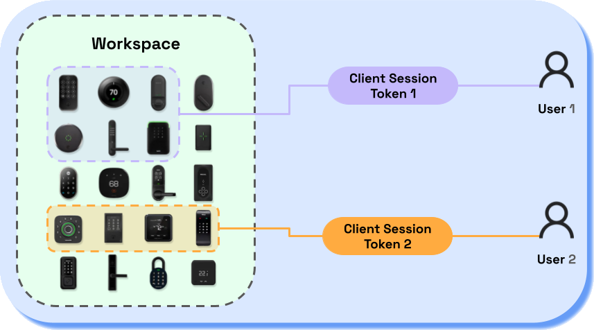

# Client Sessions

If you want to restrict your users' access to their own devices, use client sessions.

<figure><figcaption></figcaption></figure>

The `client_session` object represents a client session.

You create each client session with a custom `user_identifier_key`.
Normally, the `user_identifier_key` is a user ID that your application provides.

When calling the Seam API from your back end using an API key,
you can pass the `user_identifier_key` as a parameter to limit results to the associated client session.
For example, `/devices/list?user_identifier_key=123` only returns devices associated with the client session created with the `user_identifier_key` `123`.

A client session has a token that you can use with the Seam JavaScript SDK to make requests
from the client (browser) directly to the Seam API.
The token restricts the user's access to only the devices that they own.

For more information about client sessions and client session tokens, see the following topics:

* [Client Session Tokens](../../core-concepts/workspaces/client-session-tokens.md)
* [Get Started with React](../../seam-components/overview/get-started-with-react-components-and-client-session-tokens.md)

## `client_session` Properties

The `client_session` object has the following properties:

<table><thead><tr><th width="272">Property</th><th width="132">Type</th><th>Description</th></tr></thead><tbody><tr><td><code>client_session_id</code></td><td>String<br><em>Required</em></td><td>ID of the client session</td></tr><tr><td><code>user_identifier_key</code></td><td>String<br><em>Required</em></td><td>Your own internal user ID for the user</td></tr><tr><td><code>created_at</code></td><td>String<br><em>Required</em></td><td>Date and time at which the client session was created</td></tr><tr><td><code>token</code></td><td>String<br><em>Required</em></td><td>Token that enables you to call <a href="broken-reference">Seam components</a> while restricting a user's access to only devices that they own</td></tr><tr><td><code>device_count</code></td><td>Number<br><em>Required</em></td><td>Number of <a href="../../core-concepts/devices.md">devices</a> to which this client session grants access</td></tr><tr><td><code>connected_account_ids</code></td><td>Array of strings<br><em>Required</em></td><td>Array of IDs of the <a href="../connected-accounts/">connected accounts</a> associated with this client session</td></tr><tr><td><code>connect_webview_ids</code></td><td>Array of strings<br><em>Required</em></td><td>IDs of the <a href="../../core-concepts/connect-webviews/">Connect Webviews</a> associated with this client session</td></tr><tr><td><code>workspace_id</code></td><td>String<br><em>Required</em></td><td>ID of the <a href="../../core-concepts/workspaces/">workspace</a> associated with this client session</td></tr></tbody></table>

## `client_session` Methods

You can perform the following actions on `client_session` objects:

* [Create a client session](create-a-client-session.md)
* [List client sessions](list-client-sessions.md)
* [Get a client session](get-a-client-session.md)
* [Delete a client session](delete-a-client-session.md)


## Example: Use Client Sessions on the Back End to Limit Your Users to Their Own Devices

The code in this example performs the following steps:

1. Create a client session for a new user using your internal user ID (`user_identifier_key`).
2. Create a [Connect Webview](../../core-concepts/connect-webviews).
3. Link the Connect Webview to the client session.
4. Redirect the user to the Connect Webview URL so they may login and connect their account.
5. Use the `user_identifier_key` parameter to manage the user's own devices.




```javascript
const seam = new Seam("YOUR_API_KEY")

const handleUserAccountLink = async (req, res) => {
  const user_identifier_key = req.auth.userId
  
  // Get or create a client session using your internal user ID as the user_identifier_key.
  const client_session = await seam.clientSessions.get_or_create({
    user_identifier_key
  })
  
  // Create a Connect Webview.
  const connect_webview = await seam.connectWebviews.create()
  
  // Link the Connect Webview to the client session.
  await seam.clientSessions.grant_access({
    user_identifier_key,
    connect_webview_ids: [connect_webview.connect_webview_id],
  })
  
  // Redirect the user to the Connect Webview.
  res.redirect(connect_webview.url)
}


const handleUserDeviceList = async (req, res) => {
  const user_identifier_key = req.auth.userId

  const devices = await seam.devices.list({
    user_identifier_key,
    name: "Front Door",
  })
  
  res.status(200).json({ devices })
}

// Handle the application request to unlock a door.
const handleUnlock = async (req, res) => {
  const user_identifier_key = req.auth.userId
  const device_id = req.body.device_id
  
  const devices = await seam.devices.list({
    user_identifier_key,
    device_ids: [device_id],
  })
  
  if (devices.length === 0) return res.send(401).end()
  
  await seam.devices.unlock_door({ device_id })
  
  res.send(204)
}
```



***
