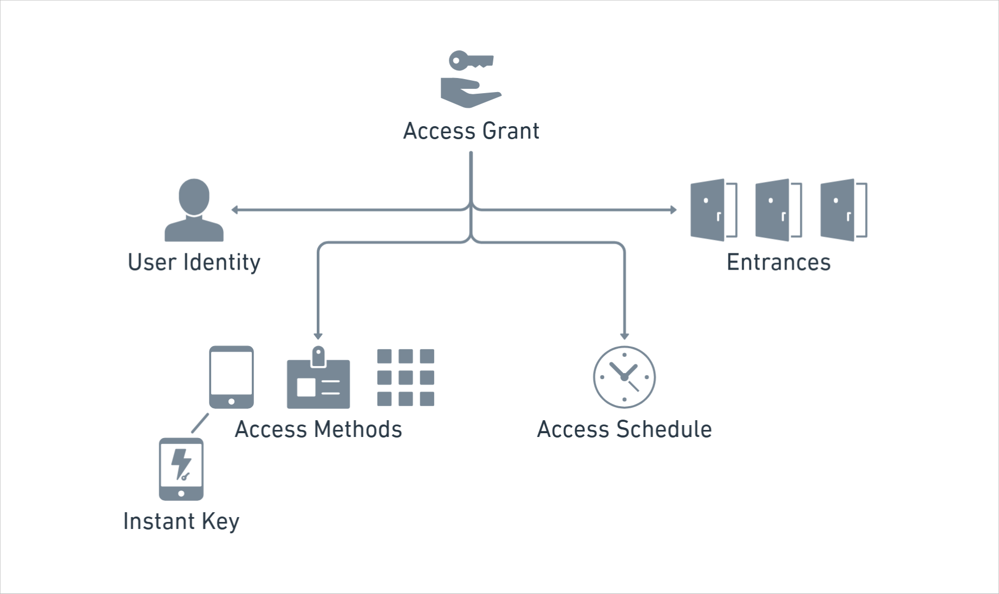

# Access Grants

Seam Access Grants provide a unified, intuitive, and streamlined way to grant and manage user access across multiple access system providers. With a single command you can define the "who, where, when, and how" for assigning a user access to entrances and other access points. Access Grants support plastic cards, PIN codes, and mobile keys, including Instant Keys. You can even create multiple access methods using a single command.

<figure><figcaption>
Use Access Grants to specify the characteristics of access.
</figcaption></figure>

An Access Grant includes the following characteristics:

<table><thead><tr><th width="148.39999389648438">Characteristic</th><th>Creation Parameter</th><th>Description</th></tr></thead><tbody><tr><td>Who</td><td><code>user_identity_id</code> or <code>user_identity</code></td><td>The user to whom to grant access. You can either create a user identity separately and specify the ID to the Access Grant or create a new user identity as part of the Access Grant creation action.</td></tr><tr><td>Where</td><td><code>acs_entrance_ids</code> or <code>space_ids</code></td><td>The entrances to which to grant access. You can specify one or more entrances by ID. Alternately, you can define <a href="../../api/spaces/">spaces</a> that contain groups of related entrances and then specify one or more spaces by ID.</td></tr><tr><td>When</td><td><code>starts_at</code> and <code>ends_at</code></td><td>The access schedule.</td></tr><tr><td>How</td><td><code>requested_access_methods</code> and <code>mode</code></td><td>The access methods that you want to grant for the user. In each <code>requested_access_method</code>, specify the desired <code>mode</code> of access, such as a PIN code, key card, or mobile key (with an Instant Key).</td></tr></tbody></table>

***

## Access Grant Process

The Access Grant process consists of the following steps:

<table><thead><tr><th width="198.800048828125">Step</th><th>Description</th></tr></thead><tbody><tr><td><ol><li>Set up your site for Access Grants.</li></ol></td><td>This step includes confirming hardware capabilities and making sure that you have the required licenses. For example, if you plan to use mobile keys or Instant Keys, your lock hardware must support Bluetooth Low Energy (BLE) keys. Also, to use mobile keys with your access system, you may need to purchase licenses or subscriptions to activate certain software features. These requirements vary by access system. For details, see <a href="../instant-keys/setting-up-your-site-for-instant-keys.md">Setting Up Your Site for Instant Keys</a> and the <a href="../../device-and-system-integration-guides/overview.md#access-control-systems">system integration guide</a> for your access system.</td></tr><tr><td><ol start="2"><li>Connect your access system to Seam.</li></ol></td><td>To connect your access system to Seam, we recommend embedding a <a href="../../core-concepts/connect-webviews/">Connect Webview</a> in your application. The Connect Webview flow guides the property manager through each step of the connection process. For on-premises access systems, use Seam Bridge to connect the access system securely to Seam. For details, see <a href="../access-systems/connect-an-acs-to-seam/">Connect an Access System to Seam</a>.</td></tr><tr><td><ol start="3"><li>(Optional) Set up spaces to organize entrances into logical groups.</li></ol></td><td>You can use spaces to create groups of entrances for efficiency. For example, a user staying in Room 101 may need access to both the Room 101 door, the main entrance door, and the nearest elevator. You could create a space that includes these three access points and then use this space when creating an Access Grant. For details, see <a href="../../api/spaces/">spaces</a>.</td></tr><tr><td><ol start="4"><li>Create a user identity.</li></ol></td><td>User identities represent your users—the people to whom you want to grant access. You can create a user identity before creating an Access Grant, or you can create a user identity as part of creating the Access Grant. See <a href="../mobile-access/managing-mobile-app-user-accounts-with-user-identities.md#what-is-a-user-identity">Managing Mobile App User Accounts with User Identities</a>.</td></tr><tr><td><ol start="5"><li>Create an Access Grant.</li></ol></td><td>When you create an Access Grant, you specify the user identity to whom you want to grant access, the access schedule, the set of entrances or spaces, and one or more access methods that you want to request. See <a href="creating-an-access-grant-using-entrances.md">Creating an Access Grant Using Entrances</a> and <a href="creating-an-access-grant-using-spaces.md">Creating an Access Grant Using Spaces</a>. You can poll for access method status changes or watch for Access Grant and access method lifecycle events that alert you to next steps, such as how and when to deliver each created access method to your user.</td></tr><tr><td><ol start="6"><li>Deliver the access method to the user.</li></ol></td><td>
Once Seam alerts you that your access methods are ready, deliver them to your user. Delivery steps depend on the mode of access, such as plastic key card, PIN code, or mobile key.
<ul><li>If you have created an access grant that includes a card access method, you may need to encode the card using the Seam encoders API.</li><li>If you have created an Access Grant that includes a mobile key, you can use the Seam mobile SDKs to develop your mobile app that delivers these mobile keys to your users.</li><li>Each mobile key also includes an Instant Key URL. To share this Instant Key with your user, send it through text or email or embed it in your own app.</li></ul>
See <a href="delivering-access-methods.md">Delivering Access Methods</a>.
</td></tr></tbody></table>

***

## Using Reservations

Some access control systems (such as Dormakaba Ambiance, Dormakaba Community, Visionline, Salto Space, and Vostio) rely on offline override behavior for guest and resident credentials.

When issuing Access Grants for these systems, you’ll need to use reservations to ensure credentials override and join correctly.

👉 [Learn how to use reservations with Access Grants →](reservation-access-grants.md)

***

## Get Started

To create your first Access Grant, see the [Access Grant Quick Start](access-grant-quick-start.md). Then, learn more in the following topics:

* [Creating an Access Grant Using Entrances](creating-an-access-grant-using-entrances.md)
* [Creating an Access Grant Using Spaces](creating-an-access-grant-using-spaces.md)
* [Delivering Access Methods](delivering-access-methods.md)
* [Access Grants API Reference](../../api/access_grants/)
* [Access Methods API Reference](../../api/access_methods/)
