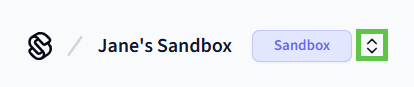
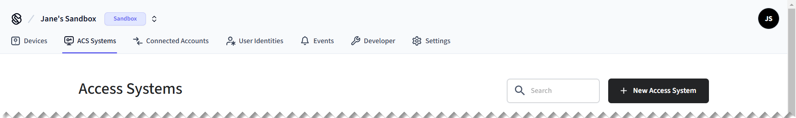
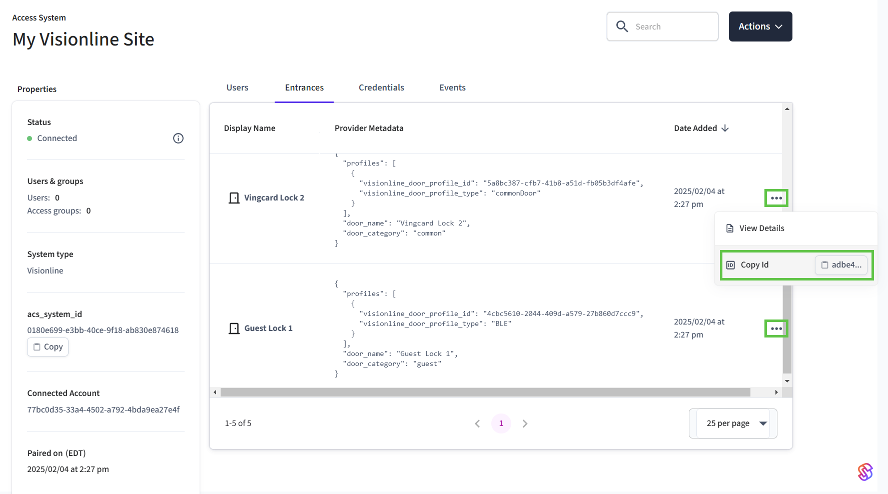
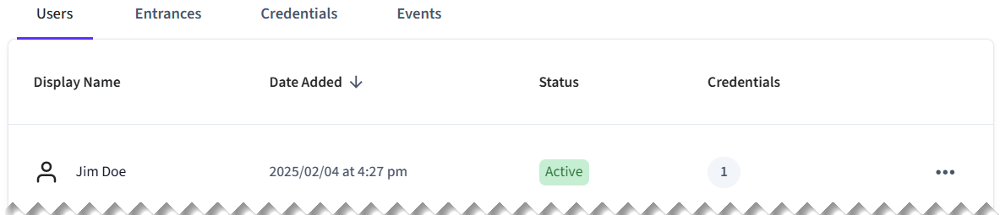
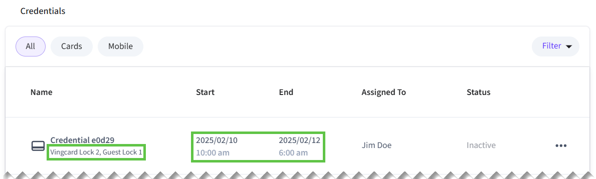

# Encodable Key Card Quick Start

In this quick start, create an ACS user for a virtual [ASSA ABLOY Visionline](../../../device-and-system-integration-guides/assa-abloy-visionline-access-control-system/) access control system. Then, grant the user access to an entrance using a encodable key card credential.


This quick start walks you through the process that applies specifically to the Visionline ACS. There are often differences between access control systems. For example, for some access control systems, you encode credentials onto cards. For others, you do not encode data onto cards, but, rather, assign cards to users.

Once you've completed this quick start, learn how to work with your ACS using Seam, by reading the [system integration guide](../../../device-and-system-integration-guides/overview.md#access-control-systems) for your ACS.


## Overview

This quick start walks you through the following basic steps:

1. [Connect](../../../core-concepts/workspaces/#connecting-virtual-devices) an access control system to Seam.
   * To get started quickly, use a virtual ACS in a [sandbox workspace](../../../core-concepts/workspaces/#sandbox-workspaces).
2. Install a Seam SDK and create an API key.
3. Create an [ACS user](../../../products/access-systems/user-management.md).
4.  Create an encodable key card [ACS credential](../managing-credentials.md) for the ACS user.

    This credential contains both the set of entrances to which the user has access and the access schedule for the user.\
    While some access control systems specify allowed entrances directly within the credential, others use access groups. For more details, see [Access Permission Assignment Variations](../connect-an-acs-to-seam/understanding-access-control-system-differences.md#access-permission-assignment-variations).
5. View the following information about your successfully-created credential:
   * The list of entrances to which the ACS user now has access.
   * The access schedule for the credential.
6.  Encode the credential onto a card.

    Some access control systems—including Visionline—require you to encode credentials onto key cards.

:rocket: Let's get started!

***

## Step 1: Connect a Virtual ACS

In this quick start, use Seam Console to connect a virtual ACS to your sandbox workspace. Alternately, you can use the Seam API to create a [Connect Webview](../../../core-concepts/connect-webviews/) and then use it to connect an ACS to Seam.

1. Log in to [Seam Console](https://console.seam.co/).
2.  In the upper-left corner, click the workspace switcher and select or [create a sandbox workspace](../../../core-concepts/workspaces/#create-a-sandbox-workspace).

    
3.  In the top navigation pane, click **ACS Systems**.

    <figure><figcaption><p>Click ACS Systems to go to the Access Systems page.</p></figcaption></figure>
4.  On the **Access Systems** page, click **New Access System**.

    Seam Console displays a Connect Webview that enables you to connect a virtual ACS to Seam.
5.  In the Connect Webview, authorize the connection.

    1. Click **Continue**.
    2. In the device brand list, click **Visionline**.
    3.  On the **Set up your Seam Bridge** page, click **Continue**.

        [Seam Bridge](../../seam-bridge/) is a software-only component that enables you to connect on-premises software systems to the Seam platform. Because Visionline is an on-premises ACS, Seam Bridge is required for real Visionline systems. However, this quick start uses a virtual Visionline ACS, so you do not need to install Seam Bridge.
    4. On the **Seam Bridge Connection** page, click **Submit**.
    5. On the **Enter your credentials** page:
       1. In the **Visionline Site Name** field, type any string to identify this virtual Visionline ACS site, for example, `My Visionline Site`.
       2. In the **Username** field, type `jane`.
       3. In the **Password** field, type `1234`.
       4. Click **Submit**.
    6. Click **Close**.

    The **Access Systems** page now displays the newly-connected virtual Visionline access control system.

***

## Step 2: Install a Seam SDK and Create an API Key

1. Download and install a Seam SDK in your favorite programming language.



```bash
npm i seam
```



```bash
pip install seam
# For some development environments, use pip3 in this command instead of pip.
```



```bash
bundle add seam
```



```bash
composer require seamapi/seam
```



Install using [nuget](https://www.nuget.org/packages/Seam).



2. Create an API key.
   1. In the top navigation pane of [Seam Console](https://console.seam.co/), click **Developer**.
   2. In the left navigation pane, click **API Keys**.
   3. In the upper-right corner of the **API Keys** page, click **Add API Key**.
   4. In the **Add API Key** dialog, type a name for your new API key and then click **Create API Key**.
   5. Copy the newly-created API key and store it for future use.
3.  Open a terminal window and export your API key as an environment variable.

    ```sh
    export SEAM_API_KEY=seam_test2bMS_94SrGUXuNR2JmJkjtvBQDg5c
    ```

    The Seam SDK that you have installed automatically uses this API key once you have exported it.

***

## Step 3: Create an ACS User

Create an ACS user within the virtual Visionline access control system.

1. Find the ACS system ID.
   1. In the top navigation pane of [Seam Console](https://console.seam.co/), click **ACS Systems**.
   2. On the **Access Systems** page, locate the Visionline ACS, for example, **My Visionline Site**.
   3. In the **acs\_system\_id** column for the Visionline ACS, click the ID to copy it.
   4. Store this ACS system ID for future use.
2. Create the ACS user, as follows:



**Code:**

```python
from seam import Seam

seam = Seam()  # Seam automatically uses your exported SEAM_API_KEY.

acs_user = seam.acs.users.create(
  full_name = "Jim Doe",
  # Use the ACS system ID that you copied earlier from Seam Console.
  acs_system_id = acs_system_id
)
```

**Output:**

```
AcsUser(
  acs_user_id='33333333-3333-3333-3333-333333333333',
  full_name='Jim Doe',
  ...
)
```



**Code:**

```bash
# Use the ACS system ID that you copied earlier from Seam Console.
acs_user=$(curl -X 'POST' \
  'https://connect.getseam.com/acs/users/create' \
  -H 'accept: application/json' \
  -H "Authorization: Bearer ${SEAM_API_KEY}" \
  -H 'Content-Type: application/json' \
  -d "{
  \"full_name\": \"Jim Doe\",
  \"acs_system_id\": \"${acs_system_id}\"
}")
```

**Output:**

```json
{
  "acs_user": {
    "acs_user_id": "33333333-3333-3333-3333-333333333333",
    "full_name": "Jim Doe",
    ...
  },
  "ok": true
}
```



**Code:**

```javascript
import { Seam } from "seam";

const seam = new Seam(); // Seam automatically uses your exported SEAM_API_KEY.

const acsUser = await seam.acs.users.create({
  full_name: "Jim Doe",
  // Use the ACS system ID that you copied earlier from Seam Console.
  acs_system_id: acsSystemId
});
```

**Output:**

```json
{
  acs_user_id: '33333333-3333-3333-3333-333333333333',
  full_name: 'Jim Doe',
  ...
}
```



**Code:**

```ruby
require "seam"

seam = Seam.new() # Seam automatically uses your exported SEAM_API_KEY.

acs_user = seam.acs.users.create(
  full_name: "Jim Doe",
  # Use the ACS system ID that you copied earlier from Seam Console.
  acs_system_id: acs_system_id
)
```

**Output:**

```
<Seam::Resources::AcsUser:0x005f0
  acs_user_id="33333333-3333-3333-3333-333333333333"
  full_name="Jim Doe"
  ...
>
```



**Code:**

```php
<?php
require 'vendor/autoload.php';

$seam = new Seam\SeamClient(); // Seam automatically uses your exported SEAM_API_KEY.

$acs_user = $seam->acs->users->create(
  full_name: "Jim Doe",
  // Use the ACS system ID that you copied earlier from Seam Console.
  acs_system_id: $acs_system_id
);
```

**Output:**

```json
{
  "acs_user_id": "33333333-3333-3333-3333-333333333333",
  "full_name": "Jim Doe",
  ...
}
```



**Code:**

```csharp
// Coming soon!
```

**Output:**

```json
// Coming soon!
```



***

## Step 4: Create an Encodable Key Card Credential

Create an encodable key card credential for the ACS user. In this credential, specify the set of allowed entrances and the access schedule. For Visionline, you must also specify some system-specific metadata, such as the card format and whether the credential is an [override credential](../../../device-and-system-integration-guides/assa-abloy-visionline-access-control-system/configuring-visionline-mobile-credentials/#credential-types-for-visionline).

If this credential were intended for a real Visionline card, you'd need to create the credential and then encode this data onto the key card. Other access control systems do not use encodable cards, but, rather, assign cards to users.

1. Find the IDs of the allowed entrances.
   1. In the top navigation pane of [Seam Console](https://console.seam.co/), click **ACS Systems**.
   2. On the **Access Systems** page, click the Visionline ACS, for example, **My Visionline Site**.
   3. On the Visionline ACS page, click the **Entrances** tab.
   4.  Locate the **Vingcard Lock 2** and **Guest Lock 1** entrances.

       In this example, the set of entrances includes both a common entrance and a guest room door.
   5.  For each of these entrances, click **...**, click **Copy Id**, and then store this entrance ID for future use.

       <figure><figcaption><p>Copy the IDs for the Vingcard Lock 2 and Guest Lock 1 entrances.</p></figcaption></figure>
2. Create the key card credential, as follows:



**Code:**

```python
key_card_credential = seam.acs.credentials.create(
  acs_user_id = acs_user.acs_user_id,
  access_method = "card",
  allowed_acs_entrance_ids = [
    vingcard_lock_2_entrance_id,
    guest_lock_1_entrance_id
  ],
  starts_at = "2025-02-10T15:00:00.000Z",
  ends_at = "2025-02-12T11:00:00.000Z",
  visionline_metadata = {
    "card_format": "rfid48",
    "override": True
  }
)
```

**Output:**

```
AcsCredential(
  acs_credential_id='66666666-6666-6666-6666-666666666666',
  acs_user_id='33333333-3333-3333-3333-333333333333',
  access_method='card',
  starts_at='2025-02-10T15:00:00.000Z',
  ends_at='2025-02-12T11:00:00.000Z',
  ...
)
```



**Code:**

```bash
key_card_credential=$(curl -X 'POST' \
  'https://connect.getseam.com/acs/credentials/create' \
  -H 'accept: application/json' \
  -H "Authorization: Bearer ${SEAM_API_KEY}" \
  -H 'Content-Type: application/json' \
  -d "{
  \"acs_user_id\": \"$(jq -r '.acs_user.acs_user_id' <<< ${acs_user})\",
  \"access_method\": \"card\",
  \"allowed_acs_entrance_ids\": [
    \"${vingcard_lock_2_entrance_id}\",
    \"${guest_lock_1_entrance_id}\"
  ],
  \"starts_at\": \"2025-02-10T15:00:00.000Z\",
  \"ends_at\": \"2025-02-12T11:00:00.000Z\",
  \"visionline_metadata\": {
     \"card_format\": \"rfid48\",
     \"override\": true
  }
}")
```

**Output:**

```json
{
  "acs_credential":
    {
      "acs_credential_id": "66666666-6666-6666-6666-666666666666",
      "acs_user_id": "33333333-3333-3333-3333-333333333333",
      "access_method": "card",
      "starts_at": "2025-02-10T15:00:00.000Z",
      "ends_at": "2025-02-12T11:00:00.000Z",
      ...
    },
  "ok":true
}
```



**Code:**

```javascript
const keyCardCredential = await seam.acs.credentials.create({
  acs_user_id: acsUser.acs_user_id,
  access_method: "card",
  allowed_acs_entrance_ids: [
    vingcardLock2EntranceId,
    guestLock1EntranceId
  ],
  starts_at: "2025-02-10T15:00:00.000Z",
  ends_at: "2025-02-12T11:00:00.000Z",
  visionline_metadata: {
    "card_format": "rfid48",
    "override": true
  }
});
```

**Output:**

```json
{
  acs_credential_id: '66666666-6666-6666-6666-666666666666',
  acs_user_id: '33333333-3333-3333-3333-333333333333',
  access_method: 'card',
  starts_at: '2025-02-10T15:00:00.000Z',
  ends_at: '2025-02-12T11:00:00.000Z',
  ...
}
```



**Code:**

```ruby
key_card_credential = seam.acs.credentials.create(
  acs_user_id: acs_user.acs_user_id,
  access_method: "card",
  allowed_acs_entrance_ids: [
    vingcard_lock_2_entrance_id,
    guest_lock_1_entrance_id
  ],
  starts_at: "2025-02-10T15:00:00.000Z",
  ends_at: "2025-02-12T11:00:00.000Z",
  visionline_metadata: {
    "card_format": "rfid48",
    "override": true
  }
)
```

**Output:**

```
<Seam::Resources::AcsCredential:0x00410
  acs_credential_id="66666666-6666-6666-6666-666666666666"
  acs_user_id="33333333-3333-3333-3333-333333333333"
  access_method="card"
  starts_at="2025-02-10T15:00:00.000Z"
  ends_at="2025-02-12T11:00:00.000Z"
  ...
>
```



**Code:**

```php
$key_card_credential = $seam->acs->credentials->create(
  acs_user_id: $acs_user->acs_user_id,
  access_method: "card",
  allowed_acs_entrance_ids: [
    $vingcard_lock_2_entrance_id,
    $guest_lock_1_entrance_id
  ],
  starts_at: "2025-02-10T15:00:00.000Z",
  ends_at: "2025-02-12T11:00:00.000Z",
  visionline_metadata: array('card_format' => "rfid48", 'is_override_key' => true)
);
```

**Output:**

```json
{
  "acs_credential_id": "66666666-6666-6666-6666-666666666666",
  "acs_user_id": "33333333-3333-3333-3333-333333333333",
  "access_method": "card",
  "starts_at": "2025-02-10T15:00:00.000Z",
  "ends_at": "2025-02-12T11:00:00.000Z",
  ...
}
```



**Code:**

```csharp
// Coming soon!
```

**Output:**

```json
// Coming soon!
```



***

## Step 5: View Your New Credential

You can use Seam Console, the Seam API, or the [Seam CLI](../../../core-concepts/seam-console/seam-online-cli.md) to view the following information about your successfully-created credential:

* The list of entrances to which the ACS user now has access.
* The access schedule for the credential.

To use Seam Console to view information about your new key card credential:

1. In the top navigation pane of [Seam Console](https://console.seam.co/), click **ACS Systems**.
2. On the **Access Systems** page, click the Visionline ACS, for example, **My Visionline Site**.
3.  In the **Users** table, click **Jim Doe**, the ACS user that you created.

    <figure><figcaption><p>Click the ACS user to view their credentials.</p></figcaption></figure>
4.  In the **Credentials** tab for the ACS user, view the following information for the key card credential that you created:

    1. Under the credential name, Seam Console displays the list of list of entrances to which the credential grants access.
    2.  The **Start** and **End** fields for the credential show the access schedule.

        Note that Seam Console displays times adjusted to your local computer settings. That is, the times that you see in Seam Console are the times that you specified when creating the credential, adjusted to match your computer's time settings.

    <figure><figcaption><p>View the entrances and access schedule for the credential that you created.</p></figcaption></figure>

***

## Step 6: Encode the Credential onto a Card

Encode the credential that you created onto a card for the Visionline access control system.

First, find the encoder that you want to use and note its ID. Then, encode the credential onto the card using the encoder that you identified. Finally, confirm that the card was encoded successfully.

For more information, see [Working with Card Encoders and Scanners](../working-with-card-encoders-and-scanners/).



**Code:**

```python
# Get the encoder that you want to use.
encoder = seam.acs.encoders.list(
  acs_system_ids = [acs_system_id]
)[0]

# Encode the card.
encoding_action_attempt = seam.acs.encoders.encode_credential(
  acs_credential_id = key_card_credential.acs_credential_id,
  acs_encoder_id = encoder.acs_encoder_id
)

# Confirm that the encoding succeeded by 
# polling the returned action attempt
# until its status is success.
# You can also use a webhook.
seam.action_attempts.get(
  action_attempt_id = encoding_action_attempt.action_attempt_id
)
```

**Output:**

```
ActionAttempt(
  status='success',
  action_attempt_id='11111111-2222-3333-4444-555555555555',
  action_type='ENCODE_CREDENTIAL',
  result={
    acs_credential_id='66666666-6666-6666-6666-666666666666',
    card_number='1234abc',
    is_issued=True,
    issued_at='2025-02-10T12:00:00.000Z',
    ...
  },
  error=null
)
```



**Code:**

```bash
# Get the encoder that you want to use.
encoder=$(curl -X 'POST' \
  'https://connect.getseam.com/acs/encoders/list' \
  -H 'accept: application/json' \
  -H "Authorization: Bearer ${SEAM_API_KEY}" \
  -H 'Content-Type: application/json' \
  -d "{
  \"acs_system_id\": \"${acs_system_id}\"
}" | jq -r '.acs_encoders[0]')

# Encode the card.
encoding_action_attempt=$(curl -X 'POST' \
  'https://connect.getseam.com/acs/encoders/encode_credential' \
  -H 'accept: application/json' \
  -H "Authorization: Bearer ${SEAM_API_KEY}" \
  -H 'Content-Type: application/json' \
  -d "{
  \"acs_credential_id\": \"$(jq -r '.acs_credential.acs_credential_id' <<< ${key_card_credential})\",
  \"acs_encoder_id\": \"$(jq -r '.acs_encoder_id' <<< ${encoder})\"
}")

# Confirm that the encoding succeeded by 
# polling the returned action attempt
# until its status is success.
# You can also use a webhook.
curl -X 'POST' \
  'https://connect.getseam.com/action_attempts/get' \
  -H 'accept: application/json' \
  -H "Authorization: Bearer ${SEAM_API_KEY}" \
  -H 'Content-Type: application/json' \
  -d "{
  \"action_attempt_id\": \"$(jq -r '.action_attempt.action_attempt_id' <<< ${encoding_action_attempt})\"
}"
```

**Output:**

```json
{
  "action_attempt":
    {
      "status": "success",
      "action_attempt_id": "11111111-2222-3333-4444-555555555555",
      "action_type": "ENCODE_CREDENTIAL",
      "result": {
        "acs_credential_id": "66666666-6666-6666-6666-666666666666",
        "card_number": "1234abc",
        "is_issued": true,
        "issued_at": "2025-02-10T12:00:00.000Z",
        ...
      },
      "error": null
    },
  "ok": true
}
```



**Code:**

```javascript
// Get the encoder that you want to use.
const encoder = (await seam.acs.encoders.list({
  acs_system_ids = [acsSystemId]
}))[0];

// Encode the card.
const encodingActionAttempt = await seam.acs.encoders.encodeCredential({
  acs_credential_id: keyCardCredential.acs_credential_id,
  acs_encoder_id: encoder.acs_encoder_id
});

// Confirm that the encoding succeeded by 
// polling the returned action attempt
// until its status is success.
// You can also use a webhook.
await seam.actionAttempts.get({
  action_attempt_id: encodingActionAttempt.action_attempt_id
});
```

**Output:**

```json
{
  status: 'success',
  action_attempt_id: '11111111-2222-3333-4444-555555555555",
  action_type: 'ENCODE_CREDENTIAL',
  result: {
    acs_credential_id: "66666666-6666-6666-6666-666666666666',
    card_number: '1234abc',
    is_issued: true,
    issued_at: '2025-02-10T12:00:00.000Z',
    ...
  },
  error: null
}
```



**Code:**

```ruby
# Get the encoder that you want to use.
encoder = (seam.acs.encoders.list(
  acs_system_ids = [acs_system_id]
))[0]

# Encode the card.
encoding_action_attempt = seam.acs.encoders.encode_credential(
  acs_credential_id: key_card_credential.acs_credential_id,
  acs_encoder_id: encoder.acs_encoder_id
)

# Confirm that the encoding succeeded by 
# polling the returned action attempt
# until its status is success.
# You can also use a webhook.
seam.action_attempts.get(
  action_attempt_id: encoding_action_attempt.action_attempt_id
)
```

**Output:**

```
<Seam::Resources::ActionAttempt:0x00410
  status="success"
  action_attempt_id="11111111-2222-3333-4444-555555555555"
  action_type="ENCODE_CREDENTIAL"
  result={
    acs_credential_id="66666666-6666-6666-6666-666666666666"
    card_number="1234abc"
    is_issued=true,
    issued_at="2025-02-10T12:00:00.000Z"
    ...
  }
  error=nil
>
```



**Code:**

```php
// Get the encoder that you want to use.
$encoder = $seam->acs->encoders->list(
  acs_system_ids = [$acs_system_id]
)[0];

// Encode the card.
$encoding_action_attempt = $seam->acs->encoders->encode_credential(
  acs_credential_id: $key_card_credential->acs_credential_id,
  acs_encoder_id: $encoder->acs_encoder_id
);

// Confirm that the encoding succeeded by 
// polling the returned action attempt
// until its status is success.
// You can also use a webhook.
$seam->action_attempts->get(
  action_attempt_id: $encoding_action_attempt->action_attempt_id
);
```

**Output:**

```json
{
  "status": "success",
  "action_attempt_id": "11111111-2222-3333-4444-555555555555",
  "action_type": "ENCODE_CREDENTIAL",
  "result": {
    "acs_credential_id": "66666666-6666-6666-6666-666666666666",
    "card_number": "1234abc",
    "is_issued": true,
    "issued_at": "2025-02-10T12:00:00.000Z",
    ...
  },
  "error": null
}
```



**Code:**

```csharp
// Coming soon!
```

**Output:**

```json
// Coming soon!
```



***

## Next Steps

Now that you've created a key card credential and encoded it onto a card, try out the other ACS quick starts.

* [Mobile Key Quick Start](mobile-key-quick-start.md)
* [PIN Code Quick Start](pin-code-quick-start.md)

Then, [connect your ACS to Seam](../connect-an-acs-to-seam/).

***

## Learn More

For a deeper dive into ACS concepts and instructions, see the following topics:

1. Learn about ACS concepts.
   * [Access Control System Resources](../connect-an-acs-to-seam/access-control-system-resources.md)
   * [Understanding ACS Differences](../connect-an-acs-to-seam/understanding-access-control-system-differences.md)
2. Create ACS users.
   * [Managing ACS Users](../../../products/access-systems/user-management.md)
3. For relevant access control systems, assign ACS users to access groups.
   * [Assigning ACS Users to Access Groups](../user-management/assigning-users-to-access-groups.md)
4. Learn about available entrances.
   * [Retrieving Entrance Details](../retrieving-entrance-details.md)
5. Create credentials for ACS users.
   * [Managing Credentials](../managing-credentials.md)
6. For relevant access control systems, encode credentials onto key cards.
   * [Working with Card Encoders and Scanners](../working-with-card-encoders-and-scanners/)
7. See the Seam [Access Control Systems API reference](../../../api/acs/).
