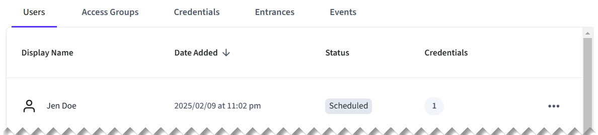

# Mobile Key Quick Start

In this quick start, create a user identity for a virtual [Salto KS](../../../device-and-system-integration-guides/salto-ks-access-control-system/) access control system. Then, grant the user access to an entrance using a mobile key credential. With mobile keys, developers can create mobile apps that download users' credentials and then use Bluetooth low energy (BLE) or similar communications technologies to unlock granted nearby entrances. For more information about Seam's mobile access solution, see [Mobile Access](../../mobile-access/).


This quick start walks you through the process that applies specifically to the Salto KS ACS. There are often differences between access control systems. Once you've completed this quick start, learn how to work with your ACS using Seam, by reading the [system integration guide](../../../device-and-system-integration-guides/overview.md#access-control-systems) for your ACS.


## Overview

This quick start walks you through the following basic steps:

1. [Connect](../../../core-concepts/workspaces/#connecting-virtual-devices) an access control system to Seam.
   * To get started quickly, use a virtual ACS in a [sandbox workspace](../../../core-concepts/workspaces/#sandbox-workspaces).
2. Install a Seam SDK and create an API key.
3. Create a [user identity](../../../api/user_identities/).
   * Seam user identities enable you to match your own mobile app users to ACS users.
4. Identify a [credential manager](../../mobile-access/issuing-mobile-credentials-from-an-access-control-system.md#initialize-the-user-identity-with-a-credential-manager) to use for the mobile credential.
5. Set up an [enrollment automation](../../mobile-access/issuing-mobile-credentials-from-an-access-control-system.md) for the user identity, to enable mobile keys.
6. Assign the user identity to an [access group](../user-management/assigning-users-to-access-groups.md).
   * Access groups are preconfigured to grant access to specific entrances.\
     While some access control systems use access groups, others specify allowed entrances directly within the credential. For more details, see [Access Permission Assignment Variations](../connect-an-acs-to-seam/understanding-access-control-system-differences.md#access-permission-assignment-variations).
7. Create a mobile key [ACS credential](../managing-credentials.md) for the user identity.
8. View the list of entrances to which the user now has access.

:rocket: Let's get started!

***

## Step 1: Connect a Virtual ACS

In this quick start, use Seam Console to connect a virtual ACS to your sandbox workspace. Alternately, you can use the Seam API to create a [Connect Webview](../../../core-concepts/connect-webviews/) and then use it to connect an ACS to Seam.

1. Log in to [Seam Console](https://console.seam.co/).
2.  In the upper-left corner, click the workspace switcher and select or [create a sandbox workspace](../../../core-concepts/workspaces/#create-a-sandbox-workspace).

    
3.  In the top navigation pane, click **ACS Systems**.

    <figure><figcaption><p>Click ACS Systems to go to the Access Systems page.</p></figcaption></figure>
4.  On the **Access Systems** page, click **New Access System**.

    Seam Console displays a Connect Webview that enables you to connect a virtual ACS to Seam.
5.  In the Connect Webview, authorize the connection.

    1. Click **Continue**.
    2. In the device brand list, click **Salto KS**.
    3. On the Salto KS authorization page:
       1. In the **Email** field, type `jane@example.com`.
       2. In the **Password** field, type `1234`.
       3. Click **Log In**.
       4. When prompted to allow application access, click **Yes, Allow**.
       5. In the sites list, select **Main Site** and then click **Continue**.
       6. Click **Close**.

    The **Access Systems** page now displays the newly-connected virtual Salto KS access control system.

***

## Step 2: Install a Seam SDK and Create an API Key

1. Download and install a Seam SDK in your favorite programming language.



```bash
npm i seam
```



```bash
pip install seam
# For some development environments, use pip3 in this command instead of pip.
```



```bash
bundle add seam
```



```bash
composer require seamapi/seam
```



**Gradle:**

```gradle
// build.gradle
dependencies {
    implementation 'io.github.seamapi:java:0.x.x'
}
```

**Maven:**

```xml
<!-- pom.xml -->
<dependency>
    <groupId>io.github.seamapi</groupId>
    <artifactId>java</artifactId>
    <version>0.x.x</version>
</dependency>
```



Install using [nuget](https://www.nuget.org/packages/Seam).





2. Create an API key.
   1. In the top navigation pane of [Seam Console](https://console.seam.co/), click **Developer**.
   2. In the left navigation pane, click **API Keys**.
   3. In the upper-right corner of the **API Keys** page, click **Add API Key**.
   4. In the **Add API Key** dialog, type a name for your new API key and then click **Create API Key**.
   5. Copy the newly-created API key and store it for future use.
3.  Open a terminal window and export your API key as an environment variable.

    ```sh
    export SEAM_API_KEY=seam_test2bMS_94SrGUXuNR2JmJkjtvBQDg5c
    ```

    The Seam SDK that you have installed automatically uses this API key once you have exported it.

***

## Step 3: Create a User Identity

Create a user identity to represent a mobile app user.

1. Find the ACS system ID.
   1. In the top navigation pane of [Seam Console](https://console.seam.co/), click **ACS Systems**.
   2. On the **Access Systems** page, locate the Salto KS Main Site ACS.
   3. In the **acs\_system\_id** column for the Main Site ACS, click the ID to copy it.
   4. Store this ACS system ID for future use.&#x20;
2. Create the user identity, as follows:



**Code:**

```python
from seam import Seam

seam = Seam()  # Seam automatically uses your exported SEAM_API_KEY.

jen_doe_user = seam.user_identities.create(
  full_name: "Jen Doe",
  email_address = "jen.doe@example.com",
  # Use the ACS system ID that you copied earlier from Seam Console.
  acs_system_ids = [acs_system_id]
)
```

**Output:**

```
UserIdentity(
  user_identity_id='22222222-2222-2222-2222-222222222222',
  full_name='Jen Doe',
  email_address='jen.doe@example.com',
  ...
)
```



**Code:**

```bash
# Use the ACS system ID that you copied earlier from Seam Console.
jen_doe_user=$(curl -X 'POST' \
  'https://connect.getseam.com/user_identities/create' \
  -H 'accept: application/json' \
  -H "Authorization: Bearer ${SEAM_API_KEY}" \
  -H 'Content-Type: application/json' \
  -d "{
  \"full_name\": \"Jen Doe\",
  \"email_address\": \"jen.doe@example.com\",
  \"acs_system_id\": \"${acs_system_id}\",
}")
```

**Output:**

```json
{
  "user_identity": {
    "user_identity_id": "22222222-2222-2222-2222-222222222222",
    "full_name": "Jen Doe",
    "email_address": "jen.doe@example.com",
    ...
  },
  "ok": true
}
```



**Code:**

```javascript
import { Seam } from "seam";

const seam = new Seam(); // Seam automatically uses your exported SEAM_API_KEY.

const jenDoeUser = await seam.userIdentities.create({
  full_name: "Jen Doe",
  email_address: "jen.doe@example.com",
  // Use the ACS system ID that you copied earlier from Seam Console.
  acs_system_id: acsSystemId,
});
```

**Output:**

```json
{
  "user_identity_id": "22222222-2222-2222-2222-222222222222",
  "full_name": "Jen Doe",
  "email_address": "jen.doe@example.com",
  ...
}
```



**Code:**

```ruby
require "seam"

seam = Seam.new() # Seam automatically uses your exported SEAM_API_KEY.

jen_doe_user = seam.user_identities.create(
  full_name: "Jen Doe",
  email_address: "jen.doe@example.com",
  # Use the ACS system ID that you copied earlier from Seam Console.
  acs_system_id: acs_system_id,
)
```

**Output:**

```
<Seam::Resources::UserIdentity:0x005f0
  user_identity_id="22222222-2222-2222-2222-222222222222"
  full_name="Jen Doe"
  email_address="jen.doe@example.com"
  ...
>
```



**Code:**

```php
<?php
require 'vendor/autoload.php';

$seam = new Seam\SeamClient(); // Seam automatically uses your exported SEAM_API_KEY.

$jen_doe_user = $seam->user_identities->create(
  full_name: "Jen Doe",
  email_address: "jen.doe@example.com",
  // Use the ACS system ID that you copied earlier from Seam Console.
  acs_system_id: $acs_system_id,
);
```

**Output:**

```json
{
  "user_identity_id": "22222222-2222-2222-2222-222222222222",
  "full_name": "Jen Doe",
  "email_address": "jen.doe@example.com",
  ...
}
```



**Code:**

```csharp
// Coming soon!
```

**Output:**

```json
// Coming soon!
```



**Code:**

```java
// Coming soon!
```

**Output:**

```json
// Coming soon!
```





***

## Step 4: Identify a Credential Manager

To create mobile keys for mobile app users, you must use a credential manager. When you added the virtual Salto KS ACS to your sandbox workspace earlier in this quick start, Seam automatically added a compatible virtual credential manager. Identify the ID of this credential manager.

1. In the top navigation pane of [Seam Console](https://console.seam.co/), click **ACS Systems**.
2. On the **Access Systems** page, locate the Salto KS Credential Manager.
3. In the **acs\_system\_id** column for the Salto KS Credential Manager, click the ID to copy it.
4. Store this credential manager ID for future use.&#x20;

***

## Step 5: Set up an Enrollment Automation for the User Identity

Once you've identified the the credential manager to use for mobile app users, launch an enrollment automation to initialize the phones for an app user, that is, a user identity. This enrollment automation oversees the registration of each new phone for the user identity with the credential manager.



**Code:**

```python
seam.user_identities.enrollment_automations.launch(
  user_identity_id = jen_doe_user.user_identity_id,
  create_credential_manager_user = True,
  # Use the credential manager ID that you copied earlier from Seam Console.
  credential_manager_acs_system_id = credential_manager_acs_system_id
)
```

**Output:**

```
EnrollmentAutomation(
  user_identity_id='22222222-2222-2222-2222-222222222222',
  enrollment_automation_id='77777777-8888-7777-7777-888888888888',
  ...
)
```



**Code:**

```bash
# Use the credential manager ID that you copied earlier from Seam Console.
curl -X 'POST' \
  'https://connect.getseam.com/user_identities/enrollment_automations/launch' \
  -H 'accept: application/json' \
  -H "Authorization: Bearer ${SEAM_API_KEY}" \
  -H 'Content-Type: application/json' \
  -d "{
  \"user_identity_id\": \"$(jq -r '.user_identity.user_identity_id' <<< ${jen_doe_user})\",
  \"create_credential_manager_user\": true,
  \"credential_manager_acs_system_id\": \"${credential_manager_acs_system_id}\"
}"
```

**Output:**

```json
{
  "enrollment_automation": {
    "user_identity_id": "22222222-2222-2222-2222-222222222222",
    "enrollment_automation_id": "77777777-8888-7777-7777-888888888888",
    ...
  },
  "ok": true
}
```



**Code:**

```javascript
await seam.userIdentities.enrollmentAutomations.launch({
  user_identity_id: jenDoeUser.user_identity_id,
  create_credential_manager_user: true,
  // Use the credential manager ID that you copied earlier from Seam Console.
  credential_manager_acs_system_id: credentialManagerAcsSystemId
});
```

**Output:**

```json
{
  "user_identity_id": "22222222-2222-2222-2222-222222222222",
  "enrollment_automation_id": "77777777-8888-7777-7777-888888888888",
  ...
}
```



**Code:**

```ruby
seam.user_identities.enrollment_automations.launch(
  user_identity_id: jen_doe_user.user_identity_id,
  create_credential_manager_user: true,
  # Use the credential manager ID that you copied earlier from Seam Console.
  credential_manager_acs_system_id: credential_manager_acs_system_id
)
```

**Output:**

```
<Seam::Resources::EnrollmentAutomation:0x005f0
  user_identity_id="22222222-2222-2222-2222-222222222222"
  enrollment_automation_id="77777777-8888-7777-7777-888888888888"
  ...
>
```



**Code:**

```php
$seam->user_identities->enrollment_automations->launch(
  user_identity_id: $jen_doe_user->user_identity_id,
  create_credential_manager_user: true,
  // Use the credential manager ID that you copied earlier from Seam Console.
  credential_manager_acs_system_id: $credential_manager_acs_system_id
);
```

**Output:**

```json
{
  "user_identity_id": "22222222-2222-2222-2222-222222222222",
  "enrollment_automation_id": "77777777-8888-7777-7777-888888888888",
  ...
}
```



**Code:**

```csharp
// Coming soon!
```

**Output:**

```json
// Coming soon!
```



**Code:**

```java
// Coming soon!
```

**Output:**

```json
// Coming soon!
```





***

## Step 6: Assign the User Identity to an Access Group

Add the user identity to an access group. For Salto KS, access groups specify the entrances to which users have access.

Some other access control systems do not use access groups and, instead, specify allowed entrances directly within the credential. For more details, see [Access Permission Assignment Variations](../connect-an-acs-to-seam/understanding-access-control-system-differences.md#access-permission-assignment-variations).

1. Find the access group ID.
   1. In the top navigation pane of [Seam Console](https://console.seam.co/), click **ACS Systems**.
   2. On the **Access Systems** page, click the Salto KS Main Site ACS.
   3. On the **Main Site** page, click the **Access Groups** tab.
   4. Locate the Main Group, click **...**, and click **Copy Id**.
   5. Store this access group ID for future use.&#x20;
2. Assign the user identity to the Main Group, as follows:



**Code:**

```python
seam.acs.access_groups.add_user(
  # Use the access group ID that you copied earlier from Seam Console.
  acs_access_group_id = access_group_id,
  user_identity_id = jen_doe_user.user_identity_id
)
```

**Output:**

```
None
```



**Code:**

```bash
# Use the access group ID that you copied earlier from Seam Console.
curl -X 'POST' \
  'https://connect.getseam.com/acs/access_groups/add_user' \
  -H "Authorization: Bearer ${SEAM_API_KEY}" \
  -H 'Content-Type: application/json' \
  -d "{
  \"acs_access_group_id\": \"${access_group_id}\",
  \"user_identity_id\": \"$(jq -r '.user_identity.user_identity_id' <<< ${jen_doe_user})\"
}"
```

**Output:**

```json
{
  "ok": true
}
```



**Code:**

```javascript
await seam.acs.accessGroups.addUser({
  // Use the access group ID that you copied earlier from Seam Console.
  acs_access_group_id: accessGroupId,
  user_identity_id: jenDoeUser.user_identity_id
});
```

**Output:**

```json
void
```



**Code:**

```ruby
seam.acs.access_groups.add_user(
  # Use the access group ID that you copied earlier from Seam Console.
  acs_access_group_id: access_group_id,
  user_identity_id: jen_doe_user.user_identity_id
)
```

**Output:**

```
nil
```



**Code:**

```php
$seam->acs->access_groups->add_user(
  // Use the access group ID that you copied earlier from Seam Console.
  acs_access_group_id: $access_group_id,
  user_identity_id: jen_doe_user.user_identity_id
);
```

**Output:**

```
void
```



**Code:**

```csharp
// Coming soon!
```

**Output:**

```
// Coming soon!
```



**Code:**

```java
// Coming soon!
```

**Output:**

```json
// Coming soon!
```





***

## Step 7: Create a Mobile Key Credential

Create a mobile key credential for the user identity.



**Code:**

```python
mobile_key = seam.acs.credentials.create(
  user_identity_id = jen_doe_user.user_identity_id,
  is_multi_phone_sync_credential = True,
  access_method = "mobile_key"
)
```

**Output:**

```
AcsCredential(
  acs_credential_id='66666666-6666-6666-6666-666666666666',
  acs_system_id='11111111-1111-1111-1111-111111111111',
  user_identity_id='22222222-2222-2222-2222-222222222222',
  access_method='mobile_key',
  ...
)
```



**Code:**

```bash
mobile_key=$(curl -X 'POST' \
  'https://connect.getseam.com/acs/credentials/create' \
  -H 'accept: application/json' \
  -H "Authorization: Bearer ${SEAM_API_KEY}" \
  -H 'Content-Type: application/json' \
  -d "{
  \"user_identity_id\": \"$(jq -r '.user_identity.user_identity_id' <<< ${jen_doe_user})\",
  \"is_multi_phone_sync_credential\": true,
  \"access_method\": \"mobile_key\"
}")
```

**Output:**

```json
{
  "acs_credential":{
    "acs_credential_id": "66666666-6666-6666-6666-666666666666",
    "acs_system_id": "11111111-1111-1111-1111-111111111111",
    "user_identity_id": "22222222-2222-2222-2222-222222222222",
    "access_method": "mobile_key",
    ...
  }
}
```



**Code:**

```javascript
const mobileKey = await seam.acs.credentials.create({
  user_identity_id: jenDoeUser.user_identity_id,
  is_multi_phone_sync_credential: true,
  access_method: "mobile_key"
});
```

**Output:**

```json
{
  acs_credential_id: '66666666-6666-6666-6666-666666666666',
  acs_system_id: '11111111-1111-1111-1111-111111111111',
  user_identity_id: '22222222-2222-2222-2222-222222222222',
  access_method: 'mobile_key',
  ...
}
```



**Code:**

```ruby
mobile_key = seam.acs.credentials.create(
  user_identity_id: jen_doe_user.user_identity_id,
  is_multi_phone_sync_credential: true,
  access_method: "mobile_key"
)
```

**Output:**

```
<Seam::Resources::AcsCredential:0x005f0
  acs_credential_id="66666666-6666-6666-6666-666666666666"
  acs_system_id="11111111-1111-1111-1111-111111111111"
  user_identity_id= "22222222-2222-2222-2222-222222222222"
  access_method="mobile_key"
  ...
>
```



**Code:**

```php
$pin_code_credential = $seam->acs->credentials->create(
  user_identity_id: $jen_doe_user->user_identity_id,
  is_multi_phone_sync_credential: true,
  access_method: "mobile_key"
);
```

**Output:**

```json
{
  "acs_credential_id": "66666666-6666-6666-6666-666666666666",
  "acs_system_id": "11111111-1111-1111-1111-111111111111",
  "user_identity_id": "22222222-2222-2222-2222-222222222222",
  "access_method": "mobile_key",
  ...
}
```



**Code:**

```csharp
// Coming soon!
```

**Output:**

```json
// Coming soon!
```



**Code:**

```java
// Coming soon!
```

**Output:**

```json
// Coming soon!
```





***

## Step 8: View Your New Credential

You can use Seam Console, the Seam API, or the [Seam CLI](../../../core-concepts/seam-console/seam-online-cli.md) to view the list of entrances to which the ACS user now has access.

To use Seam Console to view information about your new PIN code credential:

1. In the top navigation pane of [Seam Console](https://console.seam.co/), click **ACS Systems**.
2. On the **Access Systems** page, click the Salto KS Main Site ACS.
3.  In the **Users** table, click **Jen Doe**, the ACS user that you created.

    <figure><figcaption><p>Click the ACS user to view their credentials.</p></figcaption></figure>
4. In the **Credentials** tab for the ACS user, note the mobile key credential (multi-phone sync credential) that you created.
5. Click the **Access Groups** tab for the ACS user.
6. Click the **Main Group** access group.
7.  On the **Main Group** page click the **Entrances** tab and then view the entrances to which this access group grants the ACS user access.

    <figure><figcaption><p>View the entrances to which the ACS user has access as a member of the access group.</p></figcaption></figure>


This quick start shows the server-side portion of the mobile access development process. The other piece of this process is to develop a mobile app that downloads the user's mobile keys and then uses BLE or similar technology to unlock nearby entrances to which the user's credentials grant access. For details, see [Integrating into your mobile application](../../mobile-access/mobile-device-sdks/).


***

## Next Steps

Now that you've created a mobile key credential, try out the other ACS quick starts.

* [PIN Code Quick Start](pin-code-quick-start.md)
* [Key Card Quick Start](encodable-key-card-quick-start.md)

Then, [connect your ACS to Seam](../connect-an-acs-to-seam/).

***

## Learn More

For a deeper dive into ACS concepts and instructions, see the following topics:

1. Learn about ACS concepts.
   * [Access Control System Resources](../connect-an-acs-to-seam/access-control-system-resources.md)
   * [Understanding ACS Differences](../connect-an-acs-to-seam/understanding-access-control-system-differences.md)
2. Create user identities.
   * [Managing Mobile App User Accounts with User Identities](../../mobile-access/managing-mobile-app-user-accounts-with-user-identities.md)
3. For relevant access control systems, assign user identities to access groups.
   * [Adding User Identities to Access Groups](../../../api/acs/access_groups/add_user.md)
4. Learn about available entrances.
   * [Retrieving Entrance Details](../retrieving-entrance-details.md)
5. Create credentials for ACS users.
   * [Managing Credentials](../managing-credentials.md)
6. Learn more about the Seam mobile access solution.
   * [Mobile Access](../../mobile-access/)
   * [Integrating into your mobile application](../../mobile-access/mobile-device-sdks/)
7. See the Seam [Access Control Systems API reference](../../../api/acs/).
