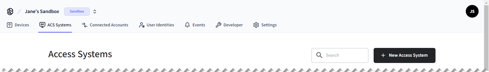

# PIN Code Quick Start

In this quick start, create an ACS user for a virtual [Salto KS](../../../device-and-system-integration-guides/salto-ks-access-control-system/) access control system. Then, grant the user access to an entrance using a PIN code credential.


This quick start walks you through the process that applies specifically to the Salto KS ACS. There are often differences between access control systems. Once you've completed this quick start, learn how to work with your ACS using Seam, by reading the [system integration guide](../../../device-and-system-integration-guides/overview.md#access-control-systems) for your ACS.


## Overview

This quick start walks you through the following basic steps:

1. [Connect](../../../core-concepts/workspaces/#connecting-virtual-devices) an access control system to Seam.
   * To get started quickly, use a virtual ACS in a [sandbox workspace](../../../core-concepts/workspaces/#sandbox-workspaces).
2. Install a Seam SDK and create an API key.
3. Create an [ACS user](../../../products/access-systems/user-management.md).
   * Also, specify the access schedule for this user.
4. Assign the ACS user to an [access group](../user-management/assigning-users-to-access-groups.md).
   * Access groups are preconfigured to grant access to specific entrances.\
     While some access control systems use access groups, others specify allowed entrances directly within the credential. For more details, see [Access Permission Assignment Variations](../connect-an-acs-to-seam/understanding-access-control-system-differences.md#access-permission-assignment-variations).
5. Create a PIN code [ACS credential](../managing-credentials.md) for the ACS user.
6. View the following information about your successfully-created credential:
   * The PIN code for the credential.
   * The access schedule for the ACS user.
   * The list of entrances to which the ACS user now has access.

:rocket: Let's get started!

***

## Step 1: Connect a Virtual ACS

In this quick start, use Seam Console to connect a virtual ACS to your sandbox workspace. Alternately, you can use the Seam API to create a [Connect Webview](../../../core-concepts/connect-webviews/) and then use it to connect an ACS to Seam.

1. Log in to [Seam Console](https://console.seam.co/).
2.  In the upper-left corner, click the workspace switcher and select or [create a sandbox workspace](../../../core-concepts/workspaces/#create-a-sandbox-workspace).

    
3.  In the top navigation pane, click **ACS Systems**.

    <figure><figcaption><p>Click ACS Systems to go to the Access Systems page.</p></figcaption></figure>
4.  On the **Access Systems** page, click **New Access System**.

    Seam Console displays a Connect Webview that enables you to connect a virtual ACS to Seam.
5.  In the Connect Webview, authorize the connection.

    1. Click **Continue**.
    2. In the device brand list, click **Salto KS**.
    3. On the Salto KS authorization page:
       1. In the **Email** field, type `jane@example.com`.
       2. In the **Password** field, type `1234`.
       3. Click **Log In**.
       4. When prompted to allow application access, click **Yes, Allow**.
       5. In the sites list, select **Main Site** and then click **Continue**.
       6. Click **Close**.

    The **Access Systems** page now displays the newly-connected virtual Salto KS access control system.

***

## Step 2: Install a Seam SDK and Create an API Key

1. Download and install a Seam SDK in your favorite programming language.



```bash
npm i seam
```



```bash
pip install seam
# For some development environments, use pip3 in this command instead of pip.
```



```bash
bundle add seam
```



```bash
composer require seamapi/seam
```




Install using [nuget](https://www.nuget.org/packages/Seam).





2. Create an API key.
   1. In the top navigation pane of [Seam Console](https://console.seam.co/), click **Developer**.
   2. In the left navigation pane, click **API Keys**.
   3. In the upper-right corner of the **API Keys** page, click **Add API Key**.
   4. In the **Add API Key** dialog, type a name for your new API key and then click **Create API Key**.
   5. Copy the newly-created API key and store it for future use.
3.  Open a terminal window and export your API key as an environment variable.

    ```sh
    export SEAM_API_KEY=seam_test2bMS_94SrGUXuNR2JmJkjtvBQDg5c
    ```

    The Seam SDK that you have installed automatically uses this API key once you have exported it.

***

## Step 3: Create an ACS User

Create an ACS user within the virtual Salto KS access control system, and specify an access schedule for this user.

1. Find the ACS system ID.
   1. In the top navigation pane of [Seam Console](https://console.seam.co/), click **ACS Systems**.
   2. On the **Access Systems** page, locate the Salto KS Main Site ACS.
   3. In the **acs\_system\_id** column for the Main Site ACS, click the ID to copy it.
   4. Store this ACS system ID for future use.&#x20;
2. Create the ACS user, as follows:



**Code:**

```python
from seam import Seam

seam = Seam()  # Seam automatically uses your exported SEAM_API_KEY.

acs_user = seam.acs.users.create(
  full_name = "June Doe",
  # Use the ACS system ID that you copied earlier from Seam Console.
  acs_system_id = acs_system_id,
  access_schedule = {
    "starts_at": "2025-02-10T15:00:00.000Z",
    "ends_at": "2025-02-12T11:00:00.000Z"
  }
)
```

**Output:**

```
AcsUser(
  acs_user_id='33333333-3333-3333-3333-333333333333',
  full_name='June Doe',
  access_schedule={
    'starts_at': '2025-02-10T15:00:00.000Z',
    'ends_at': '2025-02-12T11:00:00.000Z'
  },
  ...
)
```



**Code:**

```bash
# Use the ACS system ID that you copied earlier from Seam Console.
acs_user=$(curl -X 'POST' \
  'https://connect.getseam.com/acs/users/create' \
  -H 'accept: application/json' \
  -H "Authorization: Bearer ${SEAM_API_KEY}" \
  -H 'Content-Type: application/json' \
  -d "{
  \"full_name\": \"June Doe\",
  \"acs_system_id\": \"${acs_system_id}\",
  \"access_schedule\": {
      \"starts_at\": \"2025-02-10T15:00:00.000Z\",
      \"ends_at\": \"2025-02-12T11:00:00.000Z\"
  }
}")
```

**Output:**

```json
{
  "acs_user": {
    "acs_user_id": "33333333-3333-3333-3333-333333333333",
    "full_name": "June Doe",
    "access_schedule": {
      "starts_at": "2025-02-10T15:00:00.000Z",
      "ends_at": "2025-02-12T11:00:00.000Z"
    },
    ...
  },
  "ok": true
}
```



**Code:**

```javascript
import { Seam } from "seam";

const seam = new Seam(); // Seam automatically uses your exported SEAM_API_KEY.

const acsUser = await seam.acs.users.create({
  full_name: "June Doe",
  // Use the ACS system ID that you copied earlier from Seam Console.
  acs_system_id: acsSystemId,
  access_schedule: {
    "starts_at": "2025-02-10T15:00:00.000Z",
    "ends_at": "2025-02-12T11:00:00.000Z"
  }
});
```

**Output:**

```json
{
  acs_user_id: '33333333-3333-3333-3333-333333333333',
  full_name: 'June Doe',
  access_schedule: {
    "starts_at": "2025-02-10T15:00:00.000Z",
    "ends_at": "2025-02-12T11:00:00.000Z"
  },
  ...
}
```



**Code:**

```ruby
require "seam"

seam = Seam.new() # Seam automatically uses your exported SEAM_API_KEY.

acs_user = seam.acs.users.create(
  full_name: "June Doe",
  # Use the ACS system ID that you copied earlier from Seam Console.
  acs_system_id: acs_system_id,
  access_schedule: {
    "starts_at": "2025-02-10T15:00:00.000Z",
    "ends_at": "2025-02-12T11:00:00.000Z"
  }
)
```

**Output:**

```
<Seam::Resources::AcsUser:0x005f0
  acs_user_id="33333333-3333-3333-3333-333333333333"
  full_name="June Doe"
  access_schedule=#<Seam::DeepHashAccessor:0x000001fd69e446f8 @data={
    "starts_at"=>"2025-02-10T15:00:00.000Z",
    "ends_at"=>"2025-02-12T11:00:00.000Z"
  }>
  ...
>
```



**Code:**

```php
<?php
require 'vendor/autoload.php';

$seam = new Seam\SeamClient(); // Seam automatically uses your exported SEAM_API_KEY.

$acs_user = $seam->acs->users->create(
  full_name: "June Doe",
  // Use the ACS system ID that you copied earlier from Seam Console.
  acs_system_id: $acs_system_id,
  access_schedule: array(
    "starts_at" => "2025-02-10T15:00:00.000Z",
    "ends_at" => "2025-02-12T11:00:00.000Z"
  )
);
```

**Output:**

```json
{
  "acs_user_id": "33333333-3333-3333-3333-333333333333",
  "full_name": "June Doe",
  "access_schedule": {
    "starts_at": "2025-02-10T15:00:00.000Z",
    "ends_at": "2025-02-12T11:00:00.000Z"
  },
  ...
}
```



**Code:**

```csharp
// Coming soon!
```

**Output:**

```json
// Coming soon!
```





***

## Step 4: Assign the ACS User to an Access Group

Add the ACS user to an access group. For Salto KS, access groups specify the entrances to which users have access.

Some other access control systems do not use access groups and, instead, specify allowed entrances directly within the credential. For more details, see [Access Permission Assignment Variations](../connect-an-acs-to-seam/understanding-access-control-system-differences.md#access-permission-assignment-variations).

1. Find the access group ID.
   1. In the top navigation pane of [Seam Console](https://console.seam.co/), click **ACS Systems**.
   2. On the **Access Systems** page, click the Salto KS Main Site ACS.
   3. On the **Main Site** page, click the **Access Groups** tab.
   4. Locate the Main Group, click **...**, and click **Copy Id**.
   5. Store this access group ID for future use.&#x20;
2. Assign the ACS user to the Main Group, as follows:



**Code:**

```python
seam.acs.users.add_to_access_group(
  acs_user_id = acs_user.acs_user_id,
  # Use the access group ID that you copied earlier from Seam Console.
  acs_access_group_id = access_group_id
)
```

**Output:**

```
None
```



**Code:**

```bash
# Use the access group ID that you copied earlier from Seam Console.
curl -X 'POST' \
  'https://connect.getseam.com/acs/users/add_to_access_group' \
  -H "Authorization: Bearer ${SEAM_API_KEY}" \
  -H 'Content-Type: application/json' \
  -d "{
  \"acs_user_id\": \"$(jq -r '.acs_user.acs_user_id' <<< ${acs_user})\",
  \"acs_access_group_id\": \"${access_group_id}\"
}"
```

**Output:**

```json
{
  "ok": true
}
```



**Code:**

```javascript
await seam.acs.users.addToAccessGroup({
  acs_user_id: acsUser.acs_user_id,
  // Use the access group ID that you copied earlier from Seam Console.
  acs_access_group_id: accessGroupId
});
```

**Output:**

```json
void
```



**Code:**

```ruby
seam.acs.users.add_to_access_group(
  acs_user_id: acs_user.acs_user_id,
  # Use the access group ID that you copied earlier from Seam Console.
  acs_access_group_id: access_group_id
)
```

**Output:**

```
nil
```



**Code:**

```php
$seam->acs->users->add_to_access_group(
  acs_user_id: $acs_user->acs_user_id,
  // Use the access group ID that you copied earlier from Seam Console.
  acs_access_group_id: $access_group_id
);
```

**Output:**

```
void
```



**Code:**

```csharp
// Coming soon!
```

**Output:**

```
// Coming soon!
```





***

## Step 5: Create a PIN Code Credential

Create a PIN code credential for the ACS user. After you create the credential, Salto KS generates the corresponding PIN code.



**Code:**

```python
pin_code_credential = seam.acs.credentials.create(
  acs_user_id = acs_user.acs_user_id,
  access_method = "code"
)
```

**Output:**

```
AcsCredential(
  acs_credential_id='66666666-6666-6666-6666-666666666666',
  acs_system_id='11111111-1111-1111-1111-111111111111',
  acs_user_id='33333333-3333-3333-3333-333333333333',
  code='123456',
  access_method='code',
  ...
)
```



**Code:**

```bash
pin_code_credential=$(curl -X 'POST' \
  'https://connect.getseam.com/acs/credentials/create' \
  -H 'accept: application/json' \
  -H "Authorization: Bearer ${SEAM_API_KEY}" \
  -H 'Content-Type: application/json' \
  -d "{
  \"acs_user_id\": \"$(jq -r '.acs_user.acs_user_id' <<< ${acs_user})\",
  \"access_method\": \"code\"
}")
```

**Output:**

```json
{
  "acs_credential":{
    "acs_credential_id": "66666666-6666-6666-6666-666666666666",
    "acs_system_id": "11111111-1111-1111-1111-111111111111",
    "acs_user_id": "33333333-3333-3333-3333-333333333333",
    "code": "123456",
    "access_method": "code",
    ...
  }
}
```



**Code:**

```javascript
const pinCodeCredential = await seam.acs.credentials.create({
  acs_user_id: acsUser.acs_user_id,
  access_method: "code"
});
```

**Output:**

```json
{
  acs_credential_id: '66666666-6666-6666-6666-666666666666',
  acs_system_id: '11111111-1111-1111-1111-111111111111',
  acs_user_id: '33333333-3333-3333-3333-333333333333',
  code: '123456',
  access_method: 'code',
  ...
}
```



**Code:**

```ruby
pin_code_credential = seam.acs.credentials.create(
  acs_user_id: acs_user.acs_user_id,
  access_method: "code"
)
```

**Output:**

```
<Seam::Resources::AcsCredential:0x005f0
  acs_credential_id="66666666-6666-6666-6666-666666666666"
  acs_user_id="33333333-3333-3333-3333-333333333333"
  code="123456"
  access_method="code"
  ...
>
```



**Code:**

```php
$pin_code_credential = $seam->acs->credentials->create(
  acs_user_id: $acs_user->acs_user_id,
  access_method: "code"
);
```

**Output:**

```json
{
  "acs_credential_id": "66666666-6666-6666-6666-666666666666",
  "acs_system_id": "11111111-1111-1111-1111-111111111111",
  "acs_user_id": "33333333-3333-3333-3333-333333333333",
  "code": "123456",
  "access_method": "code",
  ...
}
```



**Code:**

```csharp
// Coming soon!
```

**Output:**

```json
// Coming soon!
```





***

## Step 6: View Your New Credential

You can use Seam Console, the Seam API, or the [Seam CLI](../../../core-concepts/seam-console/seam-online-cli.md) to view the following information about your successfully-created credential:

* The PIN code for the credential.
* The access schedule for the ACS user.
* The list of entrances to which the ACS user now has access.

To use Seam Console to view information about your new PIN code credential:

1. In the top navigation pane of [Seam Console](https://console.seam.co/), click **ACS Systems**.
2. On the **Access Systems** page, click the Salto KS Main Site ACS.
3.  In the **Users** table, click **June Doe**, the ACS user that you created.

    <figure><figcaption><p>Click the ACS user to view their credentials.</p></figcaption></figure>
4.  In the **Credentials** tab for the ACS user, view the **Code** for the PIN code credential that you created.

    <figure><figcaption><p>View the PIN code for the credential that you created.</p></figcaption></figure>
5.  In the **Properties** area for the ACS user, view the user's access schedule.\
    Note that Seam Console displays times adjusted to your local computer settings. That is, the times that you see in Seam Console are the times that you specified when creating the credential, adjusted to match your computer's time settings.

    <figure><figcaption><p>View the access schedule for the ACS user.</p></figcaption></figure>
6. Click the **Access Groups** tab for the ACS user.
7. Click the **Main Group** access group.
8.  On the **Main Group** page click the **Entrances** tab and then view the entrances to which this access group grants the ACS user access.

    <figure><figcaption><p>View the entrances to which the ACS user has access as a member of the access group.</p></figcaption></figure>

***

## Next Steps

Now that you've created a PIN code credential, try out the other ACS quick starts.

* [Key Card Quick Start](encodable-key-card-quick-start.md)
* [Mobile Key Quick Start](mobile-key-quick-start.md)

Then, [connect your ACS to Seam](../connect-an-acs-to-seam/).

***

## Learn More

For a deeper dive into ACS concepts and instructions, see the following topics:

1. Learn about ACS concepts.
   * [Access Control System Resources](../connect-an-acs-to-seam/access-control-system-resources.md)
   * [Understanding ACS Differences](../connect-an-acs-to-seam/understanding-access-control-system-differences.md)
2. Create ACS users.
   * [Managing ACS Users](../../../products/access-systems/user-management.md)
3. For relevant access control systems, assign ACS users to access groups.
   * [Assigning ACS Users to Access Groups](../user-management/assigning-users-to-access-groups.md)
4. Learn about available entrances.
   * [Retrieving Entrance Details](../retrieving-entrance-details.md)
5. Create credentials for ACS users.
   * [Managing Credentials](../managing-credentials.md)
6. See the Seam [Access Control Systems API reference](../../../api/acs/).
