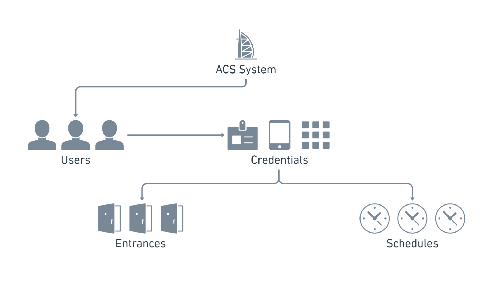

# Understanding Access Control System Differences

Seam's universal API provides the flexibility to manage a variety of [ACSs](../../../products/access-systems/). Variations among ACSs include the methods that you use to assign access permissions to users. For example, some ACSs grant scheduled access to [entrances](../retrieving-entrance-details.md) through configured [access groups](../user-management/assigning-users-to-access-groups.md), while others specify entrance permissions and schedules as properties of [credentials](../managing-credentials.md). Other variations include the following:

* Whether an ACS is cloud-based or on-premises
* The specific licenses, if any, that each ACS manufacturer requires you to purchase
* The manufacturer-specific ACS properties and metadata that you must configure to create and assign credentials to ACS users

To understand the manufacturer-specific nuances of your ACS, see the relevant [system integration guide](../../../device-and-system-integration-guides/overview.md#access-control-systems).

***

## Access Control System Installation Variations

Seam supports connecting to ACSs that are either cloud-based or on-premises.

Cloud-based ACSs are hosted on the internet and are accessible by Seam over a secure connection. This type of ACS provides the benefits and ease of remote management. In addition, you can monitor real-time data and analytics.

On-premises ACSs can also be connected to the internet but are typically protected by a firewall. To integrate with these systems, Seam requires the [Seam Bridge](../../seam-bridge.md), an application installed on a local computer. Once installed, the [Seam Bridge](../../seam-bridge.md) acts as a secure intermediary, handling network requests between Seam and the on-premises network, and enables secure communication through the firewall.

For detailed information about installing the Seam Bridge and connecting an on-premises ACS to Seam, see [Seam Bridge](../../seam-bridge.md).

***

## Access Permission Assignment Variations

This section describes various ways in which ACSs handle assigning access permissions to users.

### Access Group-Based Access Control Systems

Access group-based ACSs use access groups as an efficient way to assign access permissions to [ACS users](../../../products/access-systems/user-management.md). Each access group contains a list of entrances and the corresponding access schedule. Seam syncs all the access group and entrance information from the ACS.

To assign access permissions in an access group-based ACS, you add ACS users to the access groups. Then, you create credentials to specify the access mechanisms—such as key cards, PIN codes, or mobile keys—and assign these credentials to the ACS users.

<figure><figcaption>
Seam resource relationships for an access group-based ACS
</figcaption></figure>

The following process describes the configuration steps for your application to grant access in an access group-based ACS:

1. Connect the ACS system.\
   When the ACS connects to Seam, Seam automatically creates the `acs_system`. Seam also syncs the entrances and access groups from the connected ACS as `acs_entrance` and `acs_access_group` resources.\
   Note that because Seam automatically syncs these entrance and access group resources from the ACS, you cannot create, edit, or delete them using the Seam API.
2. Create ACS users.\
   Your application creates an `acs_user` for each user within this ACS. Each `acs_user` is configured with a set of attributes, such their name, email address, and phone number, as applicable.\
   If you need to grant a single application user access to multiple ACSs—for example, if an application user needs access to multiple buildings, each of which uses a separate ACS, or if a single building has different ACSs for different floors—you can use Seam [user identities](../../../api/user_identities/) to link `acs_user`s in different `acs_system`s.
3. Add ACS users to access groups.\
   Your application [adds](../user-management/assigning-users-to-access-groups.md#add-a-user-to-an-access-group) each `acs_user` to an `acs_access_group`. Note that the access group defines the entrances and access schedules for all the ACS users in this access group.
4.  Create credentials.\
    Your application creates `acs_credential`s with the following attributes:

    * ID of the `acs_user` to associate with this credential
    * Access method for the credential, such as `code`, `card`, or `mobile_key`

    Depending on the access method and specific ACS, your application can also configure additional credential properties. For more information about manufacturer-specific variations, see the [system integration guide](../../../device-and-system-integration-guides/overview.md#access-control-systems) for your ACS.

You can also perform other management actions, as needed, such as [adding ACS users to](../user-management/assigning-users-to-access-groups.md#add-an-acs-user-to-an-access-group) and [removing ACS users from access groups](../user-management/assigning-users-to-access-groups.md#remove-an-acs-user-from-an-access-group), [assigning](../assigning-credentials-to-users.md#assign-a-credential-to-a-user) and [unassigning](../assigning-credentials-to-users.md#unassign-a-credential-from-a-user) existing credentials, [suspending](../../../products/access-systems/suspending-and-unsuspending-users.md#suspend-an-acs-user) and [unsuspending](../../../products/access-systems/suspending-and-unsuspending-users.md#unsuspend-an-acs-user) ACS users, [updating ACS users](../../../products/access-systems/user-management.md#update-a-user) and [credentials](../../../api/acs/credentials/update.md), and [deleting ACS users](../../../products/access-systems/user-management.md#delete-a-user) and [credentials](../managing-credentials.md#delete-a-credential).

### Credential-Based Access Control Systems

In a credential-based ACS, the [`acs_credential`](../../../api/acs/credentials/) resource contains the list of entrances to which the credential grants access. The `acs_credential` also contains the schedule that specifies when this access is valid. You specify each schedule by configuring a `starts_at` and `ends_at` date and time.

<figure><figcaption>
Seam resource relationships for a credential-based ACS
</figcaption></figure>

The following process describes the configuration steps for your application to grant access in a credential-based ACS:

1. Connect the ACS system.\
   When the ACS connects to Seam, Seam automatically creates the [`acs_system`](../../../api/acs/systems/). Seam also syncs the entrances from the connected ACS as `acs_entrance` resources. Note that because Seam automatically syncs these entrance resources from the ACS, you cannot create, edit, or delete them using the Seam API.
2. Create ACS users.\
   Your application [creates](../../../products/access-systems/user-management.md#create-a-user) an [`acs_user`](../../../api/acs/users/) for each user within this ACS. Each `acs_user` is configured with a set of attributes, such their name, email address, and phone number, as applicable.\
   If you need to grant a single application user access to multiple ACSs—for example, if an application user needs access to multiple buildings, each of which uses a separate ACS—you can use Seam [user identities](../../../api/user_identities/) to link `acs_user`s in different `acs_system`s.
3.  Create credentials.\
    Your application [creates](../managing-credentials.md#create-a-credential-for-a-user) `acs_credential`s with the following attributes:

    * ID of the `acs_user` to associate with this credential
    * Access method for the credential, such as `code`, `card`, or `mobile_key`
    * Set of entrances to which this credential grants access
    * Start and end date and time during which this credential grants access

    Depending on the access method and specific ACS, your application can also configure additional credential properties. For more information about manufacturer-specific variations, see the [system integration guide](../../../device-and-system-integration-guides/overview.md#access-control-systems) for your ACS.

You can also perform other management actions, as needed, such as [assigning](../assigning-credentials-to-users.md#assign-a-credential-to-a-user) and [unassigning](../assigning-credentials-to-users.md#unassign-a-credential-from-a-user) existing credentials, [suspending](../../../products/access-systems/suspending-and-unsuspending-users.md#suspend-an-acs-user) and [unsuspending](../../../products/access-systems/suspending-and-unsuspending-users.md#unsuspend-an-acs-user) ACS users, [updating ACS users](../../../products/access-systems/user-management.md#update-a-user) and [credentials](../../../api/acs/credentials/update.md), and [deleting ACS users](../../../products/access-systems/user-management.md#delete-a-user) and [credentials](../managing-credentials.md#delete-a-credential).

***

## Next Steps

To learn about the manufacturer-specific variations for ACSs, see the corresponding [system integration guides](../../../device-and-system-integration-guides/overview.md#access-control-systems).
