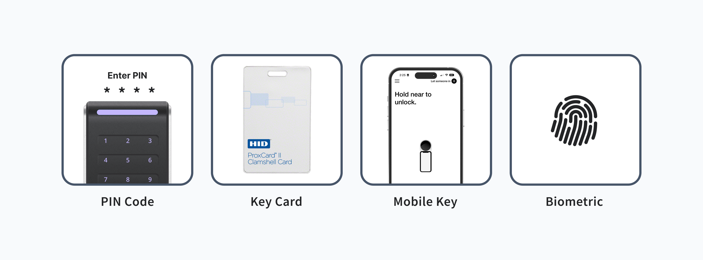

# Managing Credentials

An ACS generally uses digital means of access to authorize an [ACS user](../../products/access-systems/user-management.md) trying to get through a specific entrance. Examples of credentials include RFID cards, mobile keys, biometric identifiers, and PIN codes. The electronic nature of these credentials, as well as the fact that access is centralized, enables both the rapid provisioning and rescinding of access and the ability to compile access audit logs.

<figure><figcaption><p>Examples of ACS user credentials</p></figcaption></figure>

This guide provides instructions for creating and deleting various types of credentials.


You can assign a credential to an ACS user when you create the credential. You can also [assign an existing credential to an ACS user](assigning-credentials-to-users.md#assign-a-credential-to-a-user). Further, you can [unassign a credential from an ACS user](assigning-credentials-to-users.md#unassign-a-credential-from-a-user) without deleting the credential.


***

## Create a Credential for an ACS User

To [create a credential for an ACS user](../../api-clients/access-control-systems/credentials/create-credential-for-user.md), provide the `acs_user_id` and the desired `access_method`. Seam supports the following access methods:

* `code` for a PIN code-based credential
* `card` for a key card-based credential
* `mobile_key` for a [Seam mobile key](../../products/mobile-access-in-development/issuing-mobile-credentials-from-an-access-control-system.md#what-are-multi-phone-sync-credentials).

Depending on the ACS and the type of credential you are issuing, you can also specify the following properties for the new credential:

* PIN code.
* Start and end time frame for the validity of the credential.
* Whether the credential is a multi-phone sync credential.\
  When creating a Seam mobile key, make sure to issue a multi-phone sync credential by setting `is_multi_phone_sync_credential` to `true`.
* Manufacturer-specific data.


Make sure to note any manufacturer-specific metadata and restrictions. For details, see the applicable [device or system integration guide](../../device-and-system-integration-guides/overview.md).


The response includes the `acs_credential_id` of the newly-created credential, the `acs_user_id` associated with the credential, and additional attributes of the credential.

***

### Create a PIN Code-based Credential



**Request:**

```python
seam.acs.credentials.create(
  acs_user_id="33333333-3333-3333-3333-333333333333",
  access_method="code",
  code="824759"
)
```

**Response:**

```
AcsCredential(
  acs_credential_id='66666666-6666-6666-6666-666666666666',
  acs_user_id='33333333-3333-3333-3333-333333333333',
  code='824759',
  access_method='code',
  ...
)
```



**Request:**

```bash
curl -X 'POST' \
  'https://connect.getseam.com/acs/credentials/create' \
  -H 'accept: application/json' \
  -H "Authorization: Bearer ${API_KEY}" \
  -H 'Content-Type: application/json' \
  -d '{
  "acs_user_id": "33333333-3333-3333-3333-333333333333",
  "access_method": "code",
  "code": "824759"
}'
```

**Response:**

```json
{
  "acs_credential": {
    "acs_credential_id": "66666666-6666-6666-6666-666666666666",
    "acs_user_id": "33333333-3333-3333-3333-333333333333",
    "code": "824759",
    "access_method": "code",
    ...
  },
  "ok": true
}
```



**Request:**

```javascript
await seam.acs.credentials.create({
  acs_user_id: "33333333-3333-3333-3333-333333333333",
  access_method: "code",
  code: "824759"
});
```

**Response:**

```json
{
  acs_credential_id: '66666666-6666-6666-6666-666666666666',
  acs_user_id: '33333333-3333-3333-3333-333333333333',
  code: '824759',
  access_method: 'code',
  ...
}
```



**Request:**

```ruby
# Coming soon!
```

**Response:**

```
# Coming soon!
```



**Request:**

```php
$seam->acs->credentials->create(
  acs_user_id: "33333333-3333-3333-3333-333333333333",
  access_method: "code",
  code: "824759"
);
```

**Response:**

```json
{
  "acs_credential_id": "66666666-6666-6666-6666-666666666666",
  "acs_user_id": "33333333-3333-3333-3333-333333333333",
  "code": "824759",
  "access_method": "code",
  ...
}
```



**Request:**

```csharp
seam.CredentialsAcs.Create(
  acsUserId: "33333333-3333-3333-3333-333333333333",
  accessMethod: "code",
  code: "824759"
);
```

**Response:**

```json
{
  "acs_credential_id": "66666666-6666-6666-6666-666666666666",
  "acs_user_id": "33333333-3333-3333-3333-333333333333",
  "code": "824759",
  "access_method": "code",
  ...
}
```



**Request:**

```java
// Coming soon!
```

**Response:**

```json
// Coming soon!
```



**Request:**

```go
credential, uErr := client.Acs.Credentials.Create(
  context.Background(), &acs.CredentialsCreateRequest{
    AcsUserId: "33333333-3333-3333-3333-333333333333",
    AccessMethod: "code",
    Code: api.String("824759"),
  },
);
```

**Response:**

```json
{
  "acs_credential": {
    "acs_credential_id": "66666666-6666-6666-6666-666666666666",
    "acs_user_id": "33333333-3333-3333-3333-333333333333",
    "code": "824759",
    "access_method": "code",
    ...
  },
  "ok": true
}
```



***

### Create a Key Card-based Credential



**Request:**

```python
seam.acs.credentials.create(
  acs_user_id="33333333-3333-3333-3333-333333333333",
  access_method="card",
  code="123456"
)
```

**Response:**

```
AcsCredential(
  acs_credential_id='77777777-7777-7777-7777-777777777777',
  acs_user_id='33333333-3333-3333-3333-333333333333',
  access_method='card',
  ...
)
```



**Request:**

```bash
curl -X 'POST' \
  'https://connect.getseam.com/acs/credentials/create' \
  -H 'accept: application/json' \
  -H "Authorization: Bearer ${API_KEY}" \
  -H 'Content-Type: application/json' \
  -d '{
  "acs_user_id": "33333333-3333-3333-3333-333333333333",
  "access_method": "card",
  "code": "123456"
}'
```

**Response:**

```json
{
  "acs_credential": {
    "acs_credential_id": "77777777-7777-7777-7777-777777777777",
    "acs_user_id": "33333333-3333-3333-3333-333333333333",
    "access_method": "card",
    ...
  },
  "ok": true
}
```



**Request:**

```javascript
await seam.acs.credentials.create({
  acs_user_id: "33333333-3333-3333-3333-333333333333",
  access_method: "card",
  code: "123456"
});
```

**Response:**

```json
{
  acs_credential_id: '77777777-7777-7777-7777-777777777777',
  acs_user_id: '33333333-3333-3333-3333-333333333333',
  access_method: 'card',
  ...
}
```



**Request:**

```ruby
# Coming soon!
```

**Response:**

```
# Coming soon!
```



**Request:**

```php
$seam->acs->credentials->create(
  acs_user_id: "33333333-3333-3333-3333-333333333333",
  access_method: "card",
  code: "123456"
);
```

**Response:**

```json
{
  "acs_credential_id": "77777777-7777-7777-7777-777777777777",
  "acs_user_id": "33333333-3333-3333-3333-333333333333",
  "access_method": "card",
  ...
}
```



**Request:**

```csharp
seam.CredentialsAcs.Create(
  acsUserId: "33333333-3333-3333-3333-333333333333",
  accessMethod: "card",
  code: "123456"
);
```

**Response:**

```
{
  "acs_credential_id": "77777777-7777-7777-7777-777777777777",
  "acs_user_id": "33333333-3333-3333-3333-333333333333",
  "access_method": "card",
  ...
}
```



**Request:**

```java
// Coming soon!
```

**Response:**

```json
// Coming soon!
```



**Request:**

```go
credential, uErr := client.Acs.Credentials.Create(
  context.Background(), &acs.CredentialsCreateRequest{
    AcsUserId: "33333333-3333-3333-3333-333333333333",
    AccessMethod: "card",
    Code: api.String("123456"),
  },
);
```

**Response:**

```json
{
  "acs_credential": {
    "acs_credential_id": "77777777-7777-7777-7777-777777777777",
    "acs_user_id": "33333333-3333-3333-3333-333333333333",
    "access_method": "card",
    ...
  },
  "ok": true
}
```



***

### Create a Seam Mobile Key

Depending on the ACS for which you want to create a credential, you may also need to include system-specific metadata. See the [system integration guide](../../device-and-system-integration-guides/overview.md#access-control-systems) for your ACS. For more information about mobile access and issuing mobile credentials, see [Mobile Access](../../products/mobile-access-in-development/) and [Issuing Mobile Credentials from an Access Control System](../../products/mobile-access-in-development/issuing-mobile-credentials-from-an-access-control-system.md).



**Request:**


This request contains manufacturer-specific metadata that may vary by [manufacturer](../../device-and-system-integration-guides/overview.md#access-control-systems).


```python
seam.acs.credentials.create(
  acs_user_id="33333333-3333-3333-3333-333333333333",
  allowed_acs_entrance_ids=[
    "55555555-5555-5555-5555-555555555555",
    "55555555-5555-5555-5555-000000000000"
  ],
  credential_manager_acs_system_id="88888888-8888-8888-8888-888888888888",
  access_method="mobile_key",
  is_multi_phone_sync_credential=True,
  starts_at="2024-03-01T10:40:00Z",
  ends_at="2024-03-04T10:40:00Z",
  ...
)
```

**Response:**


This response contains manufacturer-specific metadata that may vary by [manufacturer](../../device-and-system-integration-guides/overview.md#access-control-systems).


```
AcsCredential(
  acs_credential_id='99999999-9999-9999-9999-999999999999',
  acs_user_id='33333333-3333-3333-3333-333333333333',
  access_method='mobile_key',
  is_multi_phone_sync_credential=True,
  ...
)
```



**Request:**


This request contains manufacturer-specific metadata that may vary by [manufacturer](../../device-and-system-integration-guides/overview.md#access-control-systems).


```bash
curl -X 'POST' \
  'https://connect.getseam.com/acs/credentials/create' \
  -H 'accept: application/json' \
  -H "Authorization: Bearer ${API_KEY}" \
  -H 'Content-Type: application/json' \
  -d '{
  "acs_user_id": "33333333-3333-3333-3333-333333333333",
  "allowed_acs_entrance_ids": [
    "55555555-5555-5555-5555-555555555555",
    "55555555-5555-5555-5555-000000000000"
  ],
  "credential_manager_acs_system_id": "88888888-8888-8888-8888-888888888888",
  "access_method": "mobile_key",
  "is_multi_phone_sync_credential": true,
  "starts_at": "2024-03-01T10:40:00Z",
  "ends_at": "2024-03-04T10:40:00Z",
  ...
}'
```

**Response:**


This response contains manufacturer-specific metadata that may vary by [manufacturer](../../device-and-system-integration-guides/overview.md#access-control-systems).


```json
{
  "acs_credential": {
    "acs_credential_id": "99999999-9999-9999-9999-999999999999",
    "acs_user_id": "33333333-3333-3333-3333-333333333333",
    "access_method": "mobile_key",
    "is_multi_phone_sync_credential": true,
    ...
  },
  "ok": true
}
```



**Request:**


This request contains manufacturer-specific metadata that may vary by [manufacturer](../../device-and-system-integration-guides/overview.md#access-control-systems).


```javascript
await seam.acs.credentials.create({
  acs_user_id: "33333333-3333-3333-3333-333333333333",
  allowed_acs_entrance_ids: [
    "55555555-5555-5555-5555-555555555555",
    "55555555-5555-5555-5555-000000000000"
  ],
  credential_manager_acs_system_id: "88888888-8888-8888-8888-888888888888",
  access_method: "mobile_key",
  is_multi_phone_sync_credential: true,
  starts_at: "2024-03-01T10:40:00Z",
  ends_at: "2024-03-04T10:40:00Z",
  ...
});
```

**Response:**


This response contains manufacturer-specific metadata that may vary by [manufacturer](../../device-and-system-integration-guides/overview.md#access-control-systems).


```json
{
  acs_credential_id: '99999999-9999-9999-9999-999999999999',
  acs_user_id: '33333333-3333-3333-3333-333333333333',
  access_method: 'mobile_key',
  is_multi_phone_sync_credential: true,
  ...
}
```



**Request:**

```ruby
# Coming soon!
```

**Response:**

```
# Coming soon!
```



**Request:**


This request contains manufacturer-specific metadata that may vary by [manufacturer](../../device-and-system-integration-guides/overview.md#access-control-systems).


```php
$seam->acs->credentials->create(
  acs_user_id: "33333333-3333-3333-3333-333333333333",
  allowed_acs_entrance_ids: [
    "55555555-5555-5555-5555-555555555555",
    "55555555-5555-5555-5555-000000000000"
  ],
  credential_manager_acs_system_id: "88888888-8888-8888-8888-888888888888",
  access_method: "mobile_key",
  is_multi_phone_sync_credential: true,
  starts_at: "2024-03-01T10:40:00Z",
  ends_at: "2024-03-04T10:40:00Z",
  ...
);
```

**Response:**


This response contains manufacturer-specific metadata that may vary by [manufacturer](../../device-and-system-integration-guides/overview.md#access-control-systems).


```json
{
  "acs_credential_id": "99999999-9999-9999-9999-999999999999",
  "acs_user_id": "33333333-3333-3333-3333-333333333333",
  "access_method": "mobile_key",
  "is_multi_phone_sync_credential": true,
  ...
}
```



**Request:**


This request contains manufacturer-specific metadata that may vary by [manufacturer](../../device-and-system-integration-guides/overview.md#access-control-systems).


```csharp
seam.CredentialsAcs.Create(
  acsUserId: "33333333-3333-3333-3333-333333333333",
  allowedAcsEntranceIds: new List<string>
    {
      "55555555-5555-5555-5555-555555555555",
      "55555555-5555-5555-5555-000000000000"
    },
  credentialManagerAcsSystemId: "88888888-8888-8888-8888-888888888888",
  accessMethod: "mobile_key",
  isMultiPhoneSyncCredential: true,
  startsAt: "2024-03-01T10:40:00Z",
  endsAt: "2024-03-04T10:40:00Z",
  ...
);
```

**Response:**


This response contains manufacturer-specific metadata that may vary by [manufacturer](../../device-and-system-integration-guides/overview.md#access-control-systems).


```json
{
  "acs_credential_id": "99999999-9999-9999-9999-999999999999",
  "acs_user_id": "33333333-3333-3333-3333-333333333333",
  "access_method": "mobile_key",
  "is_multi_phone_sync_credential": true,
  ...
}
```



**Request:**

```java
// Coming soon!
```

**Response:**

```json
// Coming soon!
```



**Request:**


This request contains manufacturer-specific metadata that may vary by [manufacturer](../../device-and-system-integration-guides/overview.md#access-control-systems).


```go
startsAt, err := time.Parse(time.RFC3339, "2024-03-01T10:40:00Z")
endsAt, err := time.Parse(time.RFC3339, "2024-03-04T10:40:00Z")
if err != nil {
  return err
}

credential, uErr := client.Acs.Credentials.Create(
  context.Background(), &acs.CredentialsCreateRequest{
    AcsUserId: "33333333-3333-3333-3333-333333333333",
    AllowedAcsEntranceIds: {
        "55555555-5555-5555-5555-555555555555",
        "55555555-5555-5555-5555-000000000000",
      },
    CredentialManagerAcsSystemId: api.String("88888888-8888-8888-8888-888888888888"),
    AccessMethod: "mobile_key",
    IsMultiPhoneSyncCredential: api.Bool(true),
    StartsAt: api.Time(startsAt),
    EndsAt: api.Time(endsAt),
    ...
  },
)
```

**Response:**


This response contains manufacturer-specific metadata that may vary by [manufacturer](../../device-and-system-integration-guides/overview.md#access-control-systems).


```json
{
  "acs_user": {
    "acs_credential_id": "99999999-9999-9999-9999-999999999999",
    "acs_user_id": "33333333-3333-3333-3333-333333333333",
    "access_method": "mobile_key",
    "is_multi_phone_sync_credential": true,
    ...
  },
  "ok": true
}
```



***

## Delete a Credential

To [delete a credential](../../api-clients/access-control-systems/credentials/delete-credential.md), provide the `acs_credential_id`.



**Request:**

```python
seam.acs.credentials.delete(
  acs_credential_id="66666666-6666-6666-6666-666666666666"
)
```

**Response:**

```
None
```



**Request:**

```bash
curl -X 'POST' \
  'https://connect.getseam.com/acs/credentials/delete' \
  -H 'accept: application/json' \
  -H "Authorization: Bearer ${API_KEY}" \
  -H 'Content-Type: application/json' \
  -d '{
  "acs_credential_id": "66666666-6666-6666-6666-666666666666"
}'
```

**Response:**

```json
{
  "ok": true
}
```



**Request:**

```javascript
await seam.acs.credentials.delete({
  acs_credential_id: "66666666-6666-6666-6666-666666666666"
});
```

**Response:**

```json
void
```



**Request:**

```ruby
# Coming soon!
```

**Response:**

```
# Coming soon!
```



**Request:**

```php
$seam->acs->credentials->delete(
  acs_credential_id: "66666666-6666-6666-6666-666666666666"
);
```

**Response:**

```
void
```



**Request:**

```csharp
seam.CredentialsAcs.Delete(
  acsCredentialId: "66666666-6666-6666-6666-666666666666"
);
```

**Response:**

```
void
```



**Request:**

```java
// Coming soon!
```

**Response:**

```json
// Coming soon!
```



**Request:**

```go
_, uErr := client.Acs.Credentials.Delete(
  context.Background(), &acs.CredentialsDeleteRequest{
    acsCredentialId: "66666666-6666-6666-6666-666666666666",
  },
);
```

**Response:**

```json
void
```


