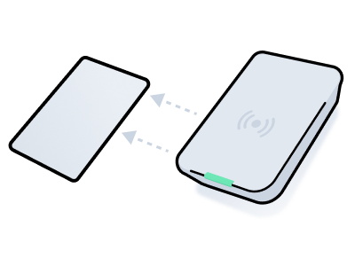

# Creating and Encoding Card Access Methods

<figure><figcaption></figcaption></figure>

Some access control systems require encoding a plastic card with the data necessary to enable access. This process involves creating an access grant that requests a card access method with the required access permissions and then using a card encoder to write the access method onto the card.

This process consists of the following basic steps:

1.  Create an [Access Grant](../../access-grants/) that includes a request for a card access method and identify the ID of the resulting access method.

    See [Create an Access Grant](creating-and-encoding-card-access-methods.md#id-1.-create-an-access-grant).
2. Use the `/acs/encoders/list` endpoint to retrieve a list of available encoders. Then, choose the encoder that you want to use to write the access method onto the card.\
   See [Retrieve Encoders](creating-and-encoding-card-access-methods.md#id-2.-retrieve-encoders).
3. Use the `/access_methods/encode` endpoint to encode the access method onto the card, using the encoder that you have chosen.\
   See [Encode the Card](creating-and-encoding-card-access-methods.md#id-3.-encode-the-card).
4. Confirm that the card was encoded successfully using polling or a [webhook](../../../core-concepts/webhooks.md).\
   See [Confirm Successful Encoding](creating-and-encoding-card-access-methods.md#id-4.-confirm-successful-encoding). Also, see a list of [common encoding errors](creating-and-encoding-card-access-methods.md#common-encoding-errors).

Once you have written an access method to a card, you cannot reuse the access method for another card. That is, you must create a separate access method for each card. However, you can reuse a card by re-encoding the card with a new access method.

***

## 1. **Create an Access Grant**

This example shows how to create a card access method as part of an Access Grant. Note that the `is_encoding_required` property of the resulting access method is `true`, which means that the access method must be encoded onto a card. Further, once you've encoded the access method on to the card, the `is_issued` property changes to `true`, and the `issued_at` property indicates the date and time at which the encoding occurred.

For more details about creating Access Grants, see [Creating an Access Grant Using Entrances](../../access-grants/creating-an-access-grant-using-entrances.md) and [Creating an Access Grant Using Spaces](../../access-grants/creating-an-access-grant-using-spaces.md).



**Code**

```python
# Identify the IDs of the entrances to which
# you want to grant access.
entrances = seam.acs.entrances.list(
  # Use the access system ID that you copied in the previous step.
  acs_system_id=acs_system_id
)

# Create the Access Grant.
access_grant = seam.access_grants.create(
  # Create a new user identity to represent your user.
  user_identity={
   "full_name": "Jane Doe",
   "email_address": "jane.doe@example.com",
   "phone_number": "+15555551000"
  },
  # Specify the IDs of the entrances to which you want to grant access.
  acs_entrance_ids=[
    entrances[0].acs_entrance_id,
    entrances[1].acs_entrance_id
  ],

  # Specify that you want to issue a card access method.
  requested_access_methods=[
    {"mode": "card"}
  ],
  # Specify the access schedule.
  starts_at="2025-08-01T15:00:00.000Z",
  ends_at="2025-08-04T11:00:00.000Z"
)
```

**Output**

```python
AccessGrant(
  access_grant_id='6d74aefc-5712-4a8b-82c1-73a51ae60b87',
  user_identity_id='8cc2633a-54ca-455a-8a2b-77e6a1fc4fee',
  starts_at='2025-08-01T15:00:00.000Z',
  ends_at='2025-08-04T11:00:00.000Z',
  instant_key_url='https://ik.seam.co/ABCXYZ',
  requested_access_methods=[
    {
      "display_name": "Plastic Card",
      "mode": "card",
      "created_at": "2025-06-16T16:54:19.946606Z",
      # Note the access_method_id of the created card access method.
      "created_access_method_ids": ["5f4e3d2c-1b0a-9f8e-7d6c-5b4a3c2d1e0f"]
    }
  ],
  ...
)
```



**Code**

```curl
# Identify the IDs of the entrances to which
# you want to grant access.
# Use the access system ID that you copied in the previous step.
mapfile -t entrances < <(
  curl -s --request POST "https://connect.getseam.com/acs/entrances/list" \
    --header "Authorization: Bearer $SEAM_API_KEY" \
    --header "Content-Type: application/json" \
    --data "{\"acs_system_id\": \"$acs_system_id\"}" | 
  jq -c '.acs_entrances[]'
)

# Create the Access Grant.
# In this command:
# - Create a new user identity to represent your user.
# - Specify the IDs of the entrances to which you want to grant access.
# - Specify that you want to issue a card access method.
# - Specify the access schedule.
access_grant=$(curl --include --request POST "https://connect.getseam.com/access_grants/create" \
  -H "Authorization: Bearer $SEAM_API_KEY" \
  -H 'Content-Type: application/json' \
  -d "{
    \"user_identity\": {
      \"full_name\": \"Jane Doe\",
      \"email_address\": \"jane.doe@example.com\",
      \"phone_number\": \"+15555551000\"
    },
    \"acs_entrance_ids\": [
      \"$(echo ${entrances[0]} | jq -r '.acs_entrance_id')\",
      \"$(echo ${entrances[1]} | jq -r '.acs_entrance_id')\"
    ],
    \"requested_access_methods\": [
      {
        \"mode\": \"card\"
      }
    ],
    \"starts_at\": \"2025-08-01T15:00:00.000Z\",
    \"ends_at\": \"2025-08-04T11:00:00.000Z\"
}")
```

**Output**

```json
{
  "access_grant":{
    "access_grant_id":"6d74aefc-5712-4a8b-82c1-73a51ae60b87",
    "user_identity_id":"8cc2633a-54ca-455a-8a2b-77e6a1fc4fee",
    "starts_at":"2025-08-01T15:00:00.000Z",
    "ends_at":"2025-08-04T11:00:00.000Z"
    "instant_key_url":"https://ik.seam.co/ABCXYZ",
    "requested_access_methods":[
      {
        "display_name":"Plastic Card",
        "mode":"card",
        # Note the access_method_id of the created card access method.
        "created_access_method_ids":["5f4e3d2c-1b0a-9f8e-7d6c-5b4a3c2d1e0f"],
        "created_at":"2025-06-16T16:54:19.946606Z"
      }
    ],
    ...
  },
  "ok":true
}
```



**Code**

```javascript
// Identify the IDs of the entrances to which
// you want to grant access.
const entrances = await seam.acs.entrances.list({
  // Use the access system ID that you copied in the previous step.
  acs_system_id: acsSystemId
});

// Create the Access Grant.
const accessGrant = await seam.accessGrants.create({
  // Create a new user identity to represent your user.
  user_identity: {
    full_name: "Jane Doe",
    email_address: "jane.doe@example.com",
    phone_number: "+15555551000"    
  },
  // Specify the IDs of the entrances to which you want to grant access.
  acs_entrance_ids: [
    entrances[0].acs_entrance_id,
    entrances[1].acs_entrance_id
  ],
  // Specify that you want to issue a card access method.
  requested_access_methods: [
    {"mode": "card"}
  ],
  // Specify the access schedule.
  starts_at: "2025-08-01T15:00:00.000Z",
  ends_at: "2025-08-04T11:00:00.000Z"
});
```

**Output**

```json
{
  access_grant_id: '6d74aefc-5712-4a8b-82c1-73a51ae60b87',
  user_identity_id: '8cc2633a-54ca-455a-8a2b-77e6a1fc4fee',
  starts_at: '2025-08-01T15:00:00.000Z',
  ends_at: '2025-08-04T11:00:00.000Z'
  instant_key_url: 'https://ik.seam.co/ABCXYZ',
  requested_access_methods: [
    {
      display_name: 'Plastic card',
      mode: 'card',
      // Note the access_method_id of the created card access method.
      created_access_method_ids: ["5f4e3d2c-1b0a-9f8e-7d6c-5b4a3c2d1e0f"],
      created_at: '2025-06-16T16:54:19.946606Z'
    }
  ],
  ...
}
```



**Code**

```ruby
# Identify the IDs of the entrances to which
# you want to grant access.
entrances = seam.acs.entrances.list(
  # Use the access system ID that you copied in the previous step.
  acs_system_id: acs_system_id
)

# Create the Access Grant.
access_grant = seam.access_grants.create(
  # Create a new user identity to represent your user.
  user_identity: {
    full_name: "Jane Doe",
    email_address: "jane.doe@example.com",
    phone_number: "+15555551000"    
  },
  # Specify the IDs of the entrances to which you want to grant access.
  acs_entrance_ids: [
    entrances[0].acs_entrance_id,
    entrances[1].acs_entrance_id
  ],
  # Specify that you want to issue a card access method.
  requested_access_methods: [
    { mode: "card" }
  ],
  # Specify the access schedule.
  starts_at: "2025-08-01T15:00:00.000Z",
  ends_at: "2025-08-04T11:00:00.000Z"
)
```

**Output**

```ruby
<Seam::Resources::AccessGrant:0x005f0
  access_grant_id="6d74aefc-5712-4a8b-82c1-73a51ae60b87"
  user_identity_id="8cc2633a-54ca-455a-8a2b-77e6a1fc4fee"
  starts_at=2025-08-01 15:00:00 UTC
  ends_at=2025-08-04 11:00:00 UTC
  instant_key_url="https://ik.seam.co/ABCXYZ"
  requested_access_methods=[
    {
      "display_name"=>"Plastic card",
      "mode"=>"card",
      # Note the access_method_id of the created card access method.
      "created_access_method_ids"=>["5f4e3d2c-1b0a-9f8e-7d6c-5b4a3c2d1e0f"],
      "created_at"=>"2025-06-16T16:54:19.946606Z"
    }
  ]
  ...
>
```



**Code**

```php
// Identify the IDs of the entrances to which
// you want to grant access.
$entrances = $seam->acs->entrances->list(
  // Use the access system ID that you copied in the previous step.
  acs_system_id: $acs_system_id
);

// Create the Access Grant.
$access_grant = $seam->access_grants->create(
  // Create a new user identity to represent your user.
  user_identity: [
    "full_name" => "Jane Doe",
    "email_address" => "jane.doe@example.com",
    "phone_number" => "+15555551000"
  ],
  // Specify the IDs of the entrances to which you want to grant access.
  acs_entrance_ids: [
    $entrances[0]->acs_entrance_id,
    $entrances[1]->acs_entrance_id
  ],
  // Specify that you want to issue a card access method.
  requested_access_methods: [
    ["mode" => "card"]
  ],
  // Specify the access schedule.
  starts_at: '2025-08-01T15:00:00.000Z',
  ends_at: '2025-08-04T11:00:00.000Z'
);
```

**Output**

```php
{
  "access_grant_id":"6d74aefc-5712-4a8b-82c1-73a51ae60b87",
  "user_identity_id":"8cc2633a-54ca-455a-8a2b-77e6a1fc4fee",
  "starts_at":"2025-08-01T15:00:00.000Z",
  "ends_at":"2025-08-04T11:00:00.000Z"
  "instant_key_url":"https://ik.seam.co/ABCXYZ",
  "requested_access_methods":[
    {
      "display_name":"Plastic Card",
      "mode":"card",
      // Note the access_method_id of the created card access method.
      "created_access_method_ids":["5f4e3d2c-1b0a-9f8e-7d6c-5b4a3c2d1e0f"],
      "created_at":"2025-06-16T16:54:19.946606Z"
    }
  ],
  ...
}
```



**Code**

```csharp
// Coming soon!
```

**Output**

```json
// Coming soon!
```



***

## 2. Retrieve Encoders

There may be multiple encoders at a location, so it’s important to select the right one to encode the credential.

This example shows how to retrieve all encoders in a building connected to a single access system. Once you've identified the encoder you'd like to use, save the `acs_encoder_id` of the chosen encoder for the next step.



**Code:**

```python
seam.acs.encoders.list(
  acs_system_ids = [building_system_id]
)
```

**Output:**

```
[
  AcsEncoder(
    acs_encoder_id='33333333-4444-5555-6666-777777777777',
    display_name='Front Desk',
    ...
  )
  ...
]
```



**Code:**

```bash
curl -X 'POST' \
  'https://connect.getseam.com/acs/encoders/list' \
  -H 'accept: application/json' \
  -H "Authorization: Bearer ${SEAM_API_KEY}" \
  -H 'Content-Type: application/json' \
  -d "{
  \"acs_system_ids\": [\"${building_system_id}\"]
}"
```

**Output:**

```json
{
  "acs_encoders": [
    {
      "acs_encoder_id": "33333333-4444-5555-6666-777777777777",
      "display_name": "Front Desk",
      ...
    },
    ...
  ],
  "ok": true
}
```



**Code:**

```javascript
await seam.acs.encoders.list({
  acs_system_ids: [buildingSystemId]
});
```

**Output:**

```json
[
  {
    acs_encoder_id: '33333333-4444-5555-6666-777777777777',
    display_name: 'Front Desk',
    ...
  },
  ...
]
```



**Code:**

```ruby
seam.acs.encoders.list(
  acs_system_ids: [building_system_id]
)
```

**Output:**

```
[
  <Seam::Resources::AcsEncoder:0x00410
    acs_encoder_id="33333333-4444-5555-6666-777777777777"
    display_name="Front Desk"
    ...
  >,
  ...
]
```



**Code:**

```php
$seam->acs->encoders->list(
  acs_system_ids: [building_system_id]
);
```

**Output:**

```json
[
  {
    "acs_encoder_id": "33333333-4444-5555-6666-777777777777",
    "display_name": "Front Desk",
    ...
  },
  ...
]
```



**Code:**

```csharp
// Coming Soon!
```

**Output:**

```json
// Coming Soon!
```



***

## 3. Encode the Card

Use `/acs/encoders/encode_credential` to start the card writing procedure that stores the access method data on the plastic key card.



**Code:**

```python
encoding_action_attempt = seam.access_methods.encode(
  access_method_id = access_method_id,
  acs_encoder_id = encoder.acs_encoder_id
)
```

**Output:**

```
ActionAttempt(
  status='pending',
  action_attempt_id='11111111-2222-3333-4444-555555555555',
  action_type='ENCODE_ACCESS_METHOD',
  result=null,
  error=null
)
```



**Code:**

```bash
encoding_action_attempt=$(curl -X 'POST' \
  'https://connect.getseam.com/access_methods/encode' \
  -H 'accept: application/json' \
  -H "Authorization: Bearer ${SEAM_API_KEY}" \
  -H 'Content-Type: application/json' \
  -d "{
  \"access_method_id\": \"${access_method_id}",
  \"acs_encoder_id\": \"${acs_encoder_id}\"
}")
```

**Output:**

```json
{
  "action_attempt":
    {
      "status": "pending",
      "action_attempt_id": "11111111-2222-3333-4444-555555555555",
      "action_type": "ENCODE_ACCESS_METHOD",
      "result": null,
      "error": null
    },
  "ok": true
}
```



**Code:**

```javascript
const encodingActionAttempt = await seam.accessMethods.encode({
  access_method_id: accessMethodId,
  acs_encoder_id: encoder.acs_encoder_id
});
```

**Output:**

```json
{
  status: 'pending',
  action_attempt_id: '11111111-2222-3333-4444-555555555555",
  action_type: 'ENCODE_ACCESS_METHOD',
  result: null,
  error: null
}
```



**Code:**

```ruby
encoding_action_attempt = seam.access_methods.encode(
  access_method_id: access_method_id,
  acs_encoder_id: encoder.acs_encoder_id
)
```

**Output:**

```
<Seam::Resources::ActionAttempt:0x00410
  status="pending"
  action_attempt_id="11111111-2222-3333-4444-555555555555"
  action_type="ENCODE_ACCESS_METHOD"
  result=nil
  error=nil
>
```



**Code:**

```php
$encoding_action_attempt = $seam->access_methods->encode(
  acs_credential_id: $access_method_id,
  acs_encoder_id: $encoder->acs_encoder_id
);
```

**Output:**

```json
{
  "status": "pending",
  "action_attempt_id": "11111111-2222-3333-4444-555555555555",
  "action_type": "ENCODE_ACCESS_METHOD",
  "result": null,
  "error": null
}
```



**Code:**

```csharp
// Coming Soon!
```

**Output:**

```json
// Coming Soon!
```



***

## 4. Confirm Successful Encoding

Once you issue a request to encode the access method onto the card, it is important to confirm that the encoding process completes successfully. You can use polling or a [webhook](../../../core-concepts/webhooks.md).

### Confirm Successful Encoding by Polling

When you make an `/access_methods/encode` request, Seam returns an [action attempt](../../../core-concepts/action-attempts.md). To confirm that the card encoding was successful, you can poll this action attempt, until its `status` becomes `success`.



**Code:**

```python
seam.action_attempts.get(
  action_attempt_id = encoding_action_attempt.action_attempt_id
)
```

**Output:**

```
ActionAttempt(
  status='success',
  action_attempt_id='11111111-2222-3333-4444-555555555555',
  action_type='ENCODE_ACCESS_METHOD',
  result={
    access_method_id='5f4e3d2c-1b0a-9f8e-7d6c-5b4a3c2d1e0f',
    card_number='1234abc',
    is_issued=True,
    issued_at='2025-06-16T16:56:00.000000Z',
    ...
  },
  error=null
)
```



**Code:**

```bash
curl -X 'POST' \
  'https://connect.getseam.com/action_attempts/get' \
  -H 'accept: application/json' \
  -H "Authorization: Bearer ${SEAM_API_KEY}" \
  -H 'Content-Type: application/json' \
  -d "{
  \"action_attempt_id\": \"$(jq -r '.action_attempt.action_attempt_id' <<< ${encoding_action_attempt})\"
}"
```

**Output:**

```json
{
  "action_attempt":
    {
      "status": "success",
      "action_attempt_id": "11111111-2222-3333-4444-555555555555",
      "action_type": "ENCODE_ACCESS_METHOD",
      "result": {
        "access_method_id": "5f4e3d2c-1b0a-9f8e-7d6c-5b4a3c2d1e0f",
        "card_number": "1234abc",
        "is_issued": true,
        "issued_at": "2025-06-16T16:56:00.000000Z",
        ...
      },
      "error": null
    },
  "ok": true
}
```



**Code:**

```javascript
await seam.actionAttempts.get({
  action_attempt_id: encodingActionAttempt.action_attempt_id
});
```

**Output:**

```json
{
  status: 'success',
  action_attempt_id: '11111111-2222-3333-4444-555555555555",
  action_type: 'ENCODE_ACCESS_METHOD',
  result: {
    access_method_id: "5f4e3d2c-1b0a-9f8e-7d6c-5b4a3c2d1e0f',
    card_number: '1234abc',
    is_issued: true,
    issued_at: '2025-06-16T16:56:00.000000Z',
    ...
  },
  error: null
}
```



**Code:**

```ruby
seam.action_attempts.get(
  action_attempt_id: encoding_action_attempt.action_attempt_id
)
```

**Output:**

```
<Seam::Resources::ActionAttempt:0x00410
  status="success"
  action_attempt_id="11111111-2222-3333-4444-555555555555"
  action_type="ENCODE_ACCESS_METHOD"
  result={
    access_method_id="5f4e3d2c-1b0a-9f8e-7d6c-5b4a3c2d1e0f"
    card_number="1234abc"
    is_issued=true,
    issued_at="2025-06-16T16:56:00.000000Z"
    ...
  }
  error=nil
>
```



**Code:**

```php
$seam->action_attempts->get(
  action_attempt_id: $encoding_action_attempt->action_attempt_id
);
```

**Output:**

```json
{
  "status": "success",
  "action_attempt_id": "11111111-2222-3333-4444-555555555555",
  "action_type": "ENCODE_ACCESS_METHOD",
  "result": {
    "access_method_id": "5f4e3d2c-1b0a-9f8e-7d6c-5b4a3c2d1e0f",
    "card_number": "1234abc",
    "is_issued": true,
    "issued_at": "2025-06-16T16:56:00.000000Z",
    ...
  },
  "error": null
}
```



**Code:**

```csharp
// Coming Soon!
```

**Output:**

```json
// Coming Soon!
```



#### View Access Method Properties

It is also useful to note that Seam assigns values to various card-related properties on the access method when the encoder has finished encoding the card. For example, `access_method.issued_at` receives a value. You can retrieve the access method to view these properties.



**Code**

```python
seam.access_methods.get(
  access_method_id=access_method_id
)
```

**Output**

```python
AccessMethod(
  access_method_id='5f4e3d2c-1b0a-9f8e-7d6c-5b4a3c2d1e0f',
  issued_at='2025-06-16T16:56:00.000000Z',
  ...
)
```



**Code**

```curl
curl -X 'POST' \
  'https://connect.getseam.com/access_methods/get' \
  -H 'accept: application/json' \
  -H "Authorization: Bearer ${SEAM_API_KEY}" \
  -H 'Content-Type: application/json' \
  -d "{
  \"access_method_id\": \"${access_method_id}\"
}"
```

**Output**

```curl
{
  "access_method": {
    "access_method_id": "5f4e3d2c-1b0a-9f8e-7d6c-5b4a3c2d1e0f",
    "issued_at": "2025-06-16T16:56:00.000000Z",
    ...
  },
  ok: true
}
```



**Code**

```javascript
await seam.accessMethods.get({
  access_method_id: accessMethodId
});
```

**Output**

```javascript
{
  "access_method_id": "5f4e3d2c-1b0a-9f8e-7d6c-5b4a3c2d1e0f",
  "issued_at": "2025-06-16T16:56:00.000000Z",
  ...
}
```



**Code**

```ruby
seam.access_methods.get(
  access_method_id: access_method_id
)
```

**Output**

```ruby
{
  "access_method_id" => "5f4e3d2c-1b0a-9f8e-7d6c-5b4a3c2d1e0f",
  "issued_at" => "2025-06-16T16:56:00.000000Z",
  ...
}
```



**Code**

```php
$seam->access_methods->get(
    access_method_id: $access_method_id
);
```

**Output**

```php
[
  "access_method_id": "5f4e3d2c-1b0a-9f8e-7d6c-5b4a3c2d1e0f",
  "issued_at": "2025-06-16T16:56:00.000000Z",
  ...
];
```



**Code:**

```csharp
// Coming Soon!
```

**Output:**

```json
// Coming Soon!
```



***

### Confirm Successful Encoding by Using a Webhook

To confirm successful encoding, you can use a [webhook](../../../core-concepts/webhooks.md) to listen for an `access_method.issued` event that contains the `access_method_id` in the payload. If you are re-encoding a card, listen for `access_method.reissued` instead of `access_method.issued`.

```json
{
  "event_id": "22222222-3333-4444-5555-666666666666",
  "event_description": "An access method was issued.",
  "event_type": "access_method.issued",
  "workspace_id": "00000000-0000-0000-0000-000000000000",
  "created_at": "2025-06-16T16:56:00.000000Z",
  "occurred_at": "2025-06-16T16:56:00.000000Z",
  "acs_system_id": "11111111-1111-1111-1111-111111111111",
  "access_method_id": "5f4e3d2c-1b0a-9f8e-7d6c-5b4a3c2d1e0f",
  "connected_account_id": "11111111-1111-1111-1111-222222222222"
}
```

***

## Common Encoding Errors

<table><thead><tr><th width="309">Error</th><th>Description</th></tr></thead><tbody><tr><td><code>no_card_on_encoder</code></td><td>No card was placed on the encoder.</td></tr><tr><td><code>incompatible_card_format</code></td><td>A card with an incompatible card format was placed on the encoder.</td></tr><tr><td><code>uncategorized_error</code></td><td>Any other encoding error.</td></tr></tbody></table>
