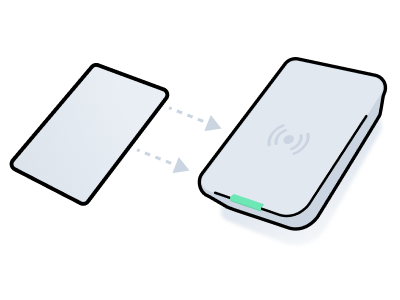

# Scanning Encoded Cards

<figure><figcaption></figcaption></figure>

You can use an encoder to scan a plastic key card to read its encoded parameters. The scan result  includes the card's properties, such as its card number, serial number, and other useful details. The returned payload can also reveal whether the card is up-to-date with the server. If discrepancies are detected, Seam also provides warnings to indicate that the card is out-of-date and needs re-encoding.

The scanning process consists of the following basic steps:

1. Initiate the scanning process.\
   Use the `/acs/encoders/scan_credential` endpoint. Specify the `acs_encoder_id` of the encoder that you want to use to scan the card.\
   This request returns an action attempt that tracks the status of the scan.\
   See [Initiate the Scanning Process](scanning-encoded-cards.md#initiate-the-scanning-process).
2. Poll the returned action attempt, until its `status` becomes `success`.\
   See [Confirm Successful Scan](scanning-encoded-cards.md#confirm-successful-scan).
3. View the scanned card payload.\
   Once the `status` of the action attempt is `success`, view the card payload within the action attempt. Note any `action_attempt.result.warnings`. Warning messages show which properties are out of sync.\
   See [View the Scanned Card Payload](scanning-encoded-cards.md#view-the-scanned-card-payload). Also, see a list of [common scanning errors](scanning-encoded-cards.md#common-scanning-errors).

***

## 1. Initiate the Scanning Process

To scan a card, first, identify the `acs_encoder_id` of the encoder that you want to use to scan the card. Then, initiate the scan using the `/acs/encoders/scan_credential` endpoint.



**Code:**

```python
# Retrieve a list of all available encoders in a building, 
# that is, connected to a single acs_system.
seam.acs.encoders.list(
  acs_system_ids = [building_system_id]
)

# Scan the card using the desired encoder.
scanning_action_attempt = seam.acs.encoders.scan_credential(
  acs_encoder_id = encoder.acs_encoder_id
)
```

**Output:**

```
ActionAttempt(
  status='pending',
  action_attempt_id='11111111-2222-3333-4444-666666666666',
  action_type='SCAN_CREDENTIAL',
  result=null,
  error=null
)
```



**Code:**

```bash
# Retrieve a list of all available encoders in a building, 
# that is, connected to a single acs_system.
curl -X 'POST' \
  'https://connect.getseam.com/acs/encoders/list' \
  -H 'accept: application/json' \
  -H "Authorization: Bearer ${SEAM_API_KEY}" \
  -H 'Content-Type: application/json' \
  -d "{
  \"acs_system_ids\": [\"${building_system_id}\"]
}"

# Scan the card using the desired encoder.
scanning_action_attempt=$(curl -X 'POST' \
  'https://connect.getseam.com/acs/encoders/scan_credential' \
  -H 'accept: application/json' \
  -H "Authorization: Bearer ${SEAM_API_KEY}" \
  -H 'Content-Type: application/json' \
  -d "{
  \"acs_encoder_id\": \"${acs_encoder_id}\"
}")
```

**Output:**

```json
{
  "action_attempt":
    {
      "status": "pending",
      "action_attempt_id": "11111111-2222-3333-4444-666666666666",
      "action_type": "SCAN_CREDENTIAL",
      "result": null,
      "error": null
    },
  "ok": true
}
```



**Code:**

```javascript
// Retrieve a list of all available encoders in a building, 
// that is, connected to a single acs_system.
await seam.acs.encoders.list({
  acs_system_ids: [buildingSystemId]
});

// Scan the card using the desired encoder.
const scanningActionAttempt = await seam.acs.encoders.scanCredential({
  acs_encoder_id: encoder.acs_encoder_id
});
```

**Output:**

```json
{
  status: 'pending',
  action_attempt_id: '11111111-2222-3333-4444-666666666666',
  action_type: 'SCAN_CREDENTIAL',
  result: null,
  error: null
}
```



**Code:**

```ruby
# Retrieve a list of all available encoders in a building, 
# that is, connected to a single acs_system.
seam.acs.encoders.list(
  acs_system_ids: [building_system_id]
)

# Scan the card using the desired encoder.
scanning_action_attempt = seam.acs.encoders.scan_credential(
  acs_encoder_id: encoder.acs_encoder_id
)
```

**Output:**

```
<Seam::Resources::ActionAttempt:0x00410
  status="pending"
  action_attempt_id="11111111-2222-3333-4444-666666666666"
  action_type="SCAN_CREDENTIAL"
  result=nil
  error=nil
>
```



**Code:**

```php
// Retrieve a list of all available encoders in a building, 
// that is, connected to a single acs_system.
$seam->acs->encoders->list(
  acs_system_ids: [building_system_id]
);

// Scan the card using the desired encoder.
$scanning_action_attempt = $seam->acs->encoders->scan_credential(
  acs_encoder_id: $encoder->acs_encoder_id
);
```

**Output:**

```json
{
  "status": "pending",
  "action_attempt_id": "11111111-2222-3333-4444-666666666666",
  "action_type": "SCAN_CREDENTIAL",
  "result": null,
  "error": null
}
```



**Code:**

```csharp
// Retrieve a list of all available encoders in a building, 
// that is, connected to a single acs_system.
seam.EncodersAcs.List(
  acsSystemIds: new List<string>
  {
    buildingSystemId
  }
);

// Scan the card using the desired encoder.
actionAttempt scanningActionAttempt = seam.EncodersAcs.ScanCredential(
  acsEncoderId: encoder.acsEncoderId
);
```

**Output:**

```json
{
  "status": "pending",
  "action_attempt_id": "11111111-2222-3333-4444-666666666666",
  "action_type": "SCAN_CREDENTIAL",
  "result": null,
  "error": null
}
```



**Code:**

```java
// Coming soon!
```

**Output:**

```json
// Coming soon!
```



**Code:**

```go
// Retrieve a list of all available encoders in a building, 
// that is, connected to a single acs_system.
acs_encoders, err := client.Acs.Encoders.List(
  context.Background(), &acs.EncodersListRequest{
    AcsSystemIds: []string{
      building_system_id,
    },
  },
)
if err != nil {
  return err
}

// Scan the card using the desired encoder.
scanning_action_attempt, err := client.Acs.Encoders.ScanCredential(
  context.Background(), &acs.EncodersScanCredentialRequest{
    AcsEncoderId: encoder.AcsEncoderId,
  },
)
if err != nil {
  return err
}

return nil
```

**Output:**

```json
{
  "status": "pending",
  "action_attempt_id": "11111111-2222-3333-4444-666666666666",
  "action_type": "SCAN_CREDENTIAL",
  "result": null,
  "error": null
}
```



***

## 2. Confirm Successful Scan

When you make an `/acs/encoders/scan_credential` request, Seam returns an [action attempt](../../../core-concepts/action-attempts.md). To identify when the scan has completed and to confirm that the scan was successful, poll this action attempt, until its `status` becomes `success`.



**Code:**

```python
seam.action_attempts.get(
  action_attempt_id = scanning_action_attempt.action_attempt_id
)
```

**Output:**

```
ActionAttempt(
  status='success',
  action_attempt_id='11111111-2222-3333-4444-666666666666',
  action_type='SCAN_CREDENTIAL',
  result={
    ...
  },
  error=null
)
```



**Code:**

```bash
curl -X 'POST' \
  'https://connect.getseam.com/action_attempts/get' \
  -H 'accept: application/json' \
  -H "Authorization: Bearer ${SEAM_API_KEY}" \
  -H 'Content-Type: application/json' \
  -d "{
  \"action_attempt_id\": \"$(jq -r '.action_attempt.action_attempt_id' <<< ${scanning_action_attempt})\"
}"
```

**Output:**

```json
{
  "action_attempt":
    {
      "status": "success",
      "action_attempt_id": "11111111-2222-3333-4444-666666666666",
      "action_type": "SCAN_CREDENTIAL",
      "result": {
        ...
      },
      "error": null
    },
  "ok": true
}
```



**Code:**

```javascript
await seam.actionAttempts.get({
  action_attempt_id: scanningActionAttempt.action_attempt_id
});
```

**Output:**

```json
{
  status: 'success',
  action_attempt_id: '11111111-2222-3333-4444-666666666666",
  action_type: 'SCAN_CREDENTIAL',
  result: {
    ...
  },
  error: null
}
```



**Code:**

```ruby
seam.action_attempts.get(
  action_attempt_id: scanning_action_attempt.action_attempt_id
)
```

**Output:**

```
<Seam::Resources::ActionAttempt:0x00410
  status="success"
  action_attempt_id="11111111-2222-3333-4444-666666666666"
  action_type="SCAN_CREDENTIAL"
  result={
    ...
  }
  error=nil
>
```



**Code:**

```php
$seam->action_attempts->get(
  action_attempt_id: $scanning_action_attempt->action_attempt_id
);
```

**Output:**

```json
{
  "status": "success",
  "action_attempt_id": "11111111-2222-3333-4444-666666666666",
  "action_type": "SCAN_CREDENTIAL",
  "result": {
    ...
  },
  "error": null
}
```



**Code:**

```csharp
seam.ActionAttempts.Get(
  actionAttemptId: scanningActionAttempt.actionAttemptId
);
```

**Output:**

```json
{
  "status": "success",
  "action_attempt_id": "11111111-2222-3333-4444-666666666666",
  "action_type": "SCAN_CREDENTIAL",
  "result": {
    ...
  },
  "error": null
}
```



**Code:**

```java
// Coming soon!
```

**Output:**

```json
// Coming soon!
```



**Code:**

```go
action_attempt, err := client.ActionAttempts.Get(
  context.Background(), &api.ActionAttemptsGetRequest{
    ActionAttemptId: scanning_action_attempt.ActionAttemptId,
  },
)
if err != nil {
  return err
}

return nil
```

**Output:**

```json
{
  "status": "success",
  "action_attempt_id": "11111111-2222-3333-4444-666666666666",
  "action_type": "SCAN_CREDENTIAL",
  "result": {
    ...
  },
  "error": null
}
```



***

## 3. View the Scanned Card Payload

Once the action attempt's `status` is `success`, view the action attempt payload to view information about the scanned card. Pay special attention to the following parts of the returned payload:

* `action_attempt.result.warnings` list any properties that Seam has detected are out-of-sync between the card and the encoder.
* `action_attempt.result.acs_credential_on_seam` lists the properties of the credential as stored on the ACS server.
* `action_attempt.result.acs_credential_on_encoder` lists the properties of the credential as stored on the card.

```json
{
  "status": "success",
  "action_attempt_id": "11111111-2222-3333-4444-666666666666",
  "action_type": "SCAN_CREDENTIAL",
  "result": {
    "warnings": [
      {
        "warning_code": "acs_credential_on_encoder_out_of_sync",
        "warning_message": "The following properties are out of sync
                            between acs_credential_on_encoder and
                            acs_credential_on_seam: ends_at"
      }
    ],
    "acs_credential_on_seam": {
      "starts_at": "2024-12-01T15:00:00.000Z",
      "ends_at": "2024-12-04T12:00:00.000Z"
      "card_number": "1234abc",
      "display_name": "Card 1234abc",
      "access_method": "card",
      "acs_system_id": "11111111-1111-1111-1111-111111111111",
      "acs_credential_id": "66666666-6666-6666-6666-666666666666",
      ...      
    },
    "acs_credential_on_encoder": {
      "starts_at": "2024-12-01T15:00:00.000Z",
      "ends_at": "2024-10-30T19:00:00.000Z",
      "card_number": "1234abc",
      ...
    }
  },
  "error": null
}
```

***

### Common Scanning Errors

<table><thead><tr><th width="309">Error</th><th>Description</th></tr></thead><tbody><tr><td><code>no_card_on_encoder</code></td><td>No card was placed on the encoder.</td></tr><tr><td><code>uncategorized_error</code></td><td>Any other encoding error.</td></tr></tbody></table>
