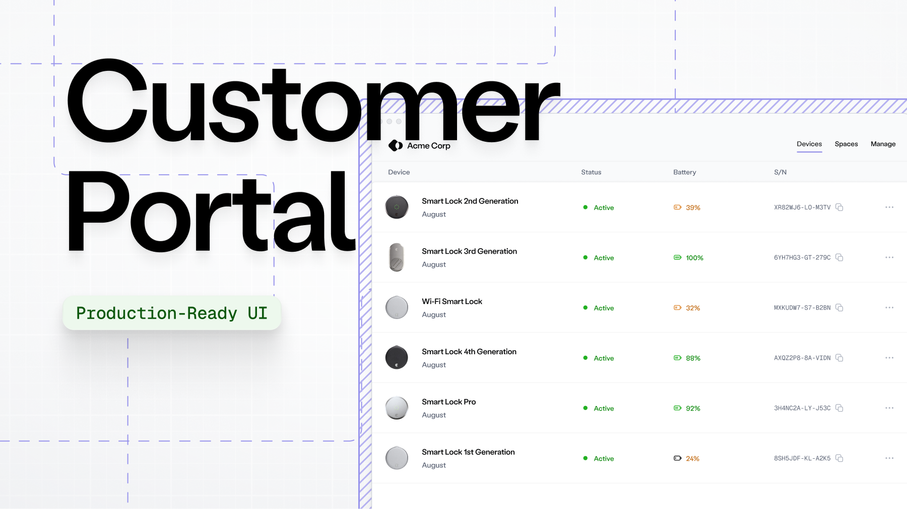

# Customer Portals

<figure><figcaption></figcaption></figure>

Provide self-service functions to your customers by setting up a customer portal. You can configure it entirely in the Console, or use our API to automate generating the portal.

You can extend the portal experience with [Seam access and climate automations](../reservation-automations.md). When a customer books a stay, reserves a gym slot, or schedules a visit, automations automatically issue and revoke access or adjust climate settings. You create and manage them in the Console.

### Get started with the customer portal

<table data-view="cards"><thead><tr><th></th><th data-hidden data-card-target data-type="content-ref"></th><th data-hidden data-card-cover data-type="image">Cover image</th></tr></thead><tbody><tr><td>
<strong>Preview customer portal in Console</strong>

Try out Customer Portals in the Console. Links here expire after 7 days.
</td><td><a href="preview-the-customer-portal-in-console.md">preview-the-customer-portal-in-console.md</a></td><td><a href="../../.gitbook/assets/image (1) (1).png">image (1) (1).png</a></td></tr><tr><td>
<strong>Integrate customer portal into your application</strong>

Generate Customer Portals programmatically for production use.
</td><td><a href="integrate-customer-portal-into-your-application.md">integrate-customer-portal-into-your-application.md</a></td><td><a href="../../.gitbook/assets/image (2).png">image (2).png</a></td></tr></tbody></table>

***

### Customer portal features

A customer portal allows your customers to self-manage connecting devices, manage their devices, and handle day-to-day management in one place.

<table><thead><tr><th width="206.46875">Feature</th><th>Description</th></tr></thead><tbody><tr><td>Customer management</td><td>
Offer your customers a self-serve method to: <i class="fa-hyphen">:hyphen:</i> Connect existing smart lock, thermostat, or access control accounts <i class="fa-hyphen">:hyphen:</i> Organize devices to match their property structure <i class="fa-hyphen">:hyphen:</i> Manage and troubleshoot their devices

<i class="fa-hyphen">:hyphen:</i> Control Access or Climate features that you’ve configured for them.
</td></tr><tr><td>Interoperability</td><td>Works seamlessly with other Seam products, including Access and Climate.</td></tr><tr><td>Customized branding</td><td>Configure the portal with your branding, including your logo, colors, and business information.</td></tr><tr><td>Ephemeral sessions</td><td>Portal sessions are temporary. New portal sessions expire after 7 days period. They should be regenerated every time a customer needs to access the portal, whether from a new browser, a new device, or after the previous session has expired.</td></tr></tbody></table>

***
