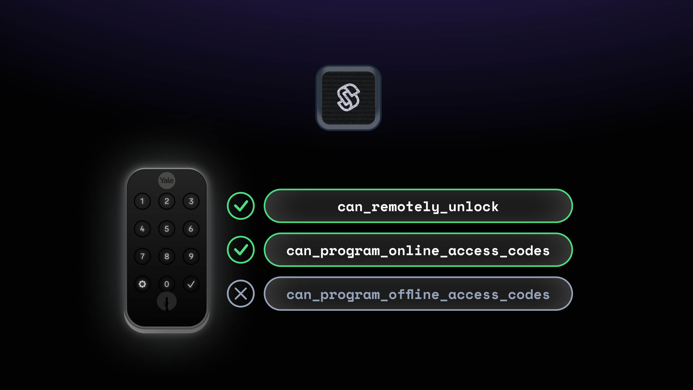
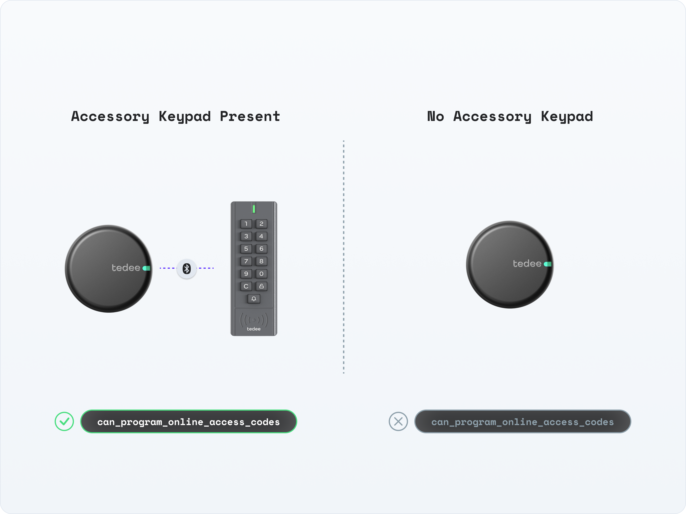
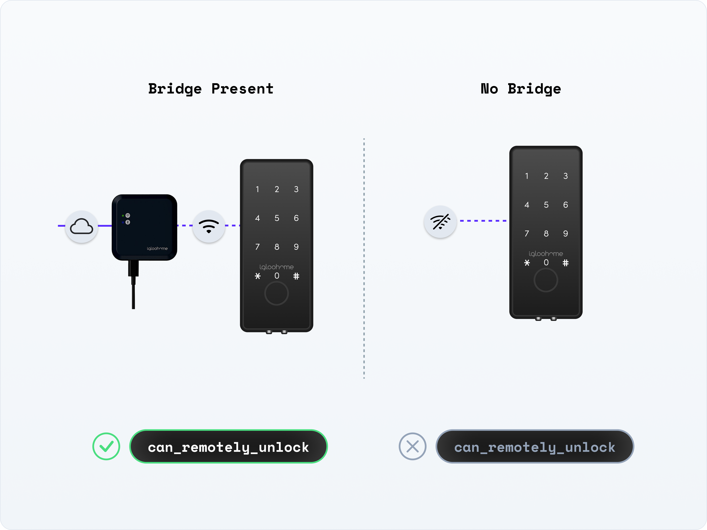

# Device and System Capabilities

<figure><figcaption></figcaption></figure>

Each device that you connect to Seam has a specific set of capabilities. These capabilities define the Seam API actions that you can use. For example, some devices support [remote unlock actions](../products/smart-locks/lock-and-unlock.md), while others support [programming access codes](../products/smart-locks/access-codes/). Some devices support both of these capabilities. When developing your application, it is imperative to be able to identify the capabilities of each device.

For example, if a device supports programming online access codes, your app can present the [`CreateAccessCodeForm` Seam Component](../seam-components/react-components/create-access-code-form.md) to your user. On the other hand, if a connected device does not support the remote unlock action, you'll likely want to disable or not display the unlock functionality for your app user.

## Capability Flags

Capability flags inform your application about what features and behaviors each device supports. That is, you can use capability flags to match devices to the requirements for operations within your app. These flags also compare the capabilities of a specific device instance with those of the device model in general.

<figure><figcaption>
Capability flags help you to understand which actions a device can perform.
</figcaption></figure>

All capability flags share the following behavior:

* If `true`, the device has this capability, and this capability is functional on this device instance.
*   If `false`, the device has this capability, but the capability is not currently functional.

    See the device [errors](../api/devices/#errors) and [warnings](../api/devices/#warnings) for more details about the cause of this issue. You can also examine the [properties](../api/devices/#properties) of the device and [events](../api/events/) related to the device to learn more about the cause of this issue.
* If not present, the device does not have this capability.

Reasons why a capability flag might be `false` could include that a required hardware accessory is not connected to the device. For example, if a lock needs a Wi-Fi bridge for connectivity and is currently not connected to a bridge, the lock cannot be remotely unlocked. If a lock is missing an accessory keypad, access codes cannot be programmed on the lock.

With respect to the ability to program online access codes, as long as a lock has the required hardware, Seam assumes that any offline status is temporary and will be resolved before [it's time to set the access code on the device](../products/smart-locks/access-codes/lifecycle-of-access-codes.md). Consequently, in this case, Seam maintains `can_program_online_access_codes` as `true`.

<figure><figcaption>
Capability flags help you to understand why a device cannot currently perform an action.
</figcaption></figure>

Seam recommends adding capability checks before performing specific actions in your app. For example, before performing a [remote unlock](../products/smart-locks/lock-and-unlock.md#unlocking-a-door) operation, you can check to make sure that the target device supports remote unlocking. For details and code samples, see the corresponding capability guides.


In addition to viewing the capabilities for a specific device, you can also view the capabilities for a provider using [List Device Providers](../api/devices/list_device_providers.md). If at least one supported device from a provider has a specific capability, the corresponding capability flag is `true`.


<table><thead><tr><th width="204">Property</th><th width="128.33333333333331">Type</th><th>Description</th></tr></thead><tbody><tr><td><code>device.can_remotely_unlock</code></td><td>Boolean <em>Optional</em></td><td>Indicates whether the device can perform a <a href="../products/smart-locks/lock-and-unlock.md">remote unlock operation</a>.</td></tr><tr><td><code>device.can_remotely_lock</code></td><td>Boolean <em>Optional</em></td><td>Indicates whether the device can perform a <a href="../products/smart-locks/lock-and-unlock.md">remote lock operation</a>.</td></tr><tr><td><code>device.can_program_online_access_codes</code></td><td>Boolean <em>Optional</em></td><td>Indicates whether the device can <a href="../products/smart-locks/access-codes/">program online access codes</a>. If <code>true</code>, it is currently possible to create new online access codes for the device, and Seam programs the device the next time it's online.</td></tr><tr><td><code>device.can_program_offline_access_codes</code></td><td>Boolean <em>Optional</em></td><td>Indicates whether the device can <a href="../products/smart-locks/access-codes/offline-access-codes.md">program offline access codes</a>. When this flag is <code>true</code>, Seam can generate an offline code for this device, regardless of the current online status of the device.</td></tr><tr><td><code>device.can_hvac_heat</code></td><td>Boolean <em>Optional</em></td><td>Indicates whether the thermostat device (in conjunction with the associated HVAC system) supports <a href="thermostats/understanding-thermostat-concepts/hvac-mode.md">heat mode</a>. When this flag is <code>true</code>, you can <a href="../products/thermostats/configure-current-climate-settings.md#set-a-thermostat-to-heat-mode">set the thermostat to heat mode</a>.</td></tr><tr><td><code>device.can_hvac_cool</code></td><td>Boolean <em>Optional</em></td><td>Indicates whether the thermostat device (in conjunction with the associated HVAC system) supports <a href="thermostats/understanding-thermostat-concepts/hvac-mode.md">cool mode</a>. When this flag is <code>true</code>, you can <a href="../products/thermostats/configure-current-climate-settings.md#set-a-thermostat-to-cool-mode">set the thermostat to cool mode</a>.</td></tr><tr><td><code>device.can_hvac_heat_cool</code></td><td>Boolean <em>Optional</em></td><td>Indicates whether the thermostat device (in conjunction with the associated HVAC system) supports <a href="thermostats/understanding-thermostat-concepts/hvac-mode.md">heat-cool (auto) mode</a>. When this flag is <code>true</code>, you can <a href="../products/thermostats/configure-current-climate-settings.md#set-a-thermostat-to-heat-cool-mode">set the thermostat to heat-cool mode</a>.</td></tr><tr><td><code>device.can_turn_off_hvac</code></td><td>Boolean <em>Optional</em></td><td>Indicates whether the thermostat device (in conjunction with the associated HVAC system) supports <a href="thermostats/understanding-thermostat-concepts/hvac-mode.md">off mode</a>. When this flag is <code>true</code>, you can <a href="../products/thermostats/configure-current-climate-settings.md#turn-off-heating-and-cooling">set the thermostat to "off" mode</a>, which turns off both the heating and cooling systems for the space.</td></tr></tbody></table>


Seam is actively developing additional capability flags to provide you with even more robust capability checking abilities for your app. If you would like us to add a specific capability flag, contact [support@seam.co](mailto:support@seam.co).


***

## Next Steps

To learn about the actions that you can perform using the Seam API, see the Seam capability guides. These guides provide helpful tutorials and code samples, categorized by capability types.

* [Smart locks](../products/smart-locks/), including [locking/unlocking](../products/smart-locks/lock-and-unlock.md) and [managing access codes](../products/smart-locks/access-codes/)
* [Access control systems](../products/access-systems/)
* [Thermostats](../products/thermostats/)
* [Noise sensors](../products/noise-sensors/)
* [Mobile access](mobile-access/)
* [Seam Bridge](seam-bridge.md)
