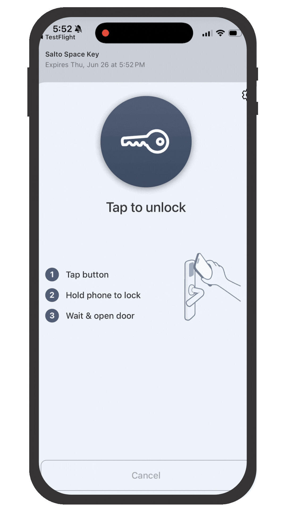

# Instant Keys

<figure><figcaption>
Seam Instant Keys are a prebuilt, Seam-hosted solution that enables you to share access using a link—no app download required.
</figcaption></figure>

Seam Instant Key is the fastest way to share access—whether it's a hotel guest, a real estate visitor, or an on-site contractor. With a single API call, you can create a mobile key and send it through text or email, or in your own app.

There's no app to install and no account to create.

The user just taps a link and gets a lightweight, native-feeling experience using an iOS App Clip or an Instant App on Android. We've designed Instant Key to feel instant, intuitive, and secure.

For issuing Bluetooth mobile keys, this is the most streamlined mobile access experience available today.

* No app store visit required: The Instant Key opens instantly from a shared link.
* Works offline: Uses Bluetooth, so even in areas with poor cellular or Wi-Fi, like elevator banks or concrete-walled hallways, the key still works.
* Great for short-term or one-time access: Hotels, self-touring, vendors, or temporary staff.
* Embeddable: Use the Instant Key link or launch the experience from within your own app.

Whether you're phasing out plastic key cards or offering self-guided tours, Instant Key delivers secure access without the usual friction.

<figure><figcaption>
Launch an App Clip from a text message.
</figcaption></figure>

## Example Use Cases

Seam Instant Key satisfies a variety of use cases, including the following examples:

### **Hotel Guests**

Delight hotel guests with a smooth, modern check-in—no lines and no kiosks. Send keys directly to guests once their reservation is confirmed or check-in is completed.

* Compatible with major hotel access control systems.
* Works alongside plastic key cards.
* Great for both full-service hotels and contactless heck-in setups.
* Keys can be sent automatically after check-in using text or email.
* Works across hotel room and common area doors.

### **Self-Touring**

Enable potential renters, buyers, and customers to access spaces without needing an on-site agent. With a tap, they can unlock the front door, tour the space, and leave when ready.

* Share secure access links for scheduled visits.
* Great for real estate, rentals, and coworking tours.
