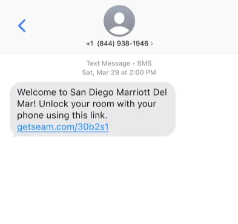

# Delivering Instant Keys

After [creating an access grant](using-access-grants-to-issue-instant-keys.md#create-an-access-grant) that includes a mobile key, Seam returns the shareable `instant_key_url` as a property of the new access grant. This URL is the Instant Key. You can deliver this key in the following ways, to best match your product flow and guest experience:

* [Share through SMS or email.](delivering-instant-keys.md#share-through-sms-or-email)
* [Embed in a web or mobile app.](delivering-instant-keys.md#embed-in-a-web-or-mobile-app)

***

## Share through SMS or Email

For most use cases—such as hotels, self-touring, and contractors—the simplest way to deliver an Instant Key is by using a link in a text message or email.

This method works well if you already collect the guest's phone number or email at booking.

<figure><figcaption>
Example: Share an Instant Key using a text message.
</figcaption></figure>

***

## Embed in a Web or Mobile App

If you have a guest-facing web app or booking portal, you can embed the Instant Key directly in your interface. For example, you could show it in a reservation detail page or check-in flow with a **Mobile Key** or **Unlock Door** button.

<figure><figcaption>
Example: Embed an Instant Key in an app.
</figcaption></figure>
