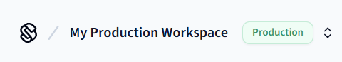
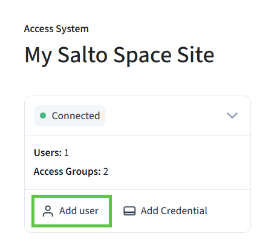
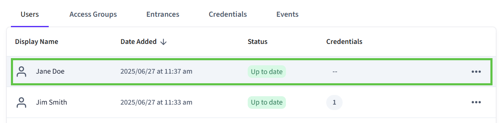
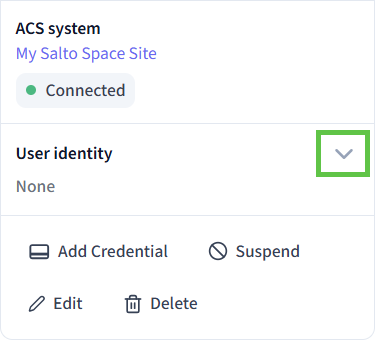
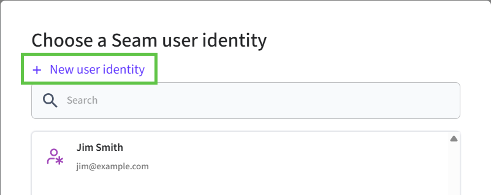
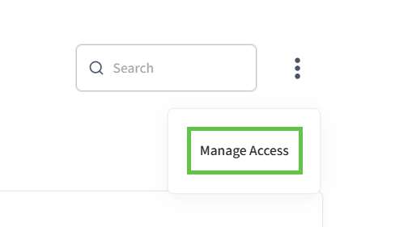
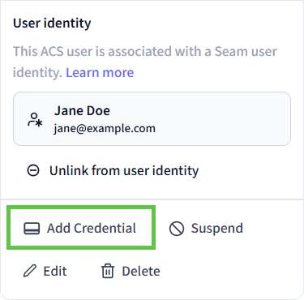
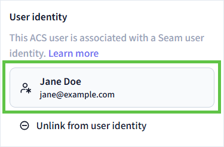
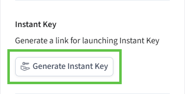
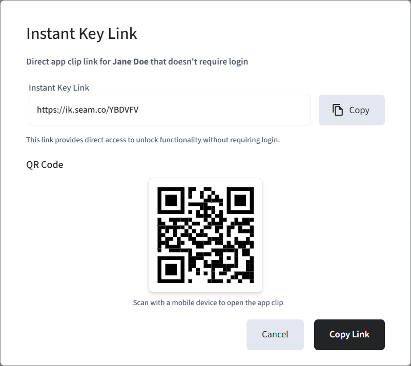

# Using Seam Console to Issue Instant Keys

You can use Seam Console to issue Instant Keys. This process assumes that you have already [connected your access system to Seam](setting-up-your-site-for-instant-keys.md#connect-your-access-system-to-seam) and includes the following steps:

1. Create an access system user and corresponding user identity.
2. If your access system supports access groups, assign the user to one or more access groups.
3.  Create a mobile key credential.

    If your access system supports direct entrance assignment, during this step, also select the entrances to which you want to grant the user access.
4. Issue an Instant Key for the user identity.

***

## Create a User Identity and Access System User

1. Log in to [Seam Console](https://console.seam.co/).
2.  In the upper-left corner, click the workspace switcher and select the production workspace in which your access system is connected.

    
3. In the top navigation pane, click **ACS Systems**.
4. On the **Access Systems** page, click the access system in which you want to grant access to a user.
5.  At the upper-left of the access system page, click **Add user**.

    <figure><figcaption>
Click <strong>Add user</strong> to add the user to whom you want to grant access.
</figcaption></figure>
6.  In the **Add New User** dialog:

    1. Type the full name of the user, as well as a unique email address or phone number.
    2. Specify the start and end dates for the user's access.
    3. Click **Continue**.

    Seam creates the new access system user.
7.  On the **Users** table, click the access system user that you created.

    <figure><figcaption>
Click the new access system user that you created.
</figcaption></figure>
8.  At the left of the user page, click **User identity** to expand the **User identity** area.

    <figure><figcaption>
Expand the <strong>User identity</strong> area to link the access system user to a user identity.
</figcaption></figure>
9. Click **Link to user identity**.
10. In the **Choose a Seam user identity** dialog, click **New user identity**.

    <figure><figcaption>
Click <strong>New user identity</strong>.
</figcaption></figure>
11. In the **Add New User Identity** dialog:

    1. Type the full name of the user, as well as a unique email address, phone number, or user identity key.
    2. Click **Save**.

    Seam creates the new user identity and links it to the access system user.
12. If your access system supports access groups:
    1. At the top of the user page, click **Access Groups**.
    2.  In the upper-right corner of the user page, click and select **Manage Access**.

        <figure><figcaption>
Click <strong>Manage Access</strong> to assign the user to an access group.
</figcaption></figure>
    3. In the **Manage Access for \[User]** dialog, select the checkbox next to each access group to which you want to add the user and then click **Save**.
13. At the left side of the user page, click **Add Credential**.

    <figure><figcaption>
Click <strong>Add Credential</strong> to create a mobile key for the access system user.
</figcaption></figure>
14. In the **Choose type of credential** dialog, click **Seam mobile key**.
15. If your access system supports direct entrance assignment:
    1. In the **Select entrances for \[user]** dialog, select the checkbox next to each entrance to which you want to grant the user access and then click **Next**.
    2. In the **Enter start & end time** dialog, specify the schedule for the user's access and then click **Next**.
16. Click **Done** to confirm the successful credential creation.
17. In the **User identity** area at the left of the user page, click the user identity linked to the access system user.

    <figure><figcaption>
Click the linked user identity.
</figcaption></figure>
18. In the **Instant Key** area at the left of the user identity page, click **Generate Instant Key**.

    <figure><figcaption>
Click <strong>Generate Instant Key</strong>. This key contains all the mobile credentials for the user identity.
</figcaption></figure>

Seam generates an Instant Key and displays the **Instant Key Link** dialog. This dialog displays the following information:

* An Instant Key link that you can copy and share with your user.
* A QR code that you can scan with a mobile device to open the Seam Instant Key App Clip.

<figure><figcaption>
Share the Instant Key link with your user. With no app install required, your user just taps to unlock.
</figcaption></figure>

For more information about sharing Instant Keys with your users, see [Delivering Instant Keys](delivering-instant-keys.md).
