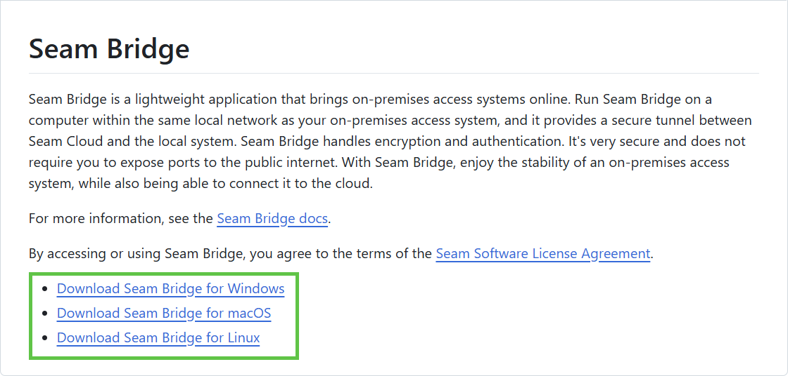
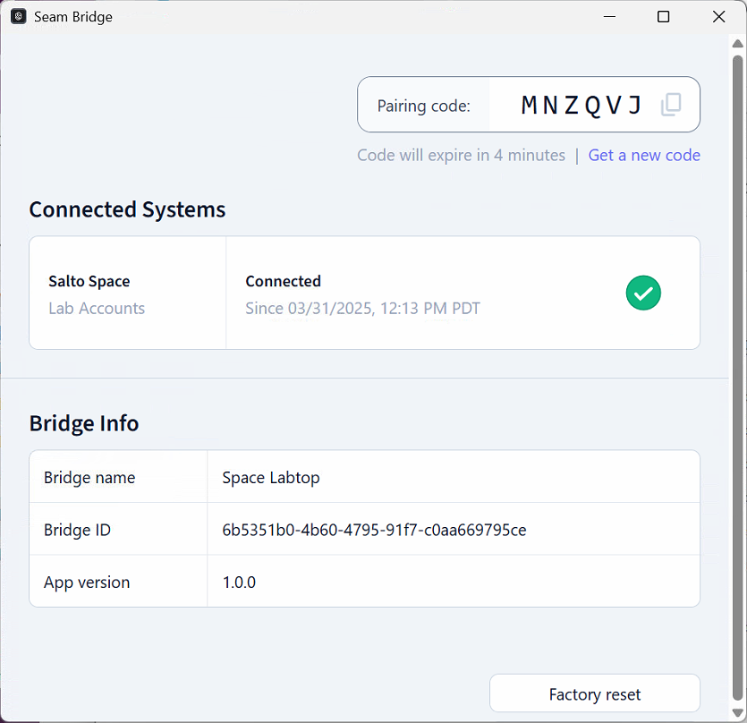

# Seam Bridge

## Overview

Seam Bridge is a lightweight app that brings your on-premises access system online—without exposing any ports to the public internet.

Install it on a computer in the same local network as your access system. Seam Bridge creates a secure tunnel between your on-premises system and Seam Cloud, handling all the encryption and authentication for you.

With Seam Bridge, you get the reliability of a local system, plus the flexibility of the cloud.


It is important to understand the difference between Seam Bridge and smart lock Wi-Fi bridges. Seam Bridge is specifically designed to connect on-premises access systems to the Seam platform. On the other hand, Smart lock Wi-Fi bridges enable remote management of smart lock devices that do not have integrated Wi-Fi connectivity. That is, a smart lock Wi-Fi bridge uses a short-range communication protocol, such as Bluetooth, to connect one or more locks to the internet through a property's local Wi-Fi network.


***

## Getting Started

Download the Seam Bridge application onto an on-premises computer. Then, pair Seam Bridge with your Seam [workspace](../core-concepts/workspaces/) and connect the on-premises access system to Seam. You install and pair Seam Bridge while you are connecting your on-premises access system to Seam. That is, the [Connect Webview](../core-concepts/connect-webviews/) that you use to connect your on-premises access system to Seam walks you through the process of downloading and pairing Seam Bridge.

For detailed information, see the setup instructions within the [system integration guide](../device-and-system-integration-guides/overview.md#access-control-systems) for your on-premises access system.

***

## **Download Seam Bridge**

In a web browser, go to [the Seam Bridge repo](https://www.seam.co/seam-bridge/releases/latest) and download the latest version of the Seam Bridge application for the appropriate operating system.

<figure><figcaption>
Download the Seam Bridge application for your operating system.
</figcaption></figure>

***

## System Setup Guides

Please refer to these guides to set up the Seam Bridge application.

<table data-view="cards"><thead><tr><th></th><th data-hidden data-card-target data-type="content-ref"></th><th data-hidden data-card-cover data-type="image">Cover image</th></tr></thead><tbody><tr><td><strong>Windows Setup</strong></td><td><a href="seam-bridge/seam-bridge-setup-for-windows.md">seam-bridge-setup-for-windows.md</a></td><td><a href="../.gitbook/assets/image (38).png">image (38).png</a></td></tr><tr><td><strong>macOS Setup</strong></td><td><a href="seam-bridge/seam-bridge-setup-for-macos.md">seam-bridge-setup-for-macos.md</a></td><td><a href="../.gitbook/assets/image (45).png">image (45).png</a></td></tr><tr><td><strong>Linux Setup</strong></td><td><a href="seam-bridge/seam-bridge-setup-for-linux.md">seam-bridge-setup-for-linux.md</a></td><td><a href="../.gitbook/assets/image (46).png">image (46).png</a></td></tr></tbody></table>

***

## Troubleshooting Seam Bridge

If issues affect the connections between Seam Bridge, your on-premises access system, and the Seam platform, the Seam Bridge app displays status, error, and other information to help you understand and troubleshoot these issues.

The **Connected Systems** area displays the status of each connection. A green checkmark indicates a healthy connection.

The Seam Bridge app also displays communication errors at the top of the window.

<figure><figcaption>
Seam Bridge displays information about the connections to on-premises access systems.
</figcaption></figure>

***

## Next Steps

Go to the setup instructions within the [system integration guide](../device-and-system-integration-guides/overview.md#access-control-systems) for your on-premises access system. These instructions describe how to pair Seam Bridge with your workspace and then connect your on-premises access system to Seam through Seam Bridge.
