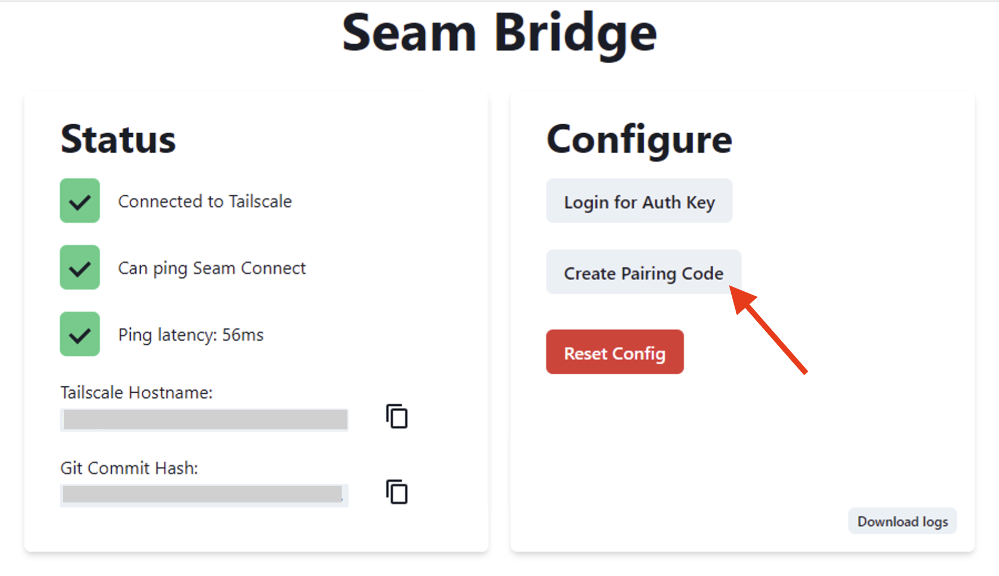
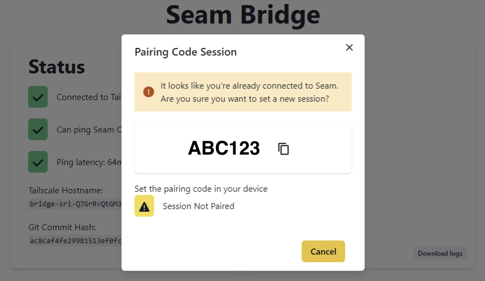
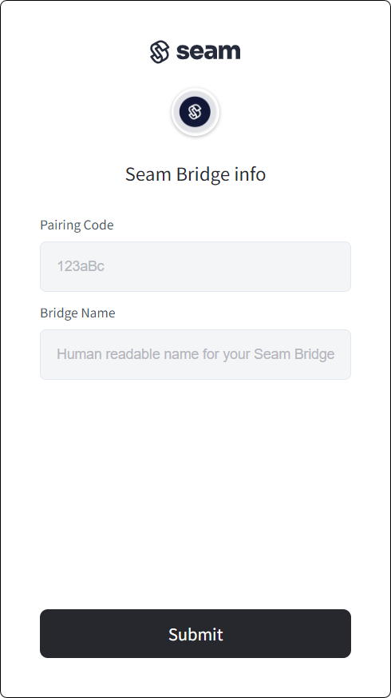

# 📡 Seam Bridge

## Overview

Seam Bridge enables you to connect on-premises software systems to the Seam platform. Consisting of an executable file (that is, an application), Seam Bridge is easy to install on an on-premises computer. Once installed, Seam Bridge creates a Seam network and functions as a secure intermediary, facilitating network requests between Seam and the on-premises network. This setup aims to enable smooth communication between cloud-based services and existing local systems, while prioritizing data security and network integrity.


Seam Bridge is a software-only component that Seam provides at no extra cost.


***

## System Requirements

* **Operating System:** Window 7 or later versions
* **Memory:** At least 1 GB of RAM
* **Network:** LAN connection required

***

## Installation Instructions

To install Seam Bridge, first install the Seam Bridge application on an on-premises computer. Then, pair Seam Bridge with your Seam [workspace](../core-concepts/workspaces/).

### **Install the Seam Bridge Application on the On-Premises Computer**

1. In a web browser, go to [the Seam Bridge releases page](https://github.com/seamapi/seam-bridge-client/releases/latest) and download the latest version of the Seam Bridge executable.
2.  Run the downloaded executable file.

    This application opens a webpage containing the Seam Bridge settings.
3.  Click **Create Pairing Code**.\

    <figure><figcaption></figcaption></figure>
4.  Copy the pairing code that the webpage displays.

    The installer uses this code to pair Seam Bridge to the workspace, using a Connect Webview.\

    <figure><figcaption></figcaption></figure>

### Pairing Seam Bridge with Your Workspace

Seam provides two options for connecting Seam Bridge to your workspace. If you are a developer who wants to connect your own device, see [Pair using Seam Console](seam-bridge.md#pair-using-the-seam-console). Alternately, if you are coordinating with an external party to set up Seam Bridge, see [Pair Using a Connect Webview](seam-bridge.md#pair-using-a-connect-webview).


Alternately, you can connect Seam Bridge to your workspace while you are connecting your access control system to Seam.


#### **Pair Using Seam Console**

1. Log in to your account in [Seam Console](https://console.getseam.com).
2. Click **Devices** to view the **Devices** page.
3. In the upper-right corner of the **Devices** page, click **+ Add Devices**.
4. Select **Seam Bridge**.
5. In the **Pairing Code** field, type the invitation code that you copied during the [Seam Bridge application installation](seam-bridge.md#install-the-seam-bridge-application-on-the-on-premises-computer).
6. In the **Bridge Name** field, type a unique name.
7. Make sure to remember the Seam Bridge name for future reference.\
   You must use this Seam Bridge name when connecting the on-premises access control system in a Connect Webview.

#### **Pair Using a Connect Webview**

The developer creates a Connect Webview using `seam_bridge` as the `accepted_providers` key. Then, the person who installed Seam Bridge performs the following steps:

1. In the Connect Webview, choose **Seam Bridge** from the list of brands, if available.
2. In the **Pairing Code** field, type the invitation code obtained during the [Seam Bridge application installation](seam-bridge.md#install-the-seam-bridge-application-on-the-on-premises-computer).
3. In the **Bridge Name** field, type a unique name.

<figure><figcaption>
Type a unique Seam Bridge name and the pairing code from the Seam Bridge application installation.
</figcaption></figure>

4. Remember the Seam Bridge name for future reference.\
   You must use this Seam Bridge name when connecting the on-premises access control system in a Connect Webview.

***

## Connecting the On-Premises Software System

After installing the Seam Bridge application and connecting Seam Bridge to your workspace, connect your on-premises software system to Seam using a Connect Webview. For detailed instructions on how to connect your system, see the setup instructions in the appropriate brand-specific [system integration guide](../device-and-system-integration-guides/overview.md#access-control-systems).
