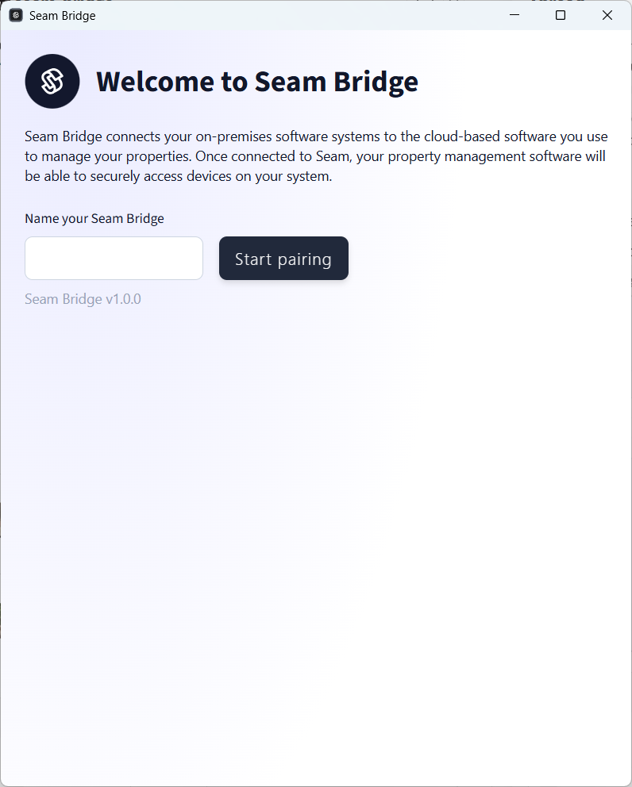

# Seam Bridge Setup for Linux

### System Requirements

* **Operating System:** Linux
* **Memory:** At least 1 GB of RAM
* **Network:** LAN connection required

***

## Run Seam Bridge

1. Open the downloaded executable file.
2. If you are using a Windows computer running Microsoft Defender, you may need to allow Windows to run the Seam Bridge app.
   1. In the **Windows protected your PC** dialog, click **More info**.
   2. Click **Run anyway**.
3.  If you are using a Windows computer, you may need to allow public networks to access the Seam Bridge app.

    1. In the **Do you want to allow public and private networks to access this app?** dialog, click **Show more**.
    2. Make sure that the **Public networks** and **Private networks** checkboxes are selected.
    3. Click **Allow**.

    The Seam Bridge app displays the **Welcome to Seam Bridge** window.

    <figure><figcaption><p><strong>Welcome to Seam Bridge</strong> window</p></figcaption></figure>
4. In the **Welcome to Seam Bridge** window, type a name for the site that you are connecting using Seam Bridge—for example, `My Site`—and then click **Start pairing**.
5. The Seam Bridge app displays a **Pairing code** that you can use to pair Seam Bridge with your workspace. You should come back to this application window to retrieve the latest pairing code when requested.\
   

***

## Set up Seam Bridge to Reboot on Restart

Use `systemd` to keep an app running on Linux. It supervises the process, restarts it on crash, and handles boot startup.

#### Create a systemd service file

1. Open Terminal.
2.  Create the service file:\


    ```bash
    sudo nano /etc/systemd/system/SeamBridge.service
    ```
3.  Add this template:

    ```
    [Unit]
    Description=Seam Bridge - Keep Running
    After=network.target

    [Service]
    ExecStart=/usr/local/bin/SeamBridge.exe
    Restart=always
    RestartSec=3
    WorkingDirectory=/usr/local/bin
    User=ubuntu
    Environment=NODE_ENV=production

    [Install]
    WantedBy=multi-user.target
    ```
4. Replace paths and `User` as needed.

#### Enable and start the service

1. Within Terminal, run the following commands:

```
sudo systemctl daemon-reload
sudo systemctl enable SeamBridge.service
sudo systemctl start SeamBridge.service
```

#### Verify status

1. Run the following command in Terminal to confirm that the service is running:

```
systemctl status myapp.service
```

You should see the service running and supervised.

#### Test auto-restart

1. Kill the process manually with `pkill SeamBridge`.
2. `systemd` should restart it immediately.

