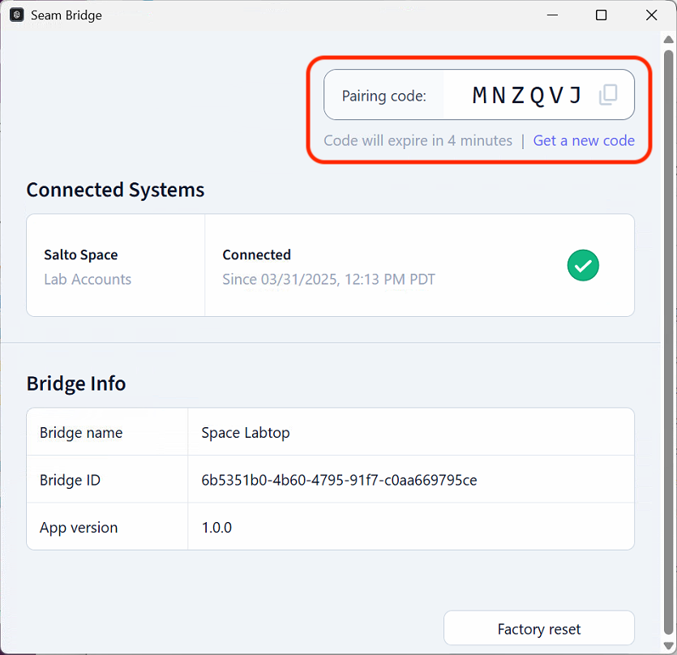

# Seam Bridge Setup for macOS

### System Requirements

* **Operating System:** macOS
* **Memory:** At least 1 GB of RAM
* **Network:** LAN connection required

***

## Run Seam Bridge

### Unzip and launch the app

1. Double click on the zipped file to unzip the file.
2. Try opening the SeamBridge.app by double-clicking it.
3. macOS will show a _“Seam Bridge" Not Opened_ dialog.\
   
4. Select **Done** to close the dialog.

### Approve the app in System Settings

1. Open **System Settings**.
2. Go to **Privacy & Security**.
3. Scroll to the bottom of the page.
4. Look for a message that says:
   * _“Seam Bridge was blocked to protect your Mac.”_
5. Select **Open Anyway**.
6. Select **Open Anyway** in the popup.

<div><figure><figcaption></figcaption></figure> <figure><figcaption></figcaption></figure></div>

***

### Complete Seam Bridge setup

1. Accept the **Terms of Service.**
2.  Enter a name for the site that you are connecting using Seam Bridge—for example, `My Site`—and then click **Start pairing**.

    
3.  Seam Bridge displays a **Pairing code.** Use this code when connecting Seam Bridge to your workspace. Return to this window whenever a new pairing code is requested.

    

***

### Set up Seam Bridge to reboot on restarts

Use `launchd` to keep the Seam Bridge running on macOS. A LaunchAgent restarts the app if it crashes and starts it whenever the user logs in.

#### Create and Launch the LaunchAgent file

1. Open **Terminal**.
2.  Create a plist file in your user `LaunchAgents` directory:

    ```bash
    mkdir -p ~/Library/LaunchAgents
    nano ~/Library/LaunchAgents/com.seambridge.keepalive.plist
    ```
3.  Paste this template:

    ```xml
    <?xml version="1.0" encoding="UTF-8"?>
    <!DOCTYPE plist PUBLIC "-//Apple//DTD PLIST 1.0//EN" "http://www.apple.com/DTDs/PropertyList-1.0.dtd">
    <plist version="1.0">
      <dict>
        <key>Label</key>
        <string>com.myapp.keepalive</string>

        <key>ProgramArguments</key>
        <array>
          <string>/path/to/app/SeamBridge.app/Contents/MacOS/SeamBridge</string>
        </array>

        <key>KeepAlive</key>
        <true/>

        <key>RunAtLoad</key>
        <true/>
      </dict>
    </plist>

    ```
4. Replace `/path/to/app` with the actual path to your binary/script. Keep the `/Contents/MacOS/SeamBridge` path at the end.
5. To save your changes in Nano:
   * `Ctrl X` to Exit.
   * `Y` to save changes.
   * Confirm the file name and click **Enter**.
6.  Within terminal, paste the following command to launch the launch agent:

    ```bash
    launchctl load ~/Library/LaunchAgents/com.seambridge.keepalive.plist
    ```

#### Test the setup

1. Kill the app manually.
2. `launchd` should restart it automatically.
3. Restart your Mac and confirm the app launches on login.

#### Prevent sleep from killing your app

1. Go to **System Settings** → **Battery**.
2. Set **Turn display off** as desired but disable **sleep while plugged in**.

***
