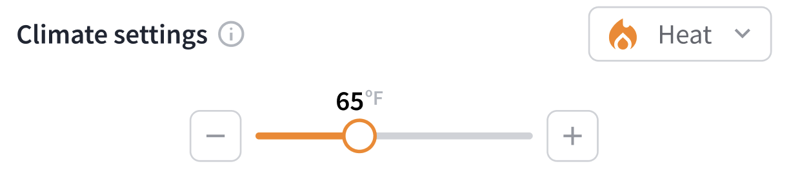
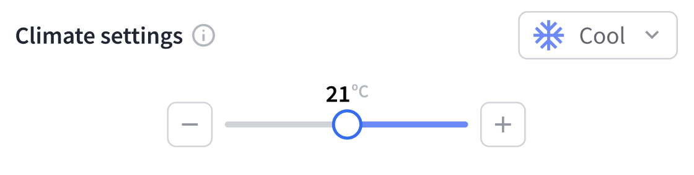
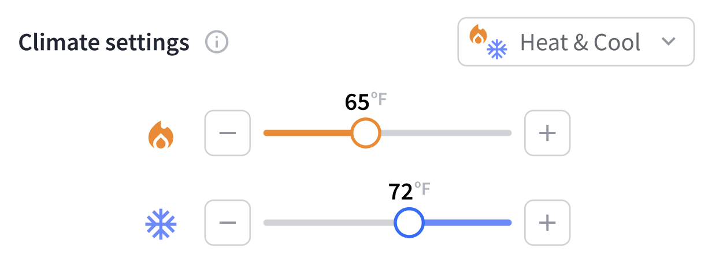

# Set Points

Temperature set points for a thermostat control the target temperatures that the thermostat activates the heating or cooling system to reach. That is, these set points define the precise temperatures that the thermostat strives to maintain in the space for heating, cooling, or automatic heat-cool operation. Choosing appropriate set points for a space is important for energy efficiency and comfort.

You can configure heating and cooling set point temperatures in Fahrenheit or Celsius.

***

## Heating Set Point

For heating, the heating set point (`heating_set_point_fahrenheit` or `heating_set_point_celsius`) is the target temperature that the thermostat turns on the furnace or heating system to reach. Once the space reaches the configured temperature, the thermostat turns off the heating system, until the temperature of the space drops below the set point again.

<figure><figcaption></figcaption></figure>

***

## Cooling Set Point

For cooling, the cooling set point (`cooling_set_point_fahrenheit` or `cooling_set_point_celsius`) is the target temperature that the thermostat turns on the air conditioner or cooling system to reach. Once that space reaches the configured temperature, the thermostat turns off the cooling system, until the temperature of the space rises above the set point again.

<figure><figcaption></figcaption></figure>

***

## Heat-Cool Set Points

In heat-cool mode, the thermostat uses the heating set point (`heating_set_point_fahrenheit` or `heating_set_point_celsius`) as the target temperature for turning on the heating system and the cooling set point (`cooling_set_point_fahrenheit` or `cooling_set_point_celsius`) as the target temperature for turning on the cooling system. The thermostat activates heating or cooling as needed to keep the temperature of the space between these two configured set points for maximum comfort.

Note that there may be a required minimum temperature difference between the cooling and heating set points. For more information, see [Minimum Heating Cooling Temperature Delta](set-points.md#minimum-heating-cooling-temperature-delta).

<figure><figcaption></figcaption></figure>

***

## Set Point Constraints

Some models of thermostats have specific requirements and constraints related to configuring set points. You can fetch the requirements by issuing a [Get Device](../../../api-clients/devices/get.md) or [List Thermostats](../../../api/thermostats/list.md) request.&#x20;

The following example shows a set of thermostat set point requirements:

```json
{
  "thermostat": {
    "device_id": "518f692b-f865-4590-8c3e-3849e9984c75",
    "device_type": "ecobee_thermostat",
    "capabilities_supported": [
      "thermostat"
    ],
    "properties": {
      ...
      "max_cooling_set_point_celsius": 33.333333333333336,
      "max_heating_set_point_celsius": 26.11111111111111,
      "min_cooling_set_point_celsius": 18.333333333333336,
      "min_heating_set_point_celsius": 7.222222222222222,
      "min_heating_cooling_delta_celsius": 2.7777777777777777,
      "min_heating_set_point_fahrenheit": 45,
      "max_heating_set_point_fahrenheit": 79,
      "min_cooling_set_point_fahrenheit": 65,
      "max_cooling_set_point_fahrenheit": 92,
      "min_heating_cooling_delta_fahrenheit": 5,
      ...
    },
    ...
  },
  ...
}
```

***

### Set Point Temperature Range

The thermostat settings have restrictions on the range of set point temperatures that users can choose for both cooling and heating. For cooling, the `min_cooling_set_point_*` and `max_cooling_set_point_*` properties indicate the permissible temperature range. For heating, the `min_heating_set_point_*` and `max_heating_set_point_*` properties indicate the permissible temperature range. These properties are available in both Celsius and Fahrenheit, as the suffix indicates. See these parameters to ensure that your selected set points fall within the defined operational limits of the thermostat.

The following example shows the set point temperature range, including both heating and cooling:

```json
"max_cooling_set_point_celsius": 33.333333333333336,
"min_cooling_set_point_celsius": 18.333333333333336,
"max_heating_set_point_celsius": 26.11111111111111,
"min_heating_set_point_celsius": 7.222222222222222,
"min_cooling_set_point_fahrenheit": 65,
"max_cooling_set_point_fahrenheit": 92,
"min_heating_set_point_fahrenheit": 45,
"max_heating_set_point_fahrenheit": 79
```

***

### Minimum Heating Cooling Temperature Delta

The `min_heating_cooling_delta_celsius` and `min_heating_cooling_delta_fahrenheit` properties denote the minimum temperature difference—that is, delta—in degrees between the cooling and heating set points when in heat-cool (auto) mode. You must configure the cooling set point to be higher than the heating set point by at least the specified delta. This setting helps to prevent the thermostat from rapidly switching between heating and cooling modes, thereby avoiding [short cycling](https://www.thespruce.com/what-it-means-when-furnace-is-short-cycling-5208093).

The following example shows a configured minimum delta between the cooling and heating set points:

```json
"min_heating_cooling_delta_celsius": 2.7777777777777777,
"min_heating_cooling_delta_fahrenheit": 5
```
