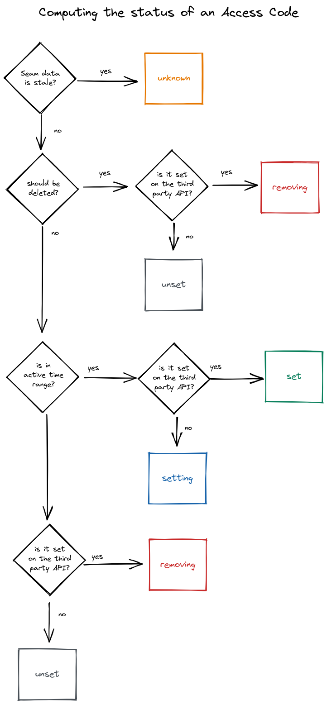

# Locks - Access Codes

## What is an Access Code?

An Access Code is a code used for a keypad or pinpad device. You can tell Seam to create an Access Code on a device, when it should be set, and optionally the code you would like to set. Seam will then make sure that the code is present on the device at the specified time (or, for ongoing codes, make sure it is set until you remove it)

There are two types of codes:

* **ongoing**: This is the default access code that is created if you don't specify any options other than the `device_id`. This code will be set on the device and Seam will ensure it is set until you explicitly remove it (with `/access_codes/delete`).
* **time\_bound**: Time Bound codes are codes where you provide a `starts_at` or `ends_at` time. The code will be added to the device at the `starts_at` time and removed at the `ends_at` time.

## Native Scheduling

Some device providers have native scheduling capabilities. For example, August allows setting a schedule in which a code is actually active. When you create `time_bound` codes on a device whose provider supports native scheduling, Seam will use the native scheduling capabilities of the provider to set the code. Where the provider does not support native scheduling, Seam will use its own scheduling to explicitly set and remove the code at the `starts_at` and `ends_at` times. You can choose to override this default behavior, and always have Seam perform the scheduling by setting `prefer_native_scheduling` to `false` when creating the code.

## Lifecycle of an Access Code


Seam is altering the behavior of access codes to never 404 unless the API user explicitly requests the deletion. At the moment, access codes will 404 if they are removed from a device, e.g. when a `time_bound` access code expires.


Access codes go through the following statuses. You can inspect the status by looking at `access_code.status`

* **unset**: Code is not in active time range, for ongoing codes it's never in this state
* **setting**: Code in active time range, Seam is contacting third party API
* **set**: Seam has confirmed the code is set on the device
* **removing:** Seam is contacting the third party API to remove the access code
* **unknown**: An account is disconnected and Seam cannot access the third party API to check the access code
* **404**: Seam has confirmed the code is not on the device, the access code is deleted in both Seam and the third party API

<figure><figcaption>
Lifecycle of Access Codes with Transition Arrows
</figcaption></figure>

<figure><figcaption>
Logic that determines status of access code
</figcaption></figure>

## Relationship between Action Attempts and Access Codes


Action Attempts are currently required for retrieving access codes from some endpoints like `/access_codes/create` and `/access_codes/update`, but in the future we will return access codes directly from these endpoints and recommend polling the Access Code state, because it gives more granular state information which are appropriate in more scenarios.


An Action Attempt represents Seam attempting to set the Access Code on the third party service. This means that Action Attempts for `time_bound` codes will not change their status to `success` and give the `result` containing the `access_code` until the `starts_at` time.
