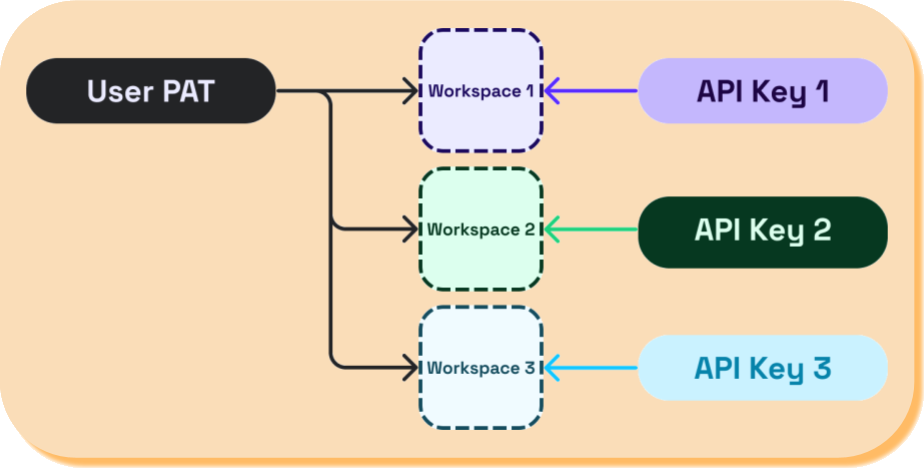

# Personal Access Tokens

In some instances, it may be necessary to access multiple workspaces with a single Seam credential. For example, you may want to set up separate workspaces for each of your users to control different sets of devices. For more information about scenarios in which multiple workspaces are useful, see [Per-Customer Workspace Setup](../workspaces/#per-customer-workspace-setup-less-common).

Because [API keys](api-keys.md) are scoped to a single workspace, Seam provides Personal Access Tokens (PATs) to enable multi-workspace authorization. First, [create a PAT](personal-access-tokens.md#create-a-personal-access-token). Then, [use this PAT with a workspace ID](personal-access-tokens.md#use-a-pat-and-workspace-id-in-the-seam-api) to access the desired workspace.&#x20;


Never use a PAT in a web browser or expose it to your users.


<figure><figcaption></figcaption></figure>

## Create a Personal Access Token

1. In the upper-right corner of the [Seam Console](https://console.seam.co/), click your username and then **Settings**.
2. In the left navigation pane, **Personal Access Tokens**.
3. In the upper-right corner of the **Personal Access Tokens** page, click **+ Add Personal Access Token**.
4. In the **Add Personal Access Token** dialog, type a name for your new PAT and then click **Create Personal Access Token**.
5. Copy the newly-created PAT and store it for future use.



## Using the PAT to issue a Seam API request

To use a PAT for authorization in the Seam API, you must specify the PAT in the `Authorization` header for the Seam HTTP API or in the `seam` constructor for the Seam SDK that you are using. You must also specify the ID of the workspace that you want to access. If you are using the Seam HTTP API, include the `seam-workspace` header with the desired workspace ID. If you are using a Seam SDK, specify the desired workspace ID in the `Seam` constructor.

The following example shows how to use a PAT and workspace ID to [list all devices](../../api-clients/devices/list-devices.md) in a workspace:



```python
seam = Seam(
    # Specify PAT.
    api_key=pat,
    # Specify workspace ID.
    workspace_id=workspaceId
)

pprint(seam.devices.list())
```



```bash
curl -X 'POST' \
  'https://connect.getseam.com/devices/list' \
  -H 'accept: application/json' \
  -H 'seam-workspace: ${WORKSPACE_ID}' \
  -H 'Authorization: Bearer ${PAT}' \
  -H 'Content-Type: application/json' \
  -d '{}'
```



```javascript
const seam = new Seam({
  // Specify PAT.
  apiKey: pat,
  // Specify workspace ID.
  workspaceId: workspaceId
})

console.log(await seam.devices.list())
```



```ruby
client = Seam::Client.new(
  # Specify PAT.
  api_key: pat,
  # Specify workspace ID.
  workspace_id: workspace_id
)

puts client.devices.list().inspect
```



```php
$seam = new Seam\SeamClient(
  // Specify PAT.
  $pat,
  // Specify workspace ID.
  $workspace_id
);

print_r($seam->devices->list());
```



```csharp
var seam = new SeamClient(
    // Specify PAT.
    apiToken: pat,
    // Specify workspace ID.
    workspaceId: workspaceId
);

var devices = seam.Devices.List();
foreach (var device in devices)
{
  Console.WriteLine(device);
}
```



```java
Seam seam = Seam.builder()
    // Specify PAT.
    .apiKey(pat)
    // Specify workspace ID.
    .seamWorkspace(workspaceId)
    .build();

System.out.println(seam.devices().list());
```




Instead of including your PAT in the `Seam` constructor, you can export your PAT as a `SEAM_API_KEY` environment variable. Then, all installed Seam SDKs automatically use this exported PAT.

```bash
$ export SEAM_API_KEY=${PAT}
```

