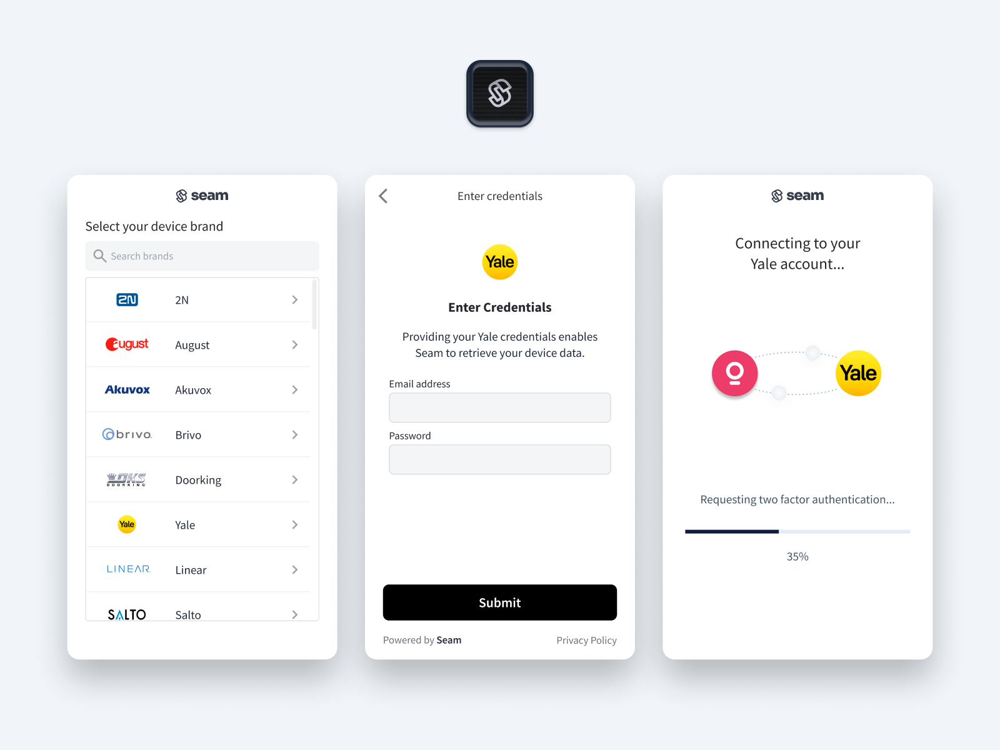
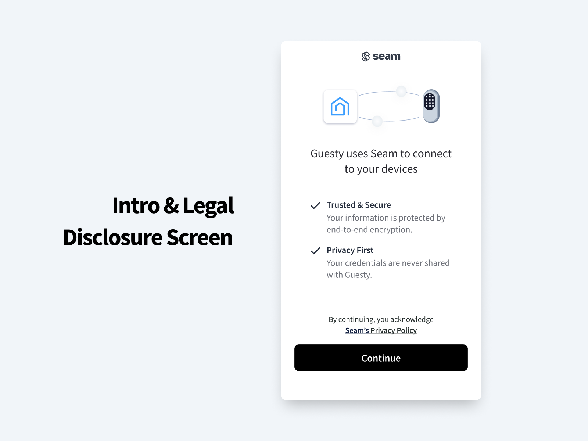
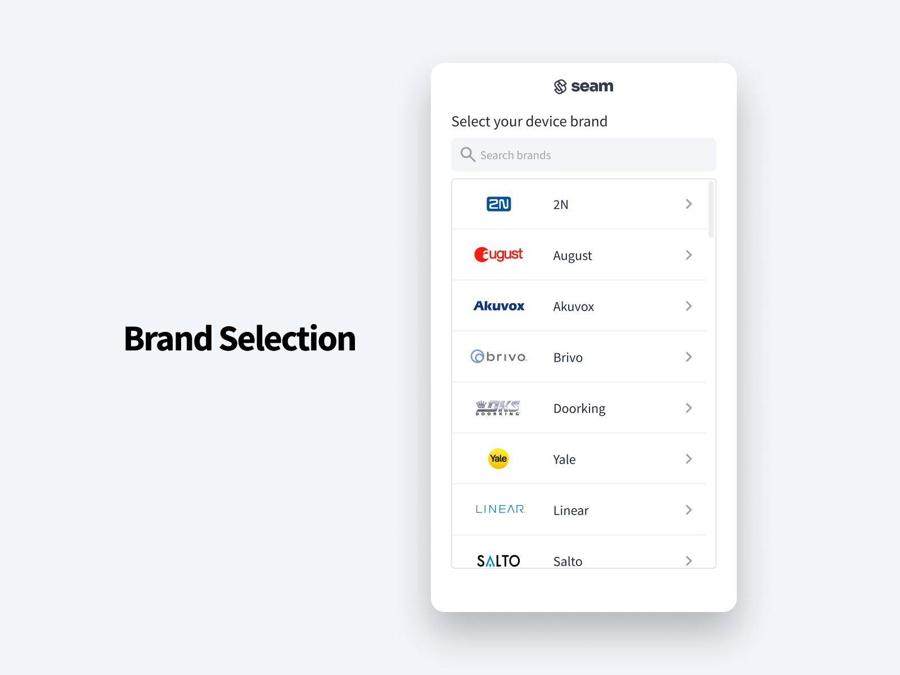
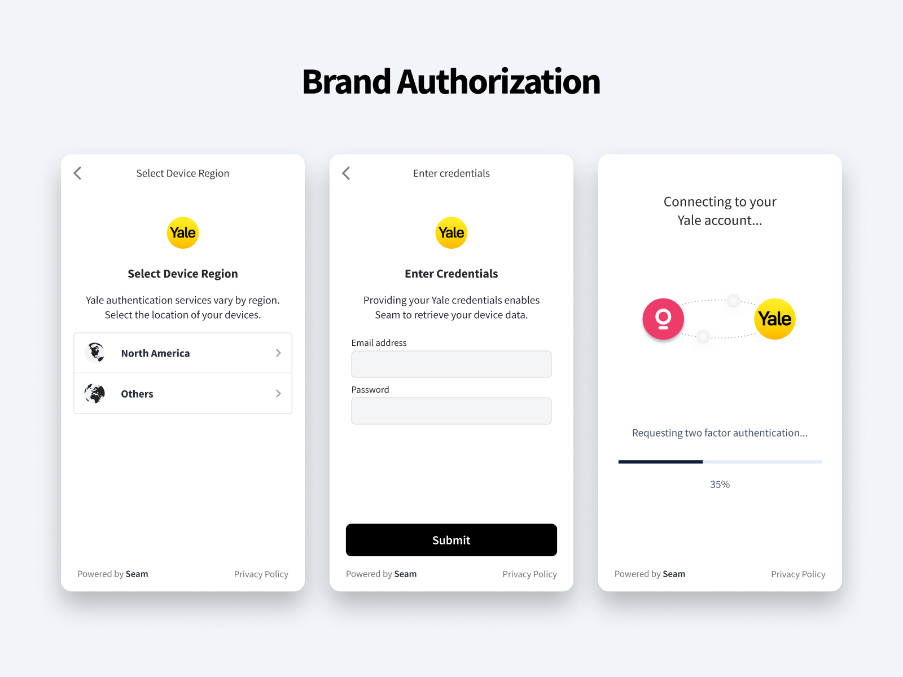
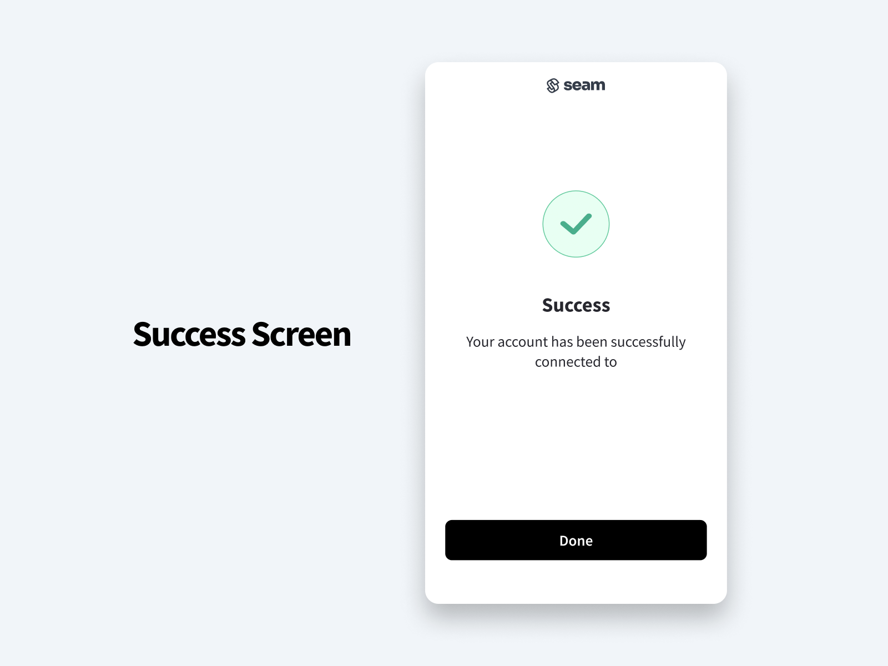

# 🔌 Connect Webviews

<figure><figcaption></figcaption></figure>

## What are Connect Webviews?

Seam Connect Webviews are fully-embedded, [customizable](customizing-connect-webviews.md) client-side components that you [add to your app](embedding-a-connect-webview-in-your-app.md) if you want to enable your users to import their own devices using your app. Your users interact with your embedded Connect Webviews to link their IoT device accounts to Seam. That is, Connect Webviews walk your users through the process of logging in to their device accounts.

Seam handles all the authentication steps, and—once your user has completed the authorization through your app—you can access and control their devices using the Seam API. Connect Webviews perform credential validation, multifactor authentication (when applicable), and error handling for each device brand that Seam supports. Further, Connect Webviews work across all modern browsers and platforms, including Chrome, Safari, and Firefox.

***

## Connect Webview Flow

This section describes the basic Connect Webview flow.

### 1. Create a Connect Webview

The Connect Webview flow begins when your user wants to connect their device account to Seam through your app.

In your app, you [create a Connect Webview](../../api-clients/connect-webviews/create-a-connect-webview.md) (`connect_webview` object).

The created `connect_webview` object includes a `url` property.



**Request:**

```python
created_connect_webview = seam.connect_webviews.create(
  custom_redirect_url = "https://example.com/redirect",
  custom_redirect_failure_url = "https://example.com/failure-redirect",
  provider_category = "stable",
  wait_for_device_creation = True
)

pprint(created_connect_webview)
```

**Response:**

```
ConnectWebview(workspace_id='398d80b7-3f96-47c2-b85a-6f8ba21d07be',
               connect_webview_id='2c852289-ee42-49d0-bddc-0410b518003d',
               status='pending',
               url='https://connect.getseam.com/connect_webviews/view?connect_webview_id=2c852289-ee42-49d0-bddc-0410b518003d&auth_token=z7Wu2Lc85gYUbNUhdvCWaEhmQv61FziA',
               login_successful=False,
               device_selection_mode='none',
               any_provider_allowed=False,
               any_device_allowed=False,
               created_at='2023-11-15T23:24:36.947Z',
               custom_metadata={},
               connected_account_id=None,
               authorized_at=None,
               custom_redirect_url='https://example.com/redirect',
               custom_redirect_failure_url='https://example.com/failure-redirect',
               accepted_providers=['august',
                                   'avigilon_alta',
                                   'brivo',
                                   'schlage',
                                   'smartthings',
                                   'yale',
                                   'nuki',
                                   'salto',
                                   'controlbyweb',
                                   'minut',
                                   'nest',
                                   'my_2n',
                                   'kwikset',
                                   'tedee',
                                   'ttlock',
                                   'noiseaware',
                                   'igloohome',
                                   'ecobee',
                                   'four_suites',
                                   'dormakaba_oracode',
                                   'lockly',
                                   'wyze'],
               accepted_devices=[],
               selected_provider=None,
               wait_for_device_creation=True,
               automatically_manage_new_devices=True)
```



**Request:**

```bash
curl -X 'POST' \
  'https://connect.getseam.com/connect_webviews/create' \
  -H 'accept: application/json' \
  -H 'Authorization: Bearer ${API_KEY}' \
  -H 'Content-Type: application/json' \
  -d '{
  "custom_redirect_url": "https://example.com/redirect",
  "custom_redirect_failure_url": "https://example.com/failure-redirect",
  "provider_category": "stable",
  "wait_for_device_creation": true
}'
```

**Response:**

```json
{
  "connect_webview": {
    "url": "https://connect.getseam.com/connect_webviews/view?connect_webview_id=e386fe69-7bce-4796-bceb-44cc240fd604&auth_token=CvPDERYGGMvqgo6N1gsT7XRBieBtPqtUG",
    "status": "pending",
    "workspace_id": "398d80b7-3f96-47c2-b85a-6f8ba21d07be",
    "custom_metadata": {},
    "accepted_devices": [],
    "login_successful": false,
    "selected_provider": null,
    "accepted_providers": [
      "august",
      "avigilon_alta",
      "brivo",
      "schlage",
      "smartthings",
      "yale",
      "nuki",
      "salto",
      "controlbyweb",
      "minut",
      "nest",
      "my_2n",
      "kwikset",
      "tedee",
      "ttlock",
      "noiseaware",
      "igloohome",
      "ecobee",
      "four_suites",
      "dormakaba_oracode",
      "lockly",
      "wyze"
    ],
    "any_device_allowed": false,
    "connect_webview_id": "e386fe69-7bce-4796-bceb-44cc240fd604",
    "custom_redirect_url": "https://example.com/redirect",
    "any_provider_allowed": false,
    "device_selection_mode": "none",
    "wait_for_device_creation": true,
    "custom_redirect_failure_url": "https://example.com/failure-redirect",
    "automatically_manage_new_devices": true,
    "created_at": "2023-11-15T23:25:47.222Z",
    "authorized_at": null
  },
  "ok": true
}
```



**Request:**

```javascript
const createdConnectWebview = await seam.connectWebviews.create({
  custom_redirect_url: "https://example.com/redirect",
  custom_redirect_failure_url: "https://example.com/failure-redirect",
  provider_category: "stable",
  wait_for_device_creation: true
})

console.log(createdConnectWebview)
```

**Response:**

```json
{
  url: 'https://connect.getseam.com/connect_webviews/view?connect_webview_id=28fa1da1-d4ab-454c-a622-3ca95f22028a&auth_token=2r2Rn8V5QUtxE79gNhTmTK58KkuqrwU8d',
  status: 'pending',
  workspace_id: '398d80b7-3f96-47c2-b85a-6f8ba21d07be',
  custom_metadata: {},
  accepted_devices: [],
  login_successful: false,
  selected_provider: null,
  accepted_providers: [
    'august',            'avigilon_alta',
    'brivo',             'schlage',
    'smartthings',       'yale',
    'nuki',              'salto',
    'controlbyweb',      'minut',
    'my_2n',             'kwikset',
    'tedee',             'ttlock',
    'nest',              'noiseaware',
    'igloohome',         'ecobee',            
    'four_suites',       'dormakaba_oracode',
    'lockly',            'wyze'
  ],
  any_device_allowed: false,
  connect_webview_id: '28fa1da1-d4ab-454c-a622-3ca95f22028a',
  custom_redirect_url: 'https://example.com/redirect',
  any_provider_allowed: false,
  device_selection_mode: 'none',
  wait_for_device_creation: true,
  custom_redirect_failure_url: 'https://example.com/failure-redirect',
  automatically_manage_new_devices: true,
  created_at: '2023-11-15T23:28:03.845Z',
  authorized_at: null
}
```



**Request:**

```ruby
created_connect_webview = client.connect_webviews.create(
  custom_redirect_url: "https://example.com/redirect",
  custom_redirect_failure_url: "https://example.com/failure-redirect",
  provider_category: "stable",
  wait_for_device_creation: true
)

puts created_connect_webview.inspect
```

**Response:**

```
<Seam::ConnectWebview:0x00438
  url="https://connect.getseam.com/connect_webviews/view?connect_webview_id=c1350df4-278f-42cc-9c16-4f9e41103796&auth_token=6zrib4wrGZMDxvJxPQQFiB6snmx7UAU6E"
  status="pending"
  workspace_id="398d80b7-3f96-47c2-b85a-6f8ba21d07be"
  custom_metadata={}
  accepted_devices=[]
  login_successful=false
  selected_provider=nil
  accepted_providers=["august", "avigilon_alta", "brivo", "schlage", "smartthings", "yale", "nuki", "salto", "controlbyweb", "minut", "my_2n", "kwikset", "tedee", "ttlock", "nest", "noiseaware", "igloohome", "ecobee", "four_suites", "dormakaba_oracode", "lockly", "wyze"]
  any_device_allowed=false
  connect_webview_id="c1350df4-278f-42cc-9c16-4f9e41103796"
  custom_redirect_url="https://example.com/redirect"
  any_provider_allowed=false
  device_selection_mode="none"
  wait_for_device_creation=true
  custom_redirect_failure_url="https://example.com/failure-redirect"
  automatically_manage_new_devices=true
  created_at=2023-11-15 23:31:12.082 UTC>
```



**Request:**

```csharp
var createdConnectWebview = seam.ConnectWebviews.Create(
  customRedirectUrl: "https://example.com/redirect",
  customRedirectFailureUrl: "https://example.com/failure-redirect",
  providerCategory: Seam.Api.ConnectWebviews.CreateRequest.ProviderCategoryEnum.Stable,
  waitForDeviceCreation: true
);

Console.WriteLine(createdConnectWebview);
```

**Response:**

```
{
  "connect_webview_id": "382034e3-0568-4e56-a226-d77778913e27",
  "url": "https://connect.getseam.com/connect_webviews/view?connect_webview_id=382034e3-0568-4e56-a226-d77778913e27&auth_token=9eBKNtzB6ZKkSPPD33MZFshYSbmBcSMz7",
  "workspace_id": "398d80b7-3f96-47c2-b85a-6f8ba21d07be",
  "accepted_providers": [
    "august",
    "avigilon_alta",
    "brivo",
    "schlage",
    "smartthings",
    "yale",
    "nuki",
    "salto",
    "controlbyweb",
    "minut",
    "my_2n",
    "kwikset",
    "tedee",
    "ttlock",
    "nest",
    "noiseaware",
    "igloohome",
    "ecobee",
    "four_suites",
    "dormakaba_oracode",
    "lockly",
    "wyze"
  ],
  "accepted_devices": [],
  "created_at": "2023-11-15T23:34:13.279Z"
}
```



**Request:**

```java
ConnectWebview createdConnectWebview = seam.connectWebviews().create(ConnectWebviewsCreateRequest.builder()
                .customRedirectUrl("https://example.com/redirect")
                .customRedirectFailureUrl("https://example.com/failure-redirect")
                .providerCategory(ProviderCategory.STABLE)
                .waitForDeviceCreation(true)
                .build());
System.out.println(createdConnectWebview);
```

**Response:**


```json
{
  "connect_webview_id" : "945554d6-ab1f-4f82-9683-21003f547cd1",
  "url" : "https://connect.getseam.com/connect_webviews/view?connect_webview_id=945554d6-ab1f-4f82-9683-21003f547cd1&auth_token=3ArqVmE7WzA4SWpMLypojEChSsvjPH5s9",
  "workspace_id" : "398d80b7-3f96-47c2-b85a-6f8ba21d07be",
  "device_selection_mode" : "none",
  "accepted_providers" : [ "august", "avigilon_alta", "brivo", "schlage", "smartthings", "yale", "nuki", "salto", "controlbyweb", "minut", "my_2n", "kwikset", "tedee", "ttlock", "nest", "noiseaware", "igloohome", "ecobee", "four_suites", "dormakaba_oracode", "lockly", "wyze" ],
  "any_provider_allowed" : false,
  "any_device_allowed" : false,
  "created_at" : "2023-11-15T23:39:34.136Z",
  "login_successful" : false,
  "status" : "pending",
  "custom_redirect_url" : "https://example.com/redirect",
  "wait_for_device_creation" : true,
  "custom_redirect_failure_url" : "https://example.com/failure-redirect",
  "automatically_manage_new_devices" : true,
  "authorized_at" : null,
  "custom_metadata" : { },
  "selected_provider" : null
}
```




### 2. Display the Connect Webview

In your app, you open the Connect Webview for your user, using the `url` for the Connect Webview.

You can [redirect to the Connect Webview URL](embedding-a-connect-webview-in-your-app.md#redirect-to-the-connect-webview-url) or [embed the Connect Webview in an iframe](embedding-a-connect-webview-in-your-app.md#embed-the-connect-webview-in-an-iframe).

### 3. Your User Completes the Connect Webview

The Connect Webview guides your app user through the following steps:

1. **In the introduction page of the Connect Webview, the user clicks Continue.**

<figure><figcaption></figcaption></figure>

2. **The user selects their device brand.**

<figure><figcaption></figcaption></figure>

3. **The user follows the displayed instructions to authorize their accounts**. For most brands, this consists of a simple login and 2FA, all handled by Seam. Certain brands may require additional information. For example, brands like Yale offer multiple backend services depending on the user's global region. Seam prompts the user to identify the right service and proceeds with the authorization request.&#x20;

<figure><figcaption></figcaption></figure>

4. **The Connect Webview displays a page to indicate the successful device account connection**. In the event of an error, the nature of the error will be display (e.g. "incorrect password"). For more complicated errors, Seam presents a simple contact support button that will raise the issue to Seam's support team.&#x20;

<figure><figcaption></figcaption></figure>

### 4. Verify Successful Device Account Connection

Use one of the following methods to verify that your user successfully connected their account to Seam through your app:

* **Polling:** Use the `connect_webview_id` to retrieve the Connect Webview. Check the `status` of the Connect Webview to see if it changed to `success`.
* **Webhook:** Watch for a `connected_account.connected` event with a `connect_webview_id` that matches that of the Connect Webview that you created.
* **Event listening:** When you host a Connect Webview in an HTML [iframe](https://www.w3schools.com/html/html\_iframe.asp), the iframe uses `window.parent.postMessage` to send messages to the parent window that is hosting the iframe. `window.parent.postMessage` is a cross-origin communication mechanism available in web browsers. Register an event listener for the parent window containing the iframe to monitor for `message` events.

Once the connection has occurred successfully, the Connect Webview and the `connected_account.connected` event payload include a `connected_account_id`.


You do not need to delete a Connect Webview once a user completes it. Instead, you can simply ignore completed Connect Webviews.


### 5. Use the Seam API to Control Your Users' Connected Devices

Use the `connected_account_id` to make requests for your user's account and devices. Note that if you set `wait_for_device_creation` to `false` for the Connect Webview, you should wait for the `connected_account.completed_first_sync` event before retrieving the user's devices. This event indicates that Seam has finished the first sync of the connected account and the devices are now available.


If your user wants to connect additional IoT devices from different brands to Seam, your app must create and present a new Connect Webview for each device account that your user wants to connect.

