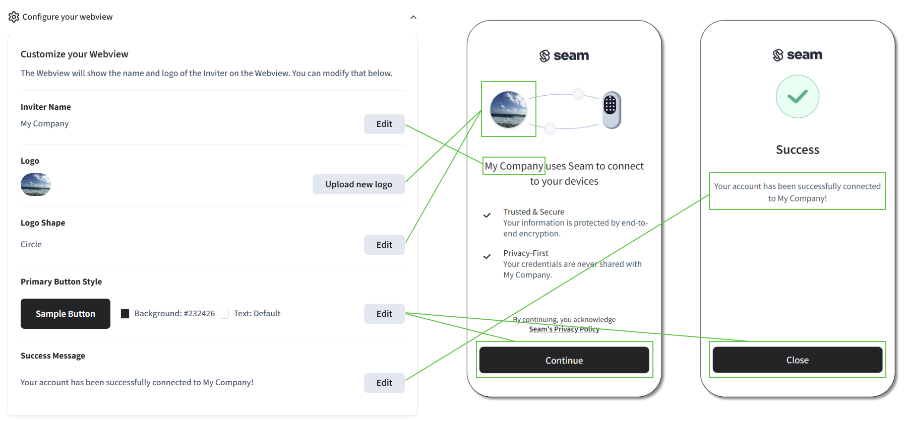

# Customizing Connect Webviews

You can use [Seam Console](../seam-console/) to customize the [Connect Webviews](./) that you present to your users through your app.

You can customize the following characteristics of your Connect Webviews:

* [Look and feel](customizing-connect-webviews.md#customize-the-look-and-feel-of-your-connect-webviews)
* [Brands (manufacturers) to display](customizing-connect-webviews.md#customize-the-brands-to-display-in-your-connect-webviews)
* [Device types (capabilities) to connect](customizing-connect-webviews.md#customize-the-types-of-devices-to-connect)
* [Behavior settings](customizing-connect-webviews.md#customize-the-behavior-settings-of-your-connect-webviews), including `automatically_manage_new_devices` and `wait_for_device_creation`

***

## Customize the Look and Feel of Your Connect Webviews

You can customize the look and feel of your Connect Webviews in the following ways:

* **Inviter name:** Define the name to display in your Connect Webviews as the entity requesting user authorization for Seam to access their device or access control system account.
* **Logo:** Choose a logo for your Connect Webviews. Ensure that the image file size does not exceed 1 MB.
* **Logo shape:** Select the shape of your logo displayed in Connect Webviews. Choices are **Circle** (default) or **Square**.
* **Primary button style:** Customize the background and text colors of the action button in your Connect Webview flow using a hex color code. The default color is #232426, which is almost black, and the default text color on the button is white.
* **Success message:** Customize the message that the Connect Webview displays when the connection completes successfully.

It is important to note that any changes you make to the customization features will apply to all of your new Connect Webviews.

<figure><figcaption><p>You can customize the look and feel of Connect Webviews.</p></figcaption></figure>

To customize the look and feel of your Connect Webviews:

1. In the top navigation pane of [Seam Console](https://console.seam.co/), click **Developer**.
2. In the left navigation pane, click **Webviews**.
3. On the **Webviews** page, click **Configure your webview**.
4.  In the **Customize your Webview** pane, configure any of the following features:

    <table><thead><tr><th width="229">Feature</th><th>Instructions</th></tr></thead><tbody><tr><td>Inviter name</td><td><ol><li>In the <strong>Inviter Name</strong> area, click <strong>Edit</strong>.</li><li>Type the desired inviter name and then click <strong>Save</strong>.</li></ol></td></tr><tr><td>Logo</td><td><ol><li>In the <strong>Logo</strong> area, click <strong>Upload new logo</strong>.</li><li>Navigate to and select the image file that contains the desired logo.<br>The image file size cannot exceed 1 MB.</li><li>Click <strong>Open</strong>.</li></ol></td></tr><tr><td>Logo shape</td><td><ol><li>In the <strong>Logo Shape</strong> area, click <strong>Edit</strong>.</li><li>Select <strong>Circle</strong> or <strong>Square</strong> and then click <strong>Save</strong>.</li></ol></td></tr><tr><td>Primary button style</td><td><ol><li>In the <strong>Primary Button Style</strong> area, click <strong>Edit</strong>.</li><li>Click the <strong>Button Background Color</strong> field and specify the desired color. Default: <code>#232426</code> (almost black).</li><li>Click the <strong>Button Text Color</strong> field and specify the desired color. Default: <code>#ffffff</code> (white).</li><li>Click <strong>Save</strong>.</li></ol></td></tr><tr><td>Success message</td><td><ol><li>In the <strong>Success Message</strong> area, click <strong>Edit</strong>.</li><li><p>In the <strong>Message</strong> field, type the desired success message.</p><p>To reset the success message, click <strong>Clear</strong>.</p></li><li>Click <strong>Save</strong>.</li></ol></td></tr></tbody></table>

***

## Customize the Brands to Display in Your Connect Webviews

When you create a Connect Webview, you can customize the providers—that is, the brands—that it displays. In the [Create Connect Webview](../../api/connect_webviews/create.md) request, include the desired set of device provider keys in the `accepted_providers` parameter. Seam supports the following device provider keys:

| Provider Name                                                                                                                          | Device Provider Key             |
| -------------------------------------------------------------------------------------------------------------------------------------- | ------------------------------- |
| [2N](../../device-guides/2n-intercom-systems.md)                                                                                       | `my_2n`                         |
| [4SUITES](../../device-and-system-integration-guides/4suites-locks/)                                                                   | `four_suites`                   |
| [Akiles](../../device-and-system-integration-guides/akiles-locks/)                                                                     | `akiles`                        |
| [Akuvox](https://akuvox.com/)                                                                                                          | `akuvox`                        |
| [ASSA ABLOY Credential Service](../../device-and-system-integration-guides/assa-abloy-access-credential-services.md)                   | `assa_abloy_credential_service` |
| [ASSA ABLOY Visionline Access Control System](../../device-and-system-integration-guides/assa-abloy-visionline-access-control-system/) | `visionline`                    |
| [August Home](../../device-guides/august-locks.md)                                                                                     | `august`                        |
| [Avigilon Alta](../../device-guides/avigilon-alta-access-system.md)                                                                    | `avigilon_alta`                 |
| [Brivo](../../device-and-system-integration-guides/brivo-access/)                                                                      | `brivo`                         |
| [ControlByWeb](../../device-guides/get-started-with-controlbyweb-devices.md)                                                           | `controlbyweb`                  |
| [DoorKing](https://www.doorking.com/)                                                                                                  | `doorking`                      |
| [Dormakaba Community](../../device-and-system-integration-guides/dormakaba-community-access-control-system/)                           | `dormakaba_community`           |
| [Dormakaba Oracode](../../device-guides/dormakaba-oracode-locks.md)                                                                    | `dormakaba_oracode`             |
| [ecobee](../../device-guides/ecobee-thermostats.md)                                                                                    | `ecobee`                        |
| [Genie Aladdin Connect](https://www.geniecompany.com/aladdin-connect-by-genie)                                                         | `genie`                         |
| [Honeywell Resideo](../../device-and-system-integration-guides/honeywell-thermostats/)                                                 | `honeywell_resideo`             |
| [igloohome](../../device-guides/igloohome-locks.md)                                                                                    | `igloohome`                     |
| [Kwikset](../../device-guides/kwikset-locks.md)                                                                                        | `kwikset`                       |
| [Latch](../../device-and-system-integration-guides/latch-access-control-system/)                                                       | `latch`                         |
| [Linear](https://linear-solutions.com/)                                                                                                | `linear`                        |
| [Lockly](../../device-and-system-integration-guides/lockly-locks/)                                                                     | `lockly`                        |
| [Minut](../../device-guides/minut-sensors.md)                                                                                          | `minut`                         |
| [Nest](../../device-guides/google-nest-thermostats/)                                                                                   | `google_nest`                   |
| [NoiseAware](../../device-guides/noiseaware-sensors.md)                                                                                | `noiseaware`                    |
| [Nuki](../../device-guides/nuki-locks.md)                                                                                              | `nuki`                          |
| [PTI Storlogix Cloud](../../device-guides/pti-storlogix-cloud.md)                                                                      | `pti`                           |
| [Salto KS Access System](../../device-and-system-integration-guides/salto-ks-access-control-system/)                                   | `salto_ks`                      |
| [Salto KS Locks](../../device-guides/salto-locks.md)                                                                                   | `salto_ks`                      |
| [Salto ProAccess Space Access System](../../device-and-system-integration-guides/salto-proaccess-space-access-system/)                 | `salto_space`                   |
| [Schlage](../../device-and-system-integration-guides/schlage-locks/)                                                                   | `schlage`                       |
| [Sensi](../../device-and-system-integration-guides/sensi-thermostats/)                                                                 | `sensi`                         |
| [SmartThings](../../device-guides/get-started-with-smartthings-hubs-+-smart-locks.md)                                                  | `smartthings`                   |
| [Tedee](../../device-and-system-integration-guides/tedee-locks/)                                                                       | `tedee`                         |
| [TTLock](../../device-guides/ttlock-locks.md)                                                                                          | `ttlock`                        |
| [Wyze](../../device-guides/wyze-locks.md)                                                                                              | `wyze`                          |
| [Yale](../../device-guides/yale-locks.md)                                                                                              | `yale`                          |

To help you decide which providers to include in a Connect Webview, you can use the [List Device Providers](../../api/devices/list_device_providers.md) method to learn about each provider. The information that this method returns for each provider includes a set of [capability flags](../../capability-guides/device-and-system-capabilities.md#capability-flags), such as `device_provider.can_remotely_unlock`. If at least one supported device from a provider has a specific capability, the corresponding capability flag is `true`.


If you omit the `accepted_providers` parameter, the Connect Webview displays all of the stable providers that Seam supports, by default. For more information about provider categories, see [Step 1: Create a Connect Webview](connect-webview-process.md#step-1-create-a-connect-webview).


The following Connect Webview creation request specifies that the Connect Webview should only display August and Schlage:



**Request:**

```python
seam.connect_webviews.create(
  accepted_providers = ["august", "schlage"]
)
```

**Response:**

```
ConnectWebview(
  connect_webview_id='1139e5a5-4bfd-4c78-9a89-83a439ad538e',
  status='pending',
  url='https://connect.getseam.com/connect_webviews/view?connect_webview_id=1139e5a5-4bfd-4c78-9a89-83a439ad538e&auth_token=5g6Nt1sunJamS1huj7pwztKaMaBpvKhLc',
  accepted_providers=[
    'august',
    'schlage'
  ],
  ...
 )
```



**Request:**

```bash
curl -X 'POST' \
  'https://connect.getseam.com/connect_webviews/create' \
  -H 'accept: application/json' \
  -H 'Authorization: Bearer ${API_KEY}' \
  -H 'Content-Type: application/json' \
  -d '{
  "accepted_providers": [
    "august",
    "schlage"
  ]
}'
```

**Response:**

```json
{
  "connect_webview": {
    "connect_webview_id": "1139e5a5-4bfd-4c78-9a89-83a439ad538e",
    "status": "pending",
    "url": "https://connect.getseam.com/connect_webviews/view?connect_webview_id=f5fa50b8-b7e3-45ed-b636-354c17df5d8a&auth_token=6w2tZqeYN4xEYcMf8ySsGgpwFAQgET6Lb",
    "accepted_providers": [
      "august",
      "schlage"
    ],
    ...
  },
  "ok": true
}
```



**Request:**

```javascript
await seam.connectWebviews.create({
  accepted_providers: ["august", "schlage"]
})
```

**Response:**

```json
{
  connect_webview_id: '1139e5a5-4bfd-4c78-9a89-83a439ad538e',
  status: 'pending',
  url: 'https://connect.getseam.com/connect_webviews/view?connect_webview_id=8cf491d8-cf67-4ad0-907d-3a8ae3764019&auth_token=C4vLHdKqpMavg6HYBbejQkE1dZ8KDcetS',
  accepted_providers: [
    'august',
    'schlage'
  ],
  ...
}
```



**Request:**

```ruby
client.connect_webviews.create(
  accepted_providers: ["august", "schlage"]
)
```

**Response:**

```
<Seam::ConnectWebview:0x00438
  connect_webview_id="1139e5a5-4bfd-4c78-9a89-83a439ad538e"
  status="pending"
  url="https://connect.getseam.com/connect_webviews/view?connect_webview_id=f3d344bb-e506-4f70-bc9d-8d78c307c324&auth_token=C1e5tgjokyrrQ1mQj9YUdSW8BxHs98D7P"
  accepted_providers=[
    "august",
    "schlage"
  ]
  ...
>
```



**Request:**

```csharp
List<Seam.Api.ConnectWebviews.CreateRequest.AcceptedProvidersEnum> acceptedProviders = new() {
  Seam.Api.ConnectWebviews.CreateRequest.AcceptedProvidersEnum.August,
  Seam.Api.ConnectWebviews.CreateRequest.AcceptedProvidersEnum.Schlage
};

seam.ConnectWebviews.Create(
  acceptedProviders: acceptedProviders
);
```

**Response:**

```json
{
  "connect_webview_id": "f69fa3b8-c89d-4fd4-b6fc-feb456d07234",
  "status": "pending",
  "url": "https://connect.getseam.com/connect_webviews/view?connect_webview_id=f69fa3b8-c89d-4fd4-b6fc-feb456d07234&auth_token=MCh7Vm2fnvyiPhtjB8Lemqr93aeHXhJhM",
  "accepted_providers": [
    "august",
    "schlage"
  ],
  ...
}
```



***

## Customize the Types of Devices to Connect


Currently, the only provider that supports multiple device types is SmartThings.


Some providers support multiple device types, like smart locks and thermostats. To specify which types of devices your users can connect to Seam for a provider that supports multiple device types, use the `accepted_capabilities` parameter when creating a Connect Webview. This parameter is especially applicable when the Connect Webview [`automatically_manage_new_devices`](customizing-connect-webviews.md#automatically_manage_new_devices) parameter is `true`. Set `accepted_capabilities` to an array containing one or more of the following values to indicate the capabilities of the devices that the Connect Webview can accept:

* `lock`
* `thermostat`
* `noise_sensor`

Seam maintains a default value for this parameter for each provider. For example, for SmartThings, the default value for `accepted_capabilities` is `["locks"]`. To begin accepting SmartThings-connected thermostats, as well as locks, set `accepted_capabilities` to `["locks", "thermostats"]`. For Honeywell Resideo, the default value is `["thermostats"]`.

## Customize the Behavior Settings of Your Connect Webviews

You can use the following two properties to customize the behavior of your Connect Webviews:

* [`automatically_manage_new_devices`](customizing-connect-webviews.md#automatically_manage_new_devices)
* [`wait_for_device_creation`](customizing-connect-webviews.md#wait_for_device_creation)

You configure these properties when you are creating the Connect Webview. Consequently, you can customize these two characteristics for each of your Connect Webviews.

### `automatically_manage_new_devices`

Seam charges fees for different parts of the API, like connecting a device, creating an access code or thermostat schedule, and creating an access control system user. To learn more, contact our team. You can exclude specific devices from your bill by marking them as "[unmanaged](../devices/managed-and-unmanaged-devices.md)."

The default value for `automatically_manage_new_devices` is `true`. Consequently, by default, Seam imports all devices and makes them available for use. However, if you set this property to `false`, Seam sets the `is_managed` property for all new devices to `false` (that is, unmanaged) when a user first connects their account to Seam.

### `wait_for_device_creation`

This property enables you to specify whether Seam should finish syncing all devices in a newly-connected account before completing the associated Connect Webview.

The default value for `wait_for_device_creation` is `false`. If `wait_for_device_creation` is `false`, you should wait for `connected_account.completed_first_sync` before retrieving your devices. This event indicates that Seam has finished the first sync of the connected account, and the connected devices are available.

Alternately, if you set `wait_for_device_creation` to `true`, Seam finishes syncing all devices in the newly-connected account before proceeding to the final page of the Connect Webview. In this case, you can fetch your devices immediately upon the completion of the Connect Webview.
