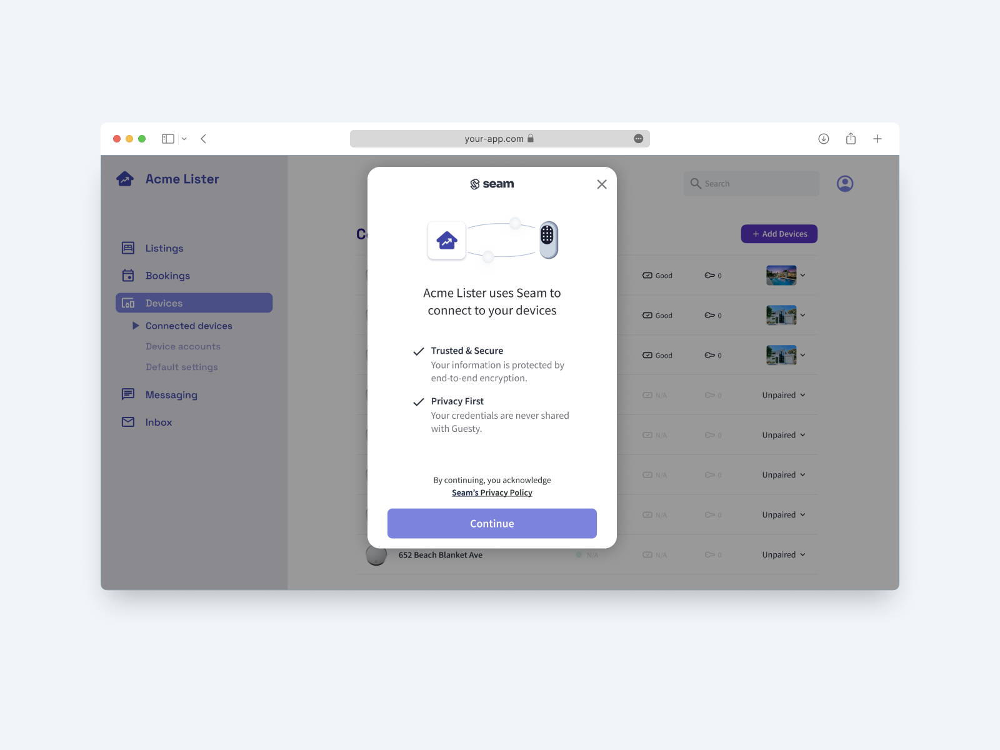
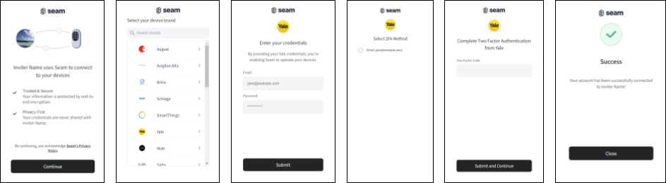

# Embedding a Connect Webview in Your App

<figure><figcaption></figcaption></figure>

To enable your users to connect their devices or access control system to Seam through your app, use a [Connect Webview](./). First, in your app, add a mechanism—such as a button—to [open a new Connect Webview](embedding-a-connect-webview-in-your-app.md#step-1-open-a-connect-webview). Then, you can use either of the following two methods to [display the Connect Webview](embedding-a-connect-webview-in-your-app.md#step-2-display-the-connect-webview) in your app:

* [Redirect to the Connect Webview URL.](embedding-a-connect-webview-in-your-app.md#redirect-to-the-connect-webview-url)
* [Embed the Connect Webview in an inline frame (iframe).](embedding-a-connect-webview-in-your-app.md#embed-the-connect-webview-in-an-iframe)

***

## Step 1: Open a Connect Webview

To enable users to connect their devices or access control system with your app, present a button to create and display a new Connect Webview. If your app has a settings section, we recommend creating a device or ACS settings page and displaying an **Add** or **Link** button, such as **Add Devices**.

When your user clicks this button, your app can either [redirect to the Connect Webview URL](embedding-a-connect-webview-in-your-app.md#redirect-to-the-connect-webview-url) or [embed the Connect Webview in an iframe](embedding-a-connect-webview-in-your-app.md#embed-the-connect-webview-in-an-iframe) and present it in a modal.

<figure><figcaption><p>Add a button to your app to enable your users to connect their devices or ACS using a Connect Webview.</p></figcaption></figure>

***

## Step 2: Display the Connect Webview

You can [redirect to the Connect Webview URL](embedding-a-connect-webview-in-your-app.md#redirect-to-the-connect-webview-url) or [use an iframe](embedding-a-connect-webview-in-your-app.md#embed-the-connect-webview-in-an-iframe) to display the Connect Webview. The following sections describe these two options:

### Redirect to the Connect Webview URL

To incorporate a Connect Webview in your app using redirection:

1. [Create the Connect Webview.](./#id-1.-create-a-connect-webview)
   * Make sure to set a `custom_redirect_url` so that the Connect Webview redirects back to the desired page within your app after the Connect Webview flow completes.
   * If you want to redirect to a different page when there is an error, you can set the `custom_redirect_failure_url` to the URL for the desired page.
   * We recommend setting `wait_for_device_creation` to `true` so that the Connect Webview does not complete until Seam completes the first sync of the connected account and devices or ACS.
2.  Redirect your app to the URL for the created Connect Webview.\
    Pass the Connect Webview `url` to the client portion of your app and redirect your app to this URL.\
    The resulting page displays the [authorization flow](./#connect-webview-process) through which your app user can link their device or ACS account to Seam.\\

    <figure><figcaption></figcaption></figure>

    Once the user has completed the authorization flow, the Connect Webview redirects back to your app (specifically to the `custom_redirect_url`). Note that Seam appends the following search parameters to the URL after the redirect:

    * `connect_webview_id`
    * If there is an error, `error_code` and `error_message`
3. [Your user completes the Connect Webview authorization flow.](./#id-3.-your-user-completes-the-connect-webview)
4. [Learn when the device or ACS account connection has completed successfully.](./#id-4.-verify-successful-device-account-connection)
5. [Retrieve the devices or ACS that your user has just connected to Seam.](./#id-5.-retrieve-connected-devices)
6. [Use the Seam API to control your users' connected devices or ACS.](./#id-6.-use-the-seam-api-to-control-your-users-connected-devices)

***

### Embed the Connect Webview in an iframe

To incorporate a Connect Webview in your app using an HTML [iframe](https://www.w3schools.com/html/html_iframe.asp):

1. [Create the Connect Webview.](./#id-1.-create-a-connect-webview)\
   We recommend setting `wait_for_device_creation` to `true` so that the Connect Webview does not complete until Seam completes the first sync of the connected account and devices or ACS.
2.  Display the URL for the created Connect Webview in an iframe.\
    Pass the Connect Webview `url` to the client portion of your app and use an HTML [iframe](https://www.w3schools.com/html/html_iframe.asp) to display the Connect Webview URL.

    For example:

    ```html
    <iframe style="border: none;min-height: 600px;height: 100%;width: 100%"
    allow="clipboard-write"
    src="<your connect_webview.url>"
    />
    ```
3.  [Your user completes the Connect Webview authorization flow.](./#id-3.-your-user-completes-the-connect-webview)

    \{% hint style="info" %\} If you choose to embed a Connect Webview in an iframe, it's important to understand that some providers move to a new tab during their authentication flow for security purposes. Seam is not able to abstract away this behavior. \{% endhint %\}
4. [Learn when the device or ACS account connection has completed successfully.](./#id-4.-verify-successful-device-account-connection)\
   When the connection completes successfully, you can close the iframe.
5. [Retrieve the devices or ACS that your user has just connected to Seam.](./#id-5.-retrieve-connected-devices)
6. [Use the Seam API to control your users' connected devices or ACS.](./#id-6.-use-the-seam-api-to-control-your-users-connected-devices)

***

## Opening Connect Webviews in iOS or Android Apps

If you want to include a Connect Webview flow inside an iOS or Android app, it is important to note that iOS and Android require verification for each link to which a user navigates within an app. Consequently, you must register a navigation delegate to handle any links within the Connect Webview. For example, there is a link from the Connect Webview to the [Seam **Privacy & Legal** webpage](https://www.seam.co/legal). This link includes `target=_blank` in the anchor tag to open the privacy policy in a new tab or window. You must configure your iOS or Android app to handle opening links in a new browser tab or window.

The following example shows how to handle all links to URLs that are not in the `getseam.com` or `seam.co` domain within a Connect Webview embedded in an iOS or Android app:



```swift
someWebView.navigationDelegate = self

extension YourViewController: WKNavigationDelegate {
  func webView(_ webView: WKWebView, decidePolicyFor navigationAction: WKNavigationAction, decisionHandler: @escaping (WKNavigationActionPolicy) -> Void) {
    if let url = navigationAction.request.url, navigationAction.navigationType == .linkActivated {
      if (url.host != "getseam.com" || url.host != "seam.co") {
        UIApplication.shared.open(url)
        decisionHandler(.cancel)
        return
      }
    }
    decisionHandler(.allow)
  }
}
```



```kotlin
webView.webViewClient = object : WebViewClient() {
  override fun shouldOverrideUrlLoading(view: WebView, url: String): Boolean {
    if (Uri.parse(url).host != "getseam.com" || Uri.parse(url).host != "seam.co") {
      val intent = Intent(Intent.ACTION_VIEW, Uri.parse(url))
      view.context.startActivity(intent)
      return true
    }
    return false
  }
}
```



For details, see the following relevant iOS or Android documentation:

* [iOS WKNavigationDelegate](https://developer.apple.com/documentation/webkit/wknavigationdelegate)
* [Android shouldOverrideUrlLoading](https://developer.android.com/reference/android/webkit/WebViewClient#shouldOverrideUrlLoading\(android.webkit.WebView,%20android.webkit.WebResourceRequest\))
