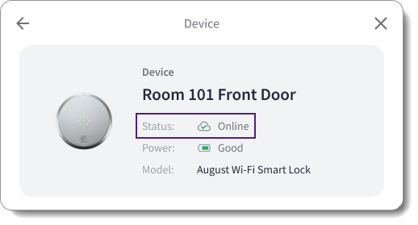

# Displaying Device Health

<figure><figcaption></figcaption></figure>

To display the health—that is, the online/offline status—of your end users' devices in your app, you can use the following Seam mechanisms:

* [Use the `properties.online` property of the `device` object.](displaying-device-health.md#get-device-status-using-device-properties)
* [Use the `device.connected` and `device.disconnected` events.](displaying-device-health.md#get-device-status-using-connection-related-events)

## Get Device Status Using Device Properties

Seam polls connected devices and accounts every ten minutes and updates the Boolean [`device.properties.online`](../../api-clients/devices/#device.properties-properties) property accordingly. Use a [Get Device](../../api-clients/devices/get-device.md) request to retrieve the current online/offline status of a device. Then, display the device status in your app.


You can also use the prebuilt [device details Seam Component](../../seam-components/react-components/device-details.md), which includes a device status display.




**Request:**

```python
device = seam.devices.get("36cf1a96-196d-41b0-9804-88154387f1f9")
pprint("Online: " + str(device.properties.online))
```

**Response:**

```
'Online: True'
```



**Request:**

```bash
# Use GET or POST.
curl -X 'GET' \
  'https://connect.getseam.com/devices/get' \
  -H 'accept: application/json' \
  -H 'Authorization: Bearer ${API_KEY}' \
  -H 'Content-Type: application/json' \
  -d '{
    "device_id": "36cf1a96-196d-41b0-9804-88154387f1f9"
}' | jq -r '"Online: " + (.device.properties.online | tostring)'
```

**Response:**

```
Online: true
```



**Request:**

```javascript
const device = await seam.devices.get({device_id: "36cf1a96-196d-41b0-9804-88154387f1f9"});
console.log("Online:", device.properties.online);
```

**Response:**

```
Online: true
```



**Request:**

```ruby
device = client.devices.get("36cf1a96-196d-41b0-9804-88154387f1f9")
puts "Online: " + device.properties['online'].to_s
```

**Response:**

```
Online: true
```



**Request:**

```php
$device = $seam->devices->get("36cf1a96-196d-41b0-9804-88154387f1f9");
if ($device->properties->online === true) {
  echo "Online: true\n";
} else {
  echo "Online: false\n";
}
```

**Response:**

```
Online: true
```



**Request:**

```csharp
var device = seam.Devices.Get(deviceId: "36cf1a96-196d-41b0-9804-88154387f1f9");
Console.WriteLine("Online: " + device.Properties.Online);
```

**Response:**

```
Online: True
```



**Request:**

```java
Device device = seam.devices()
      .get(DevicesGetRequest.builder()
              .deviceId("36cf1a96-196d-41b0-9804-88154387f1f9")
              .build());
System.out.println("Online: " + device.getProperties().getOnline());
```

**Response:**

```
Online: true
```



**Request:**

```go
device, err := client.Devices.Get(
	context.Background(),
  &api.DevicesGetRequest{
    DeviceId: api.String("36cf1a96-196d-41b0-9804-88154387f1f9"),
  },
)
if err != nil {
	return err
}
fmt.Println("Online:", device.Properties.Online)
return nil
```

**Response:**

```
Online: true
```



## Get Device Status Using Connection-Related Events

When a device connection or disconnection occurs, Seam generates a [`device.connected`](../../api-clients/events/#event-types) or [`device.disconnected`](../../api-clients/events/#event-types) event, respectively. You can retrieve these events using a [List Events](../../api-clients/events/list-events.md) request or through [webhooks](../webhooks.md) and then display the corresponding status in your app.

### Get Connection-Related Events Using a List Events Request

When issuing a [List Events](../../api-clients/events/list-events.md) request to retrieve [`device.connected`](../../api-clients/events/#event-types) or [`device.disconnected`](../../api-clients/events/#event-types) events for a specific device, include the following parameters:

<table><thead><tr><th width="162">Parameter</th><th width="161">Type</th><th>Description</th></tr></thead><tbody><tr><td><code>device_id</code></td><td>String (UUID)</td><td>ID of the device for which you want to retrieve <code>device.connected</code> or <code>device.disconnected</code> events</td></tr><tr><td><code>event_type</code></td><td>String</td><td>Event type that you want to retrieve, that is,  <code>device.connected</code> or <code>device.disconnected</code></td></tr><tr><td><code>since</code></td><td>String</td><td>Desired starting event generation date and time<br>You must include <code>since</code> or <code>between</code>.</td></tr><tr><td><code>between</code></td><td>Set of two strings</td><td>Desired starting and ending event generation dates and times<br>For example:<br><code>["2024-01-01T00:00:00Z", "2024-02-01T00:00:00Z"]</code><br>You must include <code>between</code> or <code>since</code>.</td></tr></tbody></table>

The following example uses the List Events request to retrieve all `device.connected` events for a specific device since January 1, 2024:



**Request:**

```python
device_connected_events = seam.events.list(
    device_id = "36cf1a96-196d-41b0-9804-88154387f1f9",
    event_type = "device.connected",
    since = "2024-01-01T00:00:00Z"
)
pprint(device_connected_events)
```

**Response:**

```
[{'connected_account_id': 'c1413928-f527-4e12-abf9-d5e18d92dd33',
  'created_at': '2024-02-04T21:55:09.681Z',
  'device_id': '36cf1a96-196d-41b0-9804-88154387f1f9',
  'event_id': 'ca3114b2-088d-43f9-bb5e-ded5d19ad053',
  'event_type': 'device.connected',
  'occurred_at': '2024-02-04T21:55:09.681Z',
  'workspace_id': '398d80b7-3f96-47c2-b85a-6f8ba21d07be'},
 {'connected_account_id': 'c1413928-f527-4e12-abf9-d5e18d92dd33',
  'created_at': '2024-02-03T04:54:39.744Z',
  'device_id': '36cf1a96-196d-41b0-9804-88154387f1f9',
  'event_id': '39fcb512-82a4-431d-969f-3935eeba8929',
  'event_type': 'device.connected',
  'occurred_at': '2024-02-03T04:54:39.744Z',
  'workspace_id': '398d80b7-3f96-47c2-b85a-6f8ba21d07be'}]
```



**Request:**

```bash
# Use GET or POST.
curl -X 'GET' \
  'https://connect.getseam.com/devices/list' \
  -H 'accept: application/json' \
  -H 'Authorization: Bearer ${API_KEY}' \
  -H 'Content-Type: application/json' \
  -d '{
  "device_id": "36cf1a96-196d-41b0-9804-88154387f1f9",
  "event_type": "device.connected",
  "since": "2024-01-01T00:00:00Z"
}'
```

**Response:**

```json
{
  "events": [
    {
      "event_id": "ca3114b2-088d-43f9-bb5e-ded5d19ad053",
      "device_id": "36cf1a96-196d-41b0-9804-88154387f1f9",
      "event_type": "device.connected",
      "workspace_id": "398d80b7-3f96-47c2-b85a-6f8ba21d07be",
      "created_at": "2024-02-04T21:55:09.681Z",
      "occurred_at": "2024-02-04T21:55:09.681Z",
      "connected_account_id": "c1413928-f527-4e12-abf9-d5e18d92dd33"
    },
    {
      "event_id": "39fcb512-82a4-431d-969f-3935eeba8929",
      "device_id": "36cf1a96-196d-41b0-9804-88154387f1f9",
      "event_type": "device.connected",
      "workspace_id": "398d80b7-3f96-47c2-b85a-6f8ba21d07be",
      "created_at": "2024-02-03T04:54:39.744Z",
      "occurred_at": "2024-02-03T04:54:39.744Z",
      "connected_account_id": "c1413928-f527-4e12-abf9-d5e18d92dd33"
    }
  ],
  "ok": true
}
```



**Request:**

```javascript
const device_connected_events = await seam.events.list({
  device_id: "36cf1a96-196d-41b0-9804-88154387f1f9",
  event_type: "device.connected",
  since: "2024-01-01T00:00:00Z"
})
console.log(device_connected_events)
```

**Response:**

```json
[
  {
    event_id: 'ca3114b2-088d-43f9-bb5e-ded5d19ad053',
    device_id: '36cf1a96-196d-41b0-9804-88154387f1f9',
    event_type: 'device.connected',
    workspace_id: '398d80b7-3f96-47c2-b85a-6f8ba21d07be',
    created_at: '2024-02-04T21:55:09.681Z',
    occurred_at: '2024-02-04T21:55:09.681Z',
    connected_account_id: 'c1413928-f527-4e12-abf9-d5e18d92dd33'
  },
  {
    event_id: '39fcb512-82a4-431d-969f-3935eeba8929',
    device_id: '36cf1a96-196d-41b0-9804-88154387f1f9',
    event_type: 'device.connected',
    workspace_id: '398d80b7-3f96-47c2-b85a-6f8ba21d07be',
    created_at: '2024-02-03T04:54:39.744Z',
    occurred_at: '2024-02-03T04:54:39.744Z',
    connected_account_id: 'c1413928-f527-4e12-abf9-d5e18d92dd33'
  }
]
```



**Request:**

```ruby
device_connected_events = client.events.list(
  device_id: "36cf1a96-196d-41b0-9804-88154387f1f9",
  event_type: "device.connected",
  since: "2024-01-01T00:00:00Z"
)
puts device_connected_events.inspect
```

**Response:**

```
[<Seam::Event:0x00438
  event_id="ca3114b2-088d-43f9-bb5e-ded5d19ad053"
  device_id="36cf1a96-196d-41b0-9804-88154387f1f9"
  event_type="device.connected"
  workspace_id="398d80b7-3f96-47c2-b85a-6f8ba21d07be"
  created_at=2024-02-04 21:55:09.681 UTC>, <Seam::Event:0x00460
  event_id="39fcb512-82a4-431d-969f-3935eeba8929"
  device_id="36cf1a96-196d-41b0-9804-88154387f1f9"
  event_type="device.connected"
  workspace_id="398d80b7-3f96-47c2-b85a-6f8ba21d07be"
  created_at=2024-02-03 04:54:39.744 UTC>]
```



**Request:**

```php
$device_connected_events = $seam->events->list(
  device_id: "36cf1a96-196d-41b0-9804-88154387f1f9",
  event_type: "device.connected",
  since: "2024-01-01T00:00:00Z"
);
echo json_encode($device_connected_events), "\n";
```

**Response:**


```json
[{"event_id":"ca3114b2-088d-43f9-bb5e-ded5d19ad053","device_id":"36cf1a96-196d-41b0-9804-88154387f1f9","event_type":"device.connected","workspace_id":"398d80b7-3f96-47c2-b85a-6f8ba21d07be","created_at":"2024-02-04T21:55:09.681Z","occurred_at":"2024-02-04T21:55:09.681Z"},{"event_id":"39fcb512-82a4-431d-969f-3935eeba8929","device_id":"36cf1a96-196d-41b0-9804-88154387f1f9","event_type":"device.connected","workspace_id":"398d80b7-3f96-47c2-b85a-6f8ba21d07be","created_at":"2024-02-03T04:54:39.744Z","occurred_at":"2024-02-03T04:54:39.744Z"}]
```




**Request:**

```csharp
var device_connected_events = seam.Events.List(
    deviceId: "36cf1a96-196d-41b0-9804-88154387f1f9",
    eventType: Seam.Api.Events.ListRequest.EventTypeEnum.DeviceConnected,
    since: "2024-01-01T00:00:00Z"
);
foreach (var device_connected_event in device_connected_events)
{
  Console.WriteLine(device_connected_event);
}
```

**Response:**

```json
{
  "event_id": "ca3114b2-088d-43f9-bb5e-ded5d19ad053",
  "device_id": "36cf1a96-196d-41b0-9804-88154387f1f9",
  "event_type": "device.connected",
  "workspace_id": "398d80b7-3f96-47c2-b85a-6f8ba21d07be",
  "created_at": "2024-02-04T21:55:09.681Z",
  "occurred_at": "2024-02-04T21:55:09.681Z"
}
{
  "event_id": "39fcb512-82a4-431d-969f-3935eeba8929",
  "device_id": "36cf1a96-196d-41b0-9804-88154387f1f9",
  "event_type": "device.connected",
  "workspace_id": "398d80b7-3f96-47c2-b85a-6f8ba21d07be",
  "created_at": "2024-02-03T04:54:39.744Z",
  "occurred_at": "2024-02-03T04:54:39.744Z"
}
```



**Request:**

```java
var deviceConnectedEvents = seam.events()
          .list(EventsListRequest.builder()
                  .deviceId("36cf1a96-196d-41b0-9804-88154387f1f9")
                  .eventType(EventsListRequestEventType.DEVICE_CONNECTED)
                  .since("2024-01-01T00:00:00Z")
                  .build());
System.out.println(deviceConnectedEvents);
```

**Response:**

```json
[{
  "event_id" : "ca3114b2-088d-43f9-bb5e-ded5d19ad053",
  "device_id" : "36cf1a96-196d-41b0-9804-88154387f1f9",
  "event_type" : "device.connected",
  "workspace_id" : "398d80b7-3f96-47c2-b85a-6f8ba21d07be",
  "created_at" : "2024-02-04T21:55:09.681Z",
  "occurred_at" : "2024-02-04T21:55:09.681Z",
  "connected_account_id" : "c1413928-f527-4e12-abf9-d5e18d92dd33"
}, {
  "event_id" : "39fcb512-82a4-431d-969f-3935eeba8929",
  "device_id" : "36cf1a96-196d-41b0-9804-88154387f1f9",
  "event_type" : "device.connected",
  "workspace_id" : "398d80b7-3f96-47c2-b85a-6f8ba21d07be",
  "created_at" : "2024-02-03T04:54:39.744Z",
  "occurred_at" : "2024-02-03T04:54:39.744Z",
  "connected_account_id" : "c1413928-f527-4e12-abf9-d5e18d92dd33"
}]
```



**Request:**

```go
device_connected_events, err := client.Events.List(
	context.Background(),
  &api.EventsListRequest{
    DeviceId: api.String("36cf1a96-196d-41b0-9804-88154387f1f9"),
    EventType: api.EventTypeDeviceConnected.Ptr(),
    Since: api.String("2024-01-01T00:00:00Z"),
  },
)
if err != nil {
	return err
}
fmt.Println(device_connected_events)
return nil
```

**Response:**

```json
[{
  "event_id": "ca3114b2-088d-43f9-bb5e-ded5d19ad053",
  "device_id": "36cf1a96-196d-41b0-9804-88154387f1f9",
  "event_type": "device.connected",
  "workspace_id": "398d80b7-3f96-47c2-b85a-6f8ba21d07be",
  "created_at": "2024-02-04T21:55:09.681Z",
  "occurred_at": "2024-02-04T21:55:09.681Z",
  "connected_account_id": "c1413928-f527-4e12-abf9-d5e18d92dd33"
} {
  "event_id": "39fcb512-82a4-431d-969f-3935eeba8929",
  "device_id": "36cf1a96-196d-41b0-9804-88154387f1f9",
  "event_type": "device.connected",
  "workspace_id": "398d80b7-3f96-47c2-b85a-6f8ba21d07be",
  "created_at": "2024-02-03T04:54:39.744Z",
  "occurred_at": "2024-02-03T04:54:39.744Z",
  "connected_account_id": "c1413928-f527-4e12-abf9-d5e18d92dd33"
}]
```



### Receive Connection-Related Events Using a Webhook

You can set up webhook endpoints to receive `device.connected` and `device.disconnected` events. Then, you can use the receipt of these events to display the corresponding device status in your app. For more information about configuring webhooks, see [Webhooks](../webhooks.md).
