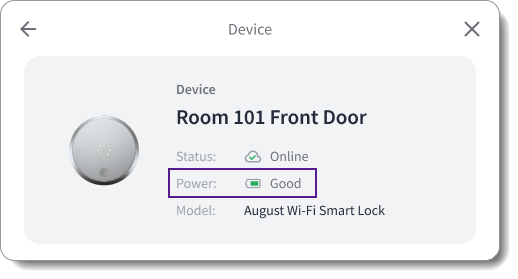

# Displaying Device Power Status

<figure><figcaption></figcaption></figure>

You can display the power status of your end users' devices in your app, including whether the device is wired or battery-powered. Further, for battery-powered devices, you can also display information about the battery status, such as the battery charge level and the battery status.

To display this information, use either of the following Seam mechanisms:

* [Use the `properties.has_direct_power`, and `properties.battery` properties of the `device` object.](displaying-device-power-status.md#get-device-power-status-using-device-properties)
* [Use the `device.low_battery` and `device.battery_status_changed` events.](displaying-device-power-status.md#get-device-power-status-using-battery-related-events)

## Get Device Power Status Using Device Properties

Seam polls connected devices and accounts every ten minutes and updates the following device properties accordingly:

<table><thead><tr><th width="320">Property</th><th width="137">Type</th><th>Description</th></tr></thead><tbody><tr><td><code>properties.has_direct_power</code></td><td>Boolean</td><td>Indicates whether the device has direct power, that is, whether the device is wired</td></tr><tr><td><code>properties.battery</code></td><td>Object</td><td>Battery information, including <code>level</code> and <code>status</code></td></tr><tr><td><code>properties.battery.level</code></td><td>Number (0-1)</td><td>Battery level of the device as a decimal value between 0 and 1, inclusive</td></tr><tr><td><code>properties.battery.status</code></td><td>Enum (string)</td><td><p>Current status of the battery charge level.</p><p>Values are:</p><p><code>critical</code>: Indicates an extremely low level, suggesting imminent shutdown or an urgent need for charging.</p><p></p><p><code>low</code>: Signifies that the battery is under the preferred threshold and should be charged soon.</p><p></p><p><code>good</code>: Denotes a satisfactory charge level, adequate for normal use without the immediate need for recharging.</p><p></p><p><code>full</code>: Represents a battery that is fully charged, providing the maximum duration of usage.</p></td></tr></tbody></table>

Use a [Get Device](../../api-clients/devices/get-device.md) request to retrieve the current power status of a device. First, determine whether the device is wired. If the device is battery-powered (that is, not wired), get the battery level and status. Then, display the retrieved device power status in your app.


You can also use the prebuilt [device details Seam Component](../../seam-components/react-components/device-details.md), which includes a device power status display.




**Request:**

```python
device = seam.devices.get("36cf1a96-196d-41b0-9804-88154387f1f9")
if device.properties.has_direct_power == True:
  pprint("Power Source: Wired")
else:
  pprint("Power Source: Battery-powered")
  pprint("Battery Level: " + str(device.properties.battery.level))
  pprint("Battery Status: " + device.properties.battery.status)
```

**Response:**

```
'Power Source: Battery-powered'
'Battery Level: 0.9999532347993827'
'Battery Status: full'
```



**Request:**

```bash
# Use GET or POST.
curl -X 'GET' \
  'https://connect.getseam.com/devices/get' \
  -H 'accept: application/json' \
  -H 'Authorization: Bearer ${API_KEY}' \
  -H 'Content-Type: application/json' \
  -d '{
    "device_id": "36cf1a96-196d-41b0-9804-88154387f1f9"
}' | jq -r '"Power Source: " + 
  (if .device.properties.has_direct_power == true then "Wired" else "Battery-powered", 
  "Battery Level: " + (.device.properties.battery.level | tostring), 
  "Battery Status: " + .device.properties.battery.status end)'
```

**Response:**

```
Power Source: Battery-powered
Power Source: Battery Level: 0.9999532347993827
Power Source: Battery Status: full
```



**Request:**

```javascript
const device = await seam.devices.get({device_id: "36cf1a96-196d-41b0-9804-88154387f1f9"});
if (device.properties.has_direct_power == true) {
  console.log("Power Source: Wired");
} else {
  console.log("Power Source: Battery-powered");
  console.log("Battery Level: " + device.properties.battery.level.toString());
  console.log("Battery Status: " + device.properties.battery.status);
}
```

**Response:**

```
Power Source: Battery-powered
Battery Level: 0.9999532347993827
Battery Status: full
```



**Request:**

```ruby
device = client.devices.get("36cf1a96-196d-41b0-9804-88154387f1f9")
if(device.properties['has_direct_power'] == true)
  puts "Power Source: Wired"
else
  puts "Power Source: Battery-powered"
  puts "Battery Level: " + device.properties['battery']['level'].to_s
  puts "Battery Status: " + device.properties['battery']['status']
end
```

**Response:**

```
Power Source: Battery-powered
Battery Level: 0.9999532347993827
Battery Status: full
```



**Request:**

```php
$device = $seam->devices->get("36cf1a96-196d-41b0-9804-88154387f1f9");
if ($device->properties->has_direct_power === true) {
  echo "Power Source: Wired\n";
} else {
  echo "Power Source: Battery-powered\n";
  // echo "Battery Level: " + $device->properties->battery->level + "\n";
  echo "Battery Level: {$device->properties->battery->level}\n";
  echo "Battery Status: {$device->properties->battery->status}\n";
}
```

**Response:**

```
Power Source: Battery-powered
Battery Level: 0.99995323479938
Battery Status: full
```



**Request:**

```csharp
var device = seam.Devices.Get(deviceId: "36cf1a96-196d-41b0-9804-88154387f1f9");
if (device.Properties.HasDirectPower == true)
{
  Console.WriteLine("Power Source: Wired");
} else {
  Console.WriteLine("Power Source: Battery-powered");
  if (device.Properties.Battery != null)
  {
    Console.WriteLine("Battery Level: " + device.Properties.Battery.Level);
    Console.WriteLine("Battery Status: " + device.Properties.Battery.Status);
  }
}
```

**Response:**

```
Power Source: Battery-powered
Battery Level: 0.9999532
Battery Status: Full
```



**Request:**

```java
Device device = seam.devices()
      .get(DevicesGetRequest.builder()
              .deviceId("36cf1a96-196d-41b0-9804-88154387f1f9")
              .build());
if (device.getProperties().getHasDirectPower() == true)
{
  System.out.println("Power Source: Wired");
} else {
  System.out.println("Power Source: Battery-powered");
  System.out.println("Battery Level: " + device.getProperties().getBattery().getLevel());
  System.out.println("Battery Status: " + device.getProperties().getBattery().getStatus());
}
```

**Response:**

```
Power Source: Battery-powered
Battery Level: 0.9999532
Battery Status: Full
```



**Request:**

```go
device, err := client.Devices.Get(
	context.Background(),
  &api.DevicesGetRequest{
    DeviceId: api.String("36cf1a96-196d-41b0-9804-88154387f1f9"),
  },
)
if err != nil {
	return err
}
fmt.Println("Online:", device.Properties.Online)
return nil
```

**Response:**

```
Online: true
```



## Get Device Power Status Using Battery-Related Events

Seam generates the following battery-related events:

* `device.low_battery`
* `device.battery_status_changed`

You can retrieve these events using a [List Events](../../api-clients/events/list-events.md) request or through [webhooks](../webhooks.md) and then display the corresponding status in your app.

### Get Battery-Related Events Using a List Events Request

When issuing a [List Events](../../api-clients/events/list-events.md) request to retrieve [`device.low_battery`](../../api-clients/events/#event-types) or [`device.battery_status_changed`](../../api-clients/events/#event-types) events for a specific device, include the following parameters:

<table><thead><tr><th width="162">Parameter</th><th width="161">Type</th><th>Description</th></tr></thead><tbody><tr><td><code>device_id</code></td><td>String (UUID)</td><td>ID of the device for which you want to retrieve <code>device.connected</code> or <code>device.disconnected</code> events</td></tr><tr><td><code>event_type</code></td><td>String</td><td>Event type that you want to retrieve, that is,  <code>device.connected</code> or <code>device.disconnected</code></td></tr><tr><td><code>since</code></td><td>String</td><td>Desired starting event generation date and time<br>You must include <code>since</code> or <code>between</code>.</td></tr><tr><td><code>between</code></td><td>Set of two strings</td><td>Desired starting and ending event generation dates and times<br>For example:<br><code>["2024-01-01T00:00:00Z", "2024-02-01T00:00:00Z"]</code><br>You must include <code>between</code> or <code>since</code>.</td></tr></tbody></table>

The following example uses the List Events request to retrieve all `device.battery_status_changed` events for a specific device since January 1, 2024:



**Request:**

```python
device_battery_status_changed_events = seam.events.list(
    device_id = "36cf1a96-196d-41b0-9804-88154387f1f9",
    event_type = "device.battery_status_changed",
    since = "2024-01-01T00:00:00Z"
)
pprint(device_battery_status_changed_events)
```

**Response:**

```
[{'connected_account_id': 'c1413928-f527-4e12-abf9-d5e18d92dd33',
  'created_at': '2024-01-01T02:25:10.158Z',
  'device_id': '36cf1a96-196d-41b0-9804-88154387f1f9',
  'event_id': 'de4314a2-903d-53e9-bb5e-ded5d19ad074',
  'event_type': 'device.battery_status_changed',
  'occurred_at': '2024-01-01T02:25:10.158Z',
  'workspace_id': '398d80b7-3f96-47c2-b85a-6f8ba21d07be'}]
```



**Request:**

```bash
# Use GET or POST.
curl -X 'GET' \
  'https://connect.getseam.com/devices/list' \
  -H 'accept: application/json' \
  -H 'Authorization: Bearer ${API_KEY}' \
  -H 'Content-Type: application/json' \
  -d '{
  "device_id": "36cf1a96-196d-41b0-9804-88154387f1f9",
  "event_type": "device.battery_status_changed",
  "since": "2024-01-01T00:00:00Z"
}'
```

**Response:**

```json
{
  "events": [
    {
      "event_id": "de4314a2-903d-53e9-bb5e-ded5d19ad074",
      "device_id": "36cf1a96-196d-41b0-9804-88154387f1f9",
      "event_type": "device.battery_status_changed",
      "workspace_id": "398d80b7-3f96-47c2-b85a-6f8ba21d07be",
      "created_at": "2024-01-01T02:25:10.158Z",
      "occurred_at": "2024-01-01T02:25:10.158Z",
      "connected_account_id": "c1413928-f527-4e12-abf9-d5e18d92dd33"
    }
  ],
  "ok": true
}
```



**Request:**

```javascript
const device_battery_status_changed_events = await seam.events.list({
  device_id: "36cf1a96-196d-41b0-9804-88154387f1f9",
  event_type: "device.battery_status_changed",
  since: "2024-01-01T00:00:00Z"
})
console.log(device_battery_status_changed_events)
```

**Response:**

```json
[
  {
    event_id: 'de4314a2-903d-53e9-bb5e-ded5d19ad074',
    device_id: '36cf1a96-196d-41b0-9804-88154387f1f9',
    event_type: 'device.battery_status_changed',
    workspace_id: '398d80b7-3f96-47c2-b85a-6f8ba21d07be',
    created_at: '2024-01-01T02:25:10.158Z',
    occurred_at: '2024-01-01T02:25:10.158Z',
    connected_account_id: 'c1413928-f527-4e12-abf9-d5e18d92dd33'
  }
]
```



**Request:**

```ruby
device_battery_status_changed_events = client.events.list(
  device_id: "36cf1a96-196d-41b0-9804-88154387f1f9",
  event_type: "device.battery_status_changed",
  since: "2024-01-01T00:00:00Z"
)
puts device_battery_status_changed_events.inspect
```

**Response:**

```
[<Seam::Event:0x00438
  event_id="de4314a2-903d-53e9-bb5e-ded5d19ad074"
  device_id="36cf1a96-196d-41b0-9804-88154387f1f9"
  event_type="device.battery_status_changed"
  workspace_id="398d80b7-3f96-47c2-b85a-6f8ba21d07be"
  created_at=2024-01-01 02:25:10.158Z]
```



**Request:**

```php
$device_battery_status_changed_events = $seam->events->list(
  device_id: "36cf1a96-196d-41b0-9804-88154387f1f9",
  event_type: "device.battery_status_changed",
  since: "2024-01-01T00:00:00Z"
);
echo json_encode($device_battery_status_changed_events), "\n";
```

**Response:**


```json
[{"event_id":"de4314a2-903d-53e9-bb5e-ded5d19ad074","device_id":"36cf1a96-196d-41b0-9804-88154387f1f9","event_type":"device.battery_status_changed","workspace_id":"398d80b7-3f96-47c2-b85a-6f8ba21d07be","created_at":"2024-01-01T02:25:10.158Z","occurred_at":"2024-01-01T02:25:10.158Z"}]
```




**Request:**

```csharp
var device_battery_status_changed_events = seam.Events.List(
    deviceId: "36cf1a96-196d-41b0-9804-88154387f1f9",
    eventType: Seam.Api.Events.ListRequest.EventTypeEnum.DeviceBatteryStatusChanged,
    since: "2024-01-01T00:00:00Z"
);
foreach (var device_battery_status_changed_event in device_battery_status_changed_events)
{
  Console.WriteLine(device_battery_status_changed_event);
}
```

**Response:**

```json
{
  "event_id": "de4314a2-903d-53e9-bb5e-ded5d19ad074",
  "device_id": "36cf1a96-196d-41b0-9804-88154387f1f9",
  "event_type": "device.battery_status_changed",
  "workspace_id": "398d80b7-3f96-47c2-b85a-6f8ba21d07be",
  "created_at": "2024-01-01T02:25:10.158Z",
  "occurred_at": "2024-01-01T02:25:10.158Z"
}
```



**Request:**

```java
var deviceBatteryStatusChangedEvents = seam.events()
          .list(EventsListRequest.builder()
                  .deviceId("36cf1a96-196d-41b0-9804-88154387f1f9")
                  .eventType(EventsListRequestEventType.DEVICE_BATTERY_STATUS_CHANGED)
                  .since("2024-01-01T00:00:00Z")
                  .build());
System.out.println(deviceBatteryStatusChangedEvents);
```

**Response:**

```json
[{
  "event_id" : "de4314a2-903d-53e9-bb5e-ded5d19ad074",
  "device_id" : "36cf1a96-196d-41b0-9804-88154387f1f9",
  "event_type" : "device.battery_status_changed",
  "workspace_id" : "398d80b7-3f96-47c2-b85a-6f8ba21d07be",
  "created_at" : "2024-01-01T02:25:10.158Z",
  "occurred_at" : "2024-01-01T02:25:10.158Z",
  "connected_account_id" : "c1413928-f527-4e12-abf9-d5e18d92dd33"
}]
```



**Request:**

```go
device_battery_status_changed_events, err := client.Events.List(
	context.Background(),
  &api.EventsListRequest{
    DeviceId: api.String("36cf1a96-196d-41b0-9804-88154387f1f9"),
    EventType: api.EventTypeBatteryStatusChanged.Ptr(),
    Since: api.String("2024-01-01T00:00:00Z"),
  },
)
if err != nil {
	return err
}
fmt.Println(device_battery_status_changed_events)
return nil
```

**Response:**

```json
[{
  "event_id": "de4314a2-903d-53e9-bb5e-ded5d19ad074",
  "device_id": "36cf1a96-196d-41b0-9804-88154387f1f9",
  "event_type": "device.battery_status_changed",
  "workspace_id": "398d80b7-3f96-47c2-b85a-6f8ba21d07be",
  "created_at": "2024-01-01T02:25:10.158Z",
  "occurred_at": "2024-01-01T02:25:10.158Z",
  "connected_account_id": "c1413928-f527-4e12-abf9-d5e18d92dd33"
}]
```



### Retrieve Battery-Related Events Using a Webhook

You can set up webhook endpoints to receive `device.battery_status_changed` and  `device.low_battery` events. Then, you can use the receipt of these events to display the corresponding device status in your app. For more information about configuring webhooks, see [Webhooks](../webhooks.md).
