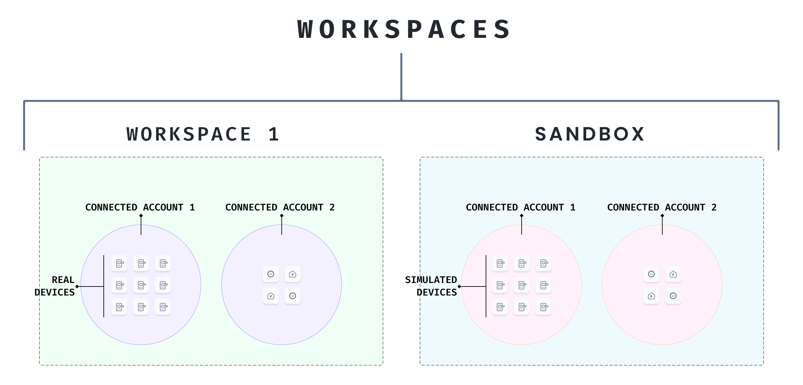

# Workspaces

The top-level resource in Seam is a workspace. All other resources (Devices, Connected Accounts, settings...etc) are organized under workspaces.

When you sign up for Seam, we create two workspaces for you:

* **Sandbox:** This is a special type of workspace. It contains simulated devices, handy for testing your code without needing real devices.
* **Production:** This is for when you're ready to control real devices!

Of course, you are not limited to these two. You can create as many workspaces as you need.

### API Keys

To make a request to a device in a workspace, you must first get an API key for that workspace. A workspace can have one or more API keys. However, a key cannot be used across multiple workspaces.

To create or edit a workspace API keys, go to the Seam dashboard. Select the right workspace. Go to the API key tab. Create/edit keys as you need.

.png>)

### Sandbox Workspaces

Sandbox workspaces are for you to test your code. We seed each Sandbox with simulated devices and user accounts that own them.

These simulated devices behave like their real counterparts. This lets you test your application against multiple device brands, **without needing to actually own each device!**

 (1) (1) (2).jpg>)

### Resetting Sandboxes

You can always reset a sandbox workspace to return it to its starting state. This is handy if you need to run continuous integration! We are also working on letting you edit the initial seed state.

### Sharing Workspaces

Aside from sharing your API key, you can also share access to a workspace with your team. This allows multiple people to manage a workspace and its resources from the Seam Dashboard.
