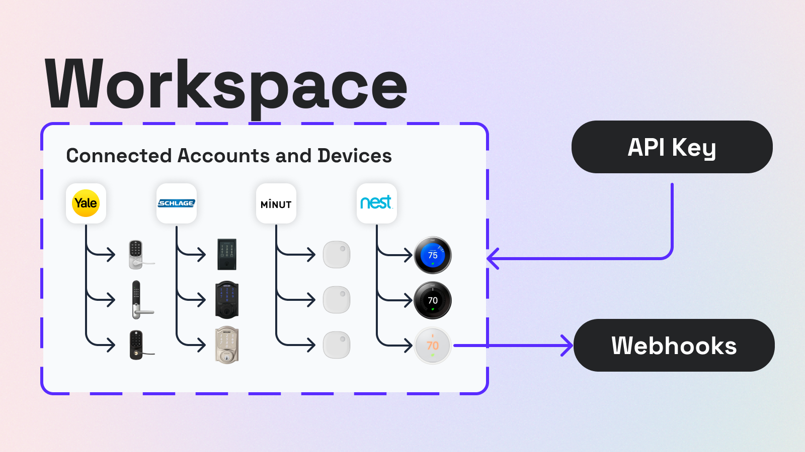
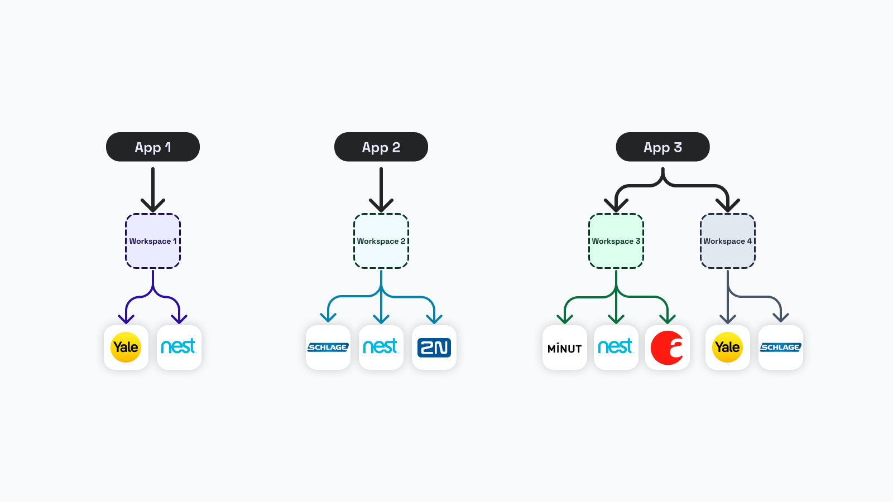

# Workspaces

## What is a Workspace?

A workspace is conceptually like a project or environment. It encapsulate all other Seam resources, such as devices and connected third-party accounts. You access resources within a workspace using an [API key](../authentication/api-keys.md), a [Personal Access Token](../authentication/personal-access-tokens.md) (PAT), or [client session tokens](../authentication/client-session-tokens/), and you can receive events from a workspace using [webhooks](../webhooks.md).

There is no limit to the number of workspaces that you can create, but most Seam customers only have the following two workspaces:&#x20;

* One [sandbox workspace](./#sandbox-workspaces) in which they connect virtual devices to test their apps
* One [production workspace](./#production-workspaces) in which they connect real devices

<figure><figcaption></figcaption></figure>

***

## Production Workspaces

Production workspaces enable you to connect and control real devices from brands, such as August, Schlage, Brivo, Nest, and more.&#x20;

### Create a Production Workspace

1. In the upper-right corner of the [Seam Console](https://console.seam.co/), click the down arrow to display the workspace list.
2. Click **+ Add Workspace**.
3. In the **Add a Workspace** dialog, type a name for your new workspace and your company name.
4. Disable **Sandbox mode**.
5. Click **Create Workspace**.



### Connecting Devices

You can use either of the following two ways to connect devices to a production workspace:

* Use the [Seam Console](./#connect-devices-using-the-seam-console).
* Use [Connect Webviews](./#connect-devices-using-connect-webviews).

#### Connect Devices Using the Seam Console

1. In the left navigation pane of the [Seam Console](https://console.seam.co/), click **Devices**.
2. In the upper-right corner of the **Devices** page, click **+ Add Device**.\
   The Seam Console displays a [Connect Webview](../connect-webviews/) (that is, an authorization flow) that enables you to connect a device account to Seam.
3. In the Connect Webview, click **Continue**.
4. In the manufacturer list, select the manufacturer of the devices that you want to connect.
5. Follow the login instructions to authorize these devices.

Once authorized, the devices associated with this test account appear in the **Devices** table in your production workspace.



#### Connect Devices Using Connect Webviews

If you are creating an application (app) to control your users' devices, use [Connect Webviews](../connect-webviews/). Connect Webviews are fully-embedded client-side components that you add to your app. Your users interact with your embedded Connect Webviews to link their device accounts to Seam through your app. Seam handles all the authentication steps. Once your user has completed the authorization through your app, your users' devices are linked with your production workspace, and you can access and control their devices using the Seam API.

<figure><figcaption></figcaption></figure>

### Common Workspace Setup

Most Seam customers use a single production workspace to connect all their devices, regardless of whether these devices are ones that they own or they are controlling thousands of end customers' devices. For example, a property management app with thousands of customers could still use a single production workspace to connect all customers' devices.&#x20;

<figure><figcaption></figcaption></figure>

### Per-Customer Workspace Setup (Less Common)

Some Seam customers may be developing multiple apps, each of which needs to interact with devices. In this type of scenario, it may be useful to set up a different production workspace for each application.&#x20;

For example, an information technology (IT) firm that builds custom apps for its customers will most likely want to create a separate workspace for each customer. This model can simplify security, support, and billing.

Occasionally, an app may also be using multiple Seam workspaces. For example, a restaurant chain providing a management dashboard for its franchisees may want to use a different Seam workspace for each franchisee to simplify billing and support. See App 3 in the following diagram:&#x20;

<figure><figcaption></figcaption></figure>


Note that when you use multiple workspaces, you either need to create an [API key](../authentication/api-keys.md) for each workspace or create a single [Personal Access Token](../authentication/personal-access-tokens.md) (PAT) for use with all workspaces and then specify the ID of the workspace that you want to access.


***

## Sandbox Workspaces

Sandbox workspaces are a special type of workspace designed for testing code. Sandbox workspaces offer test device accounts and virtual devices that you can connect and control. This ability to work with virtual devices is quite handy because it removes the need to own physical devices from multiple brands.

Importantly, virtual devices behave identically to the corresponding real devices. That is, if your app works with a virtual device in a sandbox workspace, it will also work with a real device in a production workspace.


You can only connect virtual devices in a sandbox workspace. To connect a real device, switch to a production workspace.


### Create a Sandbox Workspace

1. In the upper-right corner of the [Seam Console](https://console.seam.co/), click the down arrow to display the workspace list.
2. Click **+ Add Workspace**.
3. In the **Add a Workspace** dialog, type a name for your new workspace and your company name.
4. Enable **Sandbox mode**.
5. Click **Create Workspace**.

### Connecting Virtual Devices

To connect virtual devices, specify the login credentials for test device accounts in the [Seam Console](./#connect-devices-using-the-seam-console) or in [Connect Webviews](./#connect-devices-using-connect-webviews) within you apps. All manufacturers and devices that Seam supports have one or more sandbox test accounts with pre-seeded devices. For login credentials for all test device accounts, see [Sandbox & Sample Data](../../device-guides/sandbox-and-sample-data/).

### Interacting with a Virtual Device

You can trigger test events for some virtual devices. This capability is useful for testing code that depends on receiving event notifications from the Seam API. For example, virtual noise sensor devices, such as Minut, provide the ability to trigger a "noise event" that emits an event to your webhook endpoint. Once you have triggered an event, you can view this even on the **Events** tab for the virtual device.

1. In the left navigation pane of the [Seam Console](https://console.seam.co/), click **Devices**.
2. In the **Devices** table, click the device with which you want to interact.
3. Click the **Actions** tab.\
   The **Actions** tab lists the actions that you can perform on this virtual device.
4. Click the desired action, as applicable for that action.\
   For example:
   * For a virtual door lock, click the **Locked** toggle to lock or unlock the lock.
   * For a virtual thermostat, click **Edit** and then modify a climate setting.
   * For a virtual noise sensor, click **Trigger** to trigger a noise threshold alert.
5. Click the **Events** tab for the device.\
   The **Events** tab displays the event.



### Resetting Sandbox Workspaces

Sandbox workspace are unique in that you can reset them to the original starting state. For example, if you need to run complex continuous integration (CI) testing for an app, you can reset the sandbox workspace after each individual test run.

You can reset a sandbox workspace either manually through the [Seam Console](./#reset-a-sandbox-workspace-using-the-seam-console) or programmatically using the [Seam API](./#reset-a-sandbox-workspace-using-the-seam-api). For detailed information about resetting a sandbox workspace through the Seam API, see the [Reset Workspace](../../api-clients/workspaces/reset-workspace.md) API reference.

#### Reset a Sandbox Workspace Using the Seam Console

1. In the upper-right corner of the [Seam Console](https://console.seam.co/), click the down arrow to display the workspace list.
2. Select the name of the sandbox workspace that you want to reset.\
   The Seam Console switches to the selected sandbox workspace.
3. In the upper-right corner of the [Seam Console](https://console.seam.co/), click the down arrow again.
4. In the workspace list, below the name of the selected sandbox workspace, click **Reset**.

#### Reset a Sandbox Workspace Using the Seam API



```javascript
// Reset the sandbox workspace associated with your API key.
await seam.workspaces.resetSandbox()
```



```python
# Reset the sandbox workspace associated with your API key.
seam.workspaces.reset_sandbox()
```



```ruby
# Reset the sandbox workspace associated with your API key.
seam.workspaces.reset_sandbox
```



```php
// Reset the sandbox workspace associated with your API key.
$seam->workspaces->reset_sandbox();
```



***

## Sharing Workspaces

You can add teammates to your workspace.

1. In the upper-right corner of the [Seam Console](https://console.seam.co/), click the down arrow to display the workspace list.
2. Click the workspace that you want to share.
3. In the left navigation pane, click **Team**.
4. In the upper-right corner of the **Team** page, click **+ Add member**.
5. In the **Add Organization Member** dialog, type the email address of the teammate that you want to add to this workspace.
6. Click **Add to Team**.

The Seam Console sends an email invitation to the specified teammate.


