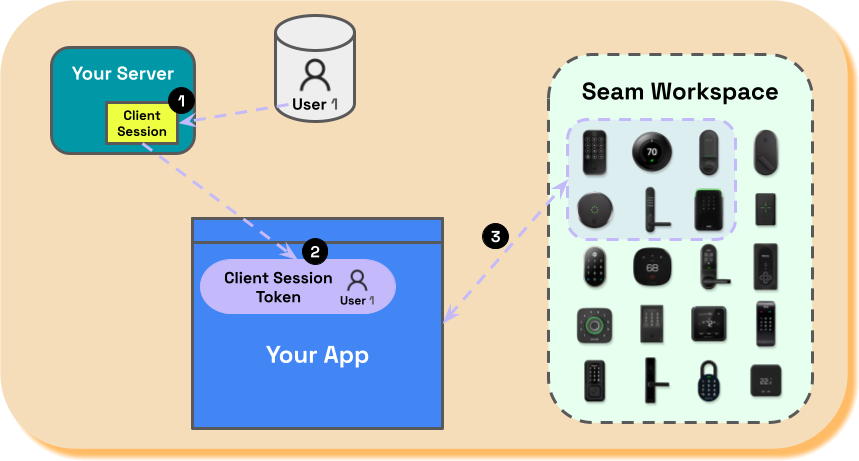

# Client Session Tokens

While an [API key](api-keys.md) grants access to all devices within a [workspace](./), you may want to restrict your users' access to only the devices that they own. To do this, use a client session token instead of an API key in an authentication header for the Seam HTTP API or within the `seam` constructor if you are using a Seam SDK, such as the Seam JavaScript SDK.

<figure><figcaption></figcaption></figure>

Client session tokens enable you to perform authentication and authorization for your users on the client side, thereby eliminating the need for your user's browser to communicate with your back-end server after the initial creation and transfer of the client session token. Rather, your user's browser communicates directly with the Seam back-end server.

<figure><figcaption></figcaption></figure>

To generate a client session token, first use the Seam API to create a client session that includes [your own internal user ID for the user](../../seam-components/overview/get-started-with-client-side-components.md#3-select-a-user-identifier-key), as well as the [connected accounts](../../api-clients/connected-accounts/) associated with this user. The created client session contains a token. You can then pass this client session token to the user's browser for use in any client-side [Seam components](broken-reference) and [Connect Webviews](../connect-webviews/). For example, if you use the Seam JavaScript SDK to create a Connect Webview, you include the client session token (instead of an API key) in the `seam` constructor. In this way, you restrict these Seam components to only have access to the devices that the user owns.

***

## Create a Client Session for an Existing User and Retrieve the Session Token

To [create a client session](../../api-clients/client-sessions/create-a-client-session.md) for an existing user with connected accounts in your workspace, include the IDs of the user's connected accounts (`connected_account_ids`) and provide your own unique internal user ID (`user_identifier_key`) to create the client session. You can then use the generated client session token to retrieve resources that are exclusive to this client session.



**Request:**

```javascript
const user_identifier_key = "internal user ID 1"
const connected_account_ids = ["3ea0b67f-649f-4131-bfe3-f2035e77a3f9", "6e1cad57-b244-40ca-b4f3-30a46c8000d4"]

const client_session = await seam.clientSessions.create({
  user_identifier_key: user_identifier_key,
  connected_account_ids: connected_account_ids
})

const client_session_token = client_session.token
console.log("Client session token: " + client_session_token)
```

**Response:**

```
Client session token: seam_cst1891oqCmE_6dBwV8PJ2Ffoe9dWYVyMfVHq
```



***

## Create a Client Session for a New User and Connect Their Accounts Using a Connect Webview

To create a client session for a new user, provide your internal user ID (`user_identifier_key`) to create the client session. Use the generated client session token to [create a Connect Webview](../../api-clients/connect-webviews/create-a-connect-webview.md). Any account linked using this Connect Webview are automatically associated with the user's client session.



**Request:**

```javascript
// Use the API key for your workspace in the 
// initial seam constructor.
const seam = new Seam({
    apiKey: apiKey
})

// Create a client session using your own ID for the user 
// as the user_identifier_key.
const user_identifier_key = "internal user ID 3"

// Create the client session.
const client_session = await seam.clientSessions.create({
  user_identifier_key: user_identifier_key
})

// Get the associated client session token.
const client_session_token = client_session.token

// Use the client session token in a new seam constructor.
const seam_using_client_session_token = new Seam({
  clientSessionToken: client_session_token
})

// Create a Connect Webview restricted by the 
// client session token.
const connect_webview_creation_action_attempt = await seam.connectWebviews.create({
  provider_category: "stable"
})

console.log(connect_webview_creation_action_attempt)
```

**Response:**

```json
{
  url: 'https://connect.getseam.com/connect_webviews/view?connect_webview_id=d3d9b7ff-446a-4f66-8f91-e470097179d4&auth_token=PHapfjhWtLDkJG5WsS9WN8tArPsYCy9vm',
  status: 'pending',
  workspace_id: '398d80b7-3f96-47c2-b85a-6f8ba21d07be',
  custom_metadata: {},
  accepted_devices: [],
  login_successful: false,
  selected_provider: null,
  accepted_providers: [
    'august',            'avigilon_alta',
    'brivo',             'schlage',
    'smartthings',       'yale',
    'nuki',              'salto',
    'controlbyweb',      'minut',
    'my_2n',             'kwikset',
    'ttlock',            'noiseaware',
    'igloohome',         'ecobee',
    'hubitat',           'four_suites',
    'dormakaba_oracode', 'lockly',
    'wyze',              'nest'
  ],
  any_device_allowed: false,
  connect_webview_id: 'd3d9b7ff-446a-4f66-8f91-e470097179d4',
  custom_redirect_url: null,
  any_provider_allowed: false,
  device_selection_mode: 'none',
  wait_for_device_creation: false,
  custom_redirect_failure_url: null,
  automatically_manage_new_devices: true,
  created_at: '2023-12-26T05:04:14.952Z',
  authorized_at: null
}
```



***

## List Client Sessions

You can [list all client sessions](../../api-clients/client-sessions/list-client-sessions.md) within your workspace.



**Request:**

```javascript
console.log(await seam.clientSessions.list())
```

**Response:**

```json
[
  {
    workspace_id: '398d80b7-3f96-47c2-b85a-6f8ba21d07be',
    token: 'seam_cst1271Q3JUh_A3ECdSrrqgYp98SmB9qY2NGp',
    user_identifier_key: 'internal user ID 1',
    created_at: '2023-12-26T04:23:46.829Z',
    client_session_id: 'c75d4330-ae01-4dfd-b6c5-f3e94e0d8168',
    user_identity_ids: [],
    third_party_account_ids: [
      '3ea0b67f-649f-4131-bfe3-f2035e77a3f9',
      '6e1cad57-b244-40ca-b4f3-30a46c8000d4'
    ],
    connect_webview_ids: [],
    device_count: 4,
    connected_account_ids: [
      '3ea0b67f-649f-4131-bfe3-f2035e77a3f9',
      '6e1cad57-b244-40ca-b4f3-30a46c8000d4'
    ]
  },
  {
    workspace_id: '398d80b7-3f96-47c2-b85a-6f8ba21d07be',
    token: 'seam_cst1891oqCmE_6dBwV8PJ2Ffoe9dWYVyMfVHq',
    user_identifier_key: 'internal user ID 2',
    created_at: '2023-12-26T04:25:50.041Z',
    client_session_id: 'e1006128-19a8-4e4d-9a91-536d80cf9c21',
    user_identity_ids: [],
    third_party_account_ids: [
      '2e884e71-b2c1-41a0-bb2c-ec94a7b4c6a4',
      'b0ccf472-cb63-400c-bf21-5b809f5e1afd'
    ],
    connect_webview_ids: [],
    device_count: 4,
    connected_account_ids: [
      '2e884e71-b2c1-41a0-bb2c-ec94a7b4c6a4',
      'b0ccf472-cb63-400c-bf21-5b809f5e1afd'
    ]
  },
  ...
]
```



***

## Get a Client Session

To [get a specific client session](../../api-clients/client-sessions/get-a-client-session.md), provide the client session ID (`client_session_id`).



**Request:**

```javascript
const client_session_id = "c75d4330-ae01-4dfd-b6c5-f3e94e0d8168"
console.log(await seam.clientSessions.get(client_session_id))
```

**Response:**

```json
{
  workspace_id: '398d80b7-3f96-47c2-b85a-6f8ba21d07be',
  token: 'seam_cst1271Q3JUh_A3ECdSrrqgYp98SmB9qY2NGp',
  user_identifier_key: 'internal user ID 1',
  created_at: '2023-12-26T04:23:46.829Z',
  client_session_id: 'c75d4330-ae01-4dfd-b6c5-f3e94e0d8168',
  device_count: 4,
  connected_account_ids: [
    '3ea0b67f-649f-4131-bfe3-f2035e77a3f9',
    '6e1cad57-b244-40ca-b4f3-30a46c8000d4'
  ],
  connect_webview_ids: [],
  user_identity_ids: []
}
```



***

## Delete a Client Session

To [delete a client session](../../api-clients/client-sessions/delete-a-client-session.md), provide the client session ID (`client_session_id`).



**Request:**

```javascript
const client_session_id = "639eb8af-19a9-4ae5-817c-6ad08fd078e7"
console.log(await seam.clientSessions.delete({
  client_session_id: client_session_id
}))
```

**Response:**

```json
{ ok: true }
```



***

## Next Steps

To learn about using client session tokens with Seam components, specifically with React, see [Get Started with React](../../seam-components/overview/get-started-with-react-components-and-client-session-tokens.md). To learn more about Connect Webviews, see [Connect Webviews](../connect-webviews/).
