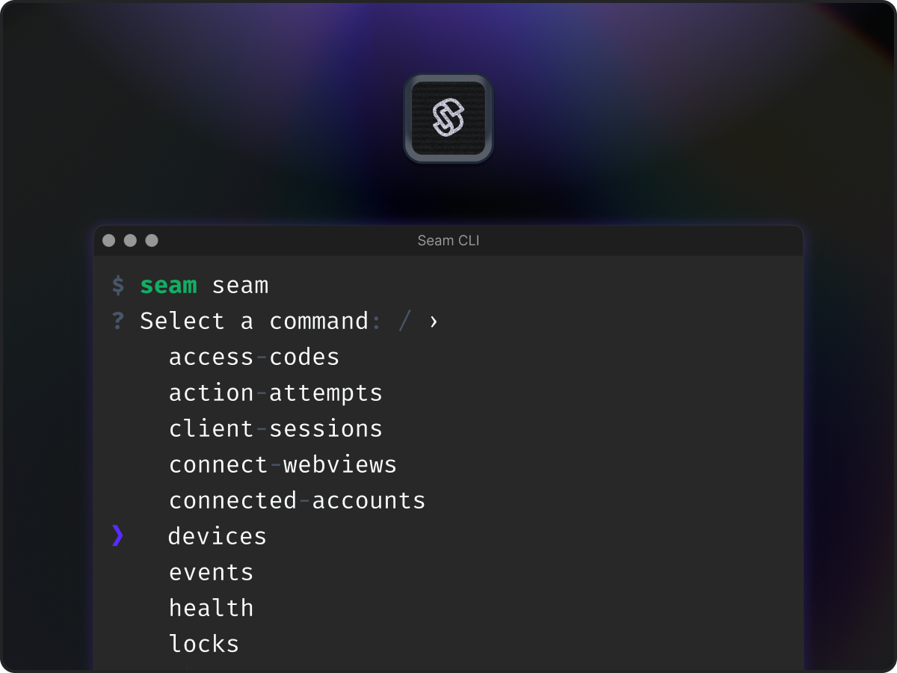
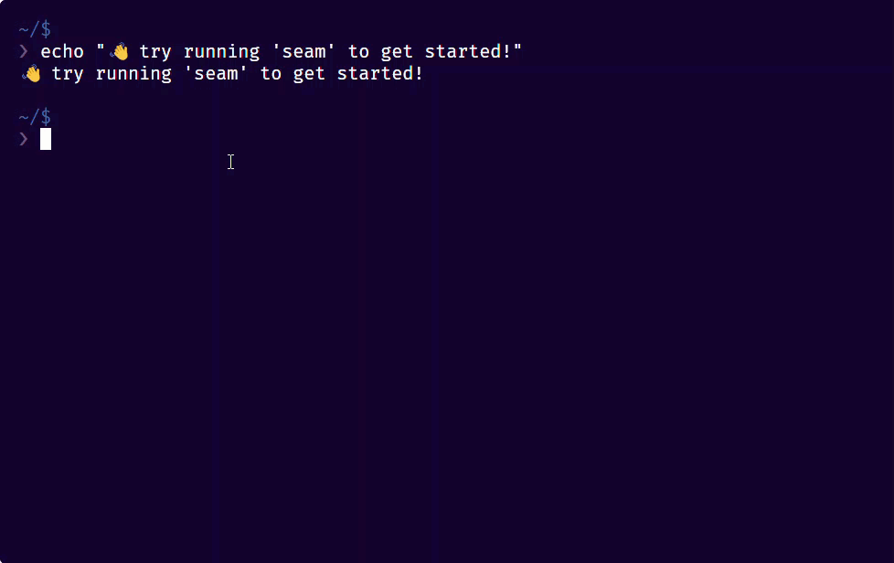

# Seam CLI

<figure><figcaption><p>The Seam CLI is a great way to to explore and test the Seam API.</p></figcaption></figure>

The Seam Command Line Interface (CLI) is a fully interactive CLI version of the Seam API. You can [install the Seam CLI locally](seam-cli.md#install-the-seam-cli) or use the [Seam Online CLI](../core-concepts/seam-console/seam-online-cli.md) within the [Seam Console](../core-concepts/seam-console/). Quick, intuitive, and easy to use, the Seam CLI enables you to perform a variety of useful tasks, including the following:

* Explore and test all the available methods in the Seam API interactively.
* View resources or test API functions easily and quickly.
* Inspect the results of your API commands.
* Access Seam API functionality that is not currently available in the Seam Console.

<figure><figcaption><p>Use the interactive Seam CLI to explore and test the Seam API.</p></figcaption></figure>

## Installing the Seam CLI

Install the Seam CLI using [`npm`](https://www.npmjs.com/package/seam-cli) or [Homebrew](https://formulae.brew.sh/formula/seam).

### Install Using `npm`

Enter the following command:

```bash
npm install -g seam-cli
```

### Install Using Homebrew

Enter the following commands:

```bash
brew tap seamapi/homebrew-seam
brew install seam
```

## Using the Seam CLI

Interact with the Seam CLI using any combination of interactive and typed commands. You "construct" the full command, including any desired parameters, and then run the command.

For details, see [Use the Seam CLI](../core-concepts/seam-console/seam-online-cli.md#use-the-seam-cli) and [Seam CLI Command Stubs](../core-concepts/seam-console/seam-online-cli.md#seam-cli-command-stubs).
