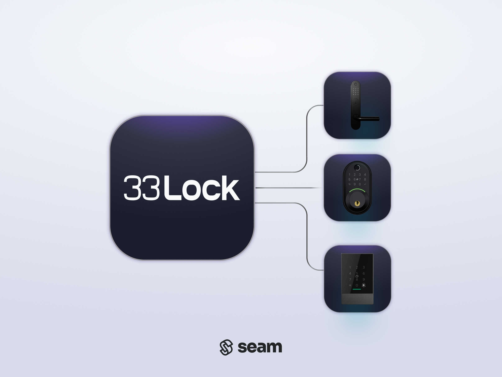

# 33 Lock Devices

<figure><picture><source srcset="../../.gitbook/assets/33lock-manufacturer-page-cover-dark.png" media="(prefers-color-scheme: dark)"></picture><figcaption>
Connect and control any 33 Locks device using the Seam API.
</figcaption></figure>

## Overview

[33 Lock](https://www.33lock.com/) is a Vancouver-based smart lock company that is focused on delivering innovative access solutions for hotels, motels, resorts, hostels, and multifamily properties. These offerings include the IntelliBolt, IntelliLever, IntelliMortise, and IntelliReader. All of these devices have an integrated keypad.

***

## Supported Devices

This integration works with all 33 Lock locks. Note that 33 Lock devices require you to register for a free [TTLock account](https://33lock.notion.site/Account-Registration-13050a6ca1ac81788991ecb923a2cb04#13050a6ca1ac8008b3ece7ed6bbbd094) and to connect the locks to a [compatible TTLock Gateway](https://33lock.notion.site/Gateway-Management-13050a6ca1ac811f9962fe949fefcc7a#13650a6ca1ac80d599e7edf5ffc171cf).

For detailed information about the 33 Lock devices that Seam supports, see our [33 Lock Supported Devices page](https://www.seam.co/manufacturers/33-lock).

We support the following features:

* [Triggering web lock and unlock actions](../../products/smart-locks/lock-and-unlock.md)
* [Programming access codes](../../products/smart-locks/access-codes/)

***

### Device Provider Key

To create a [Connect Webview](../../core-concepts/connect-webviews/) that enables your users to connect their 33 Lock devices to Seam, include the `ttlock` [device provider key](../../api-clients/connect_webviews/#device-provider-keys) in the `accepted_providers` list. For more information, see [Customize the Brands to Display in Your Connect Webview](../../core-concepts/connect-webviews/customizing-connect-webviews.md#customize-the-brands-to-display-in-your-connect-webviews).

***

## Setup Instructions

To control 33 Lock devices using Seam, you must prompt owners of these devices to perform the following steps:

1. Download the TTLock app for [iOS](https://apps.apple.com/us/app/ttlock/id1033046018) or [Android](https://play.google.com/store/apps/details?id=com.tongtongsuo.app\&hl=en_CA).
2.  Create an account on the TTLock app.

    For details, see the [33 Lock Account Registration guide](https://33lock.notion.site/Account-Registration-13050a6ca1ac81788991ecb923a2cb04#13050a6ca1ac8008b3ece7ed6bbbd094).
3. Install your 33 Lock device.
4. Add your 33 Lock device to the TTLock app.\
   For details, see the [33 Lock Lock Management guide](https://33lock.notion.site/Lock-Management-13050a6ca1ac81449b3cf68f8b463267#13650a6ca1ac80ecaf8de356da907a9d).
5. Add the TTLock Gateway to the TTLock app.\
   For details, see the [33 Lock Gateway Management guide](https://33lock.notion.site/Gateway-Management-13050a6ca1ac811f9962fe949fefcc7a).\
   Note that 33 Lock devices automatically pair with the gateway. Confirm the gateway-to-lock connection strength. For details, see the [33 Lock Gateway Settings guide](https://33lock.notion.site/Gateway-Settings-13550a6ca1ac80f59574f9df40463431#13750a6ca1ac80758293cf85026ef835).
6. In the TTLock app, go to the lock settings and enable the Remote Unlock feature.\
   Note that if Seam detects that this feature is disabled, a warning is added to the device.
7. If an installer has installed the 33 Lock device and needs to transfer ownership to another user, see the following 33 Lock guides:
   * [Administrators](https://33lock.notion.site/Administrators-13050a6ca1ac81de9c9cdaab35f98002)
   * [Transferring Locks](https://33lock.notion.site/Lock-Management-13050a6ca1ac81449b3cf68f8b463267#13650a6ca1ac80c8b96ef07012bc0457)
   * [Transferring Gateways](https://33lock.notion.site/Gateway-Management-13050a6ca1ac811f9962fe949fefcc7a#13050a6ca1ac806885c7f44966275cd0)

***

## Troubleshooting

For errors and warnings that are relevant to 33 Lock devices, see [Troubleshooting](../../device-guides/ttlock-locks.md#troubleshooting) in the TTLock device integration guide.

***

## Where to Order

To purchase 33 Lock devices, contact the 33 Lock sales team..

<table data-view="cards"><thead><tr><th></th><th></th><th></th><th data-hidden data-card-target data-type="content-ref"></th><th data-hidden data-card-cover data-type="files"></th></tr></thead><tbody><tr><td></td><td><strong>33 Lock Contact Page</strong></td><td></td><td><a href="https://www.33lock.com/contact">https://www.33lock.com/contact</a></td><td><a href="../../.gitbook/assets/33-lock-logo.png">33-lock-logo.png</a></td></tr></tbody></table>
