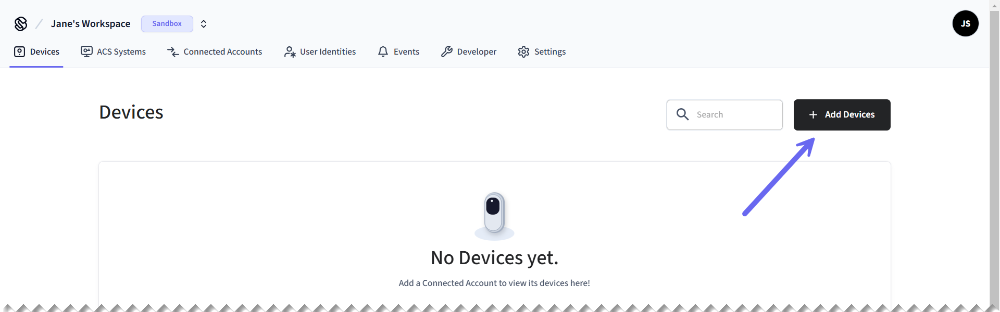

# Get started with 4SUITES locks

<figure><picture><source srcset="../../.gitbook/assets/4suites_get-started-cover_dark.png" media="(prefers-color-scheme: dark)"></picture><figcaption><p>4SUITES smart locks</p></figcaption></figure>

## Overview

Seam provides a universal API to connect and control many brands of IoT devices and systems, including smart locks, access control systems (ACSs), thermostats, and noise sensors.

This guide gives you a rapid introduction to connecting and controlling your [4SUITES lock](./) using the Seam API. For application developers, you can use the Seam API in your app, and your users can authorize your app to control their devices using Seam.

Seam supports the following 4SUITES locks:



To learn more about other IoT device and system brands that Seam supports—such as Yale, Schlage, Google Nest, and many more—visit our [integration page](https://www.seam.co/supported-devices-and-systems).


This guide shows you how to install a Seam SDK and then control your 4SUITES lock using the Seam API.

Another easy way to learn about what you can do with the Seam API is to explore the [interactive Seam CLI](../../core-concepts/seam-console/seam-online-cli.md), which you can access from directly within the [Seam Console](../../core-concepts/seam-console/).

:arrow\_forward: [Go to the Seam Console!](https://console.seam.co/)


***

## Step 1: Install a Seam SDK

Seam provides client libraries for many languages, including JavaScript, Python, Ruby, PHP, and others, as well as a Postman collection and an [OpenAPI](https://connect.getseam.com/openapi.json) spec.

* JavaScript / TypeScript ([npm](https://www.npmjs.com/package/seam), [GitHub](https://github.com/seamapi/javascript))
* Python ([pip](https://pypi.org/project/seam/), [GitHub](https://github.com/seamapi/python))
* Ruby Gem ([rubygem](https://rubygems.org/gems/seamapi), [GitHub](https://github.com/seamapi/ruby))
* PHP ([packagist](https://packagist.org/packages/seamapi/seam), [GitHub](https://github.com/seamapi/php))
* Java ([GitHub](https://github.com/seamapi/java))
* C# ([nuget](https://www.nuget.org/packages/Seam), [GitHub](https://github.com/seamapi/csharp))
* Go ([GitHub](https://github.com/seamapi/go))

First, install a Seam SDK, as follows:



```bash
npm i seam
```



```bash
pip install seam
# For some development environments, use pip3 in this command instead of pip.
```



```bash
bundle add seamapi
```



```bash
composer require seamapi/seam
```



**Gradle:**

```gradle
// build.gradle
dependencies {
    implementation 'io.github.seamapi:java:0.x.x'
}
```

**Maven:**

```xml
<!-- pom.xml -->
<dependency>
    <groupId>io.github.seamapi</groupId>
    <artifactId>java</artifactId>
    <version>0.x.x</version>
</dependency>
```



Install using [nuget](https://www.nuget.org/packages/Seam).



```bash
go get github.com/seamapi/go
```



Next, go to [https://console.seam.co/](https://console.seam.co/) and [sign up for Seam](../../core-concepts/seam-console/#create-a-seam-account) to get your [API key](../../core-concepts/authentication/api-keys.md).



Then, export your API key as an environment variable.

```bash
$ export SEAM_API_KEY=my_seam_api_key
```

Where `my_seam_api_key` is your API key.


This guide uses a [sandbox workspace](../../core-concepts/workspaces/#sandbox-workspaces). You can only connect virtual devices and systems in this type of workspace. If you want to connect a real 4SUITES lock, use a [non-sandbox workspace](../../core-concepts/workspaces/#production-workspaces) and API key.


***

## Step 2: Link your 4SUITES account with Seam

To control your 4SUITES lock using the Seam API, you must first authorize your Seam workspace to connect to your 4SUITES account. If your application needs to connect to your users' 4SUITES accounts, Seam provides fully-embedded, [customizable](../../core-concepts/connect-webviews/customizing-connect-webviews.md) client-side [Connect Webviews](../../core-concepts/connect-webviews/) to collect their authorization securely. These user-friendly pre-built authorization flows walk your users through the process of granting your Seam workspace permission to control their 4SUITES locks. The Connect Webview presents a flow that prompts your users to enter their credentials for their 4SUITES account.

In this guide, you create a Connect Webview object. Then, you display the graphical component of the created Connect Webview and enter a set of sample credentials to connect a sandbox 4SUITES account.


This guide shows you how to create a Connect Webview programmatically using the Seam API.

The [Seam Console](../../core-concepts/seam-console/) provides another easy way to connect devices to your Seam workspace.

Go to [https://console.seam.co/](https://console.seam.co/). On the **Devices** page, click **+ Add Devices**. Then, see [Authorize your workspace](get-started-with-4suites-locks.md#authorize-your-workspace) in this guide to complete the Connect Webview authorization flow.




### Create a Connect Webview

Create a `connect_webview` object and then note the returned URL.



**Code:**

```python
from seam import Seam

seam = Seam()  # Seam automatically uses your exported SEAM_API_KEY.

connect_webview = seam.connect_webviews.create(accepted_providers=["four_suites"])

assert connect_webview.login_successful is False

# Use the returned Connect Webview URL to display
# the Connect Webview authorization flow to your user.
print(connect_webview.url)
```

**Output:**

```
https://connect.getseam.com/connect_webviews/view?connect_webview_id=12345678-1234-1234-1234-123456789012&auth_token=XXXXXXXXXXXXXXXXXXXXXXXXXXXXXXXXX
```



**Code:**

```bash
curl -X 'POST' \
  'https://connect.getseam.com/connect_webviews/create' \
  -H 'accept: application/json' \
  -H "Authorization: Bearer ${SEAM_API_KEY}" \
  -H 'Content-Type: application/json' \
  -d '{
  "accepted_providers": ["four_suites"]
}' | jq -r '"Login Successful (false): " + (.connect_webview.login_successful | tostring), 
  "URL: " + .connect_webview.url'
  # Use the returned Connect Webview URL to display
  # the Connect Webview authorization flow to your user.
```

**Output:**

```
Login Successful (false): false
https://connect.getseam.com/connect_webviews/view?connect_webview_id=12345678-1234-1234-1234-123456789012&auth_token=XXXXXXXXXXXXXXXXXXXXXXXXXXXXXXXXX
```



**Code:**

```javascript
import { Seam } from "seam";

const seam = new Seam(); // Seam automatically uses your exported SEAM_API_KEY.

const connectWebview = await seam.connectWebviews.create({
  accepted_providers: ['four_suites']
});

console.log(connectWebview.login_successful); // false

// Use the returned Connect Webview URL to display
// the Connect Webview authorization flow to your user.
console.log(connectWebview.url);
```

**Output:**

```
false
https://connect.getseam.com/connect_webviews/view?connect_webview_id=12345678-1234-1234-1234-123456789012&auth_token=XXXXXXXXXXXXXXXXXXXXXXXXXXXXXXXXX
```



**Code:**

```ruby
require "seamapi"

seam = Seam::Client.new() # Seam automatically uses your exported SEAM_API_KEY.

connect_webview = seam.connect_webviews.create(
  accepted_providers: ["four_suites"]
)

puts connect_webview.login_successful # false

# Use the returned Connect Webview URL to display
# the Connect Webview authorization flow to your user.
puts connect_webview.url
```

**Output:**

```
false
https://connect.getseam.com/connect_webviews/view?connect_webview_id=12345678-1234-1234-1234-123456789012&auth_token=XXXXXXXXXXXXXXXXXXXXXXXXXXXXXXXXX
```



**Code:**

```php
<?php
require 'vendor/autoload.php';

$seam = new Seam\SeamClient(); // Seam automatically uses your exported SEAM_API_KEY.

$connect_webview = $seam->connect_webviews->create(
  accepted_providers: ["four_suites"]
);

echo $connect_webview->login_successful ? 'true' : 'false', "\n"; // false

// Use the returned Connect Webview URL to display
// the Connect Webview authorization flow to your user.
echo $connect_webview->url;
```

**Output:**

```
false
https://connect.getseam.com/connect_webviews/view?connect_webview_id=12345678-1234-1234-1234-123456789012&auth_token=XXXXXXXXXXXXXXXXXXXXXXXXXXXXXXXXX
```



**Code:**

```csharp
using Seam.Client;

var seam = new SeamClient(apiToken: SEAM_API_KEY);

var connectWebview = seam.ConnectWebviews.Create(
  acceptedProviders: new() {Seam.Api.ConnectWebviews.CreateRequest.AcceptedProvidersEnum.FourSuites}
);

Console.WriteLine(connectWebview.LoginSuccessful); // False

// Use the returned Connect Webview URL to display
// the Connect Webview authorization flow to your user.
Console.WriteLine(connectWebview.Url);
```

**Output:**

```
False
https://connect.getseam.com/connect_webviews/view?connect_webview_id=12345678-1234-1234-1234-123456789012&auth_token=XXXXXXXXXXXXXXXXXXXXXXXXXXXXXXXXX
```



**Code:**

```java
import java.io.Console;
import java.util.*;
import com.fasterxml.jackson.annotation.*;
import com.fasterxml.jackson.databind.annotation.JsonDeserialize;
import com.seam.api.Seam;
import com.seam.api.core.ObjectMappers;
import com.seam.api.types.ConnectWebview;
import com.seam.api.types.Device;
import com.seam.api.types.Manufacturer;
import com.seam.api.types.ActionAttempt;
import com.seam.api.types.AccessCode;
import com.seam.api.resources.connectwebviews.requests.ConnectWebviewsCreateRequest;
import com.seam.api.resources.connectwebviews.requests.ConnectWebviewsGetRequest;
import com.seam.api.resources.devices.requests.DevicesListRequest;
import com.seam.api.resources.devices.requests.DevicesGetRequest;
import com.seam.api.resources.locks.requests.LocksUnlockDoorRequest;
import com.seam.api.resources.accesscodes.requests.AccessCodesCreateRequest;
import com.seam.api.resources.accesscodes.requests.AccessCodesListRequest;

public class Main {

  public static void main(String[] args) {

    Seam seam = Seam.builder()
      .apiKey(SEAM_API_KEY)
      .build();

    ConnectWebview connectWebview = seam.connectWebviews().create(ConnectWebviewsCreateRequest.builder()
      .acceptedProviders(List.of(AcceptedProvider.FOUR_SUITES))
      .build());

    System.out.println(connectWebview.getLoginSuccessful()); // false
    
    // Use the returned Connect Webview URL to display
    // the Connect Webview authorization flow to your user.
    System.out.println(connectWebview.getUrl());

  }
}
```

**Output:**

```
false
https://connect.getseam.com/connect_webviews/view?connect_webview_id=12345678-1234-1234-1234-123456789012&auth_token=XXXXXXXXXXXXXXXXXXXXXXXXXXXXXXXXX
```



**Code:**

```go
package main

import (
  "context"
  "fmt"
  "os"

  api "github.com/seamapi/go"
  seam "github.com/seamapi/go/client"
)

func main() {
  if err := run(); err != nil {
    _, _ = fmt.Fprintln(os.Stderr, err.Error())
    os.Exit(1)
  }
}

func run() error {
  client := seam.NewClient(
    seam.WithApiKey(SEAM_API_KEY),
  )

  connectWebview, err := client.ConnectWebviews.Create(
    context.Background(),
    &api.ConnectWebviewsCreateRequest{
      AcceptedProviders: []api.AcceptedProvider{
        api.AcceptedProviderFourSuites,
      },
    },
  )
  
  if err != nil {
    return err
  }
  
  fmt.Println(connectWebview.LoginSuccessful) // false
  
  // Use the returned Connect Webview URL to display
  // the Connect Webview authorization flow to your user.
  fmt.Println(connectWebview.Url)

  return nil		
}
```

**Output:**

```
false
https://connect.getseam.com/connect_webviews/view?connect_webview_id=12345678-1234-1234-1234-123456789012&auth_token=XXXXXXXXXXXXXXXXXXXXXXXXXXXXXXXXX
```



***

### Authorize your workspace

In a web browser, go to the URL that the Connect Webview object returned.

For application developers, you can redirect your user to this Connect Webview URL so that they can authorize your app to control their devices using Seam. We even provide a prebuilt [Connect Account Button](../../seam-components/react-components/connect-account-button.md) within our suite of [Seam Components](../../seam-components/overview/) that help you build your device management flow.


Because you're using a sandbox workspace, you can connect Seam's test 4SUITES account. We provide [virtual devices](../../device-guides/sandbox-and-sample-data/) for each of the brands that we support. These sandbox devices and systems enable you to test your app with devices from multiple brands without the need to own all the corresponding physical devices.


Complete the Connect Webview authorization flow by entering the following [4SUITES sandbox account](../../device-guides/sandbox-and-sample-data/4suites-locks-sample-data.md) credentials:

* **Email:** jane@example.com
* **Password:** 1234

<figure><picture><source srcset="../../.gitbook/assets/4suites_connect-flow-screens_dark.png" media="(prefers-color-scheme: dark)"></picture><figcaption><p>Use the Seam Connect Webview authorization flow to connect a 4SUITES account with Seam. This flow varies slightly based on the device manufacturer.</p></figcaption></figure>

Confirm that authorization through the Connect Webview was successful by querying its status.



**Code:**

```python
updated_connect_webview = seam.connect_webviews.get(connect_webview.connect_webview_id)

assert updated_connect_webview.login_successful is True # True
```

**Output:**

```
True
```



**Code:**

```bash
curl -X 'POST' \
  'https://connect.getseam.com/connect_webviews/get' \
  -H 'accept: application/json' \
  -H "Authorization: Bearer ${SEAM_API_KEY}" \
  -H 'Content-Type: application/json' \
  -d "{
  \"connect_webview_id\": \"${connect_webview_id}\"
}" | jq -r '"Login Successful (true): " + (.connect_webview.login_successful | tostring)'
```

**Output:**

```
Login Successful (true): true
```



**Code:**

```javascript
const updatedConnectWebview = await seam.connectWebviews.get({
  connect_webview_id: connectWebview.connect_webview_id
});

console.log(updatedConnectWebview.login_successful); // true
```

**Output:**

```
true
```



**Code:**

```ruby
updated_connect_webview = seam.connect_webviews.get(
  connect_webview_id: connect_webview.connect_webview_id
)

puts updated_connect_webview.login_successful # true
```

**Output:**

```
true
```



**Code:**

```php
$updated_connect_webview = $seam->connect_webviews->get(
  connect_webview_id: $connect_webview->connect_webview_id
);

echo $updated_connect_webview->login_successful ? 'true' : 'false', "\n"; // true
```

**Output:**

```
true
```



**Code:**

```csharp
var updatedConnectWebview = seam.ConnectWebviews.Get(
  connectWebviewId: connectWebview.connectWebviewId
);

Console.WriteLine(updatedConnectWebview.LoginSuccessful); // True
```

**Output:**

```
True
```



**Code:**

```java
ConnectWebview updatedConnectWebview = seam.connectWebviews().get(ConnectWebviewsGetRequest.builder()
  .connectWebviewId(connectWebview.getConnectWebviewId())
  .build());

System.out.println(updatedConnectWebview.getLoginSuccessful()); // true
```

**Output:**

```
true
```



**Code:**

```go
updatedConnectWebview, err := client.ConnectWebviews.Get(
  context.Background(),
  &api.ConnectWebviewsGetRequest{
    ConnectWebviewId: connectWebview.connectWebviewId,
  },
)

if err != nil {
  return err
}

fmt.Println(updatedConnectWebview.LoginSuccessful) // true

return nil
```

**Output:**

```
true
```



***

## Step 3: Retrieve 4SUITES lock devices

When you link a 4SUITES account with Seam, we create a `device` object to represent each 4SUITES lock in your account. You can then retrieve these 4SUITES devices using the [List Devices](../../api-clients/devices/list-devices.md) and [Get Device](../../api-clients/devices/get-device.md) endpoints.

The Seam API exposes each device's properties, such as the door lock status, power status, capabilities, and so on.



**Code:**

```python
# Retrieve all devices, filtered by manufacturer,
# which is one of several filters that list() supports.
all_four_suites_locks = seam.devices.list(manufacturer="four_suites")

# Select the first device as an example.
front_door = all_four_suites_locks[0]

# Inspect specific properties.
assert front_door.properties["online"] is True # True
assert front_door.properties["locked"] is True # True

# View the entire returned device object.
pprint(front_door)
```

**Output:**

```
Device(
  device_id='11111111-1111-1111-1111-444444444444',
  display_name='Lock 1',
  workspace_id='00000000-0000-0000-0000-000000000000'
  connected_account_id='11111111-1111-1111-1111-222222222222',
  created_at='2024-05-29T20:08:48.878Z',
  properties={
    'manufacturer': 'four_suites',
    'online': True,
    'locked': True,
    'has_direct_power': True,
    ...
  }
  can_remotely_unlock=True,
  ...
)
```



**Code:**

```bash
# Retrieve all devices, filtered by manufacturer, which is
# one of several filters that the list endpoint supports.
all_four_suites_locks=$(
  # Use GET or POST.
  curl -X 'GET' \
    'https://connect.getseam.com/devices/list' \
    -H 'accept: application/json' \
    -H "Authorization: Bearer ${SEAM_API_KEY}" \
    -H 'Content-Type: application/json' \
    -d '{
    "manufacturer": "four_suites"
  }')

# Select the first device as an example.
front_door=$(jq -r '.devices[0]' <<< ${all_four_suites_locks})

# Inspect specific properties.
echo $(jq -r '"Online (true): " + (.properties.online | tostring)' <<< ${front_door})
echo $(jq -r '"Locked (true): " + (.properties.locked | tostring)' <<< ${front_door})

# View the entire returned device object.
echo ${front_door}
```

**Output:**

```json
Online (true): true
Locked (true): true
{
  "device_id": "11111111-1111-1111-1111-444444444444",
  "display_name": "Lock 1",
  "workspace_id": "00000000-0000-0000-0000-000000000000",
  "connected_account_id": "11111111-1111-1111-1111-222222222222",
  "created_at": "2024-05-29T20:08:48.878Z",
  "properties": {
    "manufacturer": "four_suites",
    "locked": true,
    "online": true,
    "has_direct_power": true,
    ...
  },
  "can_remotely_unlock": true,
  ...
}
```



**Code:**

```javascript
// Retrieve all devices, filtered by manufacturer,
// which is one of several filters that list() supports.
const allFourSuitesLocks = await seam.devices.list({manufacturer: "four_suites"});

// Select the first device as an example.
const frontDoor = allFourSuitesLocks[0];

// Inspect specific properties.
console.log(frontDoor.properties.online); // true
console.log(frontDoor.properties.locked); // true

// View the entire returned device object.
console.log(frontDoor);
```

**Output:**

```json
true
true
{
  device_id: '11111111-1111-1111-1111-444444444444',
  display_name: 'Lock 1',
  workspace_id: '00000000-0000-0000-0000-000000000000',
  connected_account_id: '11111111-1111-1111-1111-222222222222',
  created_at: '2024-05-29T20:08:48.878Z',
  properties: {
    manufacturer: 'four_suites',
    online: true,
    locked: true,
    has_direct_power: true,
    ...
  },
  can_remotely_unlock: true,
  ...
}   
```



**Code:**

```ruby
# Retrieve all devices, filtered by manufacturer,
# which is one of several filters that list() supports.
all_four_suites_locks = seam.devices.list(manufacturer: "four_suites")

# Select the first device as an example.
front_door = all_four_suites_locks[0]

# Inspect specific properties.
puts front_door.properties['online'] # true
puts front_door.properties['locked'] # true

# View the entire returned device object.
puts front_door.inspect
```

**Output:**

```json
true
true
<
  Seam::Device:0x00438
    device_id="11111111-1111-1111-1111-444444444444"
    display_name="Lock 1"
    workspace_id="00000000-0000-0000-0000-000000000000"
    connected_account_id="11111111-1111-1111-1111-222222222222"
    created_at=2024-05-29 20:08:48.878 UTC
    properties={
      "manufacturer"=>"four_suites",
      "online"=>true,
      "locked"=>true,
      "has_direct_power"=>true,
      ...
    }
    can_remotely_unlock=true
    ...
>
```



**Code:**

```php
// Retrieve all devices, filtered by manufacturer,
// which is one of several filters that list() supports.
$all_four_suites_locks = $seam->devices->list(manufacturer: "four_suites");

// Select the first device as an example.
$front_door = $all_four_suites_locks[0];

// Inspect specific properties.
echo $front_door->properties->online ? 'true' : 'false', "\n"; // true
echo $front_door->properties->locked ? 'true' : 'false', "\n"; // true

// View the entire returned device object.
echo json_encode($front_door, JSON_PRETTY_PRINT);
```

**Output:**

```json
true
true
{
  "device_id": "11111111-1111-1111-1111-444444444444",
  "display_name": "Lock 1",
  "workspace_id": "00000000-0000-0000-0000-000000000000"
  "connected_account_id": "11111111-1111-1111-1111-222222222222",
  "created_at": "2024-05-29T20:08:48.878Z",
  "properties": {
    "manufacturer": "four_suites",
    "online": true,
    "locked": true,
    "has_direct_power": true,
    ...
  },
  "can_remotely_unlock": true,
  ...
}
```



**Code:**

```csharp
// Retrieve all devices, filtered by manufacturer,
// which is one of several filters that list() supports.
var allFourSuitesLocks = seam.Devices.List(
  manufacturer: Seam.Api.Devices.ListRequest.ManufacturerEnum.FourSuites
);

// Select the first device as an example.
Device frontDoor = allFourSuitesLocks[0];

// Inspect specific properties.
Console.WriteLine(frontDoor.Properties.Online); // true
Console.WriteLine(frontDoor.Properties.Locked); // true

// View the entire returned device object.
Console.WriteLine(frontDoor);
```

**Output:**

```json
True
True
{
  "device_id": "11111111-1111-1111-1111-444444444444",
  "display_name": "Lock 1",
  "workspace_id": "00000000-0000-0000-0000-000000000000",
  "connected_account_id": "11111111-1111-1111-1111-222222222222",
  "created_at": "2024-05-29T20:08:48.878Z",
  "properties": {
    "manufacturer": "four_suites",
    "online": true,
    "locked": true,
    "has_direct_power": true,
    ...
  },
  "can_remotely_unlock": true,
  ...
}
```



**Code:**

```java
// Retrieve all devices, filtered by manufacturer,
// which is one of several filters that list() supports.
var allFourSuitesLocks = seam.devices().list(DevicesListRequest.builder()
  .manufacturer(Manufacturer.FOURSUITES)
  .build());

// Select the first device as an example.
Device frontDoor = allFourSuitesLocks.get(0);

// Inspect specific properties.
System.out.println(frontDoor.getProperties().getOnline()); // true
System.out.println(frontDoor.getProperties().getLocked()); // true

// View the entire returned device object.
System.out.println(frontDoor);
```

**Output:**

```json
true
true
{
  "device_id" : "11111111-1111-1111-1111-444444444444",
  "display_name": "Lock 1",
  "workspace_id" : "00000000-0000-0000-0000-000000000000",
  "connected_account_id" : "11111111-1111-1111-1111-222222222222",
  "created_at" : "2024-05-29T20:08:48.878Z",
  "properties" : {
    "manufacturer" : "four_suites",
    "online" : true,
    "locked" : true,
    "has_direct_power" : true,
    ...
  },
  "can_remotely_unlock" : true,
  ...
}
```



**Code:**

```go
// Retrieve all devices, filtered by manufacturer,
// which is one of several filters that list() supports.
allFourSuitesLocks, err := client.Devices.List(
  context.Background(), &api.DevicesListRequest{
    Manufacturer: api.ManufacturerFourSuites.Ptr(),
  },
)

// Select the first device as an example.
frontDoor := allFourSuitesLocks[0]

if err != nil {
  return err
}

// Inspect specific properties.
fmt.Println(frontDoor.Properties.Online) // true
fmt.Println(*frontDoor.Properties.Locked) // true

// View the entire returned device object.
fmt.Println(frontDoor)

return nil
```

**Output:**

```json
true
true
{
  "device_id": "11111111-1111-1111-1111-444444444444",
  "display_name": "Lock 1",
  "workspace_id": "00000000-0000-0000-0000-000000000000",
  "connected_account_id": "11111111-1111-1111-1111-222222222222",
  "created_at": "2024-05-29T20:08:48.878Z",
  "properties": {
    "manufacturer": "four_suites",
    "online": true,
    "locked": true,
    "has_direct_power": true,
    ...
  },
  "can_remotely_unlock": true,
  ...
}
```



***

## Step 4: Control your 4SUITES lock

Next, you can use the Seam API to control your lock.

Each device that you connect to Seam has a specific set of capabilities. These capabilities define the Seam API actions that you can use, such as [remote unlock actions](../../products/smart-locks/lock-and-unlock.md), [programming access codes](../../products/smart-locks/access-codes/), and so on. Seam's intuitive and granular [capability flags](../../capability-guides/device-and-system-capabilities.md#capability-flags) inform your application about what features and behaviors each device supports. Notice the capability flags within the code samples in this guide.

Try out the following actions on your 4SUITES lock:

* [ ] [Unlock your lock](get-started-with-4suites-locks.md#unlock-your-lock)

### Unlock your lock

To unlock a door, use the [Unlock Door](../../api-clients/locks/unlock-a-lock.md) endpoint. Specify the device that you want to unlock by including the `device_id` in the request body. This endpoint returns an [action attempt](../../core-concepts/action-attempts.md) to track the progress of the unlock operation.



**Code:**

```python
# Confirm that the device can remotely unlock.
# You're using a capability flag here!
if front_door.can_remotely_unlock:
  # Perform the unlock operation
  # and return an action attempt.
  action_attempt=seam.locks.unlock_door(device_id=front_door.device_id)
```

**Output:**

```
ActionAttempt(
  status='pending',
  action_type='UNLOCK_DOOR',
  action_attempt_id='11111111-2222-3333-4444-555555555555',
  result=None,
  error={}
)
```



**Code:**

```bash
# Confirm that the device can remotely unlock.
# You're using a capability flag here!
if  $(jq -r '.can_remotely_lock' <<< ${front_door}); then \
  # Perform the unlock operation
  # and return an action attempt.
  curl -X 'POST' \
    'https://connect.getseam.com/locks/unlock_door' \
    -H 'accept: application/json' \
    -H "Authorization: Bearer ${SEAM_API_KEY}" \
    -H 'Content-Type: application/json' \
    -d "{
      \"device_id\": \"$(jq -r '.device_id' <<< ${front_door})\"
  }";
fi
```

**Output:**

```json
{
  "action_attempt": {
    "status":"pending",
    "action_type":"UNLOCK_DOOR",
    "action_attempt_id":"11111111-2222-3333-4444-555555555555",
    "result":null,
    "error":null
  },
  "ok":true
}
```



**Code:**

```javascript
// Confirm that the device can remotely unlock.
// You're using a capability flag here!
if (frontDoor.can_remotely_unlock) {
  // Perform the unlock operation
  // and return an action attempt.
  const actionAttempt = await seam.locks.unlockDoor({
    device_id: frontDoor.device_id
  });
};
```

**Output:**

```json
{
  actionAttempt: {
    status: 'success',
    action_attempt_id: '11111111-2222-3333-4444-555555555555',
    action_type: 'UNLOCK_DOOR',
    result: {},
    error: null
  }
}
```



**Code:**

```ruby
# Confirm that the device can remotely unlock.
# You're using a capability flag here!
if (front_door.can_remotely_unlock)
  # Perform the unlock operation
  # and return an action attempt.
  action_attempt = seam.locks.unlock_door(front_door.device_id)
end
```

**Output:**

```
<Seam::ActionAttempt:0x00438
  status="pending"
  action_type="UNLOCK_DOOR"
  action_attempt_id="11111111-2222-3333-4444-555555555555"
  result=nil>
```



**Code:**

```php
// Confirm that the device can remotely unlock.
// You're using a capability flag here!
if ($front_door->can_remotely_unlock) {
  // Perform the unlock operation
  // and return an action attempt.
  $action_attempt = $seam->locks->unlock_door(device_id: $front_door->device_id);
}
```

**Output:**

```json
{
  "action_attempt_id":"11111111-2222-3333-4444-555555555555",
  "action_type":"UNLOCK_DOOR",
  "error":null,
  "result":{},
  "status":"success"
}
```



**Code:**

```csharp
// Confirm that the device can remotely unlock.
// You're using a capability flag here!
if (frontDoor.CanRemotelyUnlock == true) {
  // Perform the unlock operation
  // and return an action attempt.
  ActionAttempt actionAttempt = seam.Locks.UnlockDoor(deviceId: frontDoor.DeviceId);
}
```

**Output:**

```json
{
  "status": "pending",
  "action_type": "UNLOCK_DOOR",
  "action_attempt_id": "11111111-2222-3333-4444-555555555555"
}
```



**Code:**

```java
// Confirm that the device can remotely unlock.
// You're using a capability flag here!
if (frontDoor.getCanRemotelyUnlock())
{
  // Perform the unlock operation
  // and return an action attempt.
  ActionAttempt actionAttempt = seam.locks()
    .unlockDoor(LocksUnlockDoorRequest.builder()
      .deviceId(frontDoor.getDeviceId())
      .build());
}
```

**Output:**

```json
Optional[
  {
    "action_type" : "UNLOCK_DOOR",
    "action_attempt_id" : "11111111-2222-3333-4444-555555555555",
    "status" : "pending"
  }
]
```



**Code:**

```go
// Confirm that the device can remotely unlock.
// You're using a capability flag here!
if *frontDoor.CanRemotelyUnlock {
  // Perform the unlock operation.
  actionAttempt, err := client.Locks.UnlockDoor(
    context.Background(),
    &api.LocksUnlockDoorRequest{
      DeviceId: frontDoor.DeviceId,
    },
  )

  if err != nil {
    return err
  }
}

return nil
```

**Output:**

```json
&{pending <nil>
  {
    "status": "pending",
    "action_type": "UNLOCK_DOOR",
    "action_attempt_id": "11111111-2222-3333-4444-555555555555",
    "result": null,
    "error": null
  }
<nil>} <nil>
```



You can track the status of the unlock operation to confirm that the device unlocked successfully. Query the `locked` status of the device, [retrieve the action attempt](../../api-clients/action-attempt/get-action-attempt.md) by ID, or look for a [`lock.unlocked` event](../../api-clients/events/#event-types).

To query the `locked` status of the device:



**Code:**

```python
# Get the device by ID.
updated_front_door = seam.devices.get(device_id=front_door.device_id)

# Inspect the locked property to confirm
# that the unlock operation was successful.
assert updated_front_door.properties["locked"] is False # False
```

**Output:**

```
False
```



**Code:**

```bash
# Get the device by ID.
updated_front_door=$(
  # Use GET or POST.
  curl -X 'GET' \
    'https://connect.getseam.com/devices/get' \
    -H 'accept: application/json' \
    -H "Authorization: Bearer ${SEAM_API_KEY}" \
    -H 'Content-Type: application/json' \
    -d "{
      \"device_id\": \"$(jq -r '.device_id' <<< ${front_door})\"
  }")

# Inspect the locked property to confirm
# that the unlock operation was successful.
echo $(jq -r '"Locked (false): " + (.device.properties.locked | tostring)' <<< ${updated_front_door})
```

**Output:**

```
Locked (false): false
```



**Code:**

```javascript
// Get the device by ID.
const updatedFrontDoor = await seam.devices.get({device_id: frontDoor.device_id});

// Inspect the locked property to confirm
// that the unlock operation was successful.
console.log(updatedFrontDoor.properties.locked) // false
```

**Output:**

```
false
```



**Code:**

```ruby
# Get the device by ID.
updated_front_door = seam.devices.get(device_id: front_door.device_id)

# Inspect the locked property to confirm
# that the unlock operation was successful.
puts updated_front_door.properties['locked'] # false
```

**Output:**

```
false
```



**Code:**

```php
// Get the device by ID.
$updated_front_door = $seam->devices->get(device_id: $front_door->device_id);

// Inspect the locked property to confirm
// that the unlock operation was successful.
echo $updated_front_door->properties->locked ? 'true' : 'false', "\n"; // false
```

**Output:**

```
false
```



**Code:**

```csharp
// Get the device by ID.
Device updatedFrontDoor = seam.Devices.Get(
  deviceId: frontDoor.DeviceId
);

// Inspect the locked property to confirm
// that the unlock operation was successful.
Console.WriteLine(updatedFrontDoor.Properties.Locked); // false
```

**Output:**

```
False
```



**Code:**

```java
// Get the device by ID.
Device updatedFrontDoor = seam.devices().get(DevicesGetRequest.builder()
  .deviceId(frontDoor.getDeviceId())
  .build());

// Inspect the locked property to confirm
// that the unlock operation was successful.
System.out.println(updatedFrontDoor.getProperties().getLocked()); // false
```

**Output:**

```
false
```



**Code:**

```go
// Get the device by ID.
updatedFrontDoor, err := client.Devices.Get(
  context.Background(), &api.DevicesGetRequest{
    DeviceId: api.String(frontDoor.DeviceId),
  },
)

if err != nil {
  return err
}

// Inspect the locked property to confirm
// that the unlock operation was successful.
fmt.Println(*updatedFrontDoor.Properties.Locked) // false
```

**Output:**

```
false
```



***

## Step 5: Connect a real 4SUITES lock

Now that you have learned the basics of using the Seam API, you can connect and control a real 4SUITES device. To do so, make sure to switch to a [non-sandbox workspace](../../core-concepts/workspaces/#production-workspaces) and [API key](../../core-concepts/authentication/api-keys.md).

For more details about setting up your real 4SUITES lock, see the [4SUITES locks integration guide](./).

***

## Step 6: Build your application!

Seam makes it easy to develop your application. In addition to the robust Seam API and the wide variety of programming languages that our SDKs support, we also provide a suite of [Seam Components](../../seam-components/overview/). These prebuilt UI components help you to build your device management flow.

<figure><figcaption><p>Seam Components make it easy to develop your application!</p></figcaption></figure>

For example, you can use the [Device Table Seam Component](../../seam-components/react-components/device-table.md) to display a list of devices and to identify all devices with issues. You can use the [Device Details Seam Component](../../seam-components/react-components/device-details.md) to display a device's properties, settings, and issues, as well as to enable your users to perform actions based on each device's capabilities. The [Access Code Details Seam Component](../../seam-components/react-components/access-code-details.md) provides a similar display and actions for access codes.

Seam Components use a responsive design to fit seamlessly on any screen size. They also provide device debugging flows to help your users.

To learn about all the Seam Components that we provide, see [Seam Components](../../seam-components/overview/).

***

## Next steps

Now that you've completed this getting started guide for 4SUITES devices, you can learn more about what you can do with the Seam API.

* [ ] **Explore**\
  See the [other devices and system integrations](../overview.md) that Seam supports.
* [ ] **Learn**\
  Read about Seam [concepts](broken-reference) and the [device and system capabilities ](../../capability-guides/device-and-system-capabilities.md)that Seam supports.
* [ ] **Use Seam Components**\
  Find out about [Seam Components](../../seam-components/overview/), which are prebuilt UI components for building your device management flow.
* [ ] **Use webhooks**\
  Learn how to use [webhooks](../../core-concepts/webhooks.md) as an efficient way to receive device events.
* [ ] **Find out more**\
  Explore the other types of devices and systems that you can control with Seam, including [access control systems](../../products/access-systems/), [thermostats](../../products/thermostats/), and [noise sensors](../../products/noise-sensors/).
* [ ] **Develop for mobile access**\
  Learn about Seam's [mobile access solution](../../products/mobile-access-in-development/).


If you have any questions or want to report an issue, email us at [support@seam.co](mailto:support@seam.co).


***

## Quick links

<table data-card-size="large" data-view="cards"><thead><tr><th></th><th></th><th data-hidden></th><th data-hidden data-card-cover data-type="files"></th><th data-hidden data-card-target data-type="content-ref"></th></tr></thead><tbody><tr><td><strong>Get an API Key</strong> (free)</td><td>Sign up for the Seam Console and get your API keys. →</td><td></td><td><a href="../../.gitbook/assets/seam-api-key.png">seam-api-key.png</a></td><td><a href="https://console.seam.co/">https://console.seam.co/</a></td></tr><tr><td><strong>Contact Sales</strong></td><td>Got a project or a specific question? Contact our team to get answers. →</td><td></td><td><a href="../../.gitbook/assets/seam-contact-us-light.png">seam-contact-us-light.png</a></td><td><a href="https://www.seam.co/contact-us">https://www.seam.co/contact-us</a></td></tr></tbody></table>
