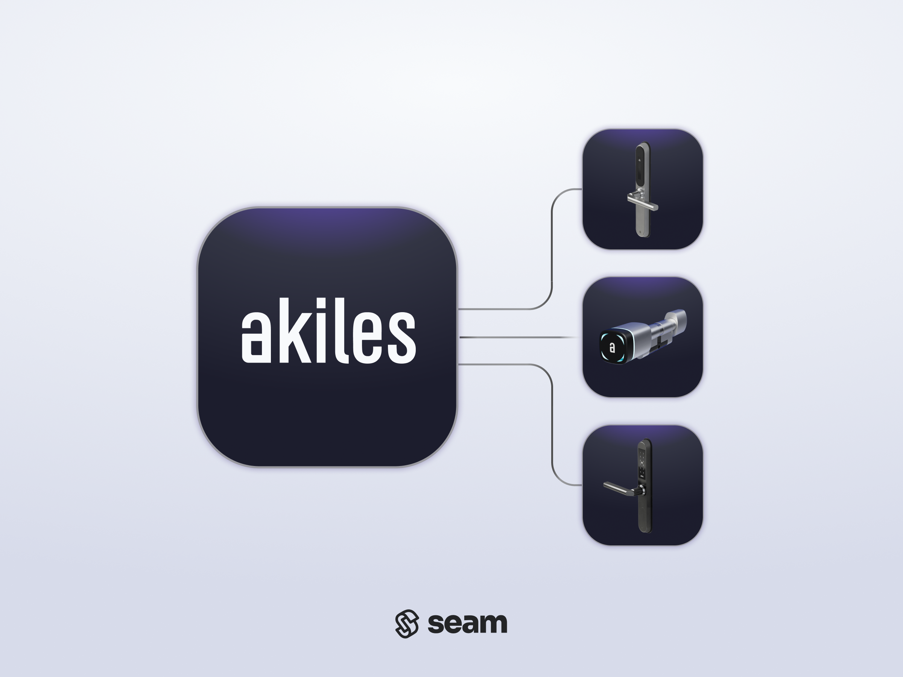

# Akiles Locks

<figure><picture><source srcset="../../.gitbook/assets/akiles-manufacturer-page-cover-dark.png" media="(prefers-color-scheme: dark)"></picture><figcaption>
Connect and control any Akiles device using the Seam API.
</figcaption></figure>

## Overview

[Akiles](https://akiles.app/en) is a Barcelona-based company that produces smart lock products for the European market. These offerings include the Smart Cylinder, Roomlock, and Pinpad, as well as the Smart Controller for electrified locks and access points. Akiles also offers the Akiles Gateway and Akiles Cloud. Seam integrates with Akiles through the Akiles Gateway to provide remote unlock functionality and access code creation and management.

***

## Supported Devices

This integration supports all Akiles locks. These locks require the [Akiles Gateway](https://akiles.app/en/products/smart-lock-system-gateway). Seam also supports the addition of the optional [Akiles Pinpad](https://akiles.app/en/products/smart-lock-system-pinpad) to enable entering access codes for devices that do not have an integrated keypad.

The following table details the requirements for compatibility with this Seam integration:

<table><thead><tr><th width="315">Capability</th><th>Required Accessories</th></tr></thead><tbody><tr><td>Remote unlock</td><td><ul><li>Akiles Gateway</li></ul></td></tr><tr><td>Access codes</td><td><ul><li>Akiles Gateway</li><li>Akiles Pinpad (if the device does not have an integrated keypad)</li></ul></td></tr></tbody></table>

For detailed information about the Akiles devices that Seam supports, see our [Akiles Supported Devices page](https://www.seam.co/manufacturers/akiles):

***

## Supported Features

We support the following features:

* [Triggering web unlock actions](../../products/smart-locks/lock-and-unlock.md)
* [Programming access codes](../../products/smart-locks/access-codes/) on devices that have an integrated keypad or Akiles Pinpad

***

### Device Provider Key

To create a [Connect Webview](../../core-concepts/connect-webviews/) that enables your users to connect their Tedee devices to Seam, include the `akiles` device provider key in the `accepted_providers` list. For more information, see [Customize the Brands to Display in Your Connect Webviews](../../core-concepts/connect-webviews/customizing-connect-webviews.md#customize-the-brands-to-display-in-your-connect-webviews).

***

## Setup Instructions

To control Akiles devices using Seam, you must prompt owners of these devices to add the Akiles Gateway and locks in the Akiles app and then connect these devices to Seam.

### Add Devices in the Akiles App

1.  Plug in your Akiles Gateway and connect it using Ethernet.

    The LED should be blue to indicate that it is connected.
2. Before installing an Akiles Roomlock, take a picture of the QR code inside the lock body.\
   The QR code is located on the inside of the lock, opposite the keypad. This code is required to add the lock in the Akiles app.
3.  Log in to the Akiles app.

    * [Web](https://web.akiles.app/login)
    * [iOS](https://apps.apple.com/app/akiles/id1467888600)
    * [Google Play](https://play.google.com/store/apps/details?id=app.akiles\&hl=en)

    Make sure to note your credentials for the Akiles app.
4. In the Akiles app, click the upper-left menu and select **Devices**.
5. At the upper-right corner, click **Actions +** and select **New Device**.
6. Type a name for the new device and select the site with which you want to associate the device.
7. In the **Device Type** area, add the Akiles Gateway.
   * Use a QR code scanner, scan the QR code on the back of the Gateway to retrieve the hardware ID number. Note that smartphone camera apps have built-in QR code scanners.
   * In the **Device Type** field, paste the hardware ID number.\
     The Akiles app displays Device and Version information based on the hardware ID.
   * Click **Create Device**.\
     The Akiles app creates the device representation and displays the device status. A Gateway takes a moment to connect to the Akiles server, run a firmware auto-update, and reboot.
8. Add each Akiles lock.
   * Using the photo that you took of the QR code inside the lock, scan this code to retrieve the hardware ID number. Note that smartphone photo apps are capable of scanning QR codes in photos.
   * In the **Device Type** field, paste the hardware ID number.\
     The Akiles app displays Device and Version information based on the hardware ID.
   * Click **Create Device**.\
     The Akiles app creates the device representation and displays that the device status is offline.
9. Connect each lock to the Gateway.
   * Click the upper-left menu and select **Links**.\
     By default, the Akiles app displays a link between the Gateway and server. You can check the link status in this location at any time.
   * Click **Link +**.
   * Clear the **Server** field to remove **Server** from **Central Device**.
   * Click **Central Device** and select **Gateway**.
   * **Peripheral Device** and select **Lock**.
   * Click **Create Link**.\
     This link connects the lock to the Akiles server and may take several minutes to complete. It also performs firmware updates that take additional time.
10. Click the upper-left menu, select **Devices**, and make sure that all devices are online.

### Connect Akiles Devices to Seam

Use your credentials for the Akiles app to log in to the [Seam Connect Webview](../../core-concepts/connect-webviews/) to add your devices to Seam.

***

## Where to Order

To purchase Akiles devices, contact the Akiles sales team.

<table data-view="cards"><thead><tr><th></th><th></th><th></th><th data-hidden data-card-target data-type="content-ref"></th><th data-hidden data-card-cover data-type="files"></th></tr></thead><tbody><tr><td></td><td><strong>Akiles Contact Page</strong></td><td></td><td><a href="https://akiles.app/en/contact">https://akiles.app/en/contact</a></td><td><a href="../../.gitbook/assets/akiles-logo.png">akiles-logo.png</a></td></tr></tbody></table>

***
