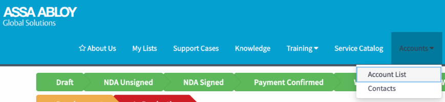
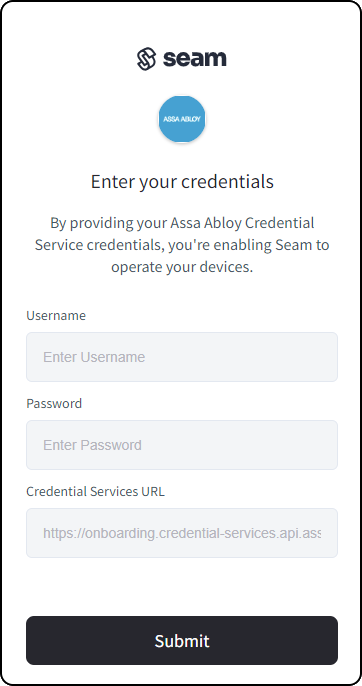
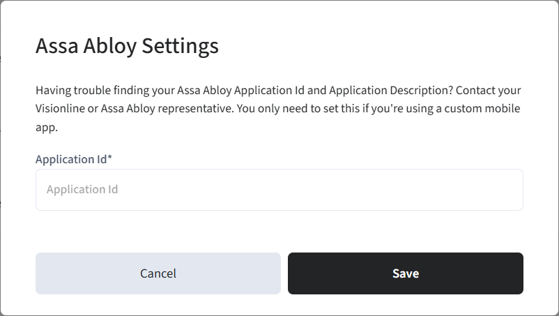

# ASSA ABLOY Vingcard Credential Services

ASSA ABLOY Credential Services stores all the mobile credentials that your application issues. To add mobile key support for your [Visionline ACS](assa-abloy-visionline-access-control-system/), you must obtain an ASSA ABLOY Credential Services account. You must also register for the ASSA ABLOY partnership program by sending an email to either of the following addresses:

* [mobile.access.globalsolutions@assaabloy.com](mailto:mobile.access.globalsolutions@assaabloy.com)
* [onboardingprogram@assaabloy.com](mailto:onboardingprogram@assaabloy.com)

## Before You Begin

Before connecting your ASSA ABLOY Credential Services to Seam, you must first identify your ASSA ABLOY credentials.

While you are in the development phase of your application, you can find your [development credentials](assa-abloy-credential-services-credential-manager.md#retrieve-your-assa-abloy-development-credentials) in the ASSA ABLOY Global Solutions Technology Partner Portal. You cannot use this preliminary application ID to connect to live sites.

Once you have received certification through the ASSA ABLOY partnership program, ASSA ABLOY provides a set of [production credentials](assa-abloy-credential-services-credential-manager.md#retrieve-your-assa-abloy-production-credentials).

### Retrieve Your ASSA ABLOY Development Credentials

Locate your ASSA ABLOY tenant account username and password, as well as your Visionline system ID, application ID, and credential services URL in the ASSA ABLOY Global Solutions Technology Partner Portal.

1. In a web browser, go to the [ASSA ABLOY Global Solutions Technology Partner Portal](https://my.assaabloyglobalsolutions.com/tpp).
2. Log in to the ASSA ABLOY Global Solutions Technology Partner Portal.
3.  Click **Accounts > Account List**.

    <figure> Account List."><figcaption></figcaption></figure>
4. In the **Agreements** area, locate and open the text (`.txt`) file.\
   This text file contains your ASSA ABLOY tenant account username and password, as well as your Visionline system ID, application ID, and credential services URL.

### Retrieve Your ASSA ABLOY Production Credentials

Once you have received certification, ASSA ABLOY provides your production credentials, including your application ID.

***

## Setup Instructions

1.  Create and then display a [Connect Webview](../core-concepts/connect-webviews/), including `assa_abloy_credential_service` in the set of [`accepted_providers`](../api/connect_webviews/).\
    Alternately, in the top navigation pane of [Seam Console](https://console.seam.co/), click **ACS Systems**. Then, in the upper-right corner of the **Access Systems** page, click **New Access System**.

    <figure><figcaption>
Click ACS Systems to go to the Access Systems page.
</figcaption></figure>
2. In the Connect Webview, perform the following steps:
   1. Click **Continue**.
   2. If the Connect Webview displays multiple brand options, select **Assa Abloy Credential Service**.
   3. In the **Username** field, type your tenant account username.
   4. In the **Password** field, type your tenant account password.
   5.  In the **Credential Services URL** field, type the credential services URL.

       <figure><figcaption></figcaption></figure>
   6. Click **Submit**.
3. If you are developing a custom mobile app, configure your ASSA ABLOY settings in Seam Console, as follows:
   1. In the top navigation pane of [Seam Console](https://console.seam.co/), click **Settings**.
   2. On the **Workspace Settings** page, next to **Assa Abloy Settings**, click **Edit**.
   3.  In the **Assa Abloy Settings** dialog, type your application ID.

       ASSA ABLOY assigns this application ID to your app when you receive certification. This single application ID uniquely identifies your application within both the iOS and Android app stores.

       <figure><figcaption>
Type your ASSA ABLOY application ID.
</figcaption></figure>
   4. Click **Save**.


ASSA ABLOY assigns you a preliminary application ID during the development phase. You cannot use this preliminary application ID to connect to live sites. After you receive certification, ASSA ABLOY provides a production application ID that you can use to connect to real sites. Consequently, when you obtain certification, you must edit your workspace settings to update this application ID.

