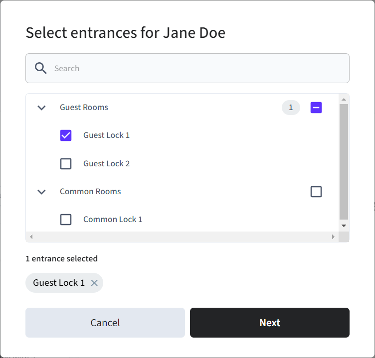

# Retrieving Guest and Common Entrances

You can retrieve lists of entrances. You may want to display entrances categorized by type to provide more context to your app users. To fetch only guest or common entrances, filter using the `visionline_metadata.door_category` property for entrances. The value for this property is set within the Visionline ACS.

<figure><figcaption><p>You can provide context to your app users by displaying entrances categorized by type.</p></figcaption></figure>

## Fetch Guest Entrances

To fetch only guest entrances, filter entrances to include only those with a `visionline_metadata.properties.door_category` of `guest`.



```python
all_entrances = seam.acs.entrances.list(
  acs_system_id=acs_system.acs_system_id
)

# Filter for entrances with the guest entrance category type.
guest_entrance_category_types = ["guest"]

def filter_entrances_by_profile_type(entrance_list, category_types):
    guest_entrances = []
    for entrance in entrance_list:
        if entrance["visionline_metadata"]["door_category"] in category_types:
            guest_entrances.append(entrance)
    return guest_entrances

guest_entrances = filter_entrances_by_profile_type(
    all_entrances,
    guest_entrance_category_types
)
```



***

## Fetch Common Entrances

To fetch only common entrances, filter entrances to include only those with a `visionline_metadata.properties.door_category` of `common` or `common (PMS)`.



```python
all_entrances = seam.acs.entrances.list(
  acs_system_id=acs_system.acs_system_id
)

# Filter for entrances with the common entrance category types.
common_entrance_category_types = ["common", "common (PMS)"]

def filter_entrances_by_profile_type(entrance_list, category_types):
    common_entrances = []
    for entrance in entrance_list:
        if entrance["visionline_metadata"]["door_category"] in category_types:
            common_entrances.append(entrance)
    return common_entrances

common_entrances = filter_entrances_by_profile_type(
    all_entrances,
    common_entrance_category_types
)
```


