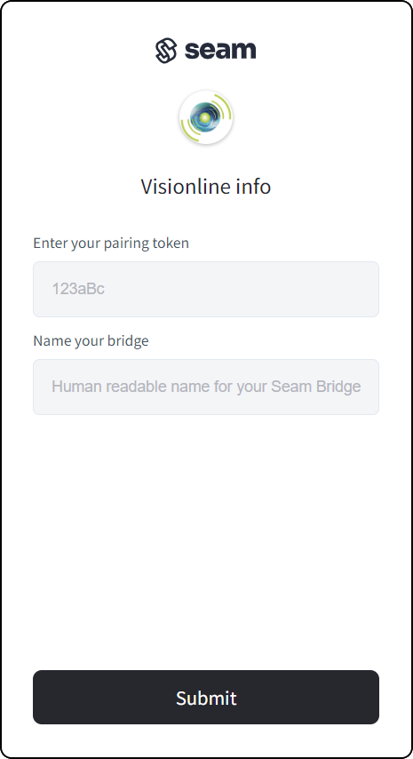

# Connecting a Visionline Site to Seam

Perform this process for each Visionline ACS site that you want to connect to Seam.

1. Create and then display a [Connect Webview](../../../core-concepts/connect-webviews/).\
   When creating the Connect Webview, include `visionline` in the set of [`accepted_providers`](../../../api-clients/connect-webviews/#connect\_webview-properties). For more information, see [Customize the Brands to Display in Your Connect Webview](../../../core-concepts/connect-webviews/customizing-connect-webviews.md#customize-the-brands-to-display-in-your-connect-webviews).\
   Alternately, in the left navigation pane of the [Seam Console](https://console.seam.co/), click **Access Systems**. Then, in the upper-right corner of the **Access Systems** page, click **+ New Access System**.
2.  In the Connect Webview, perform the following steps:

    * If the Connect Webview displays multiple brand options, select **Visionline**.
    * Make sure that you have installed a [Seam Bridge](../../../capability-guides/seam-bridge.md) for the Visionline site and that the Seam Bridge is running.
    * Type the pairing token and a name for the Seam Bridge that is connected to the Visionline site. Then, click **Submit**.

    <figure><figcaption></figcaption></figure>

    *   Specify the following values to add the Visionline site to Seam:

        * In the **Name** field, type a name to identify the Visionline site within your Seam workspace.
        * In the **System ID** field, type the Visionline system ID for the Visionline site.
        * In the **Username** and **Password** fields, type the Visionline application username and password.
        * In the **Mobile Access UUID** field, type the Mobile Access UUID.
        * If the Seam Bridge is installed on the same computer as the Visionline ACS, select **Yes**. Otherwise, select **No** and type the local IP address of the on-premises computer, for example, `192.168.0.10`.

        <figure><figcaption></figcaption></figure>
    * Click **Submit**.

***

## Seam Sandbox Visionline ACS

Seam also provides a virtual Visionline ACS that you can use in your [sandbox workspace](../../../core-concepts/workspaces/#sandbox-workspaces) for exploration, development, and testing. When connecting a Visionline ACS in your sandbox test environment, use the following test credentials:

[Sandbox ASSA ABLOY Visionline Access Control System](../../../device-guides/sandbox-and-sample-data/assa-abloy-visionline-access-management-system-sample-data.md)

To issue mobile keys in your sandbox workspace, you must also use the sandbox [ASSA ABLOY Credential Services](../../../device-guides/assa-abloy-credential-services-credential-manager-in-development.md) for credential management. You can use the following virtual credential manager credentials:

[Sandbox ASSA ABLOY Credential Services](../../../device-guides/sandbox-and-sample-data/assa-abloy-credential-service-sample-data.md)
