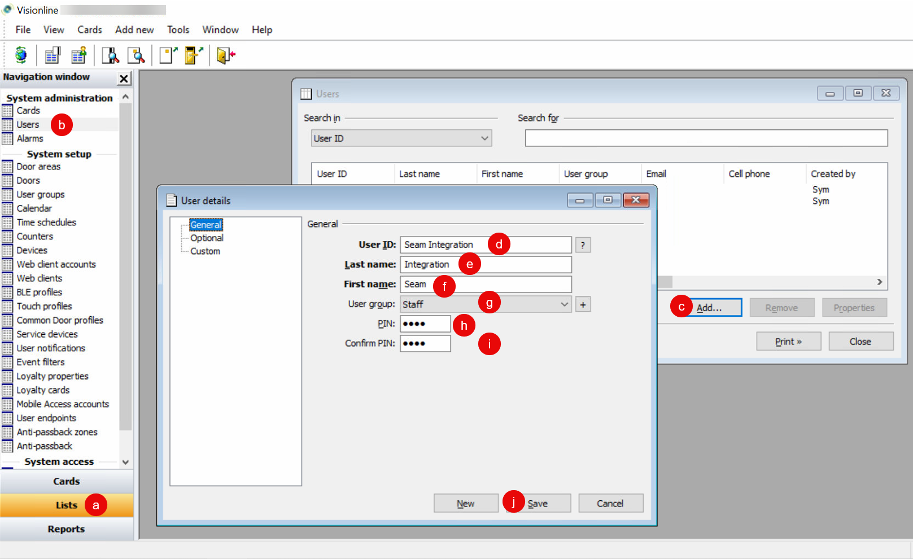
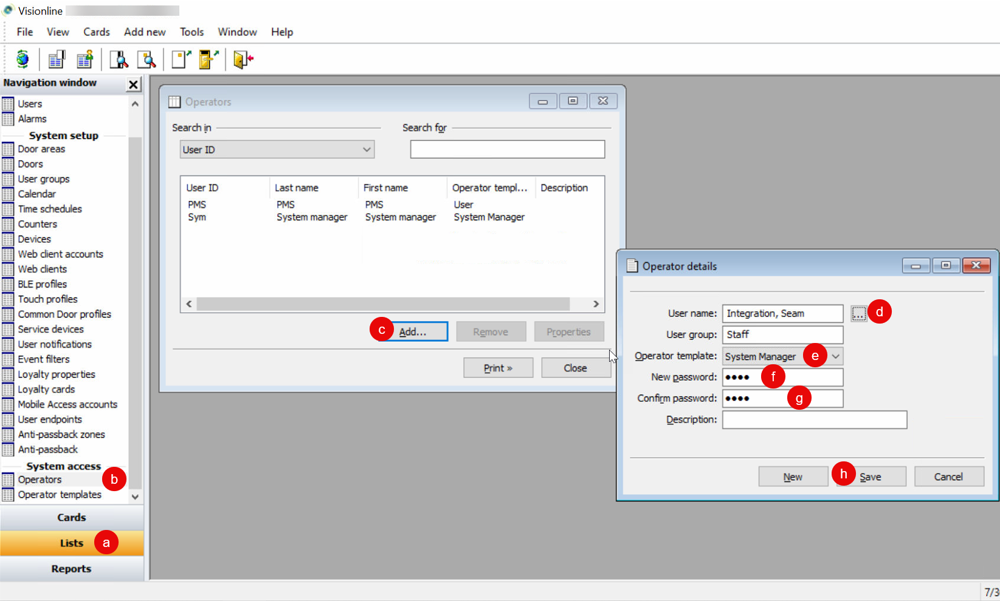

# Creating a Visionline User for Seam

The onsite Visionline ACS administrator can create a Visionline user specifically for the connection with Seam. Alternately, they can use an existing Visionline user, as long as the user is configured as an operator that uses the System Manager operator template. The user must also have a password.

To create a new Visionline user for the Seam connection, first create a new user. Then, configure the user as an operator that uses the System Manager operator template.


These instructions use Visionline 1.27. If you are using Visionline 1.28, you may notice differences in a few field names.


1. Log in to the Visionline application as a user with System Manager access.
2.  Create a new Visionline user.&#x20;

    * At the bottom of the left navigation pane, click **Lists** (a).
    * In the **System administration** section of the left navigation pane, double-click **Users** (b).
    * In the **Users** window, click **Add** (c).
    * In the **User details** window, type a **User ID** for the new user (d).
    * Type the **Last name** of the user (e).
    * Type the **First name** of the user (f).
    * Select the **User group** to which to assign the user (g).
    * Optionally, in the **PIN** and **Confirm PIN** fields, type a PIN for the user (h, i).
    * Click **Save** (j).
    * In the **User details** dialog, click **Close**.
    * In the **Users** window, click **Close**.

    <figure><figcaption>
Add a Visionline user for the connection with Seam.
</figcaption></figure>
3.  Configure the new user as an operator that uses the System Manager operator template.

    * At the bottom of the left navigation pane, click **Lists** (a).
    * In the **System access** section of the left navigation pane, double-click **Operators** (b).
    * In the **Operators** window, click **Add** (c).
    * In the **Operator details** dialog, click **...** next to the **User name** field (d).
    * In the **Users \<Operator details>** window, select the user that you created and then click **Select** (e).
    * In the **Operator details** dialog, select **System Manager** as the **Operator template** (f).\
      Alternately, you can create a new operator template for the new user, but you must make sure that this operator template has access to all permissions.
    * In the **Password** and **Confirm Password** fields, type a password for the user (g).
    * Click **Save** (h).
    * In the **Operator details** dialog, click **Close**.
    * In the **Operators** window, click **Close**.

    <figure><figcaption>
Configure the new user as an operator with the System Manager operator template.
</figcaption></figure>
