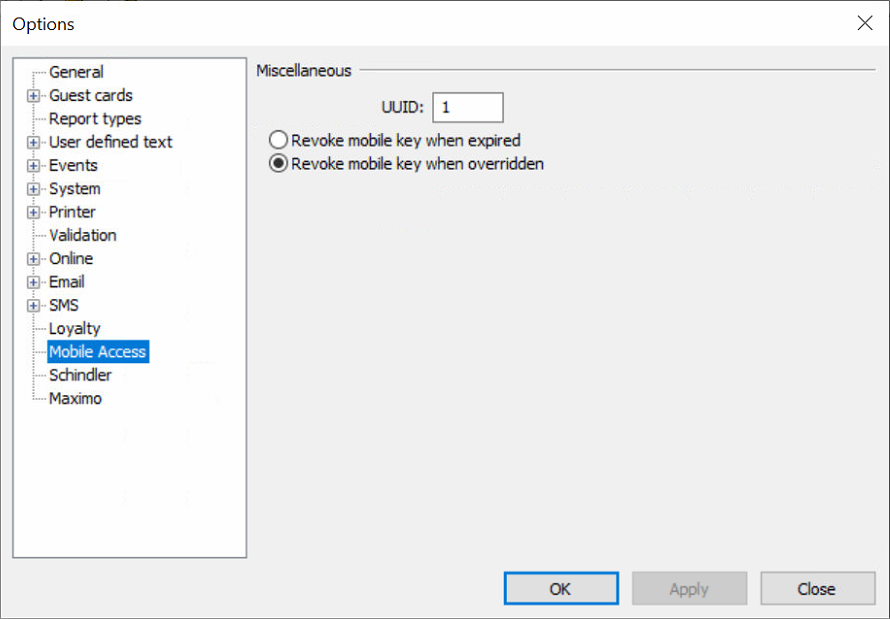

# Step 6: Configure the Mobile Access UUID in Visionline

Configure the mobile access UUID in the Visionline application.

Set this property to `1` for the development phase, that is, for anytime that you're using your development Visionline account to integrate with Seam.

1. In the top menu, click **Tools > Options**.
2. In the left navigation pane of the **Options** window, click **Mobile Access**.
3. Make sure that the **UUID** field is set to `1`.
4.  If needed, click **Apply**.

    <figure><figcaption>
Make sure that the mobile access UUID is set to 1 for your development Visionline account.
</figcaption></figure>
