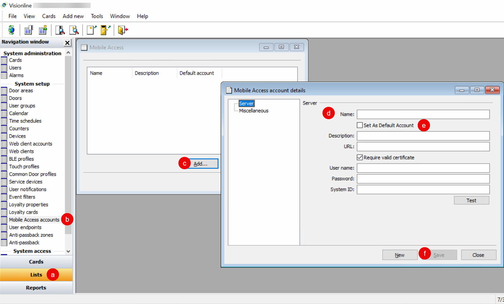

# Launching Your Visionline Production Sites

To connect your Visionline app to one or more real sites, first set up your production Seam workspace. Then, work with the property manager of each site to launch the site.

## 1. Set up your production Seam workspace

1. In the upper-right corner of the [Seam Console](https://console.seam.co/), click the down arrow to display the workspace list.
2. [Add](../../../core-concepts/workspaces/#create-a-sandbox-workspace) or select a Seam sandbox workspace for this production phase.
3. Identify the production credentials for your ASSA ABLOY Credential Services tenant account.\
   ASSA ABLOY provides you with these production credentials once you have [obtained ASSA ABLOY certification](obtaining-assa-abloy-certification-for-your-visionline-mobile-app.md).\
   The credentials include a username and password, as well as your application ID for the production phase.
4.  Use a [Connect Webview](../../../core-concepts/connect-webviews/) to connect the production ASSA ABLOY Credential Services tenant account to Seam.

    See the [ASSA ABLOY Credential Services setup instructions](../../../device-guides/assa-abloy-credential-services-credential-manager-in-development.md).
5. Add your production application ID in the Seam Console.
   * In upper-right corner of the [Seam Console](https://console.seam.co/), click your username and then select **Workspace Settings**.
   * On the **Workspace Settings** page, next to **Assa Abloy Settings**, click **Edit**.
   *   In the **Assa Abloy Settings** dialog, type or paste your application ID.\

       <figure><figcaption></figcaption></figure>
   * Click **Save**.

***

## 2. Launch each production site

Repeat this process for each production site that you want to launch. Your development and operations teams work with the property manager of each of these sites to perform the following steps:

1.  Make sure that your server and client meet the following requirements:

    * Key server:
      * Visionline V1.27.0.29 (or newer)
      * Windows 10 1901 (or newer)
      * Hosted in a location where internet traffic is allowed
    * ASSA ABLOY online locks:
      * Bluetooth modules and licenses installed

    For more details, see the following ASSA ABLOY Visionline document:



2. Unblock the following ports on the server:
   * All files in the Visionline `Program Files` and `ProgramData` folders\
     The default locations are `C:\Program Files\ASSA ABLOY\VisiOnline` and `C:\ProgramData\ASSA ABLOY\VisiOnline`.
   * Firewall ports:
     * Port 135 (TCP)
     * 3001 (TCP)
     * 7799, 7788 (TCP/UDP)
     * Lock Service Port (27015 default) (TCP)
     * PMS port (4000 default) (TCP)
3. Unblock the following ports on the client:
   * All files in the Visionline `Program Files` and `ProgramData` folders\
     The default locations are `C:\Program Files\ASSA ABLOY\VisiOnline` and `C:\ProgramData\ASSA ABLOY\VisiOnline`.
   * Firewall ports
     * Port 135 (TCP)
     * 3001 (TCP)
     * DCOM ports
4. Set up all door locks with Bluetooth low energy (BLE) profiles and then use Lock Service 3G to program the door locks with the settings from Visionline.\
   For instructions, see [Setting up Door Locks for Visionline](setting-up-door-locks-for-visionline.md).
5. Purchase the required "options" from ASSA ABLOY for the Visionline site.
   * Purchase the "Web Services" option.
   * If your app issues mobile keys, purchase the "Mobile Access" option.
6. Input the corresponding option codes into the Visionline system.
   * Open the Visionline dashboard.
   * In the top menu, click **Tools** > **Option code**.
   * In the **Option code** field, type or paste each option code that you received from Visionline and then click **Apply**.
7. Verify that the required options have been configured.
   * At the bottom of the left navigation pane, click **Reports**.
   * In the **Pre-defined** section of the left navigation pane, double-click **System settings**.
   * If desired, print or export the report.
   * In the report, find the **`[Options]`** section and verify that the purchased options are listed.
8. Retrieve or create a Visionline user for the Seam connection.\
   The onsite Visionline ACS administrator can create a Visionline user specifically for the connection with Seam. Alternately, they can use an existing Visionline user, as long as the user is configured as an operator that uses the System Manager operator template. The user must also have a password. For instructions, see [Creating a Visionline User for Seam](creating-a-visionline-user-for-seam.md).
9.  If your app issues mobile keys, make sure that you set up a Mobile Access account in the Visionline application.\
    It is important to note that Visionline only supports issuing mobile credentials through a single mobile app at a time. Consequently, if your Visionline ACS instance was already configured to use a different Mobile Access account, you must add this new Seam Mobile Access account and set this new account as the default account in the Visionline Mobile Access accounts list.

    To set up your Visionline Mobile Access account for Seam:

    * At the bottom of the left navigation pane in the Visionline application, click **Lists** (a).
    * In the **System setup** area of the left navigation pane, double-click **Mobile Access accounts** (b).
    * In the **Mobile Access** window, click **Add** (c).
    * In the **Server** pane on the **Mobile Access account details** window, specify the connection details that you received from ASSA ABLOY (d).\
      For hotels, ASSA ABLOY wraps these parameters and applies them through Option Codes (that is, license strings). In this situation, do not enter these parameters directly.
    * Make sure to select the **Set As Default Account** checkbox (e).
    * Click **Save** (f).
    * In the **Mobile Access account details** window, click **Close**.
    * In the **Mobile Access** window, click **Close**.

    <figure><figcaption>
Add a Mobile Access account and set this account as the default.
</figcaption></figure>
10. Install and run the [Seam Bridge](../../../capability-guides/seam-bridge.md) on the computer running the Visionline instance or on a computer on the same LAN.\
    See the [Seam Bridge installation instructions](../../../capability-guides/seam-bridge.md#installation-instructions).
11. If your app issues mobile keys, retrieve the Visionline system ID for the site.
    * At the bottom of the left navigation pane in the Visionline application, click **Lists**.
    * In the **System setup** area of the left navigation pane, double-click **Mobile Access accounts**.
    * In the **Mobile Access** window, select the configured mobile access account and click **Properties**.
    * In the **Server** pane on the **Mobile Access account details** window, note the value in the **System ID** field.
12. If your app issues mobile keys, retrieve the Visionline mobile UUID for the site.
    * In the menu bar of the Visionline application, click **Tools > Options**.
    * In the left navigation pane of the **Options** window, click **Mobile Access**.
    * Note the value in the **UUID** field.
13. Use a [Connect Webview](../../../core-concepts/connect-webviews/) to connect the production Visionline instance to Seam.

    See [Connecting a Visionline Site to Seam](connecting-a-visionline-site-to-seam.md).
