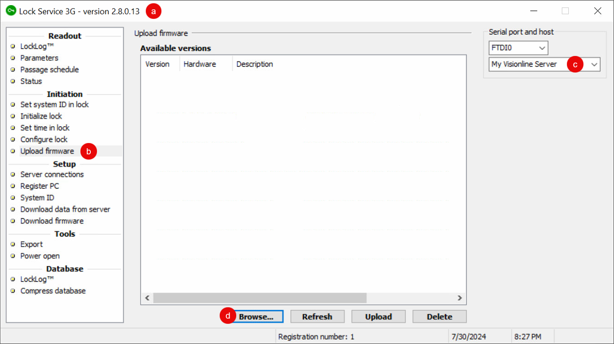

# Setting up Door Locks for Visionline

To [develop](developing-your-visionline-mobile-key-app.md) or [launch](launching-your-visionline-production-sites.md) a mobile app to issue mobile keys for Visionline,  you must first perform a series of steps, including the following door lock-related tasks:

1. [Set up all door locks in the Visionline application.](setting-up-door-locks-for-visionline.md#set-up-door-locks-with-ble-profiles)
2. [Use Lock Service 3G to program the door locks with the settings and](setting-up-door-locks-for-visionline.md#program-door-locks-with-settings-from-visionline) [Bluetooth low energy (BLE) profiles](setting-up-door-locks-for-visionline.md#set-up-door-locks-with-ble-profiles) [from Visionline.](setting-up-door-locks-for-visionline.md#program-door-locks-with-settings-from-visionline)


These instructions use Visionline 1.27. If you are using Visionline 1.28, you may notice differences in a few field names.


***

## Set up Door Locks in the Visionline Application

Use the Visionline application to define guest room and common door locks. First, set up the desired door areas, such as `Guest Doors` and `Common Doors`. Then, define each door and assign it to the appropriate door area. When you define a door or set of doors, you also choose a door type, to determine the access behavior of the door. Visionline door types include guest, guest entrance, guest common, elevator reader, elevator reader relay, and so on.

Note that for common doors, guest entrance doors and elevator reader relays automatically give access to guests within a specific guest door range, such as common entrances. Then, you assign elevator reader relays to the corresponding elevator reader.

For guest common doors, you must grant guest access manually, such as for a gym door or parking entrance.

### Set up Guest Room Locks

When defining guest room doors, first create a door area and then create a door of the **Guest** door type.

1. Log in to the Visionline application.
2.  Set up a door area for guest rooms.

    * At the bottom of the left navigation pane, click **Lists** (a).
    * In the **System setup** section of the left navigation pane, double-click **Door areas** (b).
    * In the **Door areas** window, click **Add** (c).
    * In the **Door area details** dialog, type a name and, optionally, a description for the new door area (d).\
      For example, you could create a door area named `Guest Doors`.
    * Click **Save** (e).
    * To add more door areas, click **New** and then repeat this process in the **Door area details** dialog.
    * When you are done adding door areas, in the **Door area details** dialog, click **Close**.
    * In the **Door areas** window, click **Close**.

    <figure><figcaption>
Create a door area for guest room doors.
</figcaption></figure>
3.  Define each set of guest room doors.

    * At the bottom of the left navigation pane, click **Lists** (a).
    * In the **System setup** section of the left navigation pane, double-click **Doors** (b).
    * In the **Doors** window, click **Add** (c).
    * In the **Door details** window, select **Guest** as the door **Type** (d).
    * In the **Number** field, type the door range (e).\
      For example: `101-109`
    * In the **Area** field, select the guest door area that you created (f).\
      For example: **Guest Doors**
    * Click **Save** (g).
    * To add more door sets, click **New** and then repeat this process in the **Door details** window.
    * When you are done adding door sets, in the **Door details** window, click **Close**.
    * In the **Doors** window, click **Close**.

    <figure><figcaption>
Create a set of guest room doors using the door area that you created.
</figcaption></figure>

***

### Set up Common Door Locks

When defining common doors, make sure to choose the appropriate door type. Visionline door types include the following, among others:

<table><thead><tr><th width="210">Door Type</th><th>Description</th></tr></thead><tbody><tr><td>Guest entrance</td><td>Specify a set of guest doors to give automatic access to guests within this range. You can use this door type for common entrances.</td></tr><tr><td>Guest common</td><td>You must grant access to doors of this type explicitly to specific guest credentials. You can use this door type for gym doors, parking entrances, and so on. </td></tr><tr><td>Elevator reader relay</td><td>This door type represents a floor button or relay within an elevator. Specify a set of guest doors to give automatic access to guests within this range. Assign each elevator reader relay to the corresponding "slot" in an elevator reader definition.</td></tr><tr><td>Elevator reader</td><td>The door type serves as an organization mechanism for sets of elevator reader relays.</td></tr></tbody></table>


For more information about door types, see the Visionline Help.


To define a common door, first create a door area and then create a door of the appropriate type.

1. Log in to the Visionline application if you are not already logged in.
2.  Set up a door area for the group of common doors.

    * At the bottom of the left navigation pane, click **Lists** (a).
    * In the **System setup** section of the left navigation pane, double-click **Door areas** (b).
    * In the **Door areas** window, click **Add** (c).
    * In the **Door area details** dialog, type a name and, optionally, a description for the new door area (d).\
      For example, you could create a door area named `Common Doors`.
    * Click **Save** (e).
    * To add more door areas, click **New** and then repeat this process in the **Door area details** dialog.
    * When you are done adding door areas, in the **Door area details** dialog, click **Close**.
    * In the **Door areas** window, click **Close**.

    <figure><figcaption>
Create a door area for common doors.
</figcaption></figure>
3.  Define each common door.

    * At the bottom of the left navigation pane, click **Lists** (a).
    * In the **System setup** section of the left navigation pane, double-click **Doors** (b).
    * In the **Doors** window, click **Add** (c).
    * In the **Door details** window, select the appropriate door **Type** (d).\
      See the table at the beginning of this section for descriptions of some common door types.
    * Type a **Name** for the door, reader, relay, or other entrance (e).
    * For a guest entrance door or elevator reader relay, type the beginning and ending room numbers to define the associated **Room interval** (f).\
      Note that for guest common entrances, you set up access permissions explicitly when creating guest or other credentials.
    * In the **Area** field, select the common door area that you created (g).\
      For example: **Common Doors**
    * For an elevator reader, set the relay outputs to define the access permissions by floor or other output:
      1. In the **Relay outputs** table, select an output.
      2. Click **Select**.
      3. In the **Select elevator reader relay** dialog, select the corresponding elevator reader relay and then click **OK**.
      4. Repeat this process for any additional relay outputs.
    * Click **Save** (h).
    * To add more common doors, click **New** and then repeat this process in the **Door details** window.
    * When you are done adding common doors, in the **Door details** window, click **Close**.
    * In the **Doors** window, click **Close**.

    <figure><figcaption>
Create one or more common doors using the door area that you created.
</figcaption></figure>

***

## Program Door Locks with Settings and BLE Profiles from Visionline

Once you have set up door locks in the Visionline application, use the Lock Service 3G application to program the door locks themselves. When you program a lock, you download the identity and settings for the lock from Lock Service 3G to the lock.

This process consists of the following basic steps:

1. [Install Lock Service 3G on a laptop or tablet.](setting-up-door-locks-for-visionline.md#install-lock-service-3g)
2. [Configure the Visionline application to download door lock data to Lock Service 3G.](setting-up-door-locks-for-visionline.md#configure-visionline-for-lock-service)
3. [Configure Lock Service 3G to connect to the Visionline server.](setting-up-door-locks-for-visionline.md#configure-lock-service-to-connect-to-the-visionline-server)
4. [Download door lock data from the Visionline server to Lock Service 3G.](setting-up-door-locks-for-visionline.md#download-door-lock-data-to-lock-service)
5. [Initialize each door lock to program it with the correct settings and BLE profile.](setting-up-door-locks-for-visionline.md#initialize-door-locks)

***

### Install Lock Service 3G

Install the Lock Service 3G on a Windows laptop or tablet that you can move to each door lock. You use a USB-to-lock interface cable to connect this laptop or tablet to each door lock.


If the USB-to-lock interface cable does not work correctly, you may need to install the following driver:

`CDM v2.12.xx WHQL Certified.exe`


***

### Configure Visionline for Lock Service 3G

1. Log in to the Visionline application if you are not already logged in.
2.  Add a  device.

    * At the bottom of the left navigation pane, click **Lists** (a).
    * In the **System setup** section of the left navigation pane, double-click **Devices** (b).
    * In the **Devices** window, click **Add** (c).
    * In the **Device details** window, type a **Name** for the device, such as `Lock Service 3G` (d).
    * Select **Service device host** as the device **Type** (e).
    * Make sure that the **Port** is `27015` (f).
    * Make sure that the **Location** is **Server** (g).
    * Click **Save** (h).
    * In the **Device details** window, click **Close**.
    * In the **Devices** window, click **Close**.

    <figure><figcaption>
Add a device in the Visionline app.
</figcaption></figure>
3.  Obtain the registration code for the Lock Service 3G instance.

    * At the bottom of the left navigation pane, click **Lists** (a).
    * In the **System setup** section of the left navigation pane, double-click **Service devices** (b).
    * In the **Service devices** window, click **Add** (c).
    * Note the registration code and validity period that the Visionline application displays (d).\
      You must enter this code in Lock Service 3G on the laptop or tablet.
    * Click **OK** (e).
    * In the **Service devices** window, click **Close**.

    <figure><figcaption>
Obtain the registration code for Lock Service 3G.
</figcaption></figure>

***

### Configure Lock Service 3G to Connect to the Visionline Server

1. On the laptop or tablet, open the Lock Service 3G application.
2.  Add a server connection.

    * In the **Setup** section of the left navigation pane, click **Server connections** (a).
    * If the **Server connections** dialog does not display automatically, click **Add** (b).
    * In the **Server connections** dialog, type a **Name** for this connection to the Visionline server (c).\
      Note that some of the field names in this dialog are different in different versions of Lock Service 3G.
    * In the **Address** field, type the IP address of the Visionline server (d).
    * Type the **Port** number to use to connect to the Visionline server (e).
    * Click **OK** (f).

    <figure><figcaption>
Add the connection between Lock Service 3G and the Visionline server.
</figcaption></figure>
3.  At the right of the **Lock Service 3G** window, in the lower field in the **Serial port and host** area, select the name of the Visionline server connection that you created.

    <figure><figcaption>
Select the Visionline server connection.
</figcaption></figure>
4.  Register Lock Service 3G on the laptop or tablet.

    * In the **Setup** section of the left navigation pane, click **Register PC** (a).
    * In the **Register PC** area, type the registration **Code** that you obtained from the Visionline application (b).
    * Click **Register** (c).

    <figure><figcaption>
Use the registration code from the Visionline application to register Lock Service 3G.
</figcaption></figure>

    Lock Service 3G registers with the Visionline server and displays a **Registration Finished** message.
5. Click **OK**.

***

### Download Door Lock Data to Lock Service 3G

1. Open the Lock Service 3G application if you have not done so already.
2. In the **Setup** section of the left navigation pane, click **Download data from server** (a).
3. At the right of the **Lock Service 3G** window, in the lower field in the **Serial port and host** area, select the name of the Visionline server connection (b).
4. In the **Download data from server** area, click **Check all** (c).
5. Click **Download** (d).

<figure><figcaption>
Download the door lock data from the Visionline server to Lock Service 3G.
</figcaption></figure>

Lock Service downloads the door lock data from the Visionline server and displays a message when the download is complete.

***

### Initialize Door Locks

Perform the following steps on each lock:

1. Only if necessary, update the Lock Control Unit firmware.\
   **Test locks from ASSA ABLOY should already be preprogrammed with the correct firmware.**\
   For other locks, contact ASSA ABLOY to learn whether you need to update the Lock Control Unit firmware and, if so, to obtain the correct firmware version.
   * Open the Lock Service 3G application if you have not done so already.
   * In the **Initiation** section of the left navigation pane, click **Upload firmware** (a).
   * At the right of the **Lock Service 3G** window, in the lower field in the **Serial port and host** area, select the name of the Visionline server connection (b).
   *   In the **Upload firmware** area, click **Browse** (c).\

       <figure><figcaption>
Select the Lock Control Unit firmware to upload.
</figcaption></figure>
   * Select the firmware that ASSA ABLOY has sent to you and then click **Open**.
   *   In the **Available versions** table, right-click the appropriate firmware version and select **Save to database**.\

       <figure><figcaption>
Save the firmware to the database.
</figcaption></figure>
   * In the **Available versions** table, select the appropriate firmware version.
   *   At the right of the **Lock Service 3G** window, in the upper field in the **Serial port and host** area, select the serial port that you want to use to connect to the lock.

       <figure><figcaption>
Select the port.
</figcaption></figure>
   * Connect the cable from the laptop or tablet running Lock Service 3G to the lock.
   * At the bottom of the **Upload firmware** area, click **Upload**.
2. Open the Lock Service 3G application if you have not done so already.
3. Initialize the lock.
   * In the **Initiation** section of the left navigation pane, click **Initialize lock** (a).
   * At the right of the **Lock Service 3G** window, in the lower field in the **Serial port and host** area, select the name of the Visionline server connection (b).
   * In the **Initialize lock** area, expand the appropriate door area and select the lock that you want to initialize (c).
   * Select the **Read parameters after successful initialization** checkbox (d).
   * At the right of the **Lock Service 3G** window, in the upper field in the **Serial port and host** area, select the serial port that you want to use to connect to the lock (e).
   *   Connect the cable from the laptop or tablet running Lock Service 3G to the lock and then click **Initialize** (f).

       <figure><figcaption>
Connect Lock Service 3G to each lock and initialize it.
</figcaption></figure>
