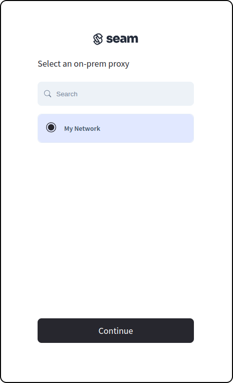

# ASSA ABLOY Visionline Access Control System

## Overview

Seam integrates seamlessly with the [ASSA ABLOY Visionline Access Control System](https://www.assaabloyglobalsolutions.com/en/hospitality-solutions/access-management-systems-for-hotels#gw-group-text-and-media-14987d7731) (ACS), a widely-used on-premise control platform for hotels. This system supports doors, elevators, turnstiles, and gates, enabling you to secure either a single building or multiple buildings using the same setup. Visionline uses a data-on-card platform, significantly reducing installation costs because the locks can function offline. Additionally, the capability of the system to operate independently of network connectivity enhances the reliability and flexibility.

***

## Supported Devices

This integration supports all readers and wireless locks connected to the Visionline ACS.

We support the following features:

* [Managing access systems](../../products/access-systems/)
* [Issuing mobile access credentials](../../products/mobile-access-in-development/)

***

### Device Provider Key

To create a [Connect Webview](../../core-concepts/connect-webviews/) that enables you to connect your Visionline ACS to Seam, include the `visionline` [device provider key](../../api-clients/connect-webviews/#device-provider-keys) in the `accepted_providers` list. For more information, see [Customize the Brands to Display in Your Connect Webview](../../core-concepts/connect-webviews/customizing-connect-webviews.md#customize-the-brands-to-display-in-your-connect-webviews).

***

## Setup Instructions


Before connecting your Visionline ACS to Seam, you must first install and connect your Seam Bridge. For detailed instructions, see [Seam Bridge](../../capability-guides/seam-bridge.md).

To issue mobile keys, you must also connect ASSA ABLOY Credential Services to Seam for credential management. For detailed instructions, see [ASSA ABLOY Credential Services](../../device-guides/assa-abloy-credential-services-credential-manager-in-development.md).


1. Log in to the Visionline application and note your username and password.\
   Optionally, you can add a new user and use their username and password instead of using the username and password of an existing Visionline application user.
2.  Make sure that you set up a Mobile Access account in the Visionline application so that you can issue mobile credentials.

    If you have not yet set up your Visionline Mobile Access account, perform the following steps:

    * At the bottom of the left navigation pane of the Visionline application, click **Lists**.
    * In the **System setup** area of the left navigation pane, click **Mobile Access > Mobile Access > New**.
    * In the **Mobile Access account details** window click **Server**.
    *   In the **Server** pane, specify the connection details that you received from ASSA ABLOY.

        For hotels, ASSA ABLOY wraps these parameters and applies them through Option Codes (that is, license strings). In that situation, you do not enter these parameters directly.
    * Save the new Visionline Mobile Access account.
3. Retrieve your Visionline system ID, as follows:
   * At the bottom of the left navigation pane of the Visionline application, click **Lists**.
   * In the **System setup** area of the left navigation pane, click **Mobile Access**.
   * Select the configured mobile access account.
   * Click **Server**.
   * In the **Server** pane, note the value in the **System ID** field.
4. Create a [Connect Webview](../../core-concepts/connect-webviews/), including `visionline` in the set of [`accepted_providers`](../../api-clients/connect-webviews/#connect\_webview-properties).
5. Display the Connect Webview and perform the following steps:
   * If presented with multiple brand options within the Connect Webview, select **Visionline**.
   *   Select your [Seam Bridge](../../capability-guides/seam-bridge.md) that is connected to the Visionline system to which you want to connect.

       <figure><figcaption></figcaption></figure>
   *   Specify the following values to add your ASSA ABLOY Visionline account to Seam:

       * Your Visionline application username and password.
       * The local IP address of the on-premises computer, for example, `192.168.0.10`.
       * (Coming soon!) The  system ID of your Visionline instance.

       <figure><figcaption></figcaption></figure>
   * Click **Submit**.


When connecting a Visionline ACS in your sandbox test environment, you can use the following test credentials:

[Sandbox ASSA ABLOY Visionline Access Control System](../../device-guides/sandbox-and-sample-data/assa-abloy-visionline-access-management-system-sample-data.md)

To issue mobile keys in your sandbox test environment, you must also use the sandbox ASSA ABLOY Credential Services for credential management. You can use the following test credential manager credentials:

[Sandbox ASSA ABLOY Credential Services](../../device-guides/sandbox-and-sample-data/assa-abloy-credential-service-sample-data.md)


***

## Where to Order

To purchase the ASS ABLOY Visionline ACS and devices, request a quote from ASSA ABLOY.

<table data-card-size="large" data-view="cards"><thead><tr><th></th><th></th><th></th><th data-hidden data-card-target data-type="content-ref"></th><th data-hidden data-card-cover data-type="files"></th></tr></thead><tbody><tr><td></td><td><strong>ASSA ABLOY Contact Page</strong></td><td></td><td><a href="https://www.assaabloyglobalsolutions.com/en/about/local-contacts">https://www.assaabloyglobalsolutions.com/en/about/local-contacts</a></td><td><a href="../../.gitbook/assets/assa-abloy-logo.png">assa-abloy-logo.png</a></td></tr></tbody></table>
