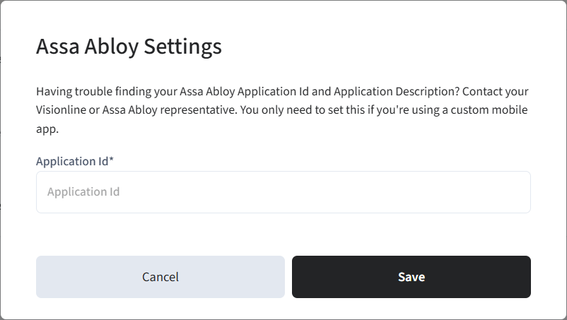

# Step 10: Connect Your Visionline Development Account to Seam

To develop your mobile key app, perform the following procedures to connect your Visionline development account to Seam:

1. [Connect your ASSA ABLOY Credential Services development account to Seam.](step-10-connect-your-visionline-development-account-to-seam.md#connect-credential-services-to-seam)
2.  [Connect your Visionline development account to Seam.](step-10-connect-your-visionline-development-account-to-seam.md#connect-visionline-to-seam)

    This process includes installing and running Seam Bridge to connect your on-premises Visionline application to Seam. For more information, see [Seam Bridge](../../../../../capability-guides/seam-bridge/).

***

## Connect Credential Services to Seam

ASSA ABLOY Credential Services stores all the mobile credentials that your application issues. For more information about ASSA ABLOY Credential Services, see the [ASSA ABLOY Credential Services integration guide](../../../../assa-abloy-credential-services-credential-manager.md).

You received a Credential Services development "tenant" account during the [mandatory ASSA ABLOY mobile development course](step-1-complete-the-assa-abloy-mobile-development-course.md). To find out the credentials and details for this account, see [Retrieve Your ASSA ABLOY Credential Services Development Account Details](step-10-connect-your-visionline-development-account-to-seam.md#retrieve-your-assa-abloy-credential-services-development-account-details). Then, [connect your development Credential Services account to Seam](step-10-connect-your-visionline-development-account-to-seam.md#connect-credential-services).

***

### Retrieve Your ASSA ABLOY Credential Services Development Account Details

Locate your ASSA ABLOY Credential Services development tenant account details in the ASSA ABLOY Global Solutions Technology Partner Portal.

1. In a web browser, go to the [ASSA ABLOY Global Solutions Technology Partner Portal](https://my.assaabloyglobalsolutions.com/tpp).
2. Log in to the ASSA ABLOY Global Solutions Technology Partner Portal.
3.  Click **Accounts > Account List**.

    <figure> Account List."><figcaption></figcaption></figure>
4. In the **Agreements** area, locate and open the text (`.txt`) file.\
   This text file contains the following information:
   * ASSA ABLOY development tenant account username
   * ASSA ABLOY development tenant account password
   * System ID for the development phase
   * Application ID for the development phase
   * ASSA ABLOY credential services URL for the development phase

***

### Connect Credential Services

1.  In the top navigation pane of [Seam Console](https://console.seam.co/), click **ACS Systems**. Then, in the upper-right corner of the **Access Systems** page, click **New Access System**.

    <figure><figcaption>
Click ACS Systems to go to the Access Systems page.
</figcaption></figure>
2. In the Connect Webview, perform the following steps:
   1. Click **Continue**.
   2. If the Connect Webview displays multiple brand options, select **Assa Abloy Credential Service**.
   3. In the **Username** field, type your development tenant account username.
   4. In the **Password** field, type your development tenant account password.
   5.  In the **Credential Services URL** field, type the development Credential Services URL.

       <figure><figcaption></figcaption></figure>
   6. Click **Submit**.
3. Configure your ASSA ABLOY settings in Seam Console, as follows:
   1. In the top navigation pane of [Seam Console](https://console.seam.co/), click **Settings**.
   2. On the **Workspace Settings** page, next to **Assa Abloy Settings**, click **Edit**.
   3.  In the **Assa Abloy Settings** dialog, type your development application ID.

       <figure><figcaption>
Type your ASSA ABLOY application ID.
</figcaption></figure>
   4. Click **Save**.


ASSA ABLOY assigns you a preliminary application ID during the development phase. You cannot use this preliminary application ID to connect to live sites. After you receive certification, ASSA ABLOY provides a production application ID that you can use to connect to real sites. This production application ID uniquely identifies your application within both the iOS and Android app stores.

When you obtain certification, you must edit your Seam workspace settings to update this application ID.


***

## Connect Visionline to Seam

Perform this process for each Visionline site that you want to connect to Seam.

1.  In the top navigation pane of [Seam Console](https://console.seam.co/), click **ACS Systems**.

    <figure><figcaption>
Click ACS Systems to go to the Access Systems page.
</figcaption></figure>
2.  On the **Access Systems** page, click **New Access System**.

    Seam Console displays a Connect Webview that enables you to connect your ACS to Seam.
3. In the Connect Webview, click **Continue**.
4. If the Connect Webview displays multiple brand options, click **Visionline**.
5.  On the **Set up your Seam Bridge** page, click [**latest Seam Bridge client**](https://www.seam.co/seam-bridge/releases/latest).

    [Seam Bridge](../../../../../capability-guides/seam-bridge/) is a software-only component that enables you to connect on-premises software systems to the Seam platform. Because Visionline is an on-premises ACS, Seam Bridge is required for Visionline systems.
6.  Download the Seam Bridge executable onto the on-premises computer that is running Visionline or onto a computer on the same network.

    For systems requirements, see [Seam Bridge](../../../../../capability-guides/seam-bridge/).
7. Run the downloaded Seam Bridge app.
8. In the **Welcome to Seam Bridge** window, type a name for the site that you are connecting using Seam Bridge and then click **Start pairing**.
9.  Copy the pairing code.

    <figure><figcaption>
Use the pairing code to pair Seam Bridge with your workspace.
</figcaption></figure>
10. In the Connect Webview, click **Continue**.
11. On the **Set up your Seam Bridge** page:
    1. In the **Enter your pairing token** field, paste the pairing code that you copied.
    2. Click **Submit**.
12. On the **Enter your credentials** page:
    1. In the **Visionline Site Name** field, type a name to identify the Visionline site within your Seam workspace.
    2.  In the **Username** field, type the username for your Visionline development account.

        This account is the one that you [created or identified in Visionline for the connection with Seam](step-4-configure-a-visionline-user-account.md).
    3. In the **Password** field, type the password for your Visionline development account.
    4. Select the **Mobile Keys will be issued in this system** checkbox.
    5. In the **Mobile Access UUID** field, type `1`.
    6. In the **System ID** field, type your system ID for the development phase.
    7. If Seam Bridge is not installed on the same computer as Visionline, select **Seam Bridge and Visionline server are installed on different computers** and then type the local IP address of the on-premises computer running Seam Bridge.
    8. Click **Submit**.
13. Click **Close**.
