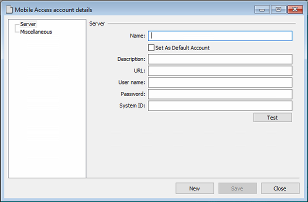

# Step 5: Set up Your Credential Services Account in Visionline

Set up your development Credential Services account in the Visionline application.

1. At the bottom of the left navigation pane in the Visionline application, click **Lists**.
2. In the **System setup** section of the left navigation pane, double-click **Mobile Access Accounts**.
3. Click **Add**.
4.  In the **Mobile Access account details** window, enter your development Credential Services account details.

    Note that you received these credentials and details during the [mandatory ASSA ABLOY mobile development course](step-1-complete-the-assa-abloy-mobile-development-course.md). Alternately, see [Retrieve Your ASSA ABLOY Credential Services Development Account Details](step-5-set-up-your-credential-services-account-in-visionline.md#retrieve-your-assa-abloy-credential-services-development-account-details).

    1. Type a **Name** for the mobile access account.
    2. Select the **Set As Default Account** checkbox.
    3. Type the **URL** of the credential server.
    4. Type **User name** and **Password** for your development Credential Services account.
    5. Type the Credential Services **System ID**.
    6. Click **Test** to verify these credentials.
    7.  Click **Save**.

        <figure><figcaption>
In Visionline, create a mobile access account with your Credential Services account details.
</figcaption></figure>

***

## Retrieve Your ASSA ABLOY Credential Services Development Account Details

Locate your ASSA ABLOY Credential Services development tenant account details in the ASSA ABLOY Global Solutions Technology Partner Portal.

1. In a web browser, go to the [ASSA ABLOY Global Solutions Technology Partner Portal](https://my.assaabloyglobalsolutions.com/tpp).
2. Log in to the ASSA ABLOY Global Solutions Technology Partner Portal.
3.  Click **Accounts > Account List**.

    <figure> Account List."><figcaption></figcaption></figure>
4. In the **Agreements** area, locate and open the text (`.txt`) file.\
   This text file contains your ASSA ABLOY tenant account username and password, as well as your system ID, application ID, and credential services URL.
