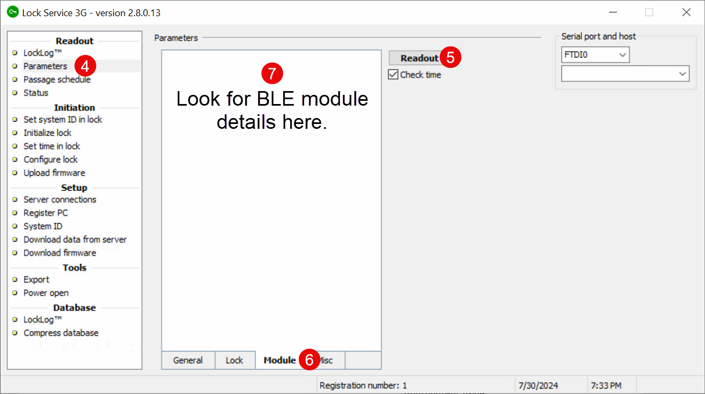

# Step 3: Confirm BLE Module on All Locks

The Visionline integration for mobile key apps requires you to install the following BLE module on each door lock:

[https://estore.assaabloyglobalsolutions.com/no/marine/ble-module-pcba-7001.html](https://estore.assaabloyglobalsolutions.com/no/marine/ble-module-pcba-7001.html)

This process consists of the following basic steps:

1. [Install Lock Service 3G on a laptop or tablet.](step-3-confirm-ble-module-on-all-locks.md#install-lock-service-3g)
2. [Confirm that all locks have the required BLE module.](step-3-confirm-ble-module-on-all-locks.md#confirm-that-all-locks-have-the-required-ble-module)


This process can be quite time-consuming because it requires interaction with all locks.


***

## Install Lock Service 3G

Install the Lock Service 3G on a Windows laptop or tablet that you can move to each door lock. You use a USB-to-lock interface cable to connect this laptop or tablet to each door lock.


If the USB-to-lock interface cable does not work correctly, you may need to install the following driver:

`CDM v2.12.xx WHQL Certified.exe`


***

## Confirm that All Locks Have the Required BLE Module

Perform the following procedure for each lock:

1. On the laptop or tablet, open the Lock Service 3G application.
2. Connect the cable from the laptop or tablet running Lock Service 3G to the lock.
3.  At the right of the **Lock Service 3G** window, in the upper field in the **Serial port and host** area, select the serial port that you want to use to connect to the lock.

    <figure><figcaption>
Select the port.
</figcaption></figure>
4. In the **Readout** section of the left navigation pane, click **Parameters**.
5. In the **Parameters** area, click **Readout**.
6. Click the **Module** tab.
7.  Confirm that the lock includes a BLE module.

    <figure><figcaption>
Confirm that each lock has an installed BLE module.
</figcaption></figure>
