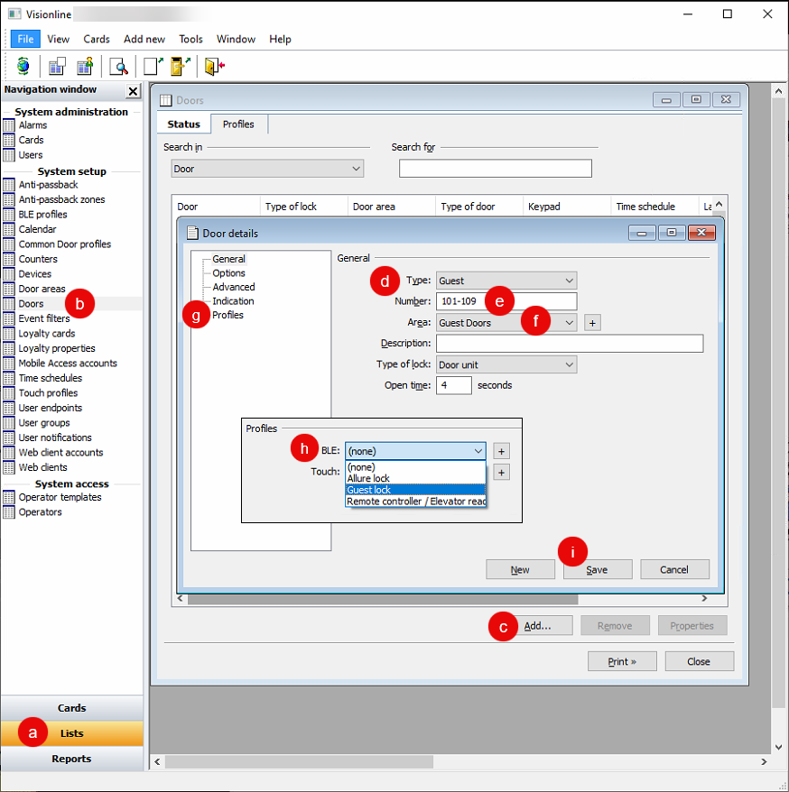
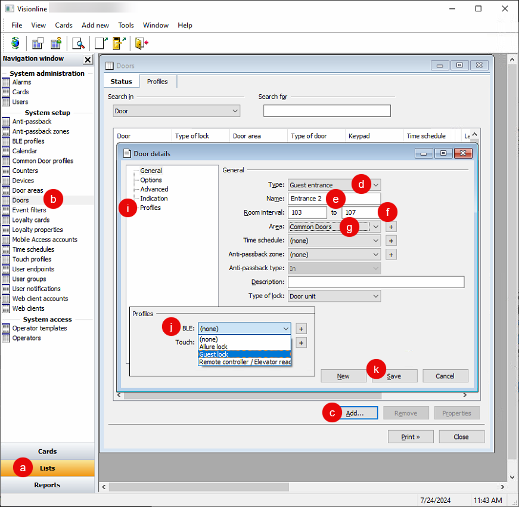

# Step 4: Set up Door Locks with BLE Profiles

In the Visionline application, set up all door locks for your Visionline mobile key integration.

Use the Visionline application to define guest room and common door locks. First, set up the desired door areas, such as `Guest Doors` and `Common Doors`. Then, define each door and assign it to the appropriate door area. When you define a door or set of doors, you also choose a door type, to determine the access behavior of the door. Visionline door types include guest, guest entrance, guest common, elevator reader, elevator reader relay, and so on.

Note that for common doors, guest entrance doors and elevator reader relays automatically give access to guests within a specific guest door range, such as common entrances. Then, you assign elevator reader relays to the corresponding elevator reader.

For guest common doors, you must grant guest access manually, such as for a gym door or parking entrance.


These instructions use Visionline 1.27. If you are using Visionline 1.28, you may notice differences in a few field names.


***

## Set up Guest Room Locks

When defining guest room doors, first create a door area and then create a door of the **Guest** door type.

1. Log in to the Visionline application.
2.  Set up a door area for guest rooms.

    1. At the bottom of the left navigation pane, click **Lists**.
    2. In the **System setup** section of the left navigation pane, double-click **Door areas**.
    3. In the **Door areas** window, click **Add**.
    4. In the **Door area details** dialog, type a name and, optionally, a description for the new door area.\
       For example, you could create a door area named `Guest Doors`.
    5. Click **Save**.
    6. To add more door areas, click **New** and then repeat this process in the **Door area details** dialog.
    7. When you are done adding door areas, in the **Door area details** dialog, click **Close**.
    8. In the **Door areas** window, click **Close**.

    <figure><figcaption>
Create a door area for guest room doors.
</figcaption></figure>
3.  Define each set of guest room doors.

    1. At the bottom of the left navigation pane, click **Lists**.
    2. In the **System setup** section of the left navigation pane, double-click **Doors**.
    3. In the **Doors** window, click **Add**.
    4. In the **Door details** window, select **Guest** as the door **Type**.
    5. In the **Number** field, type the door range.\
       For example: `101-109`
    6. In the **Area** field, select the guest door area that you created.\
       For example: **Guest Doors**
    7. In the left navigation pane of the **Door details** window, click **Profiles**.
    8. In the **Profiles** pane, select the desired BLE profile.
    9. Click **Save**.
    10. To add more door sets, click **New** and then repeat this process in the **Door details** window.
    11. When you are done adding door sets, in the **Door details** window, click **Close**.
    12. In the **Doors** window, click **Close**.

    <figure><figcaption>
Create a set of guest room doors using the door area that you created.
</figcaption></figure>

***

## Set up Common Door Locks

When defining common doors, make sure to choose the appropriate door type. Visionline door types include the following, among others:

<table><thead><tr><th width="210">Door Type</th><th>Description</th></tr></thead><tbody><tr><td>Guest entrance</td><td>Specify a set of guest doors to give automatic access to guests within this range. You can use this door type for common entrances.</td></tr><tr><td>Guest common</td><td>You must grant access to doors of this type explicitly to specific guest credentials. You can use this door type for gym doors, parking entrances, and so on. </td></tr><tr><td>Elevator reader relay</td><td>This door type represents a floor button or relay within an elevator. Specify a set of guest doors to give automatic access to guests within this range. Assign each elevator reader relay to the corresponding "slot" in an elevator reader definition.</td></tr><tr><td>Elevator reader</td><td>The door type serves as an organization mechanism for sets of elevator reader relays.</td></tr></tbody></table>


For more information about door types, see the Visionline Help.


To define a common door, first create a door area and then create a door of the appropriate type.

1. Log in to the Visionline application if you are not already logged in.
2.  Set up a door area for the group of common doors.

    1. At the bottom of the left navigation pane, click **Lists**.
    2. In the **System setup** section of the left navigation pane, double-click **Door areas**.
    3. In the **Door areas** window, click **Add**.
    4. In the **Door area details** dialog, type a name and, optionally, a description for the new door area.\
       For example, you could create a door area named `Common Doors`.
    5. Click **Save**.
    6. To add more door areas, click **New** and then repeat this process in the **Door area details** dialog.
    7. When you are done adding door areas, in the **Door area details** dialog, click **Close**.
    8. In the **Door areas** window, click **Close**.

    <figure><figcaption>
Create a door area for common doors.
</figcaption></figure>
3.  Define each common door.

    1. At the bottom of the left navigation pane, click **Lists**.
    2. In the **System setup** section of the left navigation pane, double-click **Doors**.
    3. In the **Doors** window, click **Add**.
    4. In the **Door details** window, select the appropriate door **Type**.\
       See the table at the beginning of this section for descriptions of some common door types.
    5. Type a **Name** for the door, reader, relay, or other entrance.
    6. For a guest entrance door or elevator reader relay, type the beginning and ending room numbers to define the associated **Room interval**.\
       Note that for guest common entrances, you set up access permissions explicitly when creating guest or other credentials.
    7. In the **Area** field, select the common door area that you created.\
       For example: **Common Doors**
    8. For an elevator reader, set the relay outputs to define the access permissions by floor or other output:
       1. In the **Relay outputs** table, select an output.
       2. Click **Select**.
       3. In the **Select elevator reader relay** dialog, select the corresponding elevator reader relay and then click **OK**.
       4. Repeat this process for any additional relay outputs.
    9. In the left navigation pane of the **Door details** window, click **Profiles**.
    10. In the **Profiles** pane, select the desired BLE profile.
    11. Click **Save**.
    12. To add more common doors, click **New** and then repeat this process in the **Door details** window.
    13. When you are done adding common doors, in the **Door details** window, click **Close**.
    14. In the **Doors** window, click **Close**.

    <figure><figcaption>
Create one or more common doors using the door area that you created.
</figcaption></figure>
