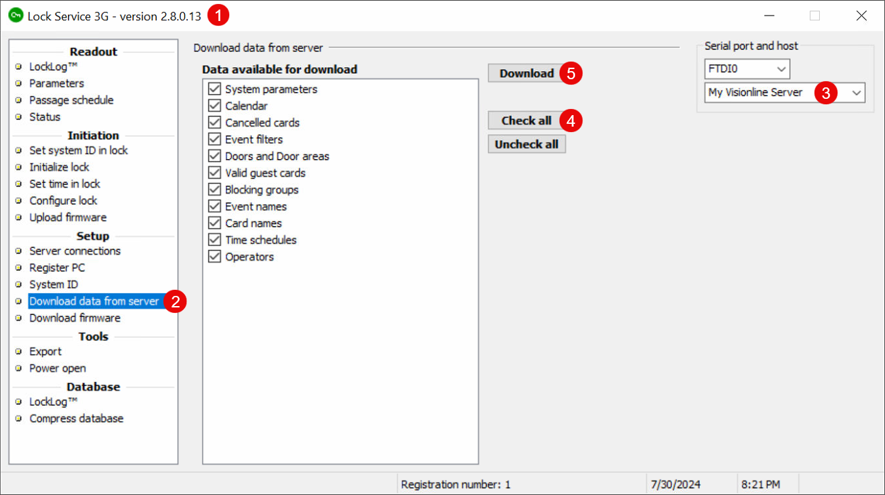

# Step 5: Program Door Locks

Once you have [set up door locks](step-4-set-up-door-locks-with-ble-profiles.md) in the Visionline application, use the Lock Service 3G application to program the door locks themselves. When you program a lock, you download the identity and settings for the lock from Lock Service 3G to the lock.

This process consists of the following basic steps:

1. [Configure the Visionline application to download door lock data to Lock Service 3G.](step-5-program-door-locks.md#configure-visionline-for-lock-service-3g)
2. [Configure Lock Service 3G to connect to the Visionline server.](step-5-program-door-locks.md#configure-lock-service-3g-to-connect-to-the-visionline-server)
3. [Download door lock data from the Visionline server to Lock Service 3G.](step-5-program-door-locks.md#download-door-lock-data-to-lock-service-3g)
4. [Initialize each door lock to program it with the correct settings.](step-5-program-door-locks.md#initialize-door-locks)

***

## Configure Visionline for Lock Service 3G

1. Log in to the Visionline application if you are not already logged in.
2.  Add a device.

    1. At the bottom of the left navigation pane, click **Lists**.
    2. In the **System setup** section of the left navigation pane, double-click **Devices**.
    3. In the **Devices** window, click **Add**.
    4. In the **Device details** window, type a **Name** for the device, such as `Lock Service 3G`.
    5. Select **Service device host** as the device **Type**.
    6. Make sure that the **Port** is `27015`.
    7. Make sure that the **Location** is **Server**.
    8. Click **Save**.
    9. In the **Device details** window, click **Close**.
    10. In the **Devices** window, click **Close**.

    <figure><figcaption>
Add a device in the Visionline app.
</figcaption></figure>
3.  Obtain the registration code for the Lock Service 3G instance.

    1. At the bottom of the left navigation pane, click **Lists**.
    2. In the **System setup** section of the left navigation pane, double-click **Service devices**.
    3. In the **Service devices** window, click **Add**.
    4. Note the registration code and validity period that the Visionline application displays.\
       You must enter this code in Lock Service 3G on the laptop or tablet.
    5. Click **OK**.
    6. In the **Service devices** window, click **Close**.

    <figure><figcaption>
Obtain the registration code for Lock Service 3G.
</figcaption></figure>

***

## Configure Lock Service 3G to Connect to the Visionline Server

1. Open the Lock Service 3G application if you have not done so already.
2.  Add a server connection.

    1. In the **Setup** section of the left navigation pane, click **Server connections**.
    2. If the **Server connections** dialog does not display automatically, click **Add**.
    3. In the **Server connections** dialog, type a **Name** for this connection to the Visionline server.\
       Note that some of the field names in this dialog are different in different versions of Lock Service 3G.
    4. In the **Address** field, type the IP address of the Visionline server.
    5. Type the **Port** number to use to connect to the Visionline server.
    6. Click **OK**.

    <figure><figcaption>
Add the connection between Lock Service 3G and the Visionline server.
</figcaption></figure>
3.  At the right of the **Lock Service 3G** window, in the lower field in the **Serial port and host** area, select the name of the Visionline server connection that you created.

    <figure><figcaption>
Select the Visionline server connection.
</figcaption></figure>
4.  Register Lock Service 3G on the laptop or tablet.

    1. In the **Setup** section of the left navigation pane, click **Register PC**.
    2. In the **Register PC** area, type the registration **Code** that you obtained from the Visionline application.
    3.  Click **Register**.

        <figure><figcaption>
Use the registration code from the Visionline application to register Lock Service 3G.
</figcaption></figure>

    Lock Service 3G registers with the Visionline server and displays a **Registration Finished** message.
5. Click **OK**.
6.  Retrieve the Visionline system ID.

    1. In the **Setup** section of the left navigation pane, click **System ID**.
    2.  In the **System ID** area, click **Get**.

        <figure><figcaption>
Retrieve the Visionline system ID.
</figcaption></figure>

    Lock Service 3G retrieves the Visionline system ID and then displays a **New system ID has been set** message.
7. Click **OK**.

***

## Download Door Lock Data to Lock Service 3G

1. Open the Lock Service 3G application if you have not done so already.
2. In the **Setup** section of the left navigation pane, click **Download data from server**.
3. At the right of the **Lock Service 3G** window, in the lower field in the **Serial port and host** area, select the name of the Visionline server connection.
4. In the **Download data from server** area, click **Check all**.
5. Click **Download**.

<figure><figcaption>
Download the door lock data from the Visionline server to Lock Service 3G.
</figcaption></figure>

Lock Service downloads the door lock data from the Visionline server and displays a message when the download is complete.

***

## Initialize Door Locks

Perform the following steps on each lock:

1. Only if necessary, update the Lock Control Unit firmware.\
   **Test locks from ASSA ABLOY should already be preprogrammed with the correct firmware.**\
   For other locks, contact ASSA ABLOY to learn whether you need to update the Lock Control Unit firmware and, if so, to obtain the correct firmware version.
   1. Open the Lock Service 3G application if you have not done so already.
   2. In the **Initiation** section of the left navigation pane, click **Upload firmware**.
   3. At the right of the **Lock Service 3G** window, in the lower field in the **Serial port and host** area, select the name of the Visionline server connection.
   4.  In the **Upload firmware** area, click **Browse**.

       <figure><figcaption>
Select the Lock Control Unit firmware to upload.
</figcaption></figure>
   5. Select the firmware that ASSA ABLOY has sent to you and then click **Open**.
   6.  In the **Available versions** table, right-click the appropriate firmware version and select **Save to database**.

       <figure><figcaption>
Save the firmware to the database.
</figcaption></figure>
   7. In the **Available versions** table, select the appropriate firmware version.
   8.  At the right of the **Lock Service 3G** window, in the upper field in the **Serial port and host** area, select the serial port that you want to use to connect to the lock.

       <figure><figcaption>
Select the port.
</figcaption></figure>
   9. Connect the [service cable](https://estore.assaabloyglobalsolutions.com/us/marine/service-cable-rj12-for-3g-rfid-lcu-e-cylinder.html) with [adapter cable](https://estore.assaabloyglobalsolutions.com/us/marine/cable-rj12-to-usb-adapter-for-3g.html) from the laptop or tablet running Lock Service 3G to the lock.
   10. At the bottom of the **Upload firmware** area, click **Upload**.
2. Open the Lock Service 3G application if you have not done so already.
3. Initialize the lock.
   1. In the **Initiation** section of the left navigation pane, click **Initialize lock**.
   2. At the right of the **Lock Service 3G** window, in the lower field in the **Serial port and host** area, select the name of the Visionline server connection.
   3. In the **Initialize lock** area, expand the appropriate door area and select the lock that you want to initialize.
   4. Select the **Read parameters after successful initialization** checkbox.
   5. Select the **Include BLE configuration data** checkbox.
   6. At the right of the **Lock Service 3G** window, in the upper field in the **Serial port and host** area, select the serial port that you want to use to connect to the lock.
   7.  Connect the service cable with adapter cable from the laptop or tablet running Lock Service 3G to the lock and then click **Initialize**.

       <figure><figcaption>
Connect Lock Service 3G to each lock and initialize it.
</figcaption></figure>

       \{% hint style="info" %\} The lock and cable connection times out after 30 seconds. If programming the lock results in an error, try unplugging the cable from the lock and reconnecting it. Then, try initializing the lock again. \{% endhint %\}
