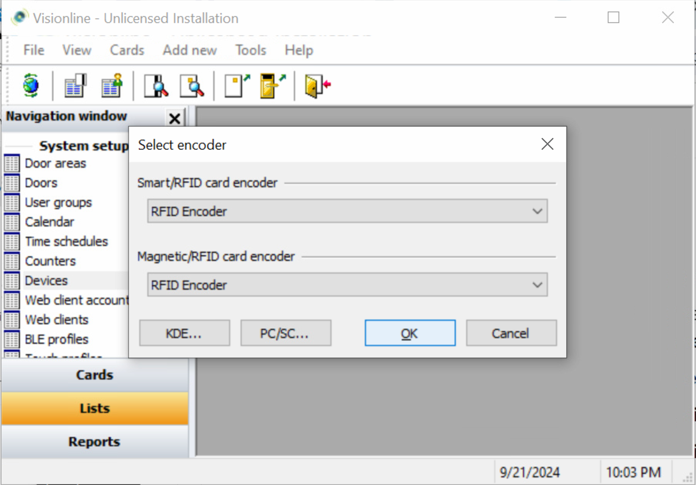

# Step 4: Install a Visionline Card Encoder

Buy and install a Visionline card encoder—specifically, the [ASSA ABLOY RFID encoder & updater](https://estore.assaabloyglobalsolutions.com/no/marine/rfid-encoder-updater-complete.html)—and then connect it to your Visionline server.

1. Install USB drivers.
   1. Install the USBXpress Development Kit.\
      This file is available for download from the [Silabs web site](https://www.silabs.com/Support%20Documents/Software/USBXpress_Install.exe).
   2. Connect the RFID encoder & updater to the power supply.
   3. Connect the RFID encoder & updater to the computer using the USB cable.
   4. On your Windows computer, go to the **Device Manager**.
   5. Expand the **Universal Serial Bus controllers** category.
   6. Double-click **USBXpress Device** .
   7. In the **General** tab of the **USBXpress Device Properties** window, make sure that the **Device status** is `This device is working properly`.
   8.  In the Visionline bundle, under **RFID Encoder/RFID Encoder Configuration Utility**, double-click **RFIDEncoderConfig.exe**.

       Note that, starting with Visionline 1.24.0, the **RFID Encoder Configuration Utility** is automatically installed in the Visionline installation folder when **Visionline.msi** is installed.

       If the RFID encoder & updater is correctly connected to the PC and correctly uses the USBXpress driver, the serial number of the RFID encoder & updater displays in the **USB** area at the upper-left of the window.
2.  Connect the card encoder to the Visionline server using USB.

    \{% hint style="info" %\} To connect through USB, you must use firmware version 2.6.2.4 or higher for the RFID encoder. Visionline 1.22.1 or higher is also required. \{% endhint %\}3. Register the card encoder.\
    1\. Log in to the Visionline application if you are not already logged in.\
    2\. At the bottom of the left navigation pane, click \*\*Lists\*\*.\
    3\. In the \*\*System setup\*\* section of the left navigation pane, double-click \*\*Devices\*\*.\
    4\. In the \*\*Devices\*\* window, click \*\*Add\*\*.\
    5\. In the \*\*Device details\*\* window, type a \*\*Name\*\* for the RFID encoder & updater.\
    6\. If desired, type a \*\*Description\*\*.\
    7\. In the \*\*Type\*\* field, select \*\*Network RFID encoder (USB)\*\*.

```
   <figure><figcaption><p>Specify the details for the new card encoder device.</p></figcaption></figure>
```

8\. Click **...** next to the **S/N** field.

```
   The list displays all network RFID encoder & updaters that are connected through USB.
```

9\. Make sure that the correct RFID encoder & updater is selected.

```
   <figure><figcaption><p>Select the correct RFID encoder &#x26; updater.</p></figcaption></figure>
```

10\. Select the correct **Location**.\
11\. If you have selected **Server** or **Computer** as the **Location**, type the **PMS address**, if applicable.\
12\. Click **Save**.\
13\. In the **Device details** window, click **Close**.\
14\. In the **Devices** window, click **Close**.\
4\. Select the card encoder to which the Visionline server should send cards.

1. Click **File** > **Select encoder**.
2.  Select the encoder that you registered in the previous section and then click **OK**.

    <figure><figcaption><p>Select the card encoder that you want to use.</p></figcaption></figure>
