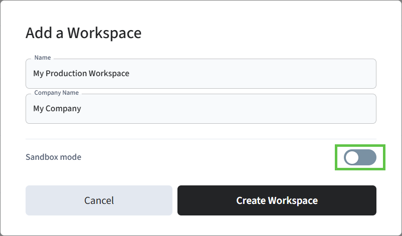

# Step 7: Create a Production Workspace

Create a Seam production workspace to connect your Visionline account to Seam. You can continue to use this workspace in your production phase as well.

1. Log in to [Seam Console](https://console.seam.co/).
2.  In the upper-left corner, click the workspace switcher.

    
3. Click **New Workspace**.
4. In the **Add a Workspace** dialog, type a name for your new workspace and your company name.
5.  Disable **Sandbox mode**.

    
6. Click **Create Workspace**.
