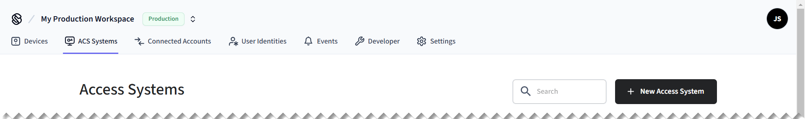
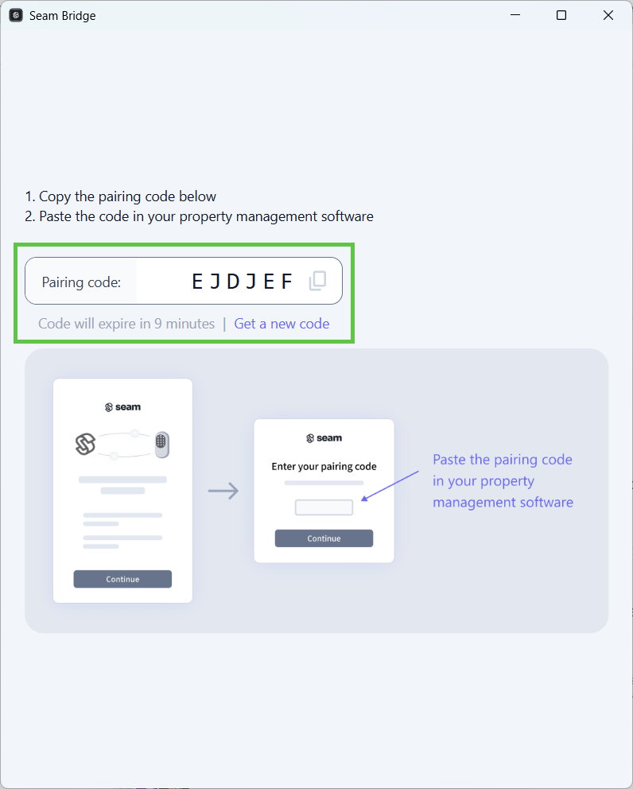

# Step 8: Connect Your Visionline Development Account to Seam

Perform this process for each Visionline site that you want to connect to Seam.

1.  In the top navigation pane of [Seam Console](https://console.seam.co/), click **ACS Systems**.

    <figure><figcaption>
Click ACS Systems to go to the Access Systems page.
</figcaption></figure>
2.  On the **Access Systems** page, click **New Access System**.

    Seam Console displays a Connect Webview that enables you to connect your ACS to Seam.
3. In the Connect Webview, click **Continue**.
4. If the Connect Webview displays multiple brand options, click **Visionline**.
5.  On the **Set up your Seam Bridge** page, click [**latest Seam Bridge client**](https://www.seam.co/seam-bridge/releases/latest).

    [Seam Bridge](../../../../../capability-guides/seam-bridge/) is a software-only component that enables you to connect on-premises software systems to the Seam platform. Because Visionline is an on-premises ACS, Seam Bridge is required for Visionline systems.
6.  Download the Seam Bridge executable onto the on-premises computer that is running Visionline or onto a computer on the same network.

    For systems requirements, see [Seam Bridge](../../../../../capability-guides/seam-bridge/).
7. Run the downloaded Seam Bridge app.
8. In the **Welcome to Seam Bridge** window, type a name for the site that you are connecting using Seam Bridge and then click **Start pairing**.
9.  Copy the pairing code.

    <figure><figcaption>
Use the pairing code to pair Seam Bridge with your workspace.
</figcaption></figure>
10. In the Connect Webview, click **Continue**.
11. On the **Set up your Seam Bridge** page:
    1. In the **Enter your pairing token** field, paste the pairing code that you copied.
    2. Click **Submit**.
12. On the **Enter your credentials** page:
    1. In the **Visionline Site Name** field, type a name to identify the Visionline site within your Seam workspace.
    2.  In the **Username** field, type the username for your Visionline development account.

        This account is the one that you [created or identified in Visionline for the connection with Seam](step-3-configure-a-visionline-user-account.md).
    3. In the **Password** field, type the password for your Visionline development account.
    4. If Seam Bridge is not installed on the same computer as Visionline, select **Seam Bridge and Visionline server are installed on different computers** and then type the local IP address of the on-premises computer running Seam Bridge.
    5. Click **Submit**.
13. Click **Close**.
