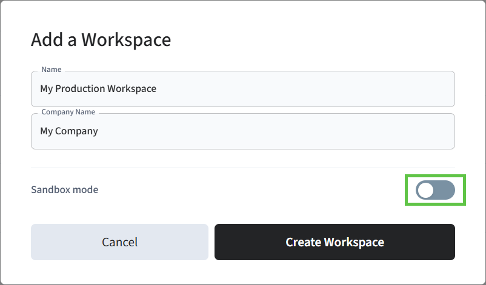

# Step 4: Create a Production Workspace

If you did not create a Seam production workspace during the development phase for your Visionline plastic card encoding app, you must create a new production workspace to connect your Visionline production account to Seam. If you did create a production workspace already, you can choose to continue using this workspace or to create a new one.

To create a production workspace.

1. Log in to [Seam Console](https://console.seam.co/).
2.  In the upper-left corner, click the workspace switcher.

    
3. Click **New Workspace**.
4. In the **Add a Workspace** dialog, type a name for your new workspace and your company name.
5.  Disable **Sandbox mode**.

    
6. Click **Create Workspace**.
